# 经典15年i春秋渗透测试系统化教程 - P10：课时2  注入式攻击-OR漏洞实战讲解 - 老网恋教父了 - BV1n54y1B7F7

这节课我们给大家讲解一下二楼的。那么奥楼呢大家都是听说过在网上就是，尤其在很多。大家一扫描完用扫描器，扫到后台之后，首先试一下哦。啊，这万能密码登录网站，看能不能登录啊，登录窗口的地。啊。

大以前是好大部分网站都是可以，就在0。04年05年的时候，word能密码比较流行啊，现在这个网站程序word能密码慢慢的少了。啊，但是也有一部分啊也没有。对这个没有过滤。

直接带入查选的存在很多这个万能密码登录。那么我们要知道这个万能密码怎么是怎么回事，为什么哎？我不输入正确的用户名和密码，就可以登录管理员后台的。

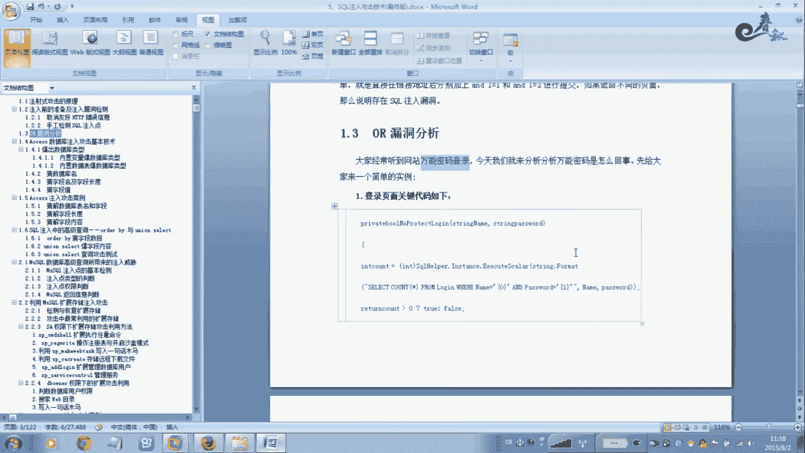

首先我们来看一下这个代码。那么这里我在网上下载了一呃。一套程序啊，就是一个简单的几个页面。我们分析一下它这个呃万能密码产生的原因。他这里首先定义了几个函数啊，它就碰到这个用户名输入用户名和密码。

碰到这个用户名和密码是否为空。你看没有？啊，如果唯空请输入命码啊，唯空password。啊为空这个法连接就是说碰了你是否为空，还判断密码是否为。是否为空间已输入。密码是否正确啊，是否违款啊？

他就是一个简单的一个朋友，但是并没有过滤什么呃，当银号按语句啊。啊，他这些语句他都没有进行碰到。你看。当他你没有输入这个用户名密码的时候，或者为空的时候，他就登录失败。如果是正确的时候。

正确的用户名和密码的时候，它这里有个st可以依句啊，等我们前面的条件如果不为空。啊，不为空。条件成立，就是说我够造大以号，或者按一等于一的语句的时候。那么他直接可以带入这个。嗯，查询就是那个星耀福。

那我来自啊我们这个哪一个表，条件是name。用户名。密码等于这个。这个就是我们前面带入，就是我们当我在这个登录窗口输入用户名和密码，带入到我这个。

username分别是username和pasword里面，它这个前面。有一个判断语句，判断我们这个带入进来的这个用户名和密码是否为空是吧啊？他就是做了一个简单的一个碰断，但是。这样是不行的。

包括我们可以构造一些。特殊的语句，等一下我会教大家怎么去构造。为什么会可以登录？首先我们知道这个大概的一个呃程序的源代码，它里面是怎么做的？在这周我们来给大家在这里演示一下。

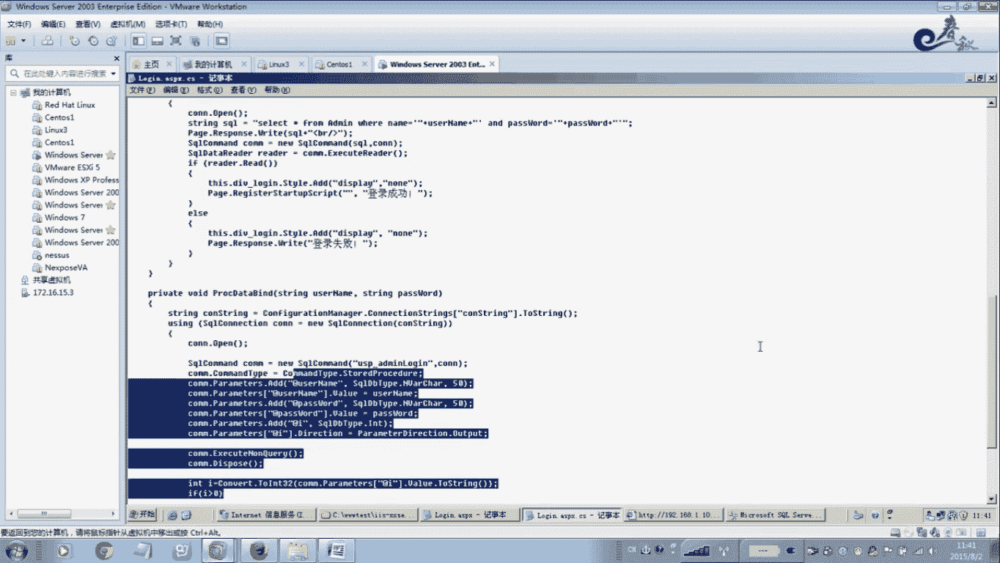

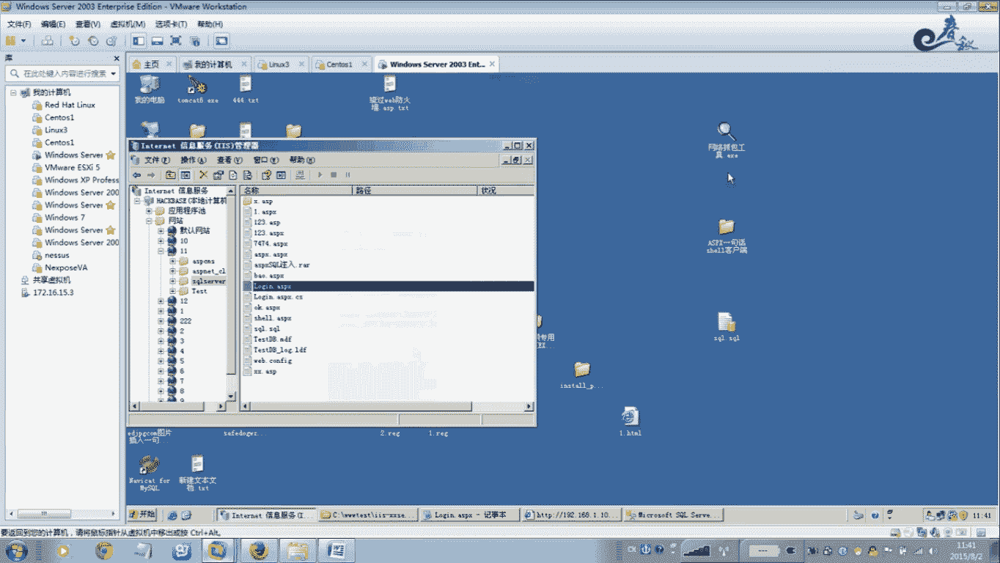

登我和随便输入用户名和密码的时候，登录它这个地方看到没有？登录失败，OK是不能登录的。登我输入正确的用户名你看。这是正确的用户名。登录的时候，它会提示登录成功，对不对？他这里有登录成功。好。那么。

我们首先看一下这个。

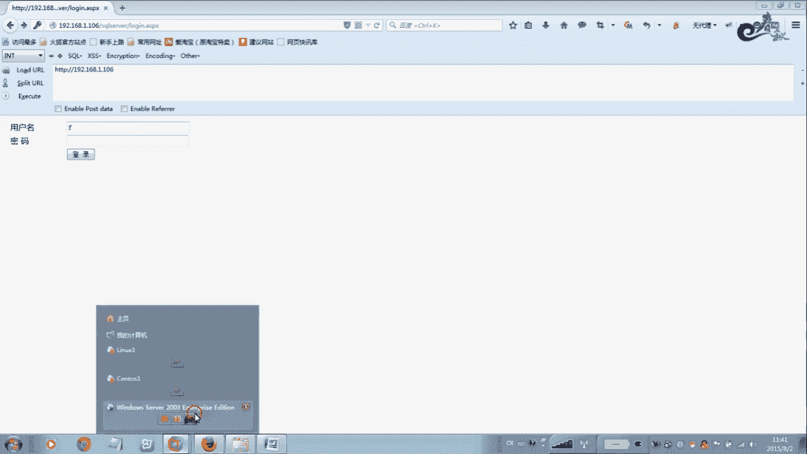

数据库。

打开。这个数据库这个表里面AD表里面正确的用户没是这个。圆儿密码123，对不对？只有当他输入正确的用户名和密码的时候，才允许登录。才允许登录。但是当我们数据库里面没有这个用户名和密码的时候。

是不允许登录。那么现在我们知道啊这个数据库里面的用户名和密码，那么下面我们就。构造一个。构造一个怎么样去构造呢？举个例子。单然学。嗯。一等于1。点过这个。这个是一个注射符。密码随便输，等我登录一下。

本这样也可以登录成功，你看到没有？我并没有输入用户名和密码吧。我数据库里面并没有这些吧，没有吧。数据库里面只有这个，你看用户名和密白。只有正确的才能登录。为什么我输了这样的也可以登录啊，这就是万能密码。

万能密码。为什么能登不？原因很简单。首先。

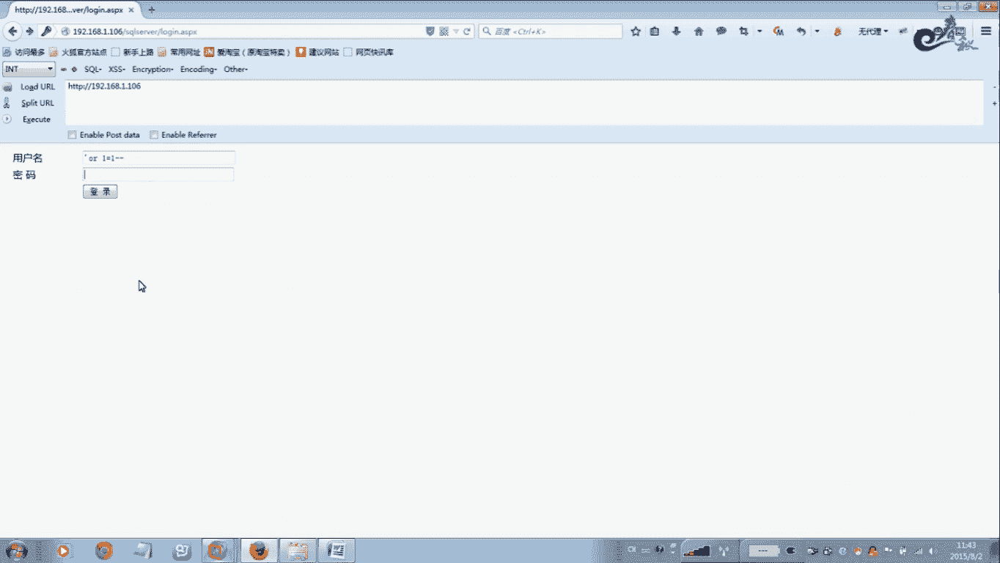

其实我们当我们带入这个数据库查询的时候。叫淡路，所以就真正的我们这个。

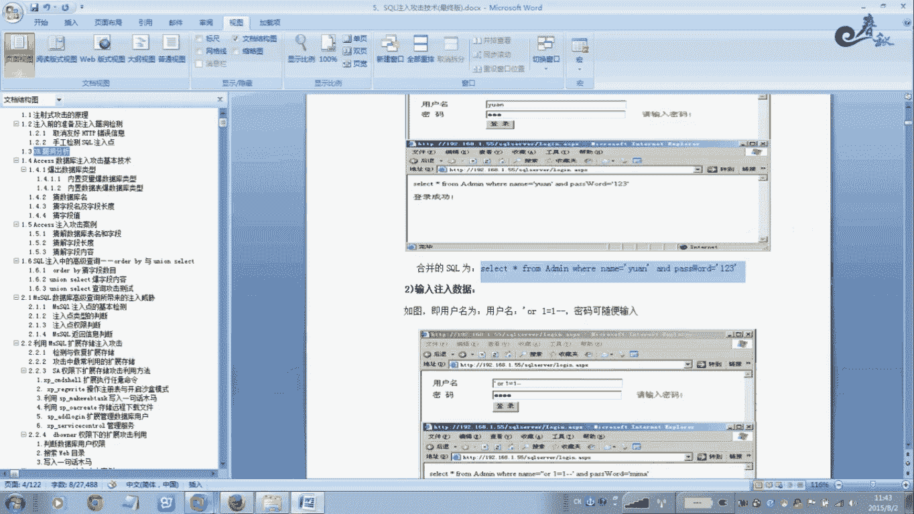

你看看这里。代码里面。S开了。好ね。当我们输入正确的用户名和密码的时候，它其实的执行的语句是这样的一回事。sla星号来自这个表未要条件是用户名和密码。也就是说。

我们的用户名和密码正确的语句是大陆数据会是这么回事的，是吧？用sck星号来自这个表条件是当我们执行查询的时候，大家可以看一下啊，我们来数据库里面。

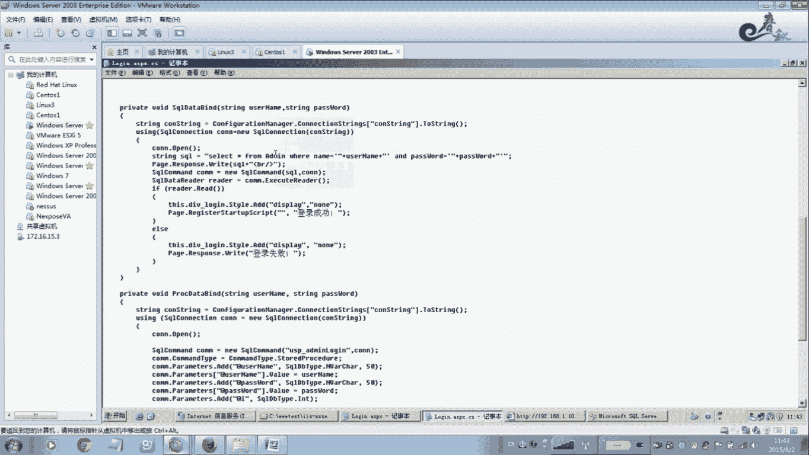

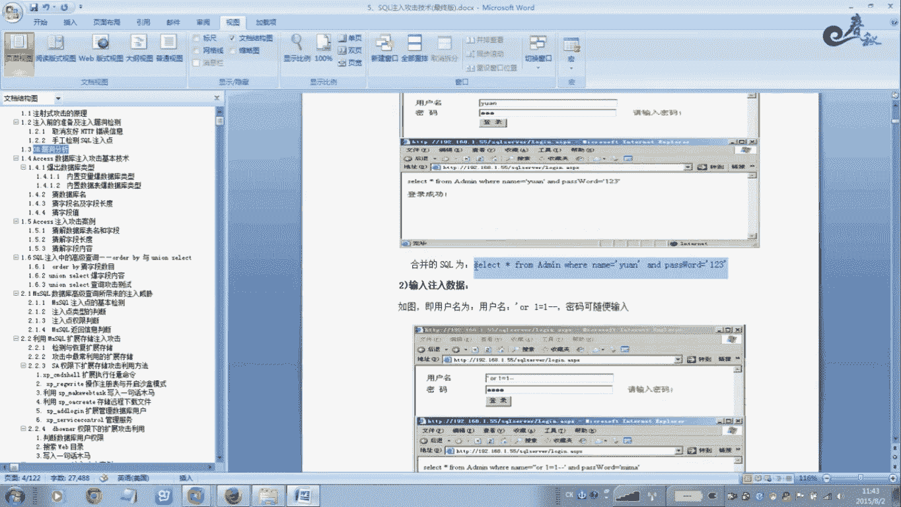

来查询一下。

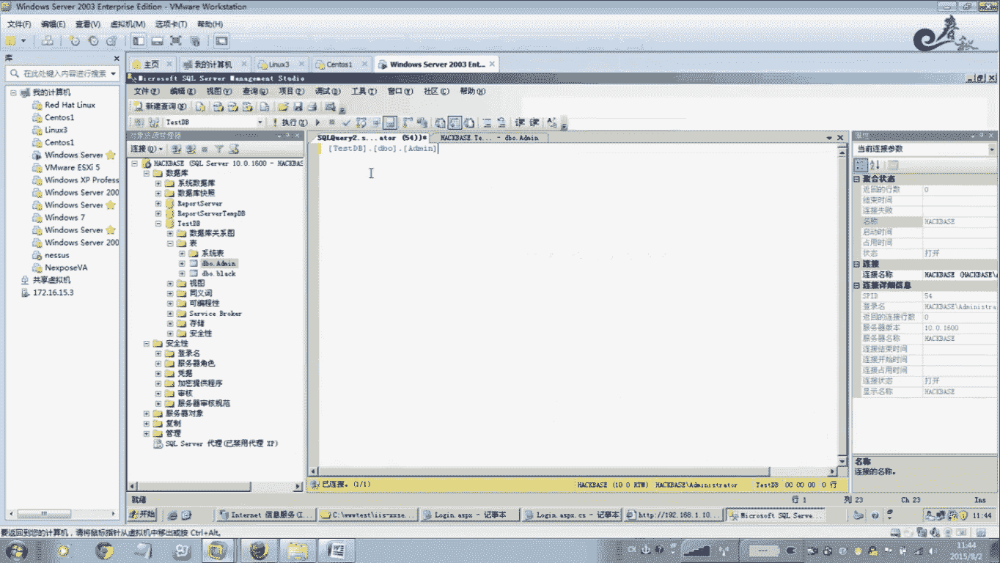

哎呀，复制不过来。もじちます。

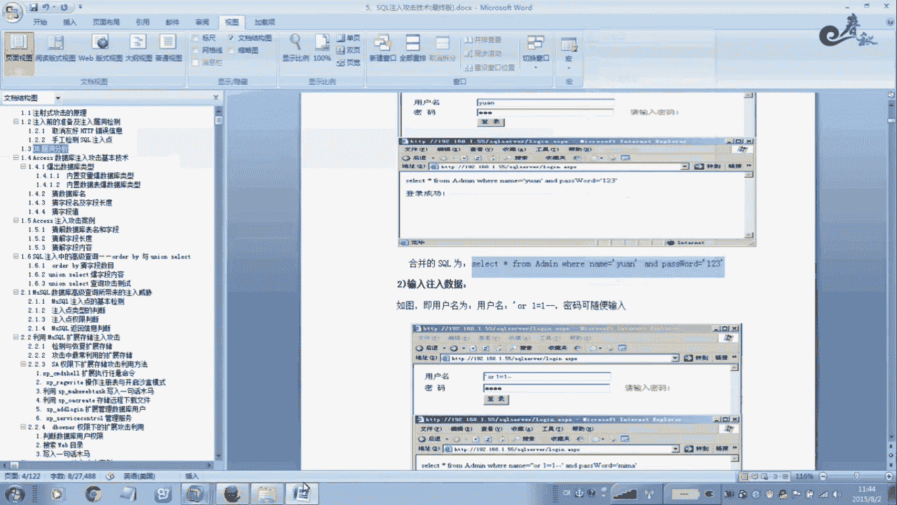

好。

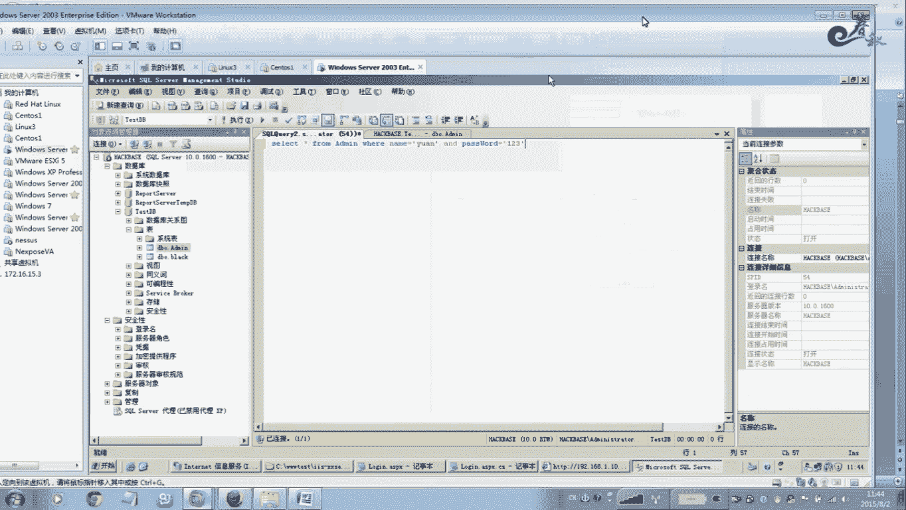

你们首先看一下命令王子，对不对？这条鱼就是是正确的吧，因为我们6个名和密码是正确的，所以它能查询出来，对不对？当我们如果是错误的，你看。用户名和密码如果是错误，你看它是没有的，查询不出来。

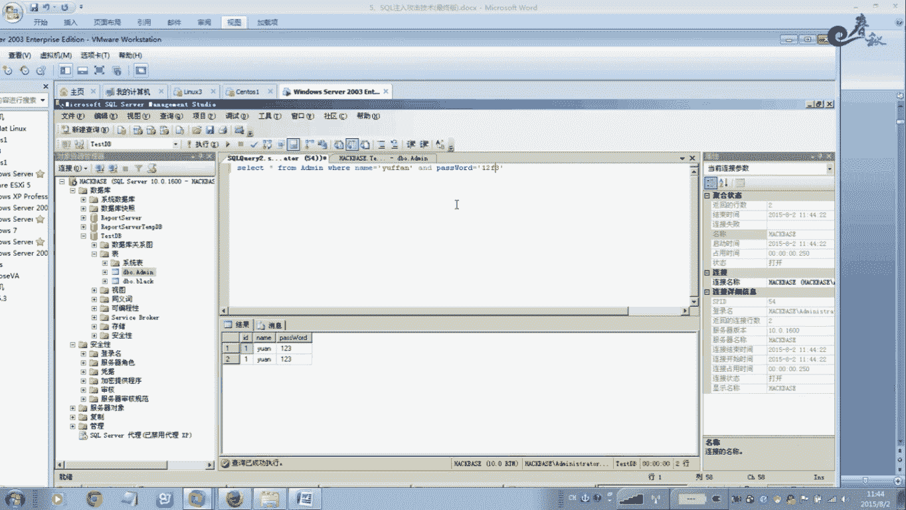

那么刚才我们是构造了一个什么语具啊？

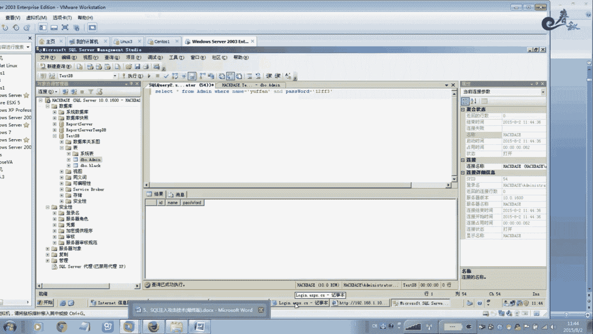

奥宇局是吧，单银号。

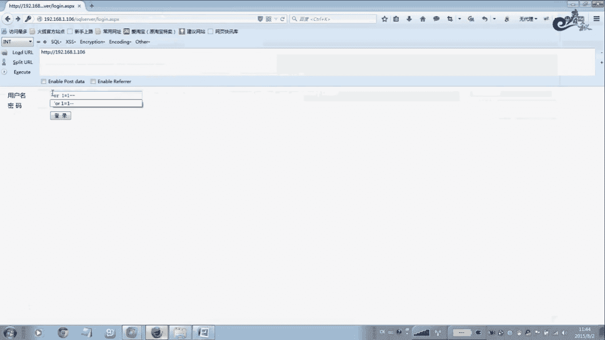

那么构造这个语句其实带入到我们数据库里面查询的时候，它是这样的一回事。首先。我们要闭合前面的单一号。因为我们这个用户名。字符形也人是说。你看这点正确也是这么回事的。现在我输入用户用户名为空。

但是在我们的程序里面碰洞的时候，大家前面给大家解释过，为空是为假，是不能登录的，是吧？不允许登录。因为控制这个当这个。本身那就有一个，就说当。

就实本来这个地方，你看。这里我们有一个单引号，这个单引号其实是。

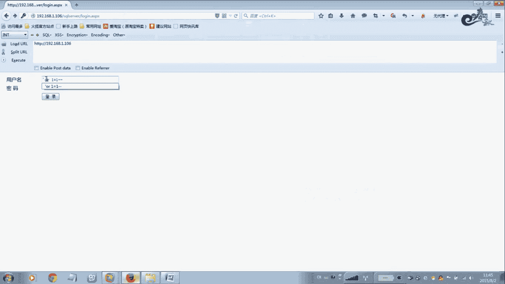

本身他是这个这个本身他是这么回事的吧，就是等到我们输入用户名吧，输入这个用户名吧。输入用户名，他自己会加一个这个单音号吧，这个现在我们这里不输不输入了。不输入了。我首先把它闭好。这个条件是不成立的。

闭合。也就这个里面我没有单独用户名。没有用户名，只是说闭合了闭合这个单型要就是用。这个条件绝对是未假。如果你一个单以后，你绝对是不允许登录的，不允许登录。但是我后面构造了一个条件，叫做OR。哦。

呃奥的与与这个行业是什么呢？还有一个暗袋跟他蹭一个。贝利的。当我这个前面的条件不满足的时候。哦就或者的意思或。一等于一，比就说前面不满足，但是我后面满足吧，一等于一一等100帧等于一吧，没问题吧。

对不对？也就是那么这一条语句结合起来，它又变成了什么含义的？咦也就是说这个为甲为甲，就是说不成立，但是这个是成立。倒是中间有1个OR。one的意思是。我这两个条件只要一个成立。

那就代表伪真真就是代表什么正确。也就是说。用户没事，O的。现在大家明白了这个道理没有？赔偿简。那么在数据库里面执行。啊，后面还有一个哈，这个两个是什么呢？这两个是代表注释。因为我们的用户名当伪n的时候。

但是密码不为证啊，也是不允许登录的，对不对？或加两个注是。也就是说。

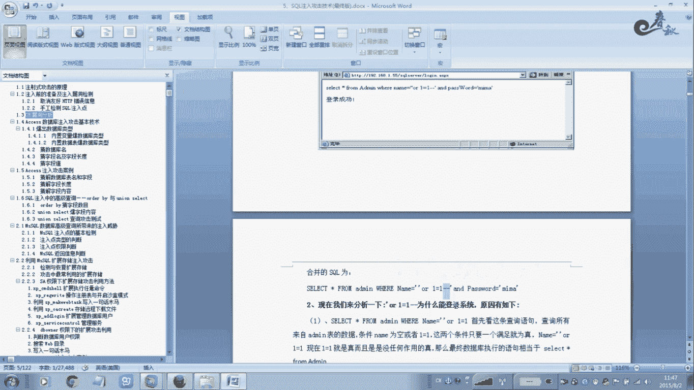

我在这里加的注释，就是这个是这个sup的这个注释符。

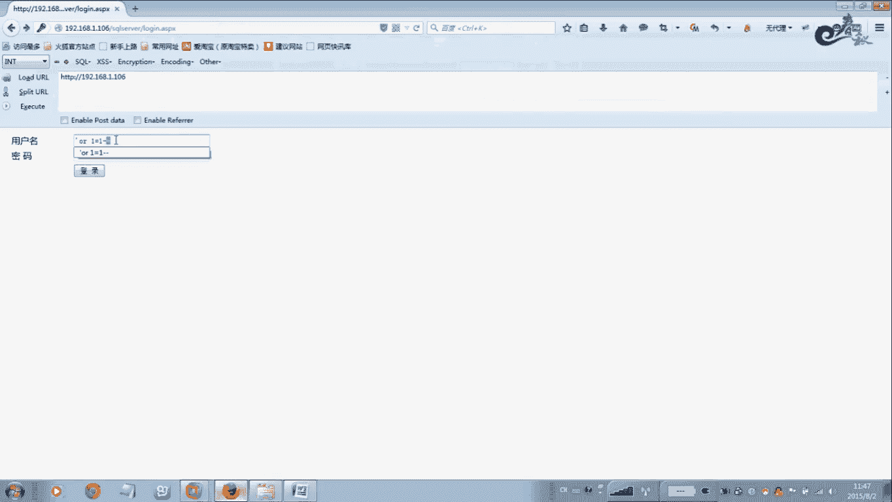

就把我们后面全部注注释掉。

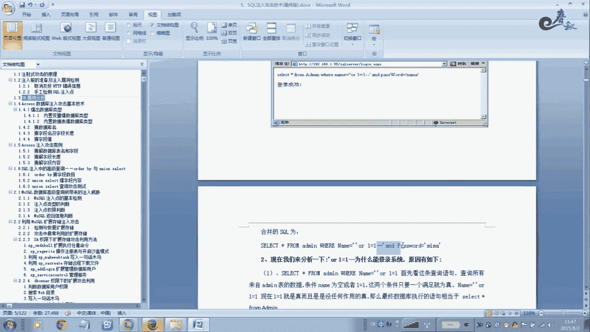

就是说这样的话，我密码不管你输什么。

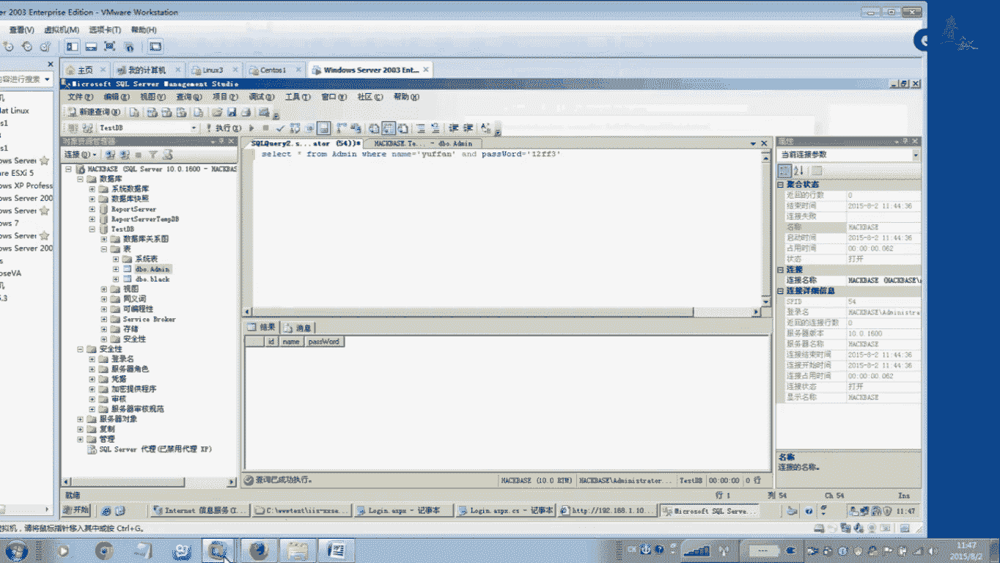

啊，不管你说什么。

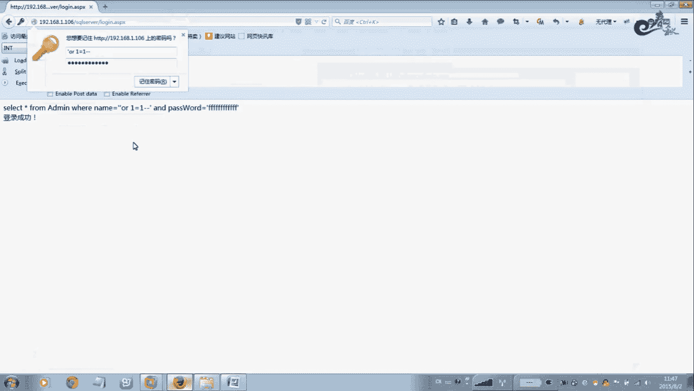

他都是单录参功的，都是登录参购，这是OK的，这样的话就可以进管理员后台。那么在这里真正的构造的语句是什么样子呢？他即使他是这么。他是这样的。查询所有来自艾min这个表f。大家我养条件是什么？

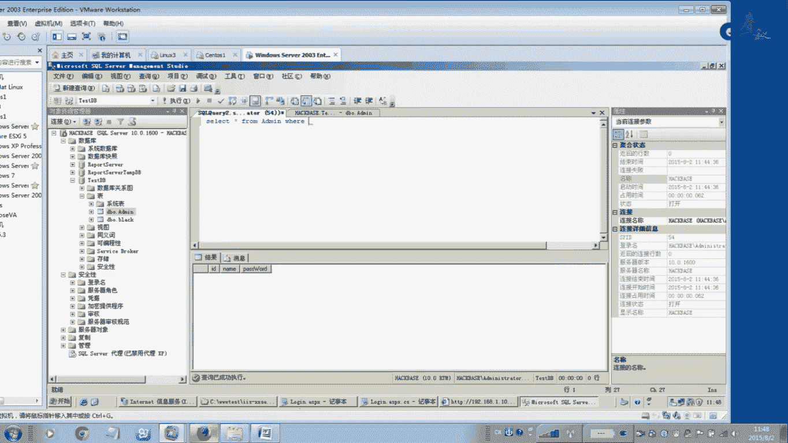

没有条件是了？一等于1。

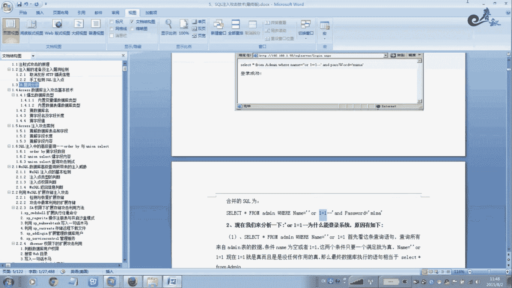

一等于。你看我们看一下哈效果。分析下语法没问题。诶。你怎么回事啊？你看。你稣 ok企 了吧。你是 ok，我想关闭一下。让大家看一下效果，主要是。你怎么老色调子什么？啊，你看。我执行了，你看出来了吧。

用户名和密码没任何问题吧。对不对？那单录数据库查询那些时候也是成立的。他执行他其实执行了这个，但然后面还有个我们加了一个这个东西。就是注释符号那样子。这个是微软的和所尾的一个注射符号，你看。你看对不对？

明年执行城款。是没有任何问题的。没有任何问题。也就是说。他是OK的。去采力的。是成立的。

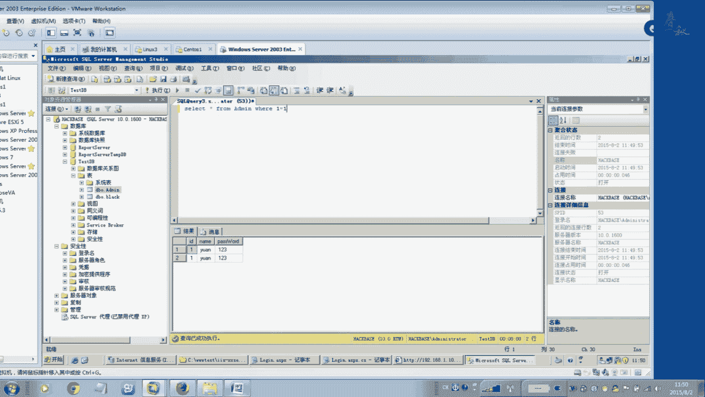

现在我希望大家就是说你首先要明白他为什么可以登录。原因就是这么回事。那么这里我也给大家详细讲解了这个分析的原因。就是说当我们查询这个语句，看首先查看这个语句，查看所有的来自这个数据，条件是这个。

为空或者一等于两个条件只要一个为真。我冇。就为真。如果是暗对的话哦。那是两边必须要全部违分的，只要一个为讲条件最终为甲就是错误，就是不能登录的那AND啊如果是。相当于他直接查选了这个。

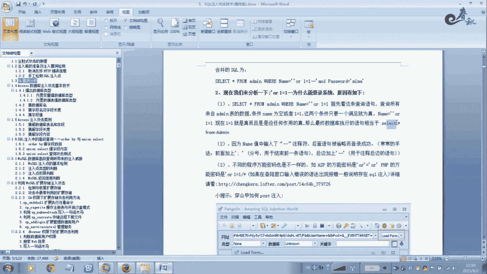

后面这个什么哦一等于1啊，这都是废话。是吧1。于1条件我要1。1，其实其实就是个废废话。130等于1嘛，所以说。这就勾造了一个。所以你在写代码的时候，你要写防御代码的时候，你一定要把单引号啊。

这些过滤掉。啊，然后这些语句。就是不允许带入到4水库里面查询，不然他就各造伪灾了。那么name这个值输入的这个这个符。就是后面的语句被省略。可单独参歌。啊，单录成功。常常的说法是前面加个单号。

现在注路的时候。你存在测试这个嗯登录窗口有没有万能密码，或者有SK的之路。其实大家嗯你随便输一个大引号。如果这个登录的时候。报错了这个地方报错了。注意好。一看到这种报错，那说明对方呢那是存在这个什么。

万能密码带load或者是SKL注入类的，为什么呢？因为我们的语句。输入进去之后，既然能报错，那说明带独的数据库的查询。这是能进行。查明。但是错误。你看一般的是如果不存在得忘的密码登录的时候。

一般是不会报错的啊，不会报错。那这个是一个技巧问题啊一个技巧问题。

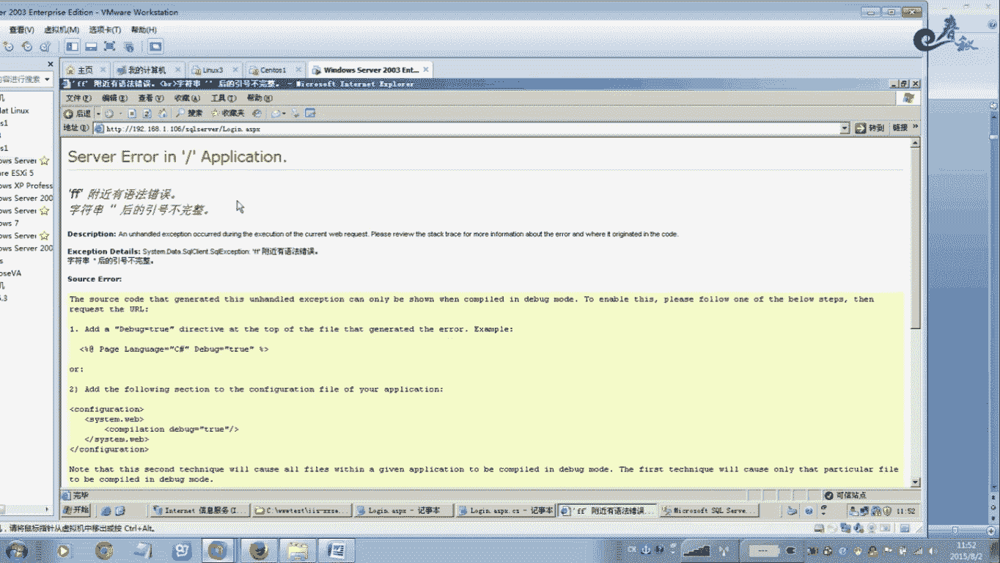

渗透的一个计算问题。

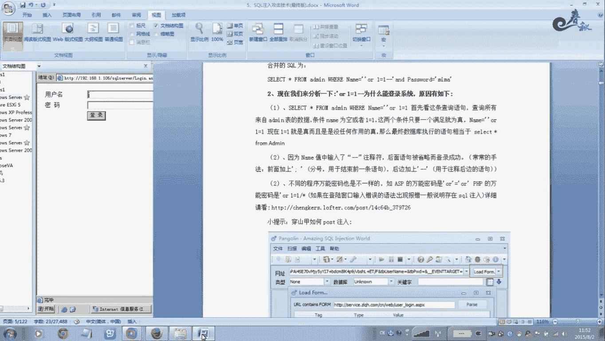

啊，记得我们卡。不是所有的程序都像像我这里一样，直接输入这样的都可以登录掉。我们介绍不同的程序的万能密码也是不一样的。如AP，它的万能密码是这样的。就登录仓口啊就登录仓口。这样速度。啊这样说的。啊。

以前特别多，但是我们这样登录不上去，为什么？因为是这里是APX。SPX也点let头的。PSP的它有这样的，对不对？它是这样的，所以说不同的程序它这个万能密码是不一样。

那么这里我也给大家一个详细的连接地址，大家回去之后好好看一下。你看。再有我有这有所有的这个万能密码。嗱边会啊。说么事。你可以在这个忘了密码。你可以在百度里面去搜索。这是SBSBX的1等0。可以自接测试。

对唔靓？这是P还P的。这是GESP的。对不对？所都洗了。

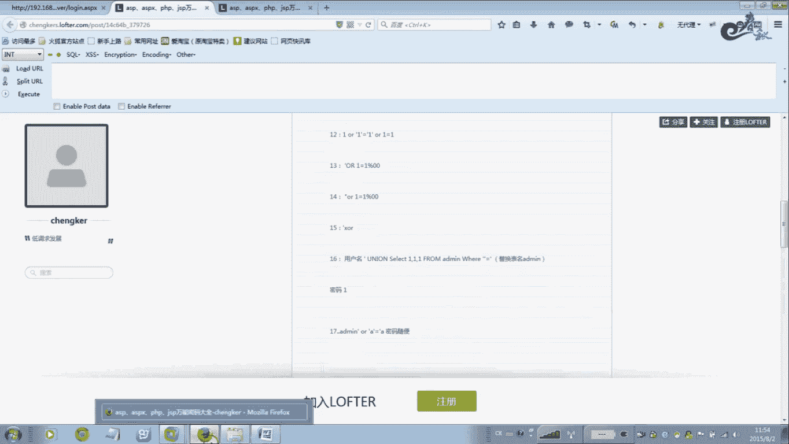

呃，接着我们看。几多咋啦。补充一点。就是那个穿三甲。啊，这是。一个朋友问到的一个问题。有关系这个哦。

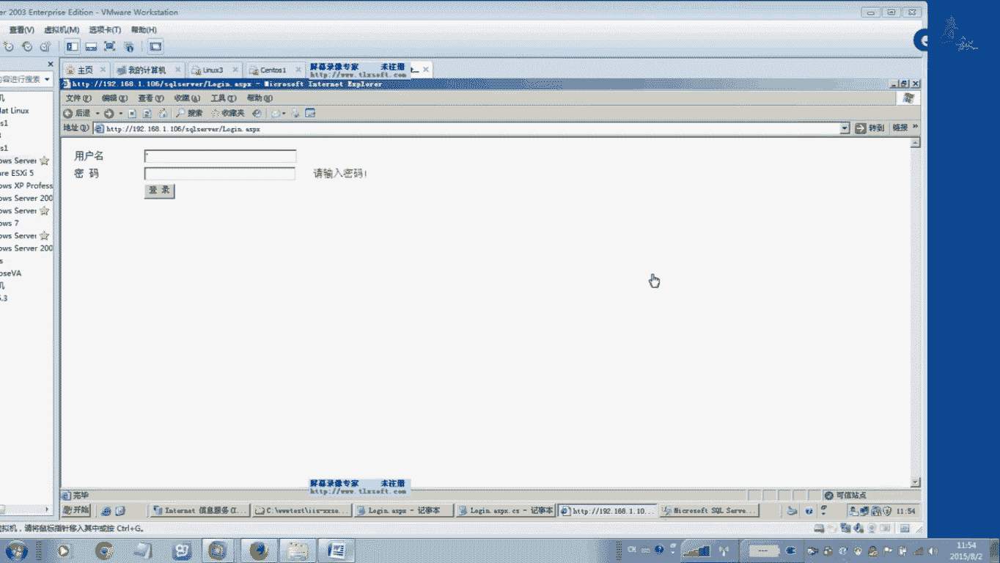

甚是在这个。QQQQ上面单独问到的一个问题。关于这个穿酸甲战类这个。奥了的这个就是这个注入点，怎么去注入这个框架型的。

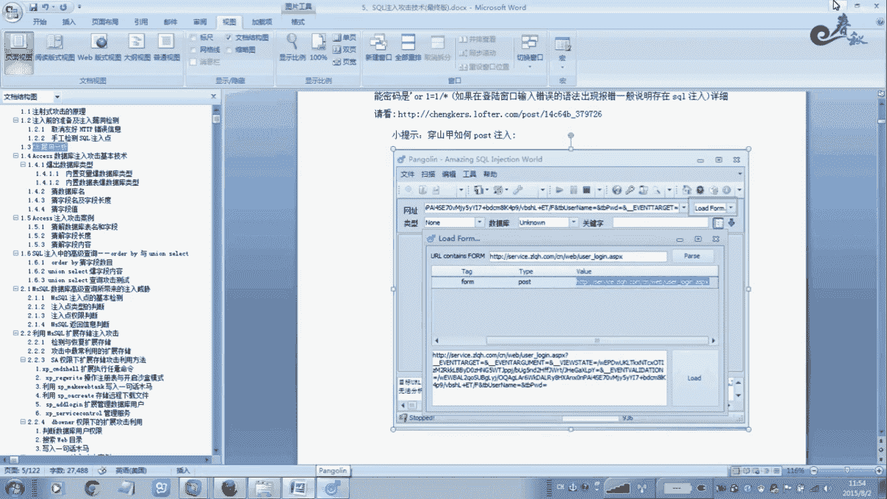

就是我们这个。这样一个单路框，哎，你看这个带单独框怎么能就注入啊，对不对？我这个地方没有电话糖了，对不对？这个地方怎么注路？其实很简单。把这个地址复制过来。对不对？复制过来之后。

你在这个地方选定一个表的这个加载。矿泉水就表单水。把呢电视放咗啲。这样的话他就。我了。啊。你这样就可以了个。输入了。但我这个地方创造的功能不是很强。5SK蓝F。SK到m注入这样的比较好。

然后这个双三甲还是跟SK到m这样的神器比较还是相差一个等级的。但是这个方法就是这么回事的。就是说你这里点击一下。在这个地方，你看这样的话，它就识别出来了。识别出这个登录在这个里。

那些参数你接着把它加载进去。哦。这样的话。它自动会变成pos的猪，因为这个登陆的是一般是pos猪，对不对？但他这个地方还是。还是不行，还是效果不行。测不出出注了点，其实在SK的m里面一下子就出来了。

但是方法就是这么回事，将来就是说穿山甲怎么样去注入这个。登录仓口的形式就是pos住啊，就是这么这么这么去注入的。

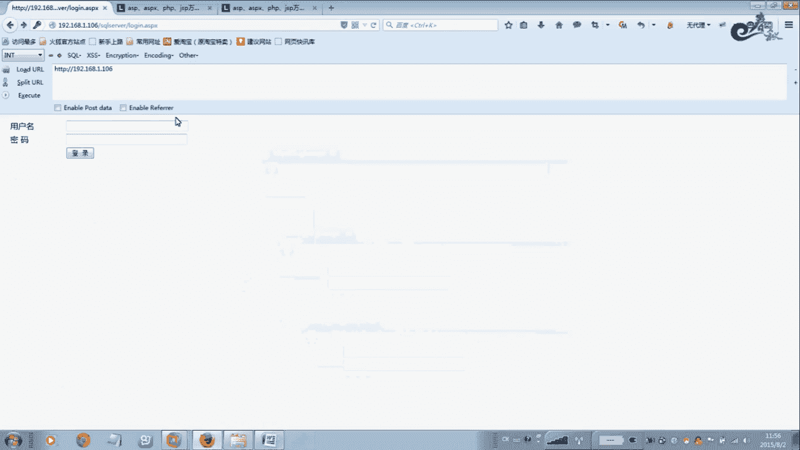

好像今天这节课我们就讲到这里吧。下一节课我们讲解一下access数据库这个注入机。

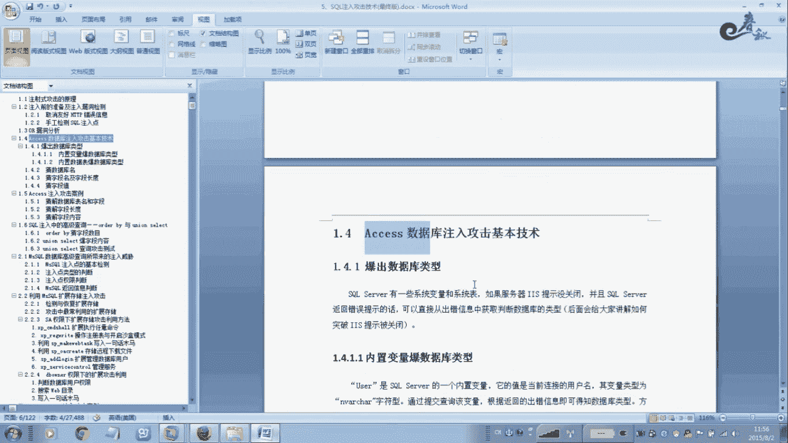