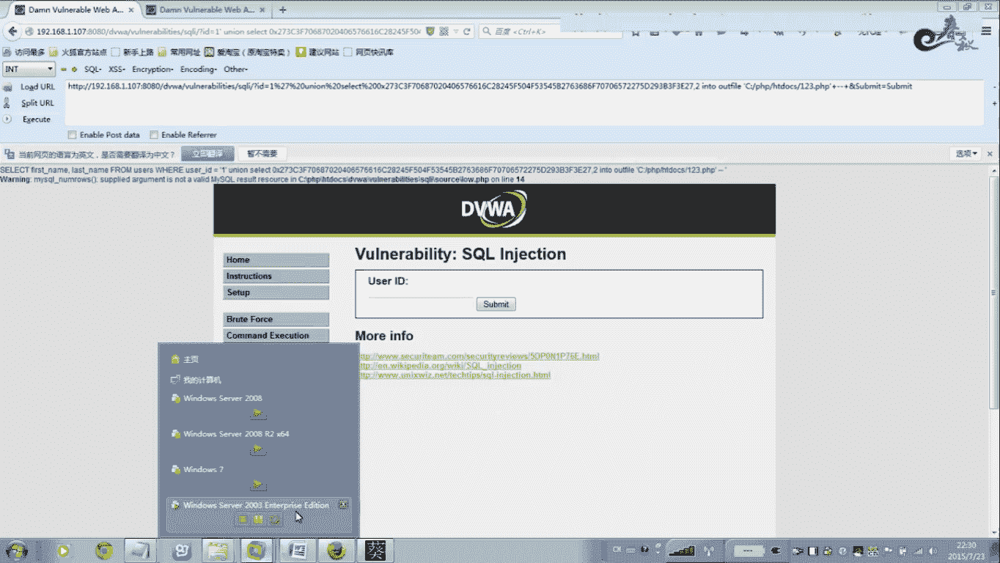
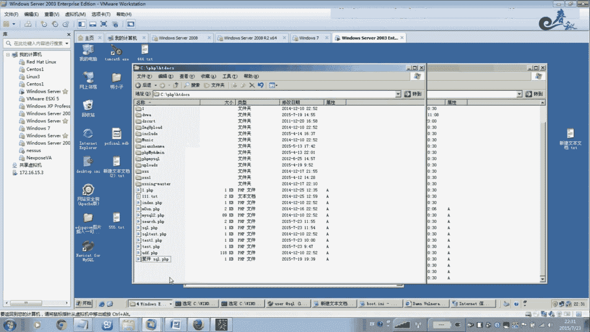
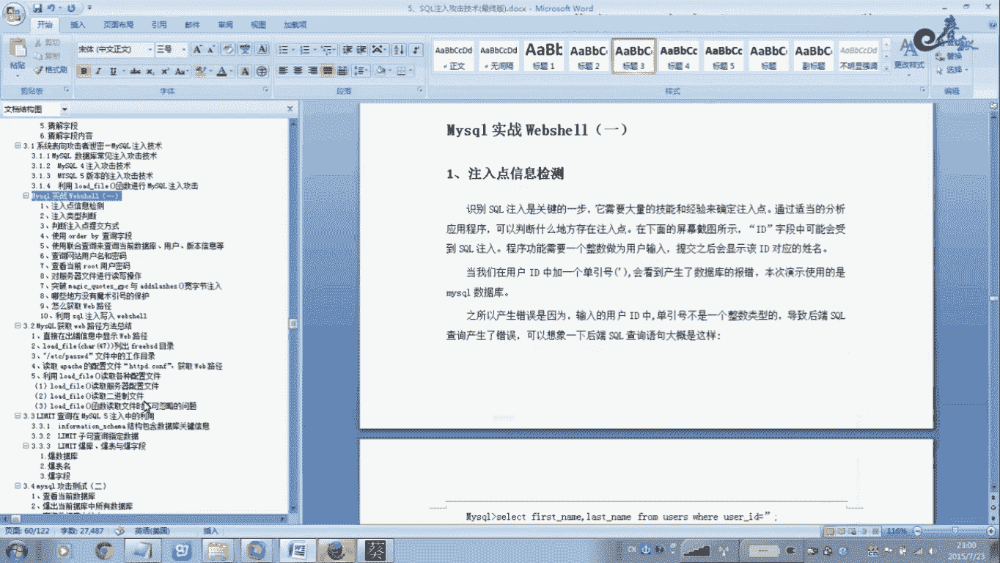

# 经典15年i春秋渗透测试系统化教程 - P13：课时5 注入式攻击-MySQL手工宽字节注入 - 老网恋教父了 - BV1n54y1B7F7

🎼，🎼Yeah。🎼Yeah。嗯。好，我们刚接着刚才的讲解。呃，我知道原因。在哪个地方的？把这个删的片。好，这里没有123的是吧？嗯，这个问题出现在这个地方。这一件。这个。一句话你骂才到得PSP。

一句话没骂。那么你这个单引号。也要转换成16斤。你把这个单引号也过来，也放在这里转换，跟它一起。不然的话，你用大引号在大引号里面的，你只把这个一句话转混为十6进去。你看这里这个单一号没有去转换。

那么他直接把这个16进去啊。当做这个字符券一样，直接输入到我们这个。这个。PSP这个文件里面去，那么输出到这个PSP这个文件里面，那么它这个代码也是十六进制的。那么十六进制的这个代码。这个菜刀不赖。

他连所以连接不上去啊，所以连接不上去。那么现在我们是把这个你看把这个单引号加上。把打一号跟这个。全部全部把给卷一下，把它卷成16进去。那么这个时候。你在这里替换一下。你看看。啊，这个时候就可以的。

月行一下哈。

那么这个时候你看看。啊，你把单引号如果也转换成16进去的，那么它输出到这个1加3点PSP里面的时候，那么它就还原成这个一句话了，你看到没有？嗯，这样的话就是OK的，没有任何问题。那不信信我们再删掉是吧？

再删掉。分之后我们再学习一下。你看。过来了吧。对在这个前面这这些AD面AD面这个东西你不用管，这个是这个。偏这个DVWAR这套程序的这个毛病，然这个没办法。对对西，你不用管他。那么现在我们来连一下。啊。

用菜刀连接一下，刚才这个菜刀还没上，现在看连一下，看你能不能连接上去文件管理。OK没唉，连接上去了。对吧。你可以看对不对？你们在这里。嗯。PSP。这个。我们这个123的木马，对不对？

这个是我们现在把它删了。算了。这就是我们这个整个过程啊，怎么去。拿到一个web啊，拿到一个web，整个的一个mySK的一个整条线的一个路侵啊，一个深透城市。那么在渗透测试过程中啊。大家会遇见一个。

遇到一些麻烦，就是说这个。当以后被转换就对方PSB开启了这个模具符号。那么怎么样去突破？在这里我也给大家讲解一下。嗯，这里其他的全部讲完了。关于这个魔术符号。就是说呃。

模具符号就是这我们这个PSP点ANIAI这个。这个。函数开启了为2。就PSP你你你搭建这个PSP环境的时候，都有1个PSHP点IN啊。这个文件这个文件就是模模修模修符号。当他为 on的时候啊。

默认是on状态。啊，也也有些管理员把它关闭了，那么他就。不存在过滤这个单印好了，当然他可以。这个关闭没事，呃，也可以通过其他的函数。你像这个AE这样的这些函数啊也是可以的啊，也是直接把这个单一号。

空给啊把它转换成这个卷一符啊，一个阀斜状。这个都是可以的，等一下我就不用这个了啊。但是大部分管理员采用这种方法，直接把这个开启回啊。这个是PSP的一个呃安全性一个。对他一个安全的一个。配置吧。

横竖有很多。注意下。还有最些函数mySK了。Esscape。He my e leader。那么这些函数都可以把这个。当银行过滤掉。过滤成反斜杠，因为我们没有单没有了单以后啊。我们没法构造这个筑路。

因为这个单向闭合啊这些东西，包括这个空给呀。他如果过滤掉了，我们这个slack语句啊没法组组成一条完整的一个sick语句。这样的话我们没法。进一步这个猪肉攻击是吧？

所以我们需要把这个单这个单引号把它显示出来，这样的话我们才能。完成后面的攻击。好，先我们来看一下，我们用这个函数吧，试一下哈。我们就不用这个PHP点IN这个模术符号。给大家演示。嗯，随便找个文件吧。嗯。

SK了。找一个什么文件呢？😔，好，这里我加了一个，你看到没有name。然，这里我加了一个。通过这个文件。这个函数。这个函数就是。对这个单引号进行过滤啊，进行转移的一个函数。其实很多写这个PSP。

程序的时候，好多人喜欢用这样的函数啊。来进行转移。其实这个函数有的能用这个函数。有的人用这些好说，咱不。这个是根据个人的习惯吧，就是你想要用哪些函数就用哪些函数来进行过滤啊，就是安全设置吧。

对这个单引号这些碰给过滤啊。你们自己去选择啊，这里我就用这个函数代替一下啊，这个本来是。没有这个对吧，本来是没有这个。是这种形式，对不对？我加了一个这个。加一个这个。加一个这个之后啊，我们来。测试一下。

CND点PHP。它里面的参数是什么？系。M被过了，我们就看M参数吧，因为它这个就是。白N后面的这个参数过滤。那么我们输一。好，可以查询出来，对不对？有这些内容。对不对？它是这这条在数数据库里面。

它是这样的一条语句吧。sle9星号查询所有的来自这个右手表，未要条件是us name等于一。第一条。他就查询唯一的时候，他就查询出这些数据啊。那果当我当我们如果想做路，搞个答印好，我们来试一下。

发现一个问题。加了一个仿斜杠。你看没有？加了一个反斜杠。只要加了这个玩意，你没法注入啊你没法注入。为什么？因为有了这个玩意啊。这个仿习杠啊。你会发现啊他这个是卷衣服，那么后面的都这一经都都没用了。

怎么后面的银行，这样的话就真正的。这个这条语句它是这种形式的。什么担号一后面就没了。后面一节就没了，这一节就没了，没了怎么办？这样的话这条语就是不完整的呀，不完整的这个还少了一个单引号啊，没这个单引号。

你没法注，你没法注入啊。这个再再说你这个查选也有问题，但是这数据库查选你少了一个单引号是不行的。这个十那个语就是要求非常严格的。你扫个东一下就就就是不行啊，就是不行。所以我们需要对单一号顾虑啊。

把这个单一号把它写。把这个符号干掉啊，这个转业符号干掉。那么就是我们今天所讲解的这个宽字节啊，宽字节。那么宽字节是什么意思的？这里我说了。当我们这个尾岸的时候，或者是用其他的函数的时候。

他都会把这个打一号啊，包括这个空制键呀、商引号啊。都会加上一个反斜杠进行一个卷移啊，进行一个卷翼。那么目前大多数主机都是打开了这个形象，而且很多程序员也注意啊，使用这个上面的这个函数啊过滤变量。

看上去是很安全的，看上去很安全。很多漏漏洞查找者或者根具遇到这些函数过滤后。过滤后的这个变量直接就放弃了。嗯有，些尤其是一些免费的工具，你就扫描。他一看见这样的网。过嚟回等一下。你过滤啊。

他就不进行下一步了。但他现在像绿蒙啊。呃，它的WVSS啊这样的扫描器啊。啊，反正一些收费对吧，比较好，就是大厂上的。他都会。检测出。他是一个什么？是框自节注入，还有还有一些什么？夸赞。就是就是卷移的呀。

这些夸张，它都可以检测出啊，是可以检测出来的。但但是其他的一些工具啊。好多工具他是不行的啊，遇遇见这些匡自姐注儒，他就放弃掉了啊，认为没没有漏洞啊，其实它是存在漏洞的。

在放弃的同时也放过了很多致命的这个安全漏的。这个我们首先而知的。仿斜杠在我们这个就是这个东西啊，这个玩意。给我卷一下。在16进制里面是0X5C。也是5C。50%。当我们在当引号前面加上这个。

分之DF的是。也就是说，这种的形格。如果程序的默认字符是GBK。但这个框字节字符，那么卖SKL，它会用GPK编码的时候就认为分之DF啊。它是一个宽字节，也就是这种。是什么意思呢？是什么意思呢？

我们 do也。百分之 d f。嗯，这个汉字还不行啊。我们讲一下。不对。😔，你这样讲。嗯，们不用我。我们接着后面的讲解吧。那么这个分之DF反斜杠一个单引号，它其实就是一个什么样子？

百分等于之DF5C27%单引号转。转移一下，你就是百分之。哎，这个地方。你用那个吧。27%它16进制0X是百分号的意思，等于相当于。啊，你通过这个BOIRP卷吧，BOIRP它里面有几个卷的。可以卷出来。

那么它就是等于这个圆这个单引号。对啊。也就对这个圆这个。单加了一个单引号。大家也许还没有搞明白。那么我在这里。其他就。说一下。他是一个怎么回事嘞？首先要知道一个汉字。他是占两个字节，你字母一个字母。

一个数字啊，字母数字啊，它是占一个字节的。所以说两个单字节宽字节是什么行业啊？宽字节就是占两个啊单字节是占一个。首先要明白这个道理。那么所有的在这个框字节注录里面，所有的繁体字就是汉字里面的繁体字。

都是反你这个把它转换之后啊，它就是这样的一个形式，百分之多少是道？现这个如果打一个我们这个。汉字。唔据啊。这种。你自己在网上去讲吧，这个地方还有问题。还不行。这个工具还不行。当系大反。你不打团体字。啊。

这个还是不行，注意哈，你必须是繁体字。反就是这种。我来看一下。那这个。这个应该取前面一节的话。白了DF。百分之DF。那5C的话。就取前面一点，取前面这个百2之DF。本来我们是单引号你。

我们来到这里直接看实例吧给给大家演示吧。本来我们这个是是这样一条鱼句吧。对不对？😔，我们复制过了。默认是这种情况。就说当我们没有加单引号的时候。没有加大引好的是。那么是这种吧。对不对？没有加单以后。

登入到这个数据库里面查询的时候。一个完整的语句是这种语句。当我们去单入到，当我们在这个后面加一个单引号的时候。那么是存了这一种吧。那就会报错吧。报错我们通过单以后就碰到这个注点嘛，是否报错嘛。

或者按的语句嘛，按照一等于一按一等于2碰嘛，再加个单以后，那后程序一看有问题。后面还需要一个单音压闭合。不然的话报错。好。但是我们开用了我们刚才所说的。这些函数或者开起来模去符号。这样的话。

他就会把这个单元和过滤吧。再动它就把这个过滤它就会加了，把这个单引后加了一个什么。放斜杠再加一个单。也就是说变成这种的。最终成了这这一种。那么这里多一个什么？首先银号保值不变，对不对？唯又多了一个单案。

这个加了一个什么反斜杠。那么现在我们需要把这个防锈杠也干掉吧。要干掉吧。那么我们怎么干掉呢？我们需要在这里加一个什么？复制过来。我们需要加一个什么？需要加一个什么？就是在这个。百分之DF。讲一个这个。

这个百分之DF。他就是1个16级。也就是说他这个是一个繁体字。啊，他是一个繁体字。我们可以。呢路。还有其他的哦。还有其他的房地址，大家注意啊，你如果你看啊我们输入一个嗯。随便一个。你罗字母吧，我Y。

5Y歪。这的话是9%吧。应该是怎么去的。我们试一下。你看好。他会不会把这个反斜杠干掉？你看还是有的啊有。但防斜杠还是有。那所以说他没有干掉。如果我们这个。输入。不是法腻子。如果不是皇帝色。那CD。

你看下以。哎，这个好像还可以。哦，这个也是房地子。哎不对呀。这个字。他怎么转换的？这个工具还不行啊，这个工具确实还不是取前面的。还不是去前面。在网上你大家自己去在网上去找到这个。嗯。汉字试一下，反正是。

汉字市。除了。繁体字都是可以的啊，如果你不是繁体字是不行的，你必须要使用繁体字。他因为他采用的这个GPK的一个模式。你可以看到这一段话。编码的时候。他认为这个。房内子它是一个宽字节。

那么我们如果就采用这个吧，你就用这个百分之DF吧，你看。他就把这个你用我其他的啊也是可以啊。刚才也那一个字也是可以的，也把这个打引号干掉了。把银行干掉。这样的话这样的话我们就可以继续注入了哈。

后面有了这个单以后就可以注入了。为什么会被干掉？为什么会被干掉？因为我们百分DF。他是一个繁体字，这个繁体字啊占两个字眼。我们把这条语句复制过来。对比。最终执行的结果。最终执行的结果是最终吧。

那么他这里。那么这个最终执行的结果呢？加了一个这个吧。加了一个这个吧。现在我们是有一个汉字了。加了1个百分之DF。之DF占用两个字间。占用两个字检，但是他这里一个字检。我们直接把他。报占了。

把这个发型给棒上，用这个汉字啊。把它把繁体字，用这个繁体字哈，繁体字。把这个反斜杠霸占了。就是。就是说隐藏掉了一样。他是单的他是三的。其实他这个反向管应该还涨，但只是涨停了啊，不涨了一下。没有显示出来。

这个放心吧。他是这么回事的他是这么回事的。所以我在这里结束了。一个当一后变成这个。加一个单小变成这种。啊，卷一那么单压卷移后占了，也就是说他其实占了两个字眼，一个反斜杠，一个单压。

那么我们需要通过繁体字把分之DF各造两个字检。过造两个字检注意好。记住了。等我们输入打印后，记住哎，这个东西很那明白哈，就是这个里面的这个。这对于初学者来讲，尤其这个宽自己注住啊。对这个初学者来讲。嗯。

你看网上的一些文章啊，你是很难看明白的，你看不懂，我不知道它里面这个具体的一个关系为什么会这样啊，为什么会这样。货误。我在解释过程中，也许也也许解释的也有或者不正确啊，或者是。表达的不是很清楚啊。

但是你。QQ单独问我也可以啊。我在这里再解释一遍，这个单也好。加了一个单引号之后，被转移成这个吧，它相当于占了两个字节。所以我们要需要通过繁体字。赞点过自己。啊，这样的话直接把这个是不是替换掉了？

对不对？替换掉了。也就是用这个防粒子直接干掉了这个防泄杠。也就是说这个占领的话，所以最后我们页面是不会显示出来。所以不会显示出来，是这么回事的啊，我认为啊我认为当么他这里也有解释相关的解释，这采用这种。

嗯，这。这个是我的理解。这是网上啊，书上面都有啊都有这种通过这个GPK啊这种模式。他其实就是这样的就是一个这样的一个道理啊。而且我把网上的总结是总结了这样的一句话啊，总结了这样的一句话。嗯。呃。

这里还有一个详列啊，在深圳在这个深呃深斗测试过程中遇到了一个例子。就就是说呃尤其在输入用户名密码的时候，我们需要什么？把单银号过滤了嘛？PSP有前面的客户给大家讲过万能密码，对不对？

万能密码就是这么回事。word能密码就是说我们需要当引行吧啊，比如AT名打引号2一等于一，对不对？密码随便输入。当第一个条件用户也不存在或者是错误的时候。就是第一个条件不。不伪真为假的时候。

但是我后面接了一个22OR呀，一等于一一本身等于一伪真。这里以前面一个甲与后面一个粘比较，只要有一个伪针，那么这栋。回真。这样的话就可以登录后台了网站后台。那么它这里也是一样的，你看右索等于分之DF。

首先把这个再一个单引号，首先那么最终它就变成一个这样的一个吧，对不对？这样这样一个，后面单引号就可以用了吧。有的一个单引号，因为他这个房地是直接把这个防斜刚干掉了。如果你直接输入这个单引号。

没有这个前面也没有点，那么。那么这个。反锈管被卷移了嘛，就没有打被转移掉了，所以要最终的这个变成这样的用户面。后面我再接1个OR一等于1。前面当然在这个数据库查询的时候，它是不采着这个字的繁体字的。

从这个地方绝对是危脚。我讲这个我讲。所以说我讲没事，但是我们就哦。货就是说。这个一。1尾帧就是这两个条件跟这这前面一个条件跟后面一个条件，只要有一个伪帧，那么它就伪帧。那么用户没违帧，它是这么回事。

那怕sword的。随便。我们就可以登录了。当然也可以。这样的话，因为他最最终的语句是什么？是伪真的条件。条件。在后后面接了一个安得俺袋嘛。这个二在二路段的时候，我们讲的非常详细啊。

这里我们大家一看就明白了啊，一看就明白这个井号会注射符，当然会者这样的啊，也是可以注射，这个无所谓。当然还有注释，还有什么这种局势，这个这个玩意这个PSP这个东西就还是非常灵活。我这个这样的就是。

也是可以的，把柱子服。好，关于这个。坤子姐的这个呃这个解决方法。针对这个匡自姐这个防御。嗯，在这里给大家也说一下。怎么去防御起来？就是在我们在初始化这个连接或者字负器之后啊。但是在数据库里面设置这个。

你登录你的数据库啊，这里我就不登了啊，是非常简单哈。你在这个数据库里面连接你的数据库，把这行代码复制过来。设置一下。设置这个也就是说这句话的含义是来设定这个客户端的支付结为二进制。就行了，就这么简单。

这样的话就可以防御这个。框字眼。啊，这就是解决方法。我，下面还有一个地方，就是说在PSP里面这个安全性里面。将呃哪些地方没有使用这个模术银号？冇然后。PSP5啊，像这样的一个变量，一般要缺少这个。

这个保护的模辑法律保护的。嗯，还有这样的。读到电脑的时候。啊，这些输入输输出输出流的时候，他这些一般的都没有这个得到这个。保护得到这个。莫些话了保护。嗯，如果没有得到这些保护。

那么你在写PSP程序的时候。我前面讲过，你可以使用这些函数啊，使用函数。输入函数就可以了。这个就是根据你在写程序的时候，这个经念。好，这节课讲的内容够多了。那么我们这节课就讲到这里吧，下一节课我们。

你讲一下这个后面的这个子查询。

