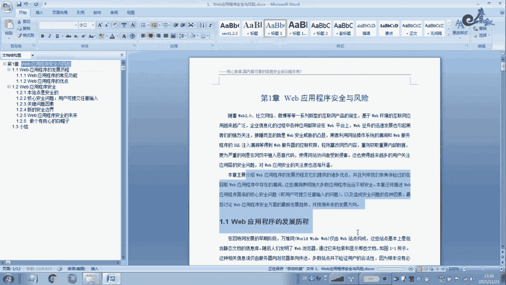
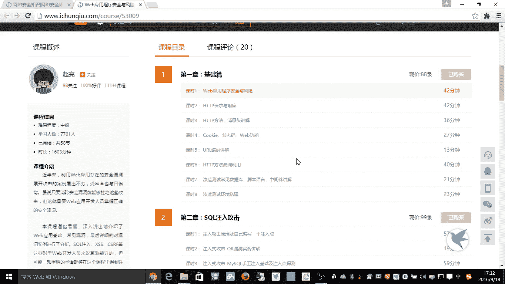
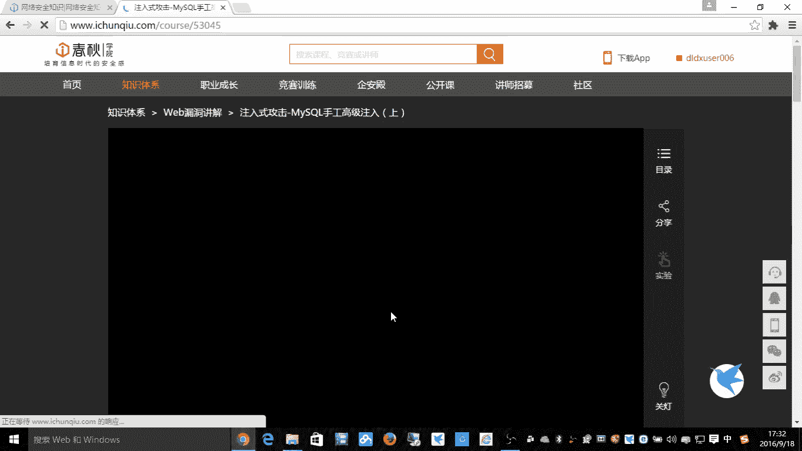
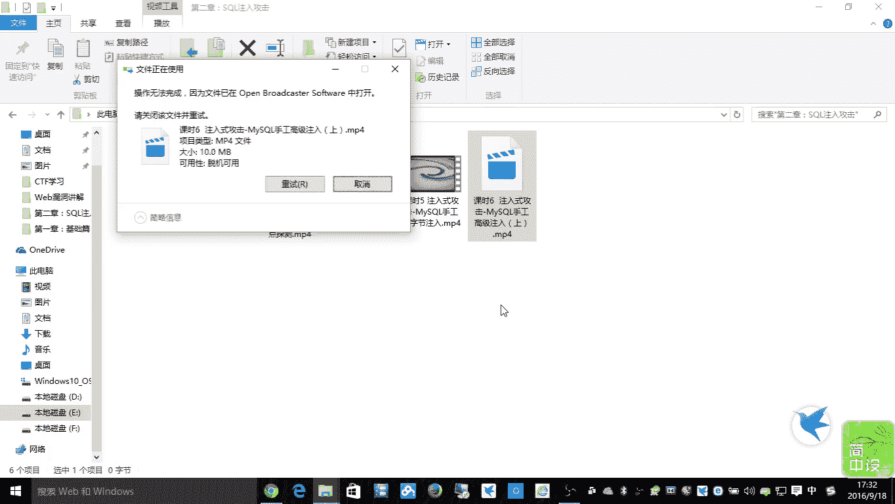
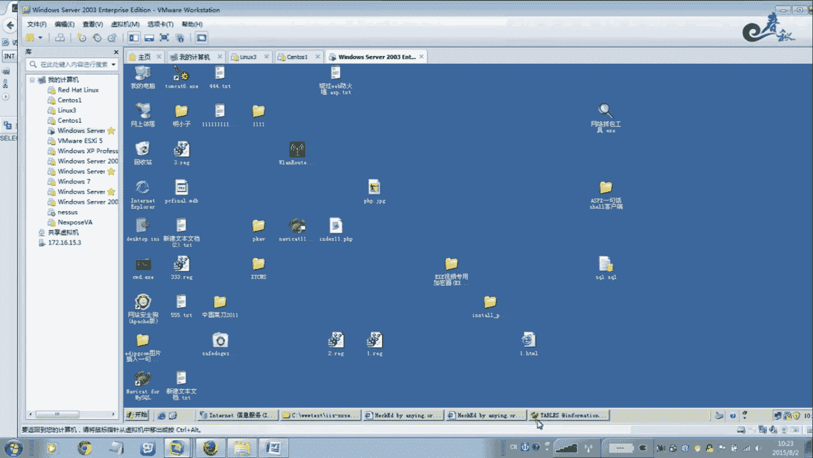
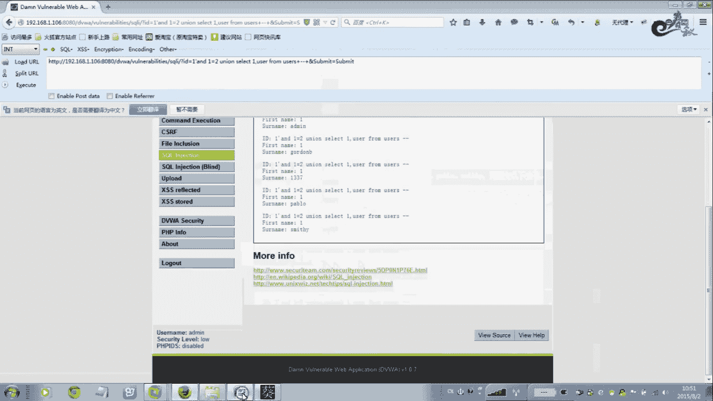

# 经典15年i春秋渗透测试系统化教程 - P14：课时6 注入式攻击-MySQL手工高级注入（上）🔍







在本节课中，我们将要学习MySQL手工注入的高级技巧，特别是如何利用`LIMIT`子句和`information_schema`数据库来系统地获取数据库、表和列的信息。我们将通过具体的SQL语句示例，一步步演示如何从目标数据库中提取敏感数据。

---

## 概述：外部应用程序安全与风险

上一节我们介绍了基础的SQL注入原理。本节中，我们来看看如何利用MySQL的特性进行更深入的手工注入攻击，以获取数据库的完整结构信息。

## 默认配置文件与敏感信息

在渗透测试过程中，查找默认配置文件是获取敏感信息的常见途径。以下是常见的默认配置文件路径，攻击者可以利用这些信息进行进一步入侵。

*   Apache日志文件路径
*   Windows系统配置文件路径
*   MySQL配置文件路径（如`my.ini`或`my.cnf`）
*   FTP服务配置文件
*   PC Anywhere配置文件

**核心概念**：攻击者通过访问这些默认路径，可能直接读取到数据库连接密码、服务器配置等关键信息。例如，Apache日志文件若被包含，可能记录攻击者输入的一句话木马。




```bash
# 示例：一个可能包含敏感信息的配置文件路径
/etc/httpd/conf/httpd.conf
C:\Program Files\Apache Group\Apache2\conf\httpd.conf
```

## 利用`LIMIT`子句进行数据检索

`LIMIT`子句用于限制SQL查询结果的返回行数。在MySQL注入中，它可以被用来逐条读取数据库中的记录。

**公式**：`LIMIT [offset], [row_count]`
*   `offset`：起始行的偏移量（从0开始计数）。
*   `row_count`：要返回的最大记录行数。

例如，`SELECT * FROM logs LIMIT 0,1;` 表示从`logs`表的第一条记录开始，返回1条记录。

## 手工注入实战：获取数据库信息

掌握了`LIMIT`的基本用法后，我们来看看如何将其应用于实际的注入过程，以获取目标数据库的详细信息。

### 1. 爆出所有数据库名称

MySQL 5.0及以上版本提供了一个名为`information_schema`的元数据库，它存储了所有其他数据库的信息。我们可以通过查询`SCHEMATA`表来获取所有数据库名。

**核心查询语句**：
```sql
1‘ UNION SELECT 1, schema_name FROM information_schema.schemata LIMIT 0,1 --+
```
*   `schema_name`是`schemata`表中存储数据库名的列。
*   通过递增`LIMIT`子句中的`offset`值（如0,1,2,3...），可以逐个爆出所有数据库名。
*   若将`row_count`值设大（如`LIMIT 0,10`），则可一次性爆出多条记录。

### 2. 爆出指定数据库中的所有表名

确定目标数据库后，下一步是获取该数据库中有哪些表。表信息存储在`information_schema.tables`中。

**核心查询语句**：
```sql
1‘ UNION SELECT 1, table_name FROM information_schema.tables WHERE table_schema=database() LIMIT 0,1 --+
```
*   `table_name`是`tables`表中存储表名的列。
*   `table_schema=database()`是一个条件，`database()`函数返回当前数据库名，此条件用于筛选出属于当前数据库的表。
*   同样通过改变`LIMIT`的`offset`来遍历所有表名。

### 3. 爆出指定表中的所有列名

知道了表名，我们还需要知道表中有哪些列（字段）。列信息存储在`information_schema.columns`中。

**核心查询语句**：
```sql
1‘ UNION SELECT 1, column_name FROM information_schema.columns WHERE table_name=0x7573657273 LIMIT 0,1 --+
```
*   `column_name`是`columns`表中存储列名的列。
*   `table_name=0x7573657273`是查询条件，其中`0x7573657273`是字符串`"users"`的十六进制形式。在注入中，使用十六进制可以避免引号被转义的问题。
*   通过遍历`LIMIT`，可以获取`users`表的所有列名，例如`user_id`, `first_name`, `last_name`, `password`等。

### 4. 爆出最终数据（用户名与密码）

最后，当我们知道了目标表（如`users`）和关键的列（如`user`, `password`），就可以直接查询其中的数据了。

**核心查询语句**：
```sql
1‘ UNION SELECT user, password FROM users LIMIT 0,1 --+
```
*   这条语句直接联合查询`users`表中的`user`和`password`列。
*   通过`LIMIT`遍历，即可获得所有用户的账号和密码哈希值。
*   若要查询特定用户（如admin），可以添加条件：`...FROM users WHERE user=0x61646d696e LIMIT 0,1 --+`（`0x61646d696e`是`"admin"`的十六进制）。

---

## 总结

本节课中我们一起学习了MySQL手工高级注入的上半部分。我们重点探讨了如何利用`LIMIT`子句进行可控的数据遍历，并深入利用了`information_schema`这个系统数据库来获取目标数据库的结构信息。关键步骤包括：爆出所有数据库名、爆出当前数据库的所有表名、爆出指定表的所有列名，最终查询到具体的敏感数据（如用户名和密码）。理解这些手工注入的步骤和原理，对于深入理解SQL注入漏洞和进行有效的安全测试至关重要。




下节课我们将继续讲解手工注入的其他高级技巧。