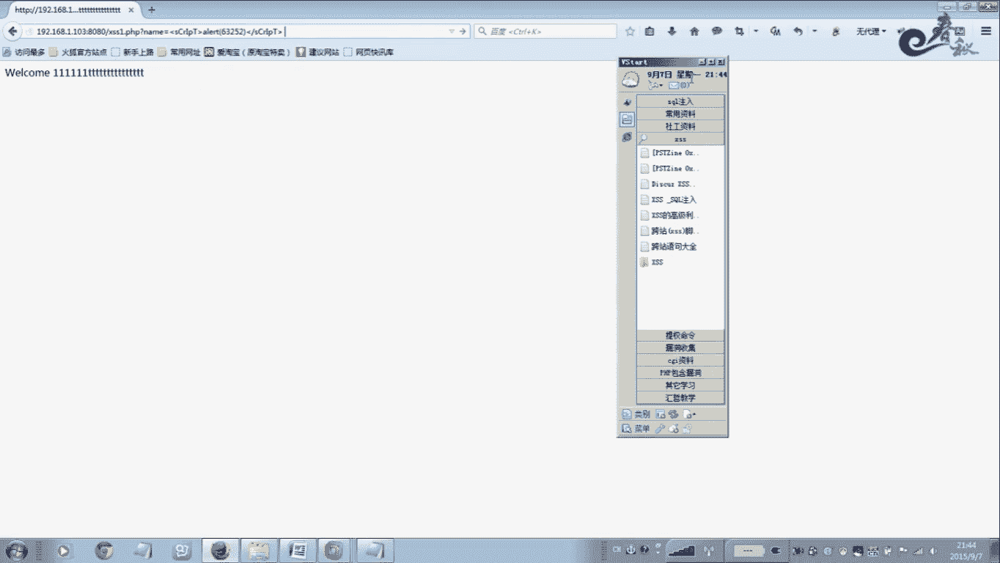
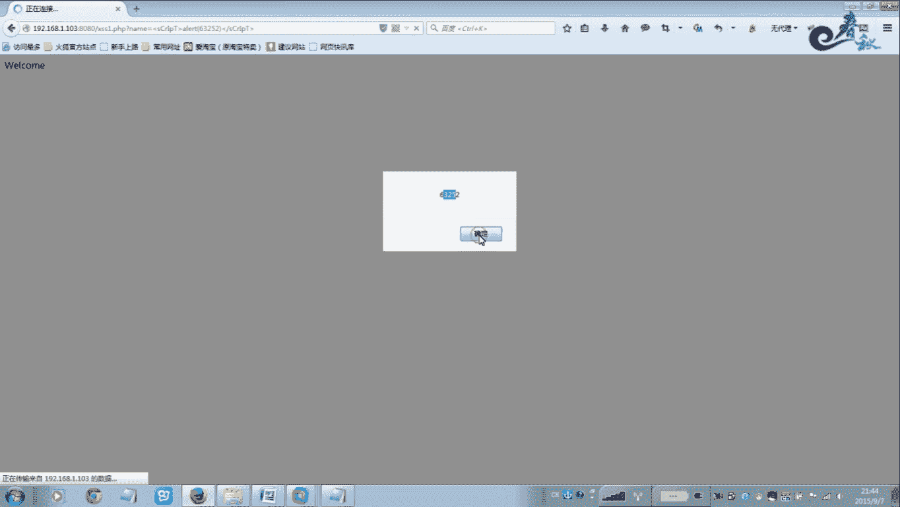
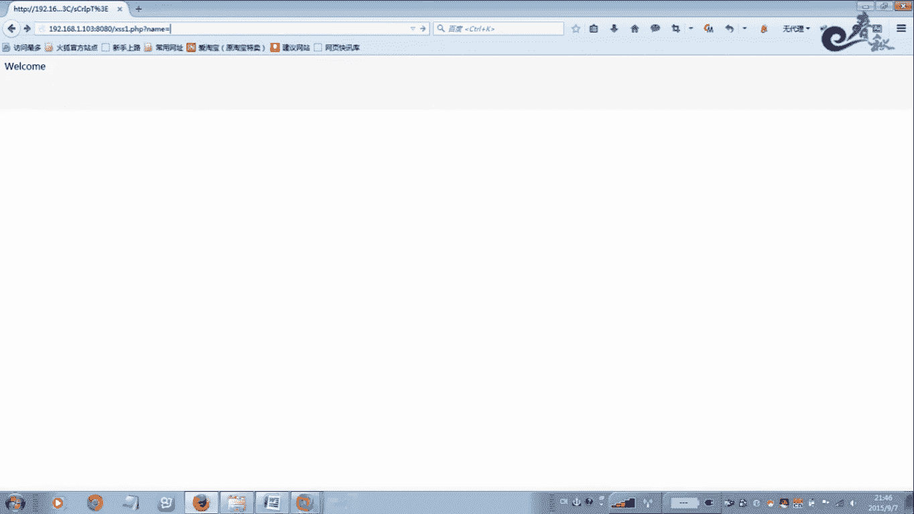

# 经典15年i春秋渗透测试系统化教程 - P18：课时1 XSS原理解析 🔍

在本节课中，我们将要学习跨站脚本攻击（XSS）的基本原理。我们将了解XSS的定义、危害、分类以及一个简单的实例演示，帮助你理解这种常见的Web安全漏洞是如何工作的。

## 什么是XSS？🤔

跨站脚本攻击（XSS）的全称是Cross Site Scripting，它是Web应用程序中最常见的安全漏洞之一。无论是大型网站还是小型网站，基本都存在这个漏洞。在渗透测试报告中，XSS通常是被提及最多的漏洞。

它的危害性也相当大。在2013年OWASP公布的十大Web漏洞中，XSS排名第三。

XSS是指攻击者在网页中嵌入客户端脚本，这些脚本通常是用JavaScript编写的恶意代码。当用户使用浏览器浏览该网页时，脚本就会在用户的浏览器上执行，从而达到攻击的目的。

## XSS的攻击目标与特点 🎯

通过以上描述，我们可以得知XSS属于客户端攻击，而非服务端攻击。这意味着最终的受害者是用户，对服务器本身影响不大。

但需要特别注意的一点是：网站管理员也属于用户之一。这意味着XSS同样可以进行服务端攻击。因为管理员比普通用户拥有更高的权限，一般可以对网站进行文件管理、数据库管理、文件上传等操作。攻击者可以利用管理员身份作为跳板来实施攻击，例如窃取管理员的Cookie信息、在后台通过XSS调用功能新建管理员、上传Webshell或创建恶意模板等。

XSS攻击的最终目的是在网页中嵌入恶意的脚本代码，例如进行钓鱼攻击，欺骗用户点击。

## XSS的攻击能力与语言基础 💪

最常见的攻击代码是使用JavaScript语言编写的。JavaScript语言功能非常强大，通常我们能想到的攻击效果，XSS都有可能实现。虽然也可能使用其他脚本语言，但互联网客户端脚本基本都基于JavaScript。

因此，要深入研究XSS漏洞，你必须精通JavaScript。换句话说，JavaScript能做到什么样的效果，XSS的攻击潜力就有多大。这并非危言耸听，因为JavaScript可以用来获取用户的Cookie信息、弹出窗口。存在XSS漏洞的网站，其XSS漏洞可以用来窃取Cookie、篡改页面、将用户导航到恶意网站。更高级的XSS代码甚至可以监控键盘操作、模拟Windows登录界面，包括窃取开机密码都是可以实现的。

以上我们简要介绍了什么是XSS以及XSS的危害。接下来，我们来看看XSS的分类。

## XSS的分类 📂

XSS主要分为三类：反射型XSS、存储型XSS和DOM型XSS。

*   **反射型XSS**：也有人称之为非持久型XSS。
*   **存储型XSS**：即持久型XSS。
*   **DOM型XSS**：基于文档对象模型的XSS。

这是一个重点，在一些面试或考试中可能会被问到。你需要知道XSS有反射型、存储型和DOM型这三类。

了解了分类，下面我们来看一下如何挖掘XSS漏洞。

## 如何挖掘XSS漏洞？⛏️

挖掘XSS漏洞，你需要寻找脚本程序的输出显示点。以下是常见的挖掘位置：

*   搜索关键字的地方。
*   存在对话框的输入框。
*   任何显示输出内容且内容会变化的地方。

我们的方法是跟踪这些变化的内容是否被过滤。如果没有被过滤，我们就尝试插入一段恶意代码，看它能否执行。这就是挖掘XSS漏洞的基本方法。

下面，我们将通过一个简单的实例来演示这个过程。

## XSS漏洞实例演示 💻

我们将一段简单的PHP代码复制到虚拟机环境中。这段代码的功能是获取用户通过URL参数`name`传入的值，并直接将其输出到页面上。

**关键代码分析：**
```php
<?php
$name = $_GET['name'];
echo "Welcome " . $name;
?>
```
这段代码定义了一个变量`$name`，用于获取`$_GET['name']`的值，然后通过`echo`语句直接输出。例如，当访问`?name=111`时，页面会显示“Welcome 111”。

**漏洞点在于：** 代码没有对用户输入的值`$name`进行任何过滤，例如过滤尖括号`<`、`>`等特殊字符。这意味着用户输入什么，页面就输出什么。



**攻击演示：**



1.  当我们输入正常的文本时，如`?name=test`，页面正常显示“Welcome test”。
2.  当我们输入一段JavaScript恶意代码时，如`?name=<script>alert('XSS')</script>`，页面会弹出一个警告框。
3.  我们也可以输入跳转代码，如`?name=<script>window.location.href="http://www.baidu.com"</script>`，页面会直接跳转到百度。

**攻击原理：** 攻击者可以将包含恶意代码的URL发送给用户（例如通过邮件、论坛等）。如果用户点击了这个链接，恶意脚本就会在其浏览器中执行。如果这是一个精心构造的钓鱼网站链接，用户就会上当。同样，我们也可以插入窃取Cookie信息的代码。

**防御思路：** 要防御此类攻击，可以直接在代码中对输入进行过滤，例如过滤尖括号`<`、`>`，或者对特殊字符进行HTML实体编码（如将`<`转换为`&lt;`）。关于XSS的详细防御方法，我们会在后续的课程中单独讲解。

本节课的实例演示旨在告诉大家XSS漏洞的基本表现形式和原理。

## 总结 📝




本节课我们一起学习了跨站脚本攻击（XSS）的基础知识。我们了解了XSS的定义、它属于客户端攻击的特点、其强大的危害潜力，以及反射型、存储型和DOM型三种主要分类。最后，我们通过一个未经过滤的PHP代码实例，直观地演示了反射型XSS漏洞是如何被触发和利用的。理解这些基本原理是后续深入学习XSS挖掘与防御的重要基础。