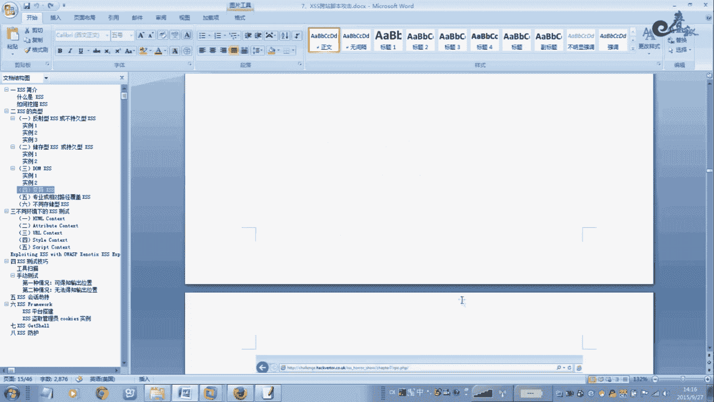
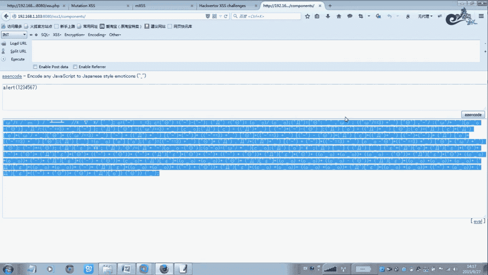
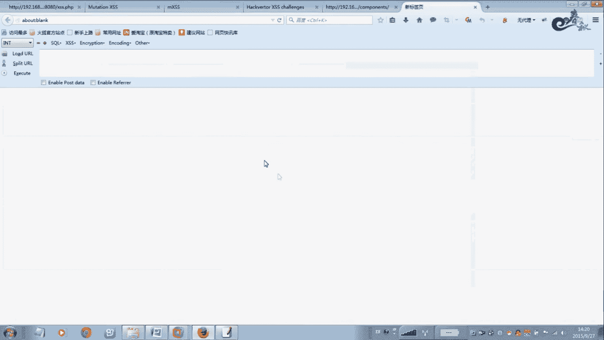
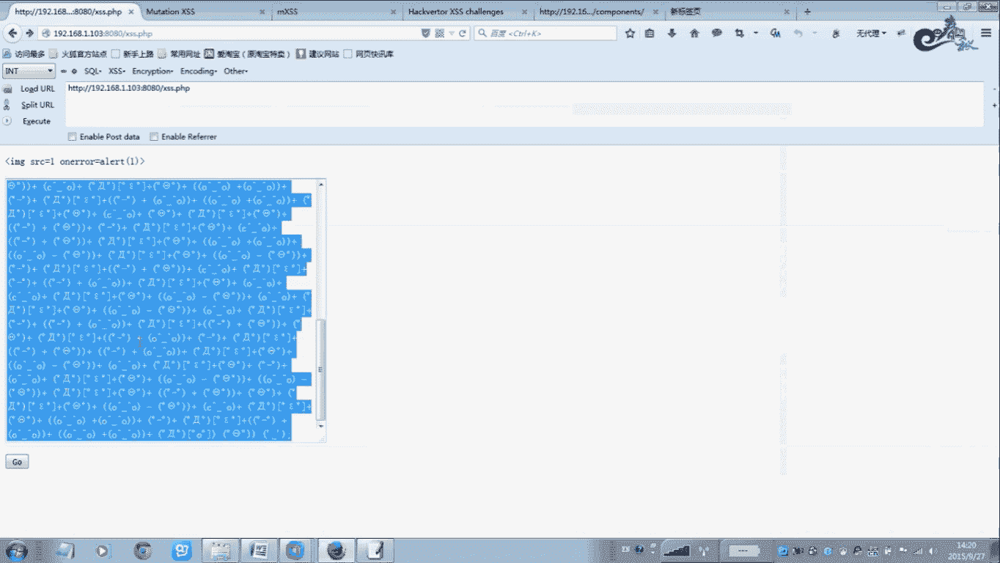
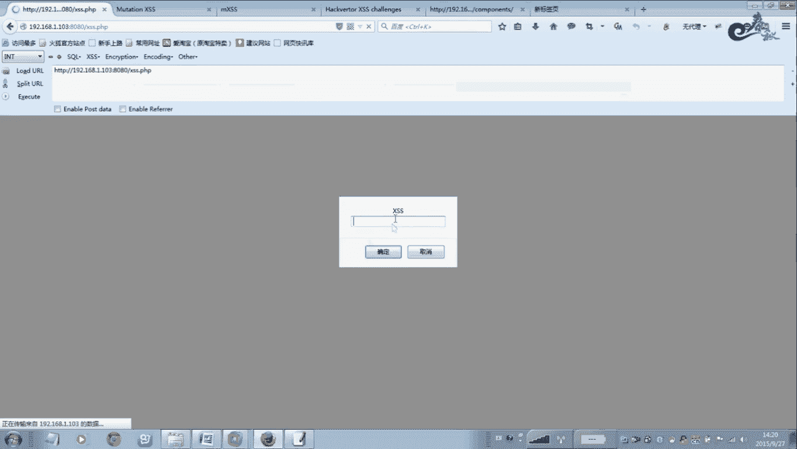
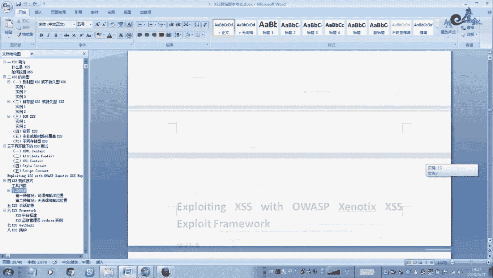
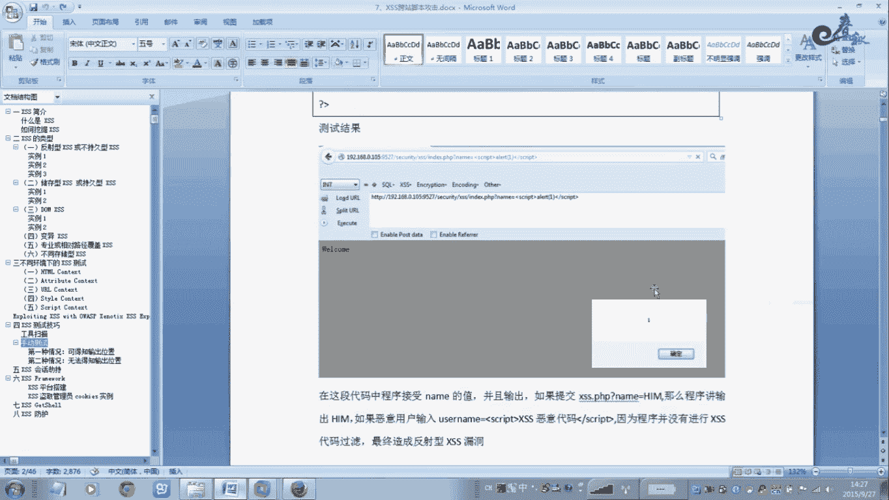
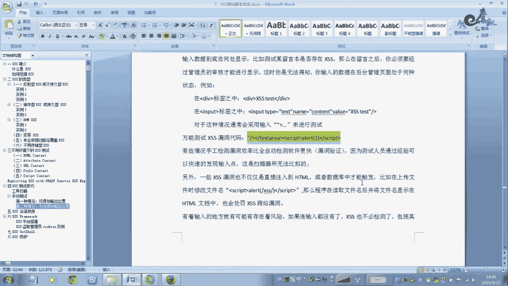

# 经典15年i春秋渗透测试系统化教程 - P21：课时4 XSS变形突破 🛡️➡️🔓

## 概述

在本节课中，我们将要学习XSS（跨站脚本攻击）的变形与突破技术。当网站对常见的XSS攻击向量（如`<script>`标签）进行过滤时，攻击者需要采用各种变形技巧来绕过这些安全防护。我们将探讨多种变异XSS的原理、构造方法以及手工测试的关键点。

---

## 变异XSS简介

上一节我们介绍了XSS的基本原理和使用方法。本节中我们来看看变异XSS是怎么回事。



变异XSS主要源于安全防护机制对特定字符或函数（如尖括号`<>`、`alert`函数）的过滤。为了突破这些过滤，攻击者需要构造特殊的、能够绕过检测的XSS载荷。

一个核心概念是：变异XSS是从安全的输入范围，通过编码、混淆等手段，引入到不安全的执行范围。许多常见的变异XSS结构源于浏览器对HTML代码的“容错”解析。

一个好的变异XSS例子是使用`<listing>`元素。当浏览器错误地解析`<listing>`标签内的内容时，可能会将其转换为`<image>`元素，从而绕过对原始HTML结构的检查。

---



## 突破过滤的常用方法

以下是几种绕过常见过滤规则的XSS变形方法。

### 1. 绕过`<script>`标签过滤

如果网站过滤了`<script>`标签，我们可以尝试其他HTML事件属性来执行JavaScript。

例如，使用`onclick`事件：
```html
<button onclick=alert(123)>点击我</button>
```
当用户点击按钮时，同样可以触发弹窗。

### 2. 使用编码混淆

对XSS载荷进行编码，可以绕过基于字符串匹配的过滤。





例如，对`<script>`进行HTML实体编码或十六进制编码：
```html
<!-- 十六进制编码 -->

```
浏览器在解析时会自动解码并执行。



### 3. 大小写混合与插入空字符

过滤器可能只匹配小写的`script`，我们可以使用大小写混合或插入空字符（如`%00`、换行符）来绕过。

例如：
```html
<ScRiPt>alert(1)</ScRiPt>
<scr%00ipt>alert(1)</scr%00ipt>
```

### 4. 使用替代函数

如果`alert`函数被过滤，可以使用其他具有类似功能的函数，如`prompt`、`confirm`或`console.log`。


例如：
```html
<script>prompt(‘xss’)</script>
```

### 5. 利用其他HTML标签与事件

除了`<script>`，许多HTML标签的`onload`、`onerror`、`onmouseover`等事件属性都可以用来执行脚本。

例如，利用图片加载错误：
```html

```
或者利用`<iframe>`框架：
```html
<iframe src=javascript:alert(1)></iframe>
```

---

## 手工测试XSS漏洞的关键

上一节我们介绍了多种变形技巧，本节中我们来看看在实际渗透测试中如何应用。

手工测试XSS漏洞的核心在于：**寻找所有用户输入并最终在页面上输出的地方**。

以下是测试时需要注意的输入点：

*   **URL参数**：查询字符串（`?id=1`）中的值。
*   **表单字段**：登录框、搜索框、评论框等。
*   **HTTP请求头**：如`User-Agent`、`Referer`、`Cookie`等，如果这些值被反射回页面。
*   **JSON/XML数据**：通过API接口提交的数据。
*   **文件上传点**：文件名或文件内容（如SVG图像中的脚本）。

测试时，可以尝试插入一个“万能”的测试向量来快速探测：
```html
‘“><script>alert(‘xss’)</script>
```
这串代码尝试闭合已有的HTML属性或标签，然后插入新的脚本。但具体构造需根据上下文调整。

---

## 工具与总结



虽然市面上有许多自动化Web漏洞扫描器（如Burp Suite, Acunetix, AWVS）可以检测XSS漏洞，但它们并非万能。



**工具扫描的局限性**在于其爬行深度和解析能力。对于复杂的交互、需要特定步骤触发的存储型XSS，或经过深度混淆的反射型XSS，自动化工具可能无法发现。

因此，**手工测试**在XSS漏洞挖掘中仍然不可或缺。它要求测试者理解应用逻辑，分析数据流，并灵活运用各种变形技巧进行验证。这个过程虽然较慢，但往往能发现自动化工具遗漏的深层漏洞。

**本节课中我们一起学习了：**

1.  **变异XSS的概念**：为绕过过滤而构造的特殊XSS载荷。
2.  **多种突破技巧**：包括编码混淆、大小写变形、使用替代标签与事件属性等。
3.  **手工测试方法论**：核心是追踪“输入->输出”的完整路径，并在所有可能的输入点进行测试。
4.  **工具与手工的结合**：认识到自动化扫描的局限性，掌握手工验证的必要性。



掌握XSS变形技术，需要不断实践、测试和理解浏览器解析HTML/JavaScript的细微差别。建议在安全的实验环境（如DVWA、XSS挑战平台）中反复练习这些技巧。