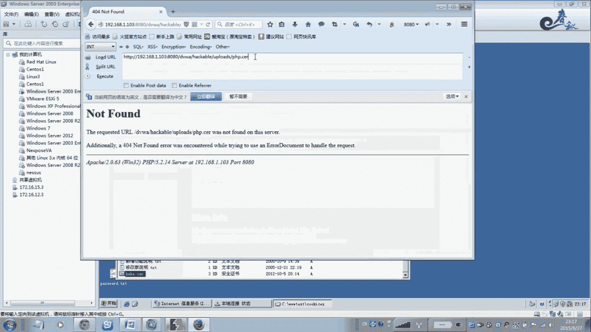
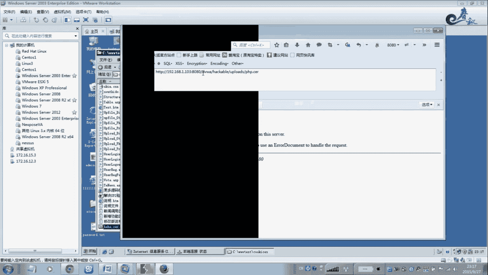
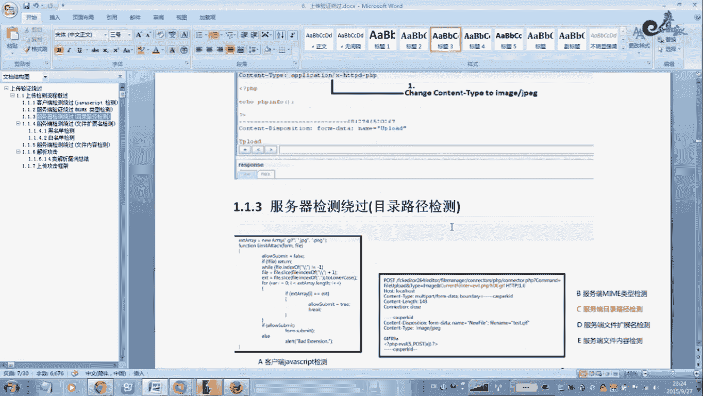

# 经典15年i春秋渗透测试系统化教程 - P22：课时1  上传漏洞-上传检测流程概述及客户端检测绕过 - 老网恋教父了 - BV1n54y1B7F7

🎼Yeah。🎼Yeah。🎼Yeah。啊，我们这节课给大家讲解一下这个上场内的。呃，上传内动也是在哦光手波排名里面前三位吧，就是说用的比较多，也是拉微b show啊这一块的一种方式。

我认为就是说渠到命临执行啊呃就是说我们这个上传内动啊。啊，直接丢一个。SP或者PSPGSP密马上去就可以拉到微博室用方呃速度是基本上是最快的。呃，那么我们来这节课就给大家把这个上传内程做一个总结啊。

做一个总结。好，我们从。头头到尾就讲解一遍。在现在这个越来越安全的这个体系中啊，我们这个注入来中啊，这里已经还难在安全性较高的一些站点出现。比如一些啊不错的点let或者抓我啊一些框架啊。

像这类搭建的网站啊，基本上都是通过一些参数化一些全体用户输入，以及其他的一些防御SK注入的一些API，那么他直接把这个注入的啊杜绝了啊杜绝了。就是封沙式这个SK的之路。那么在非PSP站点啊。

非PS在非PSP的胃部安全中这个。概率很大，而且这个VD也很大，一些攻击主要有疗程方法，一种就是说呃注入，另外一种就是上传攻接。那么这个在物远上面，大家可以看到。

就是说基本上很多站点都是通过这两种方式来拉下这个微博税啊，权限人线。一般的就是住入那种在一些。PSP啊、JSP啊，包括这个SPXSP都有哈都有的。那么我们这节课主要是讲第二种方法啊。

第二种就是上传类上传文接。那么第一种我们在前面已经讲过了。那么这里嗯还有就是说拉微不设的方法比较快的是原程包含代代码注入啊，命令执行这种啊这些类的。那么通常微博站点会有。

注册功单那么也就是说当我们用户登录之后啊，大多数这个情况下都会存在类似头像上传附件附件上传，尤其像一些呃。大型的站点论坛啊都有这个上传的功能，包括这个尤其是我们登录的这个管理员后台拉微博需要的时候。

一般的管理员后台都是有在上传一些数据啊啊图片啊。包括这个数据包啊等等这些一些word文档啊啊它都后台都有这个。比如说我们拉到管理员账号密码之后啊啊，登录后台之后啊，一般的后台都会存在。

还有就是有些商点嗯需要你投简历啊，它有一个上传功能啊，你上传你的简历啊，word文档啊，那么这些的地方我们都可以试一试啊，有没有存在这个上传漏洞。而且往往往这些有上传点的地方，一般是呃控制不严是吧？

存在很大的一些安全缺陷。那么在这个微博三度中啊，非常关键的一个突破口。这是。只要我们经过仔细分析啊，检测分析就可以绕过这个上传机制啊，验证机制往往会造成这个被攻击直接上传这个微博后门。

从而控制整个微博业务的一个拥有这个整个微博业务的一个控制权。复杂一点的情况，可以结合这个。呃，微博 say的这个服务器的个像IS阿巴奇啊啊N格斯啊啊这些一些解析漏等来突破这个上传我们这个后买来获取权限。

我们下面我们看一下这个上传的流程。你个干去。啊，第一个这张图这个图片就是我们这个ja乌斯Q呃通。k端招内部的一个检测的一个流程。那么也就是说我们购两PC机呃，就是用户啊，这个就是用户。

在上传的时候啊在上传的时候，有的一些站点它是前端则通过这个客户端这种javascript的一种方式来检测。就是说它只允许你上传GIFGPGPMG这样的一些图片格式的呃一个扩展名的文件。

它不允许上传PSPGSPP等等这一类。那么这种方式很好突破。如果只要是javascript两种方法，一种是啊把这个上传页面啊立成为放在本地再接着把这个javascript这一档嗯限制这个代码。

也就是说只限制这个。🎼呃，加FRGPG这样的文扩展你的文件来进行上传的话，那么你只要把这个javascript。再个代码删掉，再保存一下，再进行上传啊，就就可以突破。

还有一种方法通过我们这个BOIRP这类工具直接扎包啊，再上传过去拦截拦截到数据包之后，直接把这个扩展名改一下。嗯，把这个GPG改成PSP的呀，GSPSP的呀。这个根据这个呃微对方的这个微博服务器这个。

看他是什什么语言写的啊什么语言写的，那么你就直接改一下就上传就OK了。那么这种方式嗯也是。也就是说我用的比较多的，也就是通过这个BRB拦截概扩账名，改括账明对种方式来突破这个。

客户当的这个javaplay检测方法。那么这里我做了一些呃一个注释。也就是说这里大家可以看一下，那么通常一般上传的是采用什么pos的请求发送给微博服务器。那么微博服务器接收到请求后啊，并同意后啊。

那么用户与微博啊建立一个连接，再全期dter数据啊，d数据。这个带头数据啊一般都是包含了我们的这个木马，唉，像一句一句话木马，对不对？好，那么我们现在看一下一般的我们上传的五种方法啊，突破方法。

第一种就是客户单ja sleep检测。这种方法是呃相量多的，以前更多，现在稍微少了一点。那么这种方法是直我刚才说过两种方法，通过VIP改扩杂名就可以绕过去。那么第二种方法就是服务单。命运类型的这个检测。

这个是检测这个呃呃这个文件里面的一个内容，看是不是这个。PPSP类型的啊，一般都是图片有图片的头啊，可以看看得出来。所以说你一个图片啊，你右键用记械本打开，你就一看就知道。

如果就是嗯木马类型的用PSPGSP改个扩展名改成GPG是不是你再上传。如果是这种类型的服务端这个。服务端检测类型的。那么那么你就这种方法改个扩单明是闹不过去的啊，闹不过去的。

那么我们需要把这个图片里面插入一些花木马来捞过去啊，这种方式来捞过就检测里面的。投啊投包内容。那么这个第三种方法就是服务当服务当这个目录啊目录这个路径来检测。

这个是根据这个pass这个参数相关的这个内容来检测。那么这种方法这个loggo方式也也比较简单。一般通过这个解析类等啊，像这个ISIS啊、阿巴奇啊，对啊，这个路径解析就很其实后面我们会给大家详细讲解。

比就说像ISIS。啊，6。0的或7。5的。那么只要我们的这个文路径啊，这个文件夹。你命名的时候，只要是命名的时什么？例如t始的点。GAP这样的一个文件夹名字。那么你这个文件夹。下面的任何文件GPG啊。

或者都会当做这个SB来解析啊，这种方式。后面会给大家详细讲解啊，实例讲解，在这里就不再概述一下就行了。第四种就是服务端文件扩展名检测，这个是根据什么根据文件的这个相关的内容啊。

相关的内容ex这个相关的内容来进行检测。那么这个就是说我们这个举个例子IOS里面，它默认是有这么举个例子哈，那在这个地方有一些属性。Yes。你看这里也这么多，对不对？那么这个突破的方法也很简单。

就是说呃对方这个写程序的程序员在写程序的时候，没有去过滤一下AASPX啊ACX啊CER这样的扩展啊，他问了。我忘记了，就是说。嗯，墨兰像这样的IS啊，它有它就本身它就解析，它会解析这些的啊会解析这些的。

所以说你这里一定要把这些过滤掉啊，一定要过滤掉。你如果忘记了，嗯，那别人就会绕过去。所以说。一般我们会采用官民单的方式。白名单的方式来写程序，就是说只允许哪几个啊，千万不要以黑黑名单的方式来进行过滤。

这这种方式是相当不安全的。呃，我们介绍看一下服务档这个文件内容检测。啊，就是检测这个。文件里面是否含有合法或者包含这个恶意的代码啊，尤其是一句话木马，这是非常危险的啊，这种方式也就大概就是ABCDE啊。

就是5种方法啊五种方法。好，下面我们直接来看一下第一种方法就是K。这个检测拉过javak检测。我这种方式我很简单。啊，这里我没有搭啊，就是说就是说没有这个完整性的一个环境啊，就没有去手工写代码。

那么我就随便拉个DBWA啊，这个功能呢大概就给大家演示一下啊，演示一下。首先你代理一下啊，8080口用BOIP啊，BOIRP带理一下设置一下，在这里设置写设完之后，那么okK我们在这里就直接上去。啊。

那么我们把这个啊例如GPG的是吧，一个。那么这里我这个里面包含的是一花打码菜刀的啊菜刀的一句话。那么这种图片按理说是这个是不能解析的，上传到服务器是吧？说GPG的扩道米。

那么我们要如假设哈就是说如果是假设是dva script的方式检测，那么还要很简单，我们只需要把这个地方举个例子。是。只需要在这个地方点击啊，点击上传。把这个扩展名改一下。改成PHP。

因为我这个DVWA它就是PHP写的。把这个记住记得一下，把这里改一下啊，这个是DVWA的一个级别，变性级别级别是什么？低我用低级别和高级别是不存在的。还有就是说你这个闯木马的时候啊。

这个地方它这个代码是DVWA它低级别，它也是有这个。代码的大小的一个限制。也就是说你如果选一个大哎PSP大码上去，它是不让你上去。啊，你可以看一下你所以你要学会这个使用BRP这个抓包。

这个很有用的啊很有用。它是这个得限制了一个最大的啊，这个文件大小，你看maxmax啊，所以说这个地方一般情况下我上去喜欢用一句话，那雕过一句话使一下这个这个是最文当的。啊，你改个扩展名就行了啊啊。

这样就可以让我您看。我们点哎，我首先在这里来来这来来来来演示一下。好，先把这里删掉。好，我现在刷新啊，这里没有然，现在我点击转发一下。好，现在就过来了啊，过来了，对不对？你看现在变成PSP了。

本来我的稳件是什么是GPG的啊，这样就绕过去了。针对这个抓 script这个检测方法，就是这种方法突破啊，那么接着我们用这个菜刀去点一下啊，菜刀去点。我刚才做了一下。重新添加一下。

这个是他的路辑PSP点PSP那么密码呢就是菜刀是吧？对。は。Yeah。C， HO， PPPr。啊，添加。啊，就这样就可以了啊，这样的话我们就拉到微波水了。你看快吧。这就是永恒法啊。Car。

那么这个关于这个drvascript的一个客户端dvascript的检测方法突破方法。那么我们就给大家讲解到这里。好，现在就这。那一般情况下，这个这个我只是说模拟这个方法去调试说怎么样去演示。

怎么样去突破。那么一般情况下就是在针对的这个渗透测试过程中，一般它如果只要是装速这个检测的方式，可以扩装检测方式。那么很有区别哈，就是你在上传的时候。

只要弹出个这样的对话大概一个这种形式是吗啊通过vascript弹出一个对话vascript代码它是搞成在端，不是在服务端号，就是我们通过这个右键右键查看源代码啊，也是可以看到的哈。

它有一张这个vascript代码的啊vascript代码就这样代码它的限制这些是允许这些GPG啊加F啊这些上传是可以看到的。所以弹出一个对话出来，一般这种就是vascript的方式，你一眼就看出来。

所以你你就会采用我刚才所演示的你就打个BRP括一点上传转方。啊，我不需要倒时就这么讲。呃，关于我们接着看一下嗯后面这个方法。嗯，就是说这个。扩然面对方式。扩葬名扩葬名就是说嗯。

就说于我们这个改的这个地方。不一定只改这个。我，这没装包，就不一定只改个PHB或者是也可以改成其他的哈。就是就是说我们有的例如举个例子啊，有的如果。不是当沃斯个内部的。呃，那过方法的话，如果不行的话。

你给他改一下呗。像这些嗯CR啊。这样的一个扩展名嗯，CDX啊。嗯，还有这个AA啊等等的一种方法来绕过。我举个例子哈，你像啊我AB的决是可以执行的啊，这个是呃一般的程序都会过滤啊这样的一个扩张名。

那么举个例举个例子，对方程序里面如果忘记了写这个CR。啊 c r。因为是因为这个只要是在按S这个里面的。啊都是可以被解析的哈被解析的啊被解析的默认它这个歌这个构想上的，它这些也没被删除。

所以做安全线做安全的时候，一般的我们建议他把在这里点删除，点删除删除上去，没用的把它删掉啊，没用的把它删掉。为什么来举个例子好，你看CER到底能不能运行的啊？其实我们改成C如果是改成CER。啊。

你可以看一下。那点CR是吧。你看我这也是个马。那你能不能运行？我们只要看到这一里，我先把这个代理关了。

呃，这个路径不对。好是8090。Yeah。8090点。嘿嘿。哎，在这在在在这里在这里。你看。你看也是OK的，对不对？啊，CR都是可以被执行的。所以它所以说我们你你在自己的网上一定要记得。啊。

这些危险的被解析的。扩展名一定要把它删掉，或者写程序的时候一定别忘记了啊。还有这些默认的。有了，你要PSP有PSP54是吧，223这些。啊。

这些扩炸米也是相当危险的那你记得一定要把它啊这些把添加起程去的时候，一定要把它过滤掉啊。那么我们再样看一下，我我如果改成这个AACA呢，对不对？AACA呢，它是不是也是可以被执行啊你。哎，在这里。

也是可以的啊也是可以的。唔家。也是可以啊，没任何问题吧，也是被执行。所以说他这个这个放权内容啊。是非常灵活的啊是非常灵活。而突破方法。千变万化千变万化。好，下面我们来看一下第二种就是服务呢。

这种是前面讲的第一种方法是Q活动。服当年才老过。那么这个边面类型的这个检测。那么这种方式检测它是它是怎么一个检测方法呢？啊，这个图一样，跟前面的第一种差不多，他只是这个改了一个什么改这个地方。

改这个呃counttail。太普这个地方就是说。啊，代码也给大家列出来了，它这个是检测这个什么这种类型。一。咱这个文件是不是加F啊，加F的图片格式的，一般是这种啊MAGE啊些杠加F对不对？

那么我们就是说在抓包在这个哎把这个忘了。返回一下。好，来到这里吧，开个带理。Oh。Yeah。你叫大家在哪里干好。它有一个地方。一个类型，就是这个地方。嗯，我这里先把它。Yeah。好。这个地方啊这个地方。

Yes。那么你只需要把如果是这种方式检测的，就是说该放的代码里面。你看啊对方代表里面是通过这个检测的是什么服务当啊，服务当现在。就是命名这个类型的检测。那么这种方式检测的话。

那么我们如果你看看代码里面是这种方式，那么绕过方法是怎么绕过呢？啊，怎么绕过来？改这个地方改这个地方。怎么改改成什么样子？你只需要把它改成这种方式。啊。改一下就行了。如果原来的是这种方式。

那么我改成这种，你就改一下就行，改一下再去改。再去上去，按么这种方式就可以绕过去。很简单吧，只要再通过BRRP改一下就行了，把这个地方改一下。这种方式老我。因为他这个检测的时呢，他就是这样检测的。

我判断到这个类型。我检测他这个地方的类型是不是这个？就是说他。我们BRRP抓的这个包啊。你说这个包。他竟然他不是说。啊，你看看他主要是分析他的源代码哈，就是说对方服务器的PS代码看怎么写。如果他。

这个是不等于哈不等于的意思。如果它不等于这个。啊，这种类型，那么我们就是sorry啊，不允许它上传，只允许上传GIF的一个图片格式的，对不对？所以我们要改成等于这个啊要等于这个。

如果他这个地方就是说代码如果不是这，如果木兰是这种的，是吧？但是他只接受程序蛋码只接受这种。那么我们就是把他这种类型。改为这个。这跟他的这个。一样。那么你就可以成功上传。成功上去。这样的话就牢固了。

这个服装的这个。在我这服务当的这个啊秘密这个类型的一个检测。那么这种服务端检测HTT包的这个。conttain这个腿这个。类型的都可以用这种类似类似的方法来做绕过这个检测啊，绕过这个检测。

所以说嗯很简单啊很简单。好，这就是说我们。嗯。这种方式的一个烙go。那么现在我们来看一下。服当这个检测logo就是目录路径检测。那么怎么样去一个过程？

好，我们这个留在下一节课再讲解吧。

