# 经典15年i春秋渗透测试系统化教程 - P24：课时3  上传漏洞-服务器检测绕过（黑名单） - 老网恋教父了 - BV1n54y1B7F7

🎼Yeah。Yeah。好，接着讲解，我们先在讲解一下这个黑名单检测。那么这个黑名单这个安全性啊，这个比白名单这个安全性啊这个低很多。那么更记方法也是比白名单多啊。

一个一般一般有一个就是说我们在上传的时候，如果对方的程序也和啊专门针对这个白名单这个黑名单的一个列表，就是哪些哪些是这个。危险的这个。扩展民。那么他就会被拒绝啊，只要加入到黑名单。

那么你上传这个扩展名的时候，那么都会被c删掉，就是拒绝掉。那么我们来看一下哈，那么这个也是通过这个FFCKA上这个编辑器。那么像A2。4。3的这个版本，包括之前的版本，那么都存在这个内容啊。

都存在这些内容。那么我们来看一下方法吧。那么这个第一个是这个。文件名大小写logo啊，大小写logo。那么你看一下啊这个FCKAD上它这个。黑名单，因为这个编辑器用的也比较多哈。

当然还有其他的编辑器很多网上。啊，有有些是自定义开发的啊一些。那么他就是把这个危险的这个什么脚本的这个扩张名都写在这里的。只要你上传这个列表里面的。嗯，这种文件那么它都会被拒绝掉啊，都会被拒绝掉。

但是如果没在这个列表里面的，它就允许上传了啊，允许上传。你像这个APSPX啊是吧？包括这个什么EXE啊，GSP啊，它都。都拒绝了，都不允许上传。那么这种是相当危险的啊相当危险的。第一种方法go。

你看到这个列表里面都没有什么大小写啊，大小写。那么我们可以看到我现在如果你你拒绝了AP是吧，我把它改成大写的，是不是可以绕过啊，中间一个小写大小写组合。这样的话就不拉过你黑名单了吗？在上传的时候。

对不对？所以说这种方法是最不靠谱的啊，采用黑名单的方式最不靠谱。那么大小写就拉过去了。然呢。我们还可以通过什么没在这个列表里面呢，像C12A这样的过程也是可以的啊。第二种方法是名单列表logo。

那么这个时是什么意思呢？就用黑名单里面没有的名单进行攻记。举个例子ACER。啊，那这种也是在这个我前面就给大家讲过啊，前面就给大家讲过，在ISIS里面，也就是说。

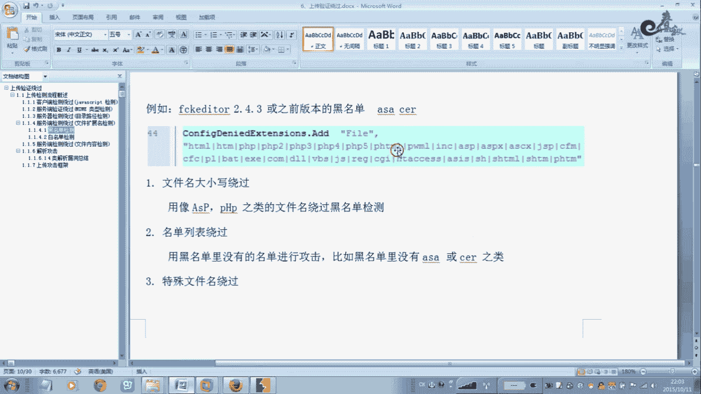

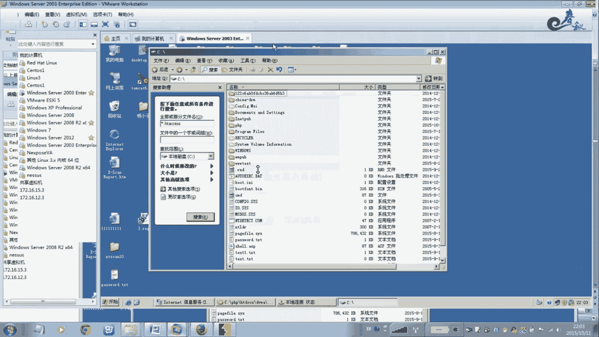

。你像这些。但是都是会被解析的哈啊，默认你要认为IS，它就会它有这些它就有这些。那么这些。

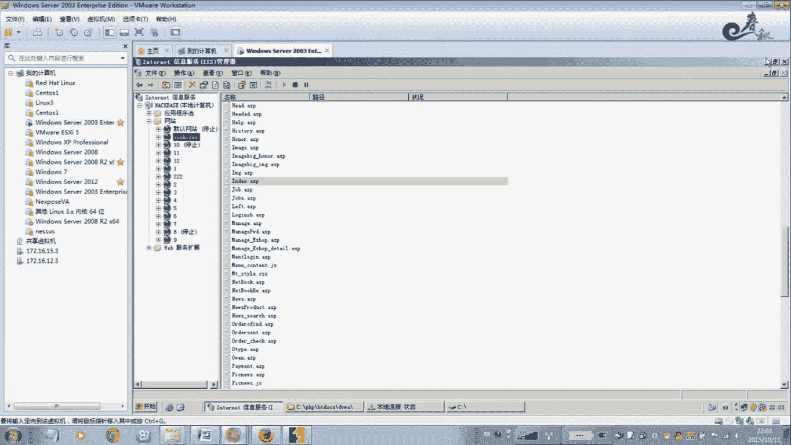

很多管理员疏忽了啊，疏忽了。所以说他这他这个也是可以的，也是正常被解析的啊，正常被解析的。微软的IS木的安装网，它就可以解析这些。所以说我们把SP码改成S一上传，照样执行，改成CER照样执行啊。

所以这就是名单列表loggo。第三种就是特殊文件名logo。那么这个是什么意思呢？啊，我这里。说了一下，我们在这个HD标包里面，就是说通过BRP摘取的时候啊。咱去这个生产过程中的这个包子后。

你把它改成什么？啊，如果是。改成这个A4后，就是这个扩展名后面加一个点，或者加一个这个下划线。那么。这种命密的方式在这个winds系统里面是不允不会被允许的啊。嗯这个的。

所以需要在这个BIRP里面来进行修改啊。修改。呃，这个空格哈，注意啊你这个空格是也我们前面在里里杂弄。比如说你在这个windows的命名里面，你直接打一个空格，它是可以允许的啊，这个没问题。

这个特殊的这个就是说特殊的这个空格，你在这个DRP里面，这个16减制里面的改，把20改成00啊，这样就可以的啊，这种这种方式它在解析的时候，那么后面的在解析的时候啊，它就从后面一解下一看。

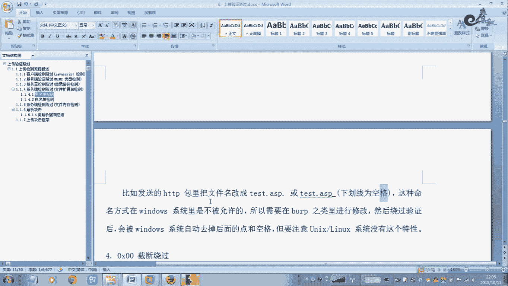

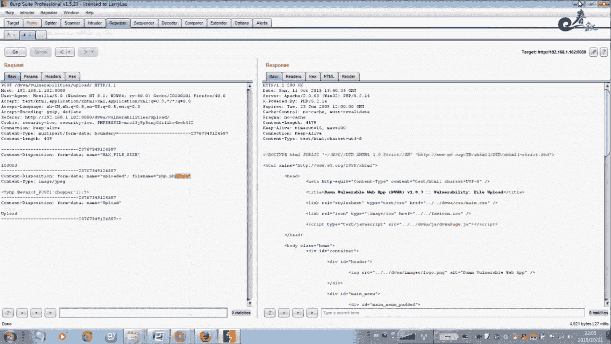

在解析的时候啊，遇到这个空格特殊的这个空格，那后面就把它全部丢弃掉了。啊。空格方面就丢弃掉了。那么这种秘密方式呃，所以说我们在这个BRP里面BRP这个工具啊，它是相当好的。

比如说我们嗯我都是通过这个BIRP来进行啊模拟一些实验。包括这个渗透过程中都会用到这种工具。所以大家一定要把把它熟悉，非常熟悉。

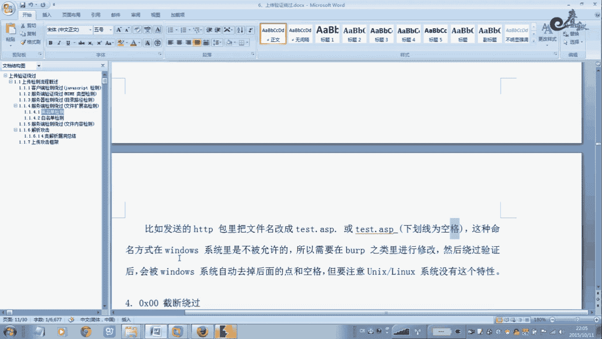

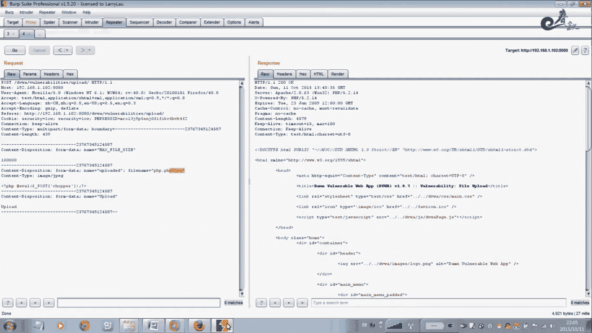

大家看一下windows系统它自动会去掉这个后面的点或者空格。大家注意啊，这个inux系统它是没有这个特性的。包括这个大小写也是一样的，windowswin跟inux它是操作系统是不一样的哈。呃。

windows它是不区分大小写的，但是在inux里面它是区分大小写的。那么这个也是一样的啊，配出在这个文件名烙go也是一样的。接着我们来看一下00宅档，00宅档前面的给大家讲过啊。

给大家讲过所以里不再讲解太多讲解。那么这个接着我们看一下第五个方面，就是说这个商扩上面。商扩障比这个解析攻击，这个是基于这个呃服务的这个解析的一个逻辑啊一个逻辑。

这个在这个阿巴奇里面啊用的这多用的这多什么意思呢？阿帕奇它就解析文件扩展名的时候是从后往前面去解析的，从后面走，不是从前面走。啊，不是从前面的，而是从后面的。它跟windows不一样哈。

这个wind是不一样，但是win。😊，一般的顺序是从前面哈，阿巴几它是从后面的来进行判断，然后前面的话就从前面进找找找找找到这里AP。啊，不过这个里一个里里夹到一个空格，那遇到这个它后面就丢弃了。

那是取取前面一节。那么这个阿巴几它是不一样，阿巴基它是从前从后面往往前面走的，它是这种还好。所以说阿巴起列表里面。它这些都有的哈，什么APGSP啊，这些常见的扩扰品都有，它都可以照成解析的。但是注意啊。

当我们如果上传这些，如果是在黑名单里面，黑名单如果包含了这些，那么你上权是绝对不可能产生的，不允许上传。但是没在列表里面，如果我加1个123456789这样的，那么你这个列表绝对没有。啊。

我因为我后面可以写那东西啊。没こざみ。我都可以自己自定义的，这样算去算去，绝对百分之百在你这个黑名单里面是百分之百没有的。因为你这个黑名单不可能装这么多，因为我这个后面是随机的，随便扔一取东西啊。

任意扔一些。那么这种扩展里你上传到服务器接后啊。那正常情况下，它不可能通知一个什么呃，我们正常的一个文件来解析的。也就是说这个呃例如是AP的程序。

你不可能把AP来解析GSP的不可能在GS通知GSP来解析。但是注意。阿赞阿巴奇里面，他是往前面去解析，他一首先碰到这个后面哎，123点123这个东西是怎么什么东西啊，他不认识不认识。

那么阿巴奇他就会往前面去找。啊，往前面去找往前面就找找到这个SP点S点SP。哎，一看哎，在我这个列表里面，那么我就把它解析。啊，那么我就把它解析。那么我这当时解析的是hello点SP。啊。

那么最后一就一片以这个。hello点SP来进行执行的。那么是这么回事的，那么是这么回事的。啊，这个就是这个上午。呃，三文件名这个解析到过。啊，这个等一下在后面阿起里面会给大家演示一下。呃。

接着我们来看一下呃。这个商库上面这个解析到过的这个。第二部分。这个是基于外部服务的这个解析方式的。PSP5。啊。PSP5大家注意，像这种扩单云也是可以的。PSP有些它支持PSP5的。

上传上去PSP34啊，你那如34。啊，如果服务器支持也是可以的啊，也是可以上传的。所以这个所以上传那这种千变万化啊，这个东西千变万化。你看也就是说。

只要这个文件里面包含了点PSP即使文件名是这个K2点PSP点GPT也会当做这个什么PSP的。执行。PSP里面来执行。那么这个是什么呀？关键是在这个配置文件里面，就是我们阿巴起的CONF文件。

只要有这么一行啊，所以说我们做安全做安全，经常注意做安全。

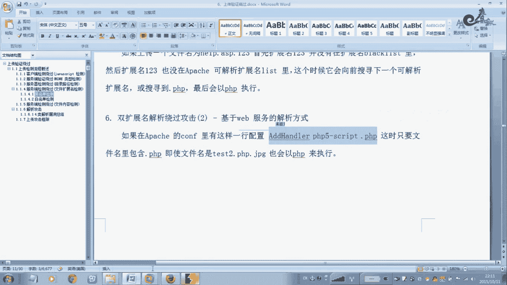

非常关键的一个东西，知道吗？

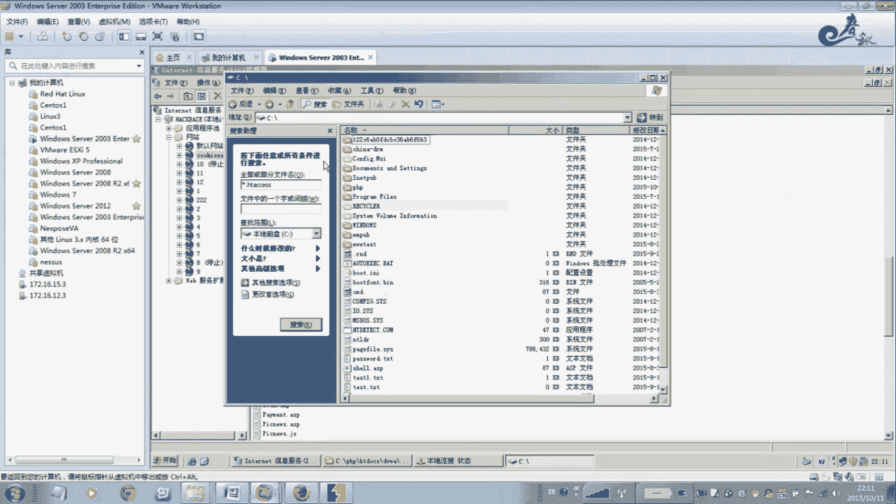

他这个木兰配置是很重要的很重要。很原远相当均要。原始阿巴它这个配置文件。啊，在这个配置文件里面，如果它这个这里面一行这个注释啊，把它去掉了，连续这一行。你允许的这个，那么是非常危险非常危险。嗯。

在这个地方，你看在在在这以后我们可以说得到哈嗯。😊。

你可以看一下，他木兰石好像是。因为我这里还没有啊。难道不是这个文件？

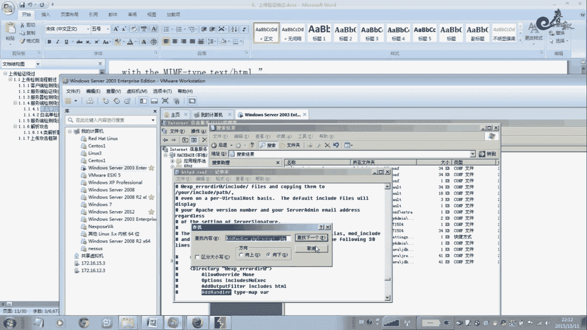

大家过去回去之后，自己找一下吧，有的。啊，因为我这个是。嗯。在网上下载一个程序，为了简单化的句。嗯，配置到这个阿87，这个阿87我直接。

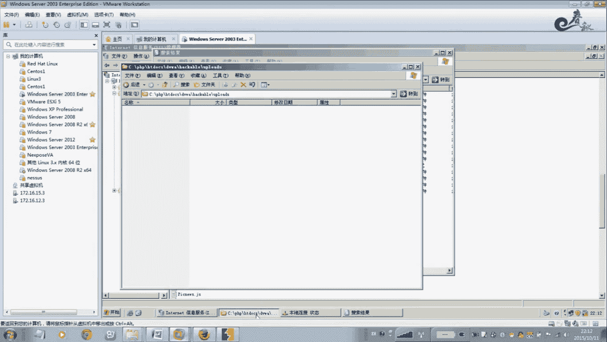

用了一个工具搭建的啊，因为有些东西它是删掉的啊。所以你正常去安装这个阿帕奇的话。他是有这一行的啊，他是有的。啊，这个配置版面可以看一下，主要有这一行。

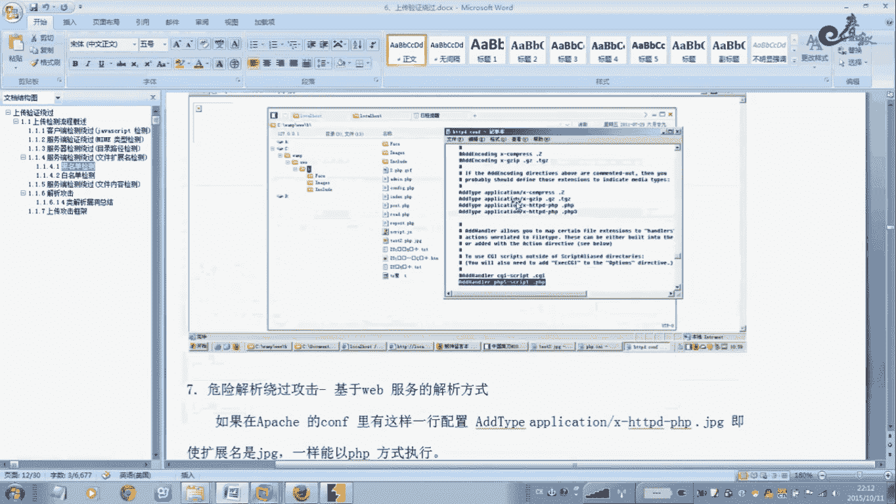

那是相当危险。接先我们看第七个危险解析这个落布攻击。这个是基于这个外波服的解析方式。那么在这个阿巴奇的这个COIF里面有这么一行啊这么一行。那么有了这一行之后啊。即使这个扩产名是GPG的。

你要以PSP方式那个。执行。来执行啊。

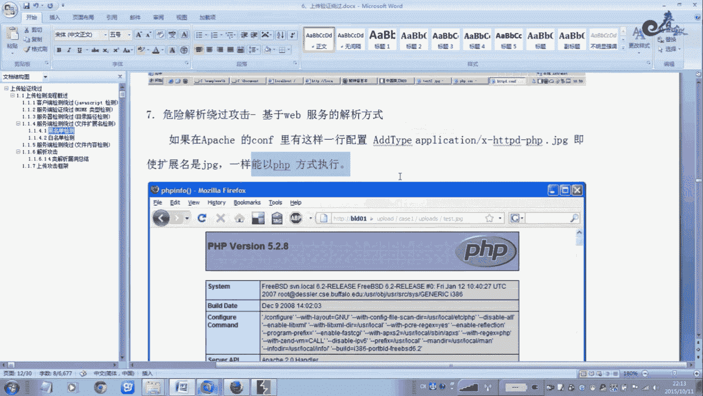

所以是我一再强调啊，一个方面是你写程序的时要过滤它。还有它这个你搭建这个IOS啊或者阿87啊，呃托moca啊，它的配置文件一定要对它这个也就是说这一部这个这一部分称称作什么中间键那个阿87IOS啊。

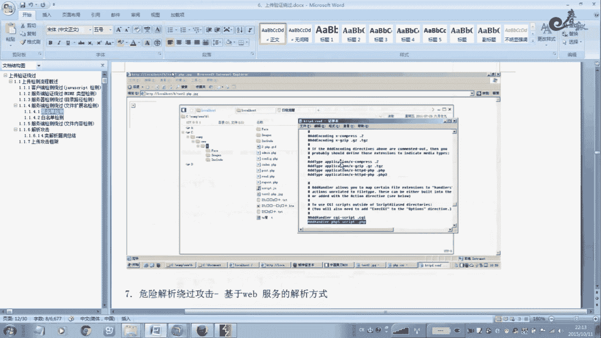

我不老啊。等等，这些都称为中间件。这个中间件这个配置也是很重要的很重要。也是经常会报一些类东，所以说安全加固渠道操作系统加固，还有中间件加固是吧？数据库加固。

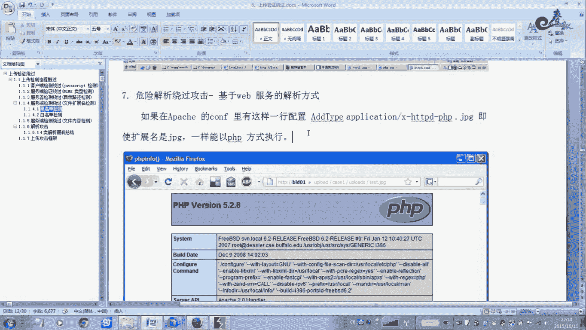

很多很多。还有这个。看下第八个方面，这种东具，这个是配合这个名单列表logo啊，授权一个自定义的，这个就可以轻松logo各种检测啊，就是说这个针对这个黑名单，这个也是相当危险的。

在这个扩单名这个列表里面没有这个。那么别人自定义一个自定义一个，我们允许这个上传这个什么。在这里面写几号代码，在代码里面允许这个上传PSP或者GSPIP。那么这样的不就绕过这个。黑名拉吗？对不对？

那么这种格局。

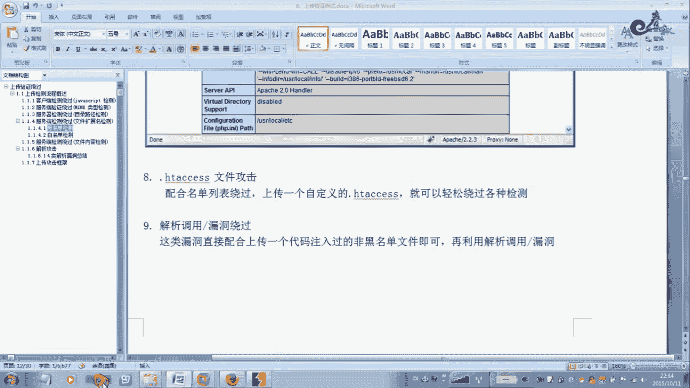

你在网上搜一大片啊一大片，整类污染上面也很多。

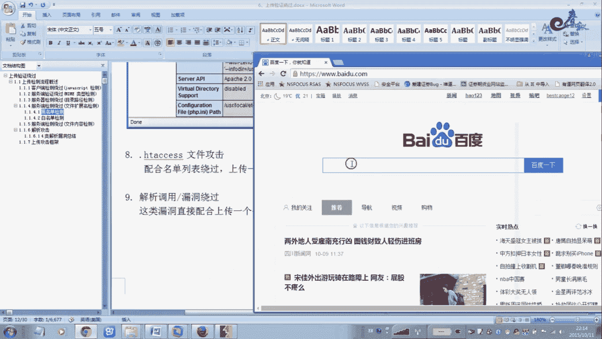

比如说嗯叫什么。明先是吧。

你看百度里面很多的。嗯。Yeah。

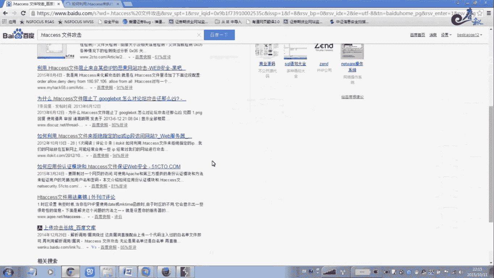

Oh。嗯，看这里你看。

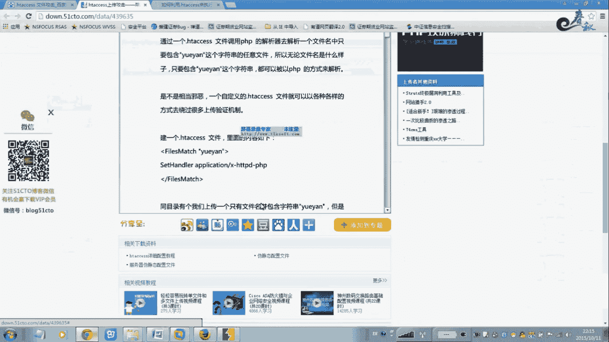

我这里解释了哈。就上传一个这个来调用PHP来解析去解析一个文件名，只包含这个。啊，页眼的这个字符券啊，类一文件你可以看一下它是什么意思，它就是说新建一个文件。

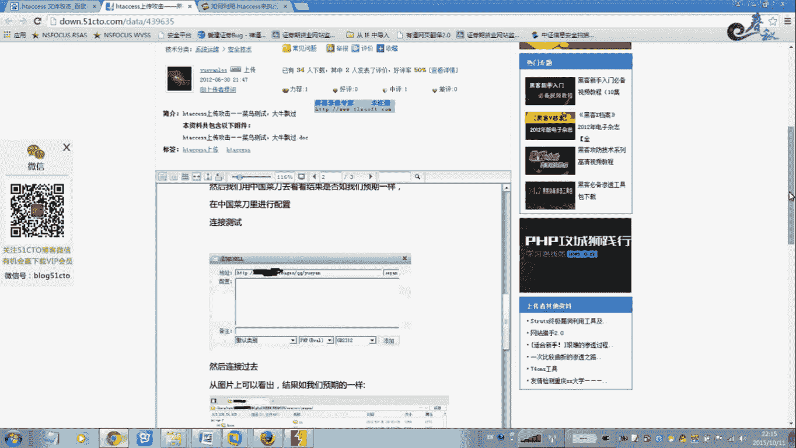

新建一个文件，这个扩栈名为这个。里面包含这几和这个代码，这个代码是就是说啊我们只要上传一个文件名，包含这个这个字符腔的。越言的啊这个字符像。在的会。但是却无任何扩张名文件，里面内容是PSP一句话木满。

上掉这个。就OK了。你看。对我们在一句话前面加加上这个，比如我们这个文件里面。上传的这个文件里面，只要包含了这个。运营。那么他的动作在个上么？PHP要体系的啊，这种编辑。

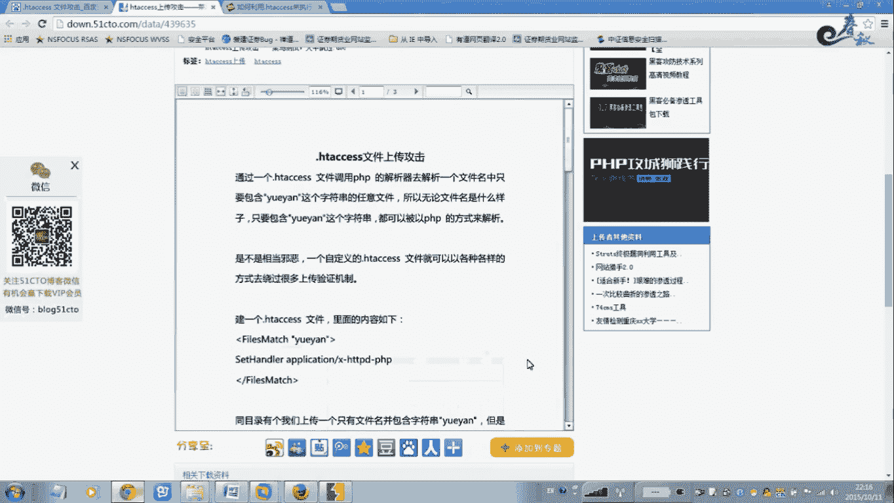

啊，这个是。相当危险。看到没下。

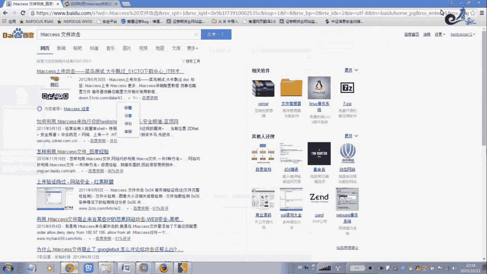

这这也是一种落go方法，这个在五卷上面也很多哈，通过这种方法进行上传。呃，第九种方法是解析调用啊，类登logo。那么这个类灯是直接配合上传代码注入过。获得这个非黑名档文件即可，就利用这个。

再利用这个解析调用啊就可以了。呃，关于这个白名单的检测，我们下节课再给大家讲解。

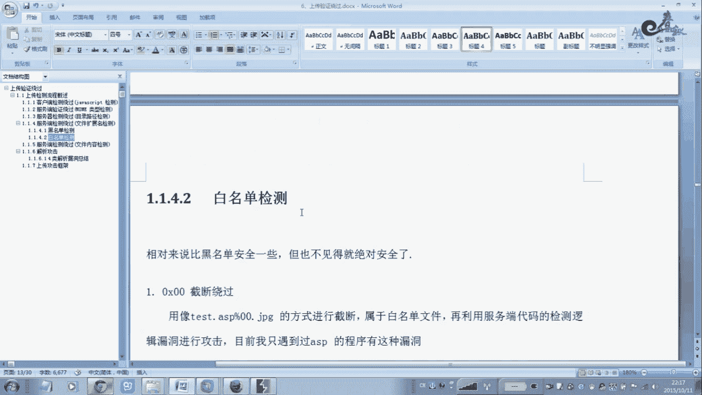