# 经典15年i春秋渗透测试系统化教程 - P25：课时4 上传漏洞-服务器检测绕过（白名单） 🔐

在本节课中，我们将要学习如何绕过服务器对上传文件的白名单检测机制。白名单检测通常比黑名单更为严格，但依然存在可被利用的漏洞。我们将重点讲解一种利用服务器配置文件（如`.htaccess`）来绕过检测的方法。

## 概述：白名单检测与绕过思路

白名单检测机制只允许特定扩展名的文件（如`.jpg`, `.png`, `.gif`）被上传，这比黑名单更为安全，绕过方法也相对较少。然而，通过一些技巧，我们仍然可以找到突破口。

上一节我们介绍了黑名单的绕过方法，本节中我们来看看针对白名单的几种主要思路。

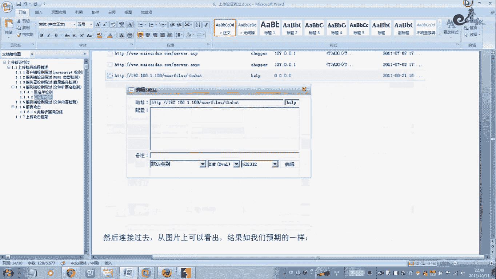

以下是三种常见的白名单绕过思路：

1.  **%00截断**：此方法在黑名单绕过中已讲解，本节不再重复演示。
2.  **解析漏洞绕过**：利用服务器（如IIS、Apache、Nginx）在解析文件时的特性漏洞。这部分内容将在后续关于解析漏洞的独立课程中详细讲解。
3.  **后台修改扩展名列表**：在获得网站管理员权限后，登录后台，寻找可以修改允许上传文件类型的设置。通过将`.php`或`.jsp`等脚本扩展名加入白名单，即可直接上传对应木马。
4.  **利用`.htaccess`文件**：这是本节重点讲解的方法。通过上传或修改服务器上的`.htaccess`配置文件，可以重新定义特定文件的解析规则，从而让服务器将无扩展名或任意扩展名的文件当作PHP脚本来执行。

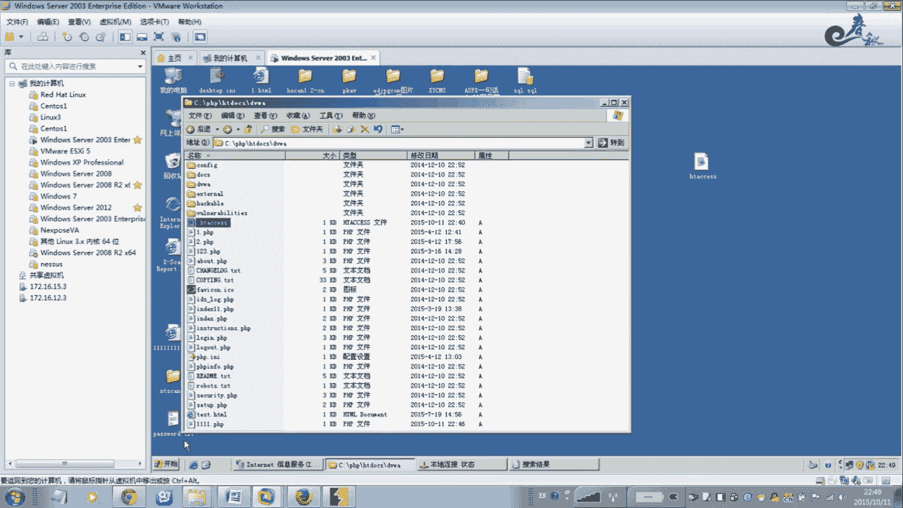

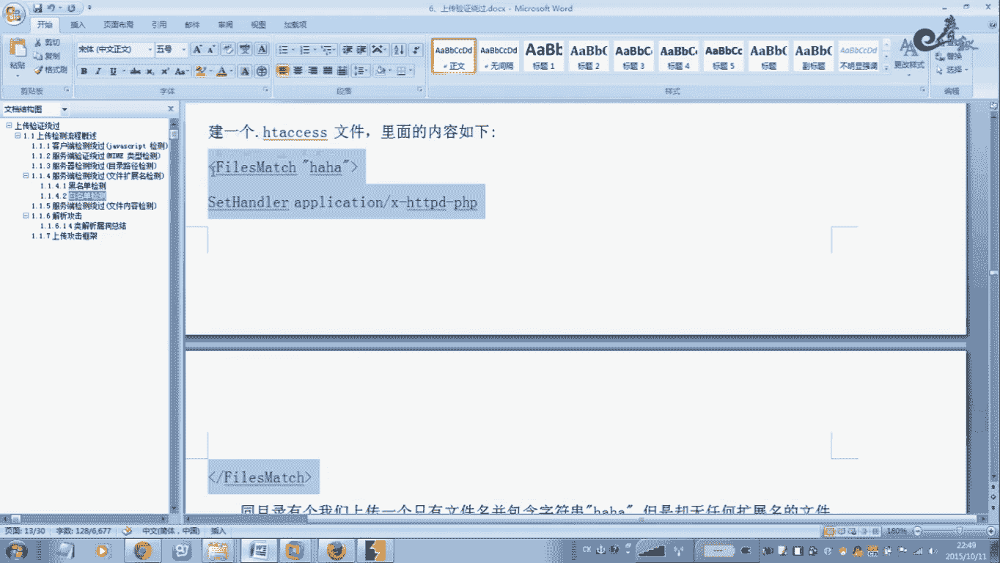

## `.htaccess`文件绕过法详解

接下来，我们详细讲解如何利用Apache服务器的`.htaccess`文件来绕过白名单检测。

### 原理与准备

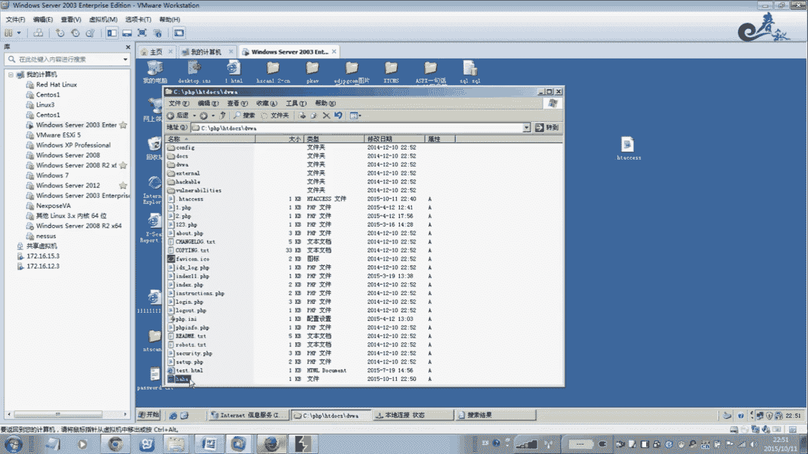

`.htaccess`是Apache服务器的一个配置文件，它可以针对特定目录修改服务器的配置。我们可以利用它来定义一个规则：让所有包含特定字符串的文件名都被当作PHP文件来解析。

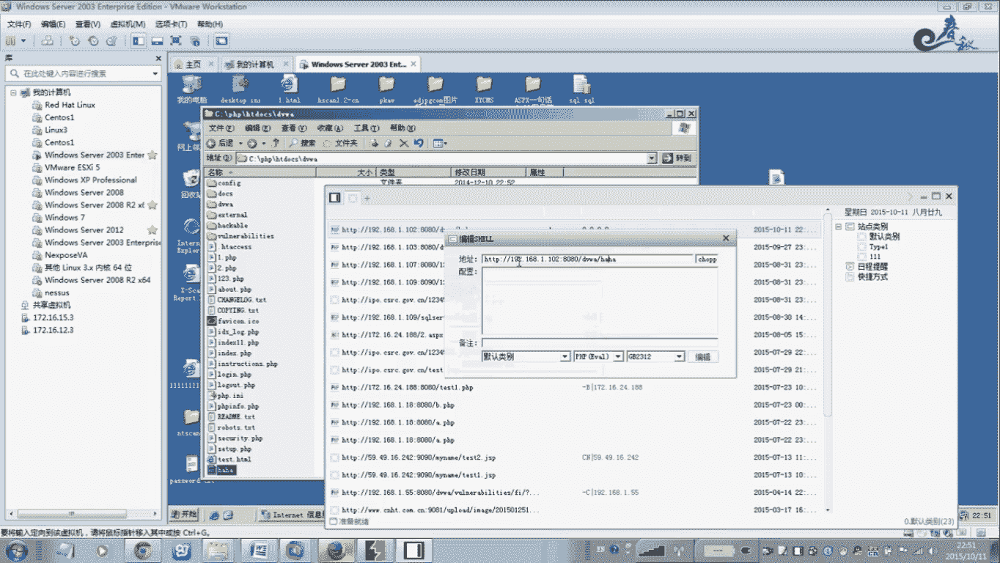

需要准备两个文件：
1.  一句话木马文件。
2.  自定义的`.htaccess`配置文件。

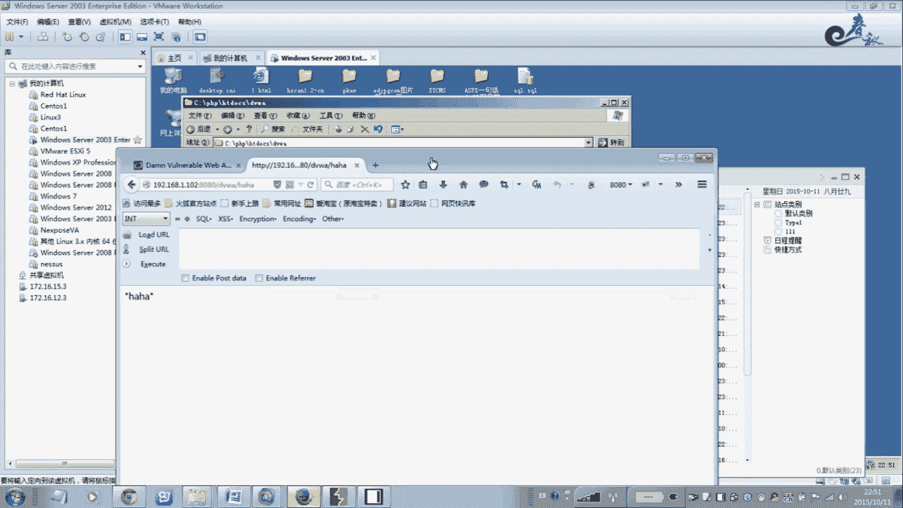

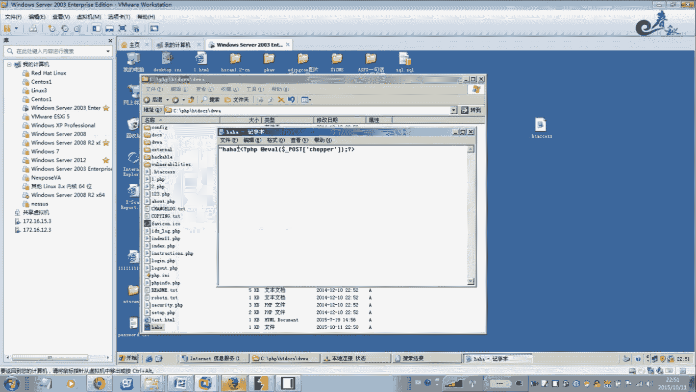

### 操作步骤

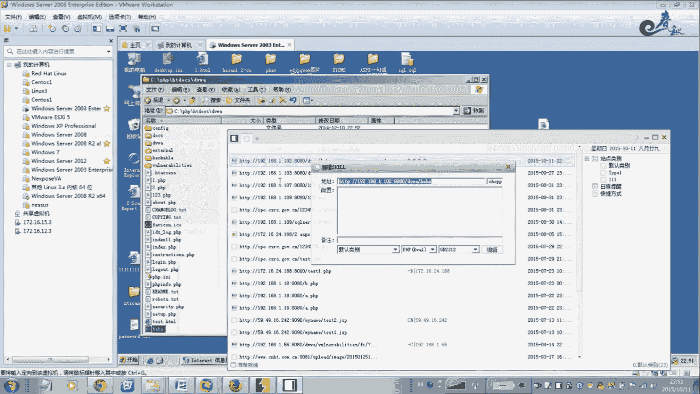

以下是具体的操作流程：

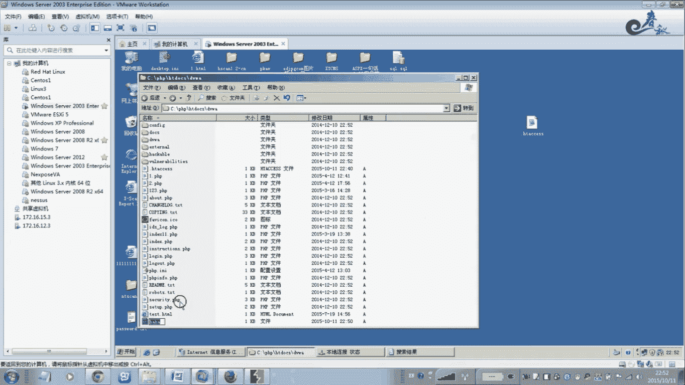

1.  **创建`.htaccess`文件**：在本地新建一个文本文件，命名为`.htaccess`。由于该文件名以点开头，在某些系统中可能无法直接创建，可以先创建`htaccess.txt`，上传后再利用重命名或文件覆盖功能改为`.htaccess`。
2.  **编写规则**：在`.htaccess`文件中写入以下代码。这段代码定义了一个规则：所有文件名中包含“heihei”字符串的文件，都将被当作PHP脚本来处理。

    ```apache
    <FilesMatch "heihei">
    SetHandler application/x-httpd-php
    </FilesMatch>
    ```
    代码中的`"heihei"`是一个示例，你可以将其替换为任意你想要的字符串。
3.  **上传配置文件**：将编辑好的`.htaccess`文件上传到目标服务器的网站目录下。如果该目录已存在`.htaccess`文件，则尝试覆盖它。
4.  **准备一句话木马**：创建一个一句话木马文件，其文件名**必须包含**你在`.htaccess`文件中定义的字符串（例如`heihei`）。这个文件可以**没有任何扩展名**，例如直接命名为`heihei`。文件内容为标准的PHP一句话木马。

    ```php
    <?php @eval($_POST['pass']);?>
    ```
5.  **上传木马文件**：将准备好的木马文件（如`heihei`）上传到服务器。由于白名单可能只允许图片格式，你需要寻找能够上传此无扩展名文件的上传点，或结合其他漏洞（如截断）完成上传。
6.  **连接测试**：使用中国菜刀等连接工具，连接你上传的木马文件。URL地址应为`http://目标网站/上传路径/heihei`，密码为`pass`。如果配置成功，你将能够建立连接。

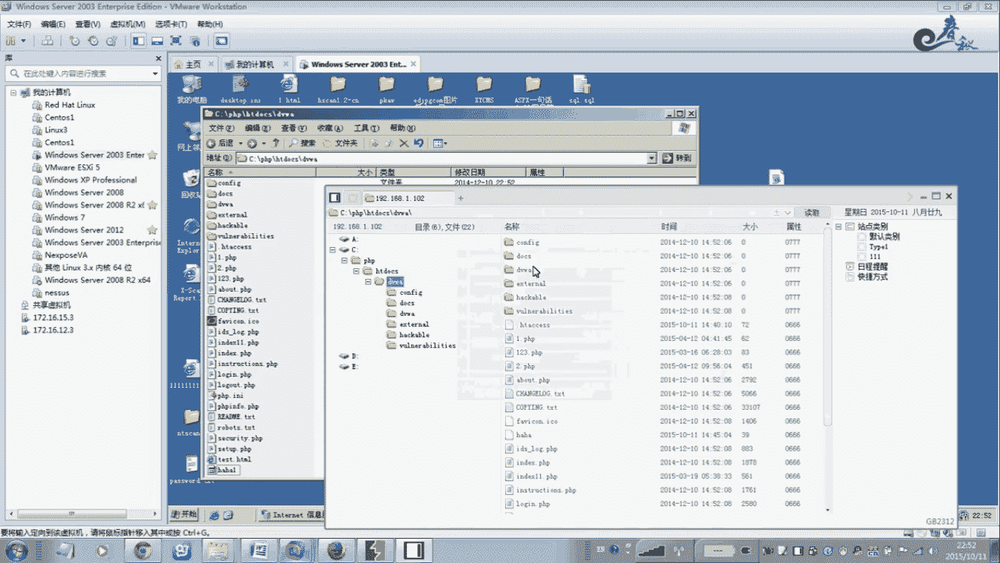

### 关键要点

*   核心在于`.htaccess`文件中的`FilesMatch`规则与木马文件名的匹配。
*   木马文件本身无需`.php`扩展名，只要文件名包含约定的字符串（如`heihei`），就会被服务器解析为PHP脚本。
*   你可以将规则中的字符串（`heihei`）和木马文件名修改为其他任意值，只要两者保持一致即可。

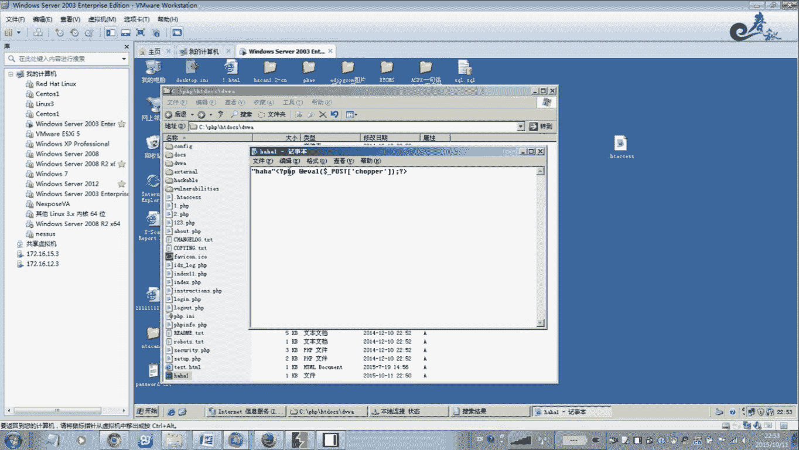

在实际渗透测试中，如果遇到严格的白名单过滤，可以尝试寻找是否存在上传或修改`.htaccess`文件的机会，并利用此方法进行测试。

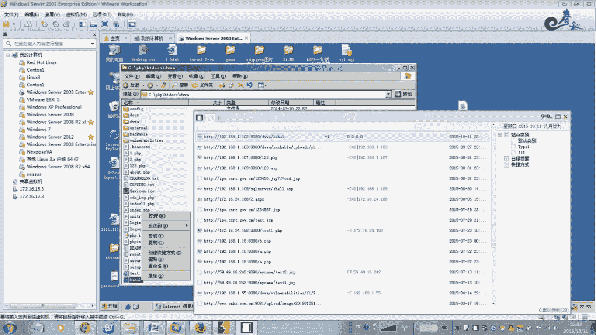

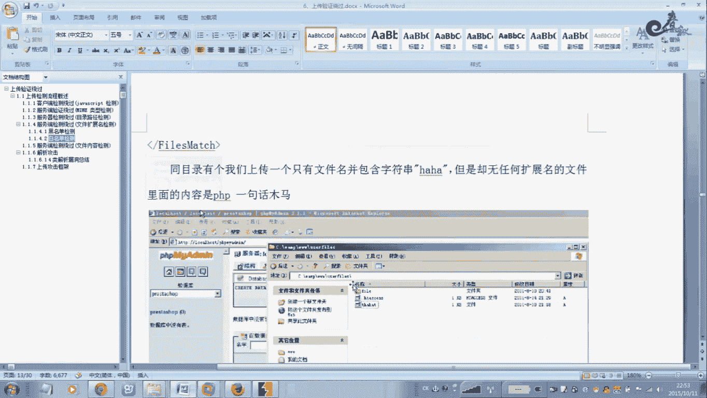

## 总结

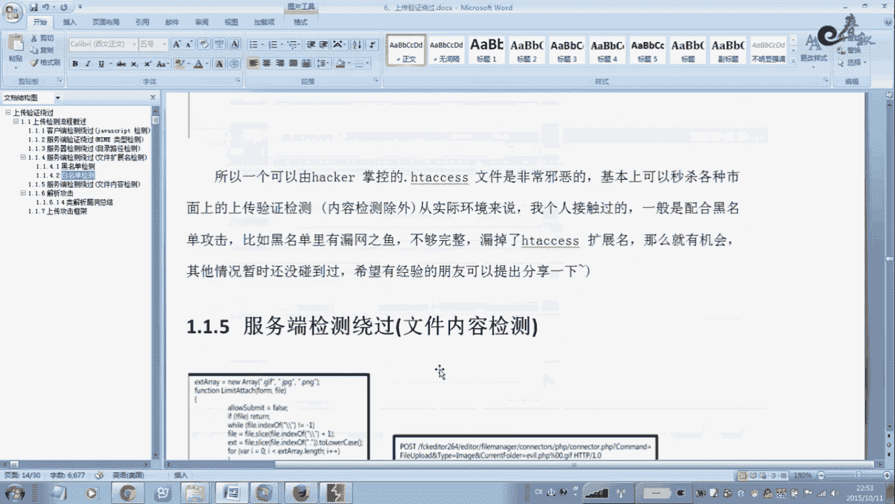

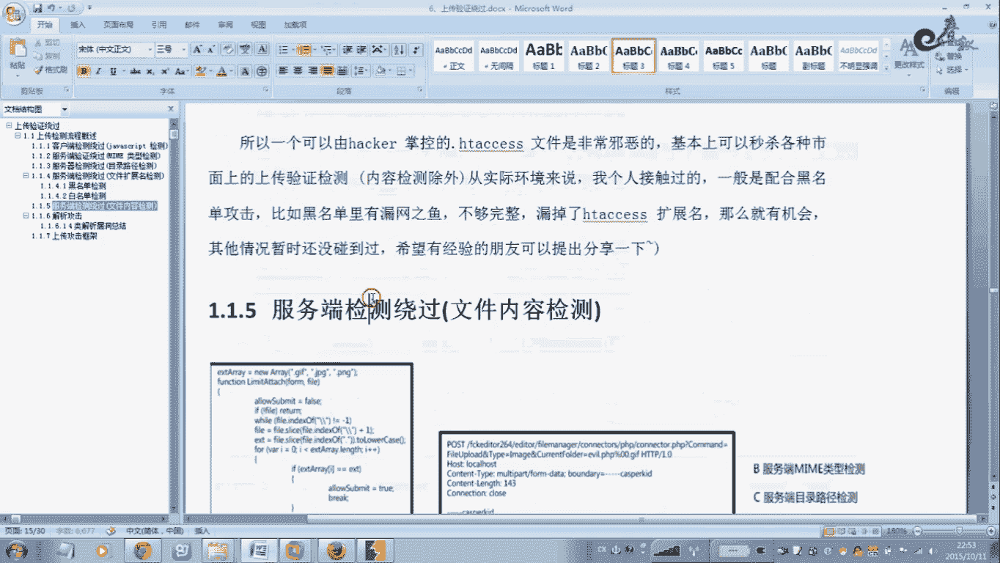

本节课中我们一起学习了服务器白名单检测机制及其绕过方法。我们重点剖析了利用`.htaccess`配置文件绕过检测的原理与详细步骤：通过自定义解析规则，使包含特定字符的无扩展名文件被当作PHP脚本执行。这种方法的关键在于配置文件和木马文件名的匹配。请在实际测试中灵活运用此思路。

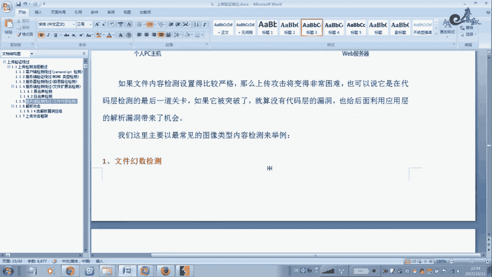

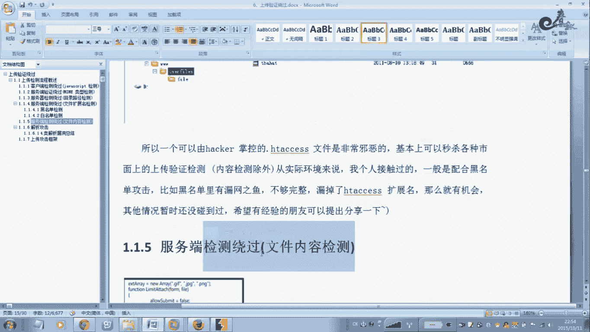

关于文件上传漏洞的其他检测绕过方式，我们将在下节课继续讲解。