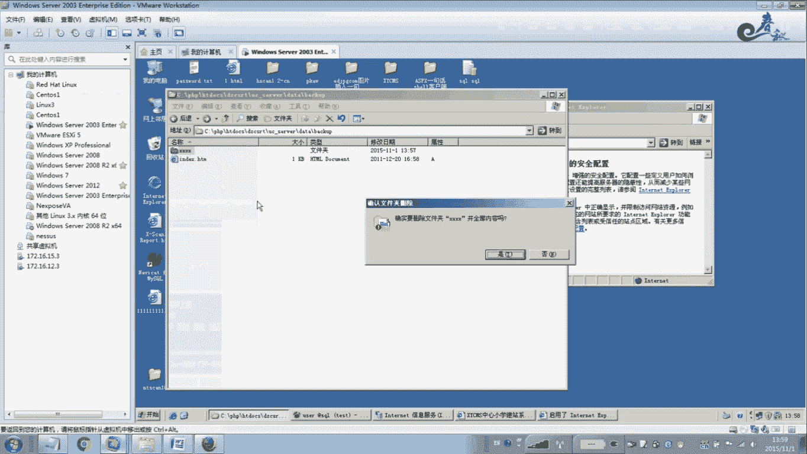
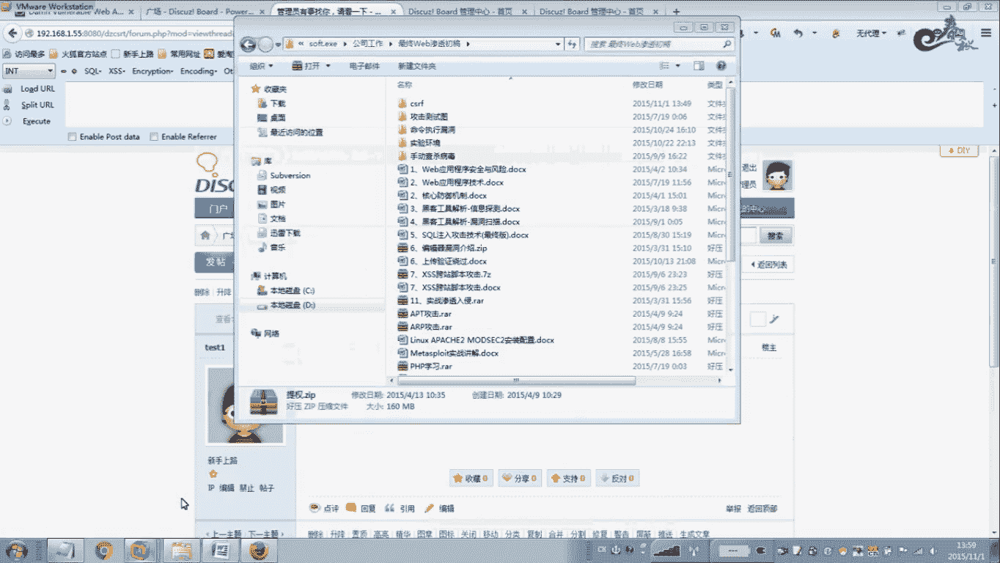
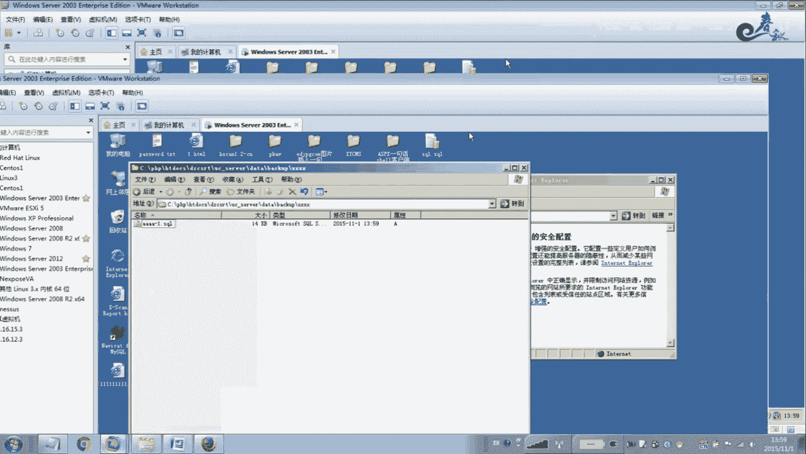
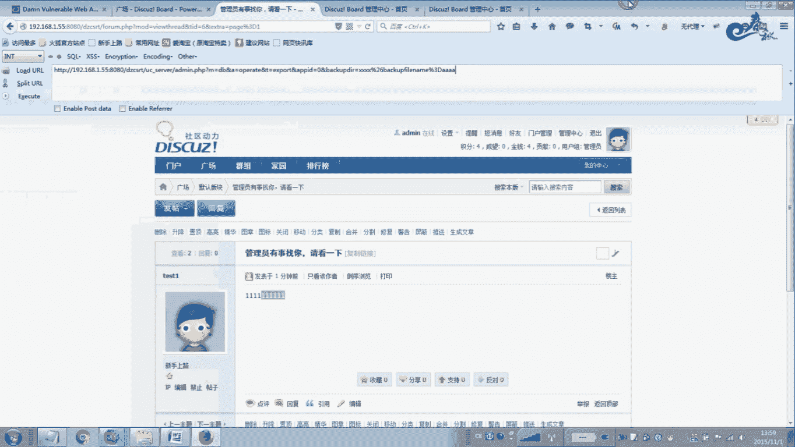
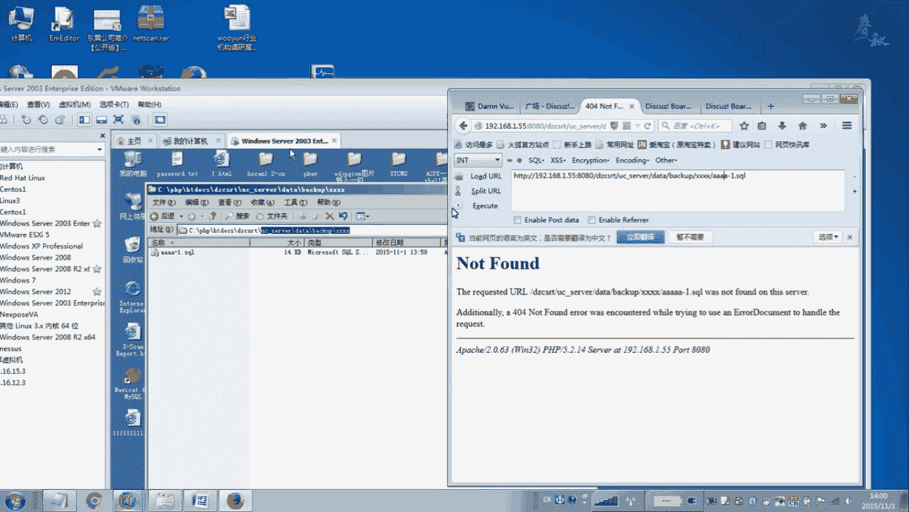
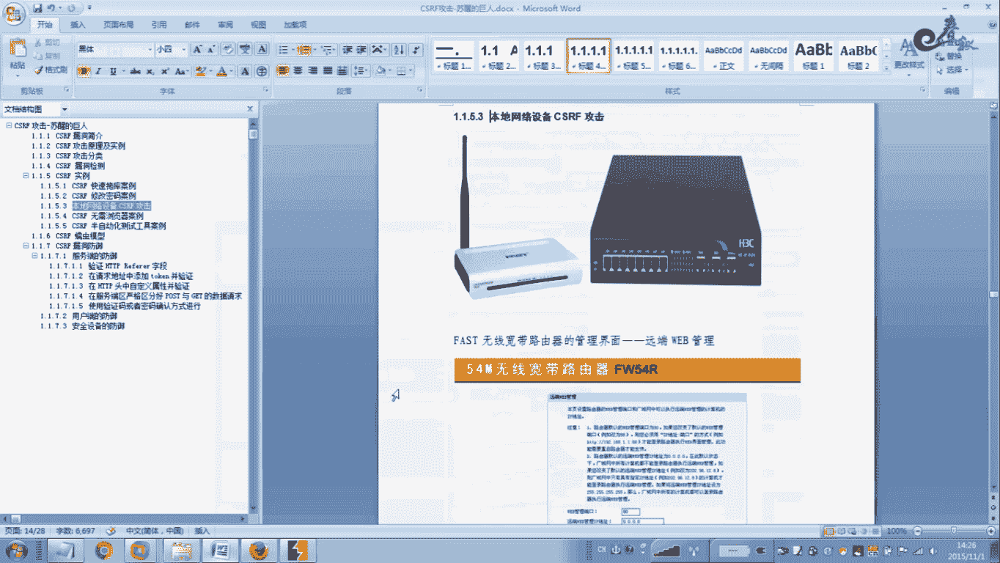

# 经典15年i春秋渗透测试系统化教程 - P29：课时2 CSRF攻击实战 🔐

在本节课中，我们将学习跨站请求伪造攻击的原理与两种实战案例。我们将通过模拟攻击过程，理解CSRF的危害性以及常见的防御方法。

---

## 概述

CSRF攻击是一种利用用户已登录的身份，在用户不知情的情况下，以用户的名义执行非授权操作的攻击方式。本节课将通过两个具体案例，演示如何利用CSRF漏洞进行数据库备份和用户密码修改。

---

## 案例一：利用CSRF进行数据库备份




上一节我们介绍了CSRF的基本概念，本节中我们来看看如何利用它进行数据库拖库攻击。





首先，我们模拟管理员正常登录Discuz论坛后台，并进行数据备份操作。



1.  使用管理员账号登录论坛后台。
2.  进入管理中心，找到“数据备份”功能。
3.  点击提交备份，此时会发送一个POST请求到服务器。
4.  使用抓包工具拦截该请求，并将其方法从POST改为GET。
5.  提交修改后的GET请求，服务器成功执行备份，数据库文件被生成在指定目录。



以下是备份操作可能涉及的请求格式变化：
**原始POST请求**
```
POST /admin.php?action=db&operation=export HTTP/1.1
...
backupdir=./data/backup_xxx
```
**构造的GET请求**
```
GET /admin.php?action=db&operation=export&backupdir=./data/backup_xxx HTTP/1.1
```

接下来，我们退出管理员账号，使用一个普通用户账号进行攻击。

1.  使用低权限的普通用户账号登录论坛。
2.  在论坛中发布一个新帖子。
3.  在帖子内容中，通过插入图片的标签，嵌入构造好的恶意备份请求URL。

以下是插入恶意代码的示例：
```html

```
代码中将图片的宽高设置为0，使其对浏览者不可见。

当管理员登录后台并浏览这个帖子时，浏览器会自动加载图片标签中的`src`地址，即向服务器发送了数据库备份的GET请求。由于管理员处于已登录状态，该请求会以管理员的权限成功执行，攻击者便能在服务器上生成一个数据库备份文件。

最后，攻击者可以通过数据库的默认路径或猜测路径，直接下载该备份文件，从而获得网站的所有核心数据。

---

## 案例二：利用CSRF修改用户密码

在了解了数据库备份攻击后，本节我们来看看CSRF另一个常见的利用场景：修改用户密码。

我们使用DVWA漏洞演练平台进行演示。首先，将其安全级别设置为“Low”。

1.  正常登录DVWA，进入“CSRF”模块。
2.  在修改密码页面，直接输入新密码并提交。
3.  通过抓包，可以获得修改密码的请求链接，例如：
    `http://target/vulnerabilities/csrf/?password_new=123456&password_conf=123456&Change=Change`

在低安全级别下，该功能未验证请求来源，也未要求提供原密码，因此存在CSRF漏洞。

攻击者可以构造一个恶意链接或页面，诱使已登录的目标用户点击。当用户点击时，其密码将在不知情的情况下被修改。

以下是构造恶意页面的简单示例：
```html
<html>
  <body>
    
  </body>
</html>
```

接下来，我们将DVWA的安全级别调整为“Medium”，查看其防御方式。

在中级安全级别下，代码增加了对`HTTP Referer`头的检查，只允许来自本域名的请求修改密码。

以下是关键防御代码逻辑：
```php
if (stripos($_SERVER['HTTP_REFERER'], $_SERVER['SERVER_NAME']) !== false) {
    // 允许修改密码
}
```
这种防御方式要求请求的`Referer`字段必须包含服务器域名（如`127.0.0.1`）。然而，如果攻击者能通过某些方式控制或伪造`Referer`头（在某些条件下是可能的），或者网站校验逻辑存在缺陷，该防御仍可能被绕过。

在高级安全级别下，DVWA引入了要求用户输入当前密码的机制，这从根本上杜绝了CSRF攻击，因为攻击者无法得知用户的原密码。

---

## 总结

本节课我们一起学习了CSRF攻击的两种实战应用。
*   第一个案例展示了如何利用CSRF漏洞，诱骗管理员触发数据库备份操作，从而窃取整个网站的数据。
*   第二个案例演示了如何利用CSRF漏洞修改其他用户的密码，并分析了不同安全级别下的防御与绕过原理。




通过这两个案例可以看出，CSRF攻击的危害极大，防御的关键在于服务端对请求进行严格校验，例如使用CSRF Token、验证`Referer`头，以及对于敏感操作（如修改密码）强制要求进行二次认证。