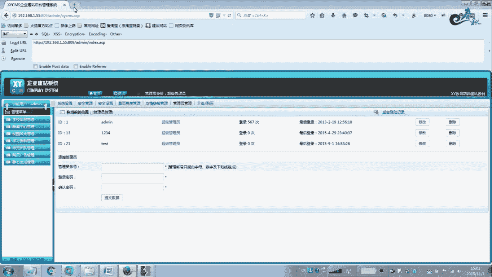
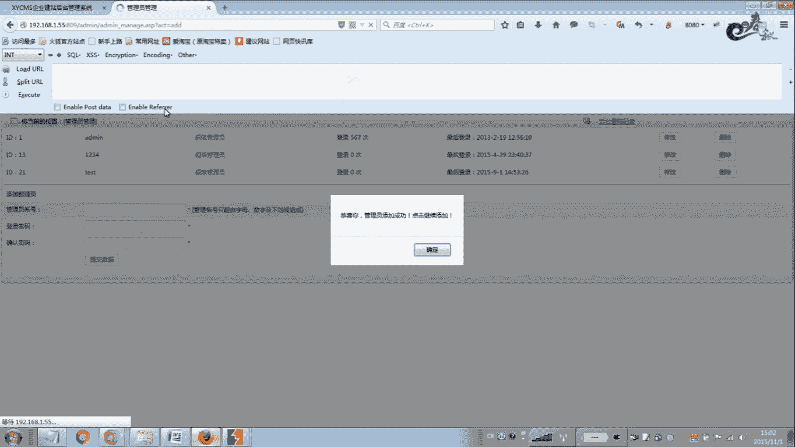
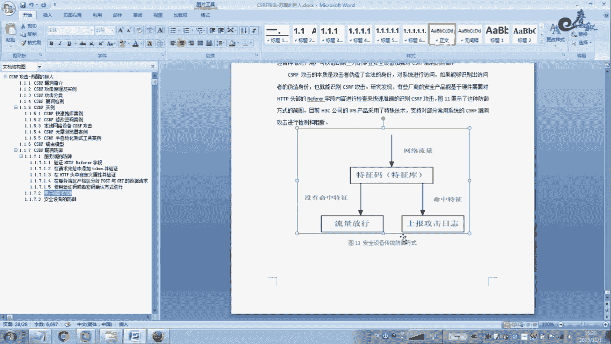

# 经典15年i春秋渗透测试系统化教程 - P30：课时3  CSRF攻击-攻击防御 - 老网恋教父了 - BV1n54y1B7F7

🎼Yeah。🎼Yeah。好，接天说讲解，我们现在要看一下这个CSRF这个本地网络设备的这个攻击。那么这种攻击。呃，也是以以前用的比较少，现在。而言你还是还算可以吧。

因为这个路由器就是在这个FW54R这个这款路由器的形式。那么有1个CSRF雷接雷战更新。那么大家其他路由也有哈。那么我们来看一下哈。那么路由器一般的情况下是外网是不允许访问的。

无线路由是外网是不能访问的，交换机路由都是一样的啊，包括硬件设的，一般情况下都是在内网里面，只源是内部的网络可才可以访问。外网是不允许访问的。默认情况下啊，那么我想访问。别人企业里面的路由或者防火墙。

那怎么去实现啊，而且。对方内网里面的这些设备一般都是默认密码，是没有被改密码的，没有被改密码。啊，那么记得我在以前读书的时候啊读书的时候，那么在大学的时候。

那么很多这个我们这个就是我拿扫描器去扫我当前这个。我当前计算机处的网络。扫80端口是一扫一大片，就很多人啊是开了这个无线路由的这个。我也不可能，像这样的话。

我直接用ADMADM或者AD passwordword这样的密码，直接登录路由。那个时候的路由可以通过右键查看源代码，可以查看到ADS的上网账号点密码。有了这个账号密码好说。在一个网站吧，我就拉你。

你把你的路由重启，把你的账号密码拿过来，我来拨号上网，在的话我就可以免费上网。还有以前就是铁通的都士没，就他的官方站点，它是登那个地方也是没有什么验证码的，也是可以批量去针对这个。

账号密码来进行暴力破解的。也就是说我一爆。长沙开头了一大一搞一大片莫人密码，可能几个1吧。几个要6个1还是几啊，我现在问了好多年了，还一搞一大片那录那个密码啊，密码一大片。呃，我们来看一下啊。

它是怎么攻击的。首先模拟正常用户登录到路由器里面，在这里开启这个微博这个管理端口，再用BRRP抓个包，把这个地址抓取下来。接着我们去构造与。把这个代码插入到。你想插路的地方去。

反正是你要欺骗对方企业去访问这个地址。访问了这个地址之后，那么对方的这个。路友的这个微博管理个端口就打开了。因为这个这个连接地址其实其实你看。80252525点C要保存的意思吗？其实就是这一行地址。

其其实就是执行了这三个功3块，一个是把外博管理当个C成80。第二个是把远程外博I这个管理IP地址改成4个255。还有最后面这个C等于这个这个其实它C就是这个点了点了一下保存的功能。

那么这个一行代码就实现了这123。全部实现了。那么这个代码怎么样去？插入那根据你自己去发挥了啊，根据手法去发挥了。这个你你绑到软件里面也好，你绑在电影里面或者绑在其他的地方啊，插入到网站里面。都可以。

随便你，反正你在QQ上发给他也行啊。这个根据你自己情况。好，接下我们看一下啊，但是前提条件好，执行这个代码要成功，要成功的情况下，你必须要它的账号默认账号密码是。A面A面啊这样的。不过改恩密码夹不一定。

因为你向月船访问这个。有的路由极少极少的路由器可以越传到这里，所以一般的默认账合默认情况下。默认没改密码的情况下是可以的啊可以的。好，接着我们看一下CSRF5虚的燃气按列。

刚把我们的工艺者的这个构造的这个CSRF蛋码放在压缩这个win2R压缩原料的这个。高级自解压这个就是高级自解压选项。这个窗口里面的这个是文本与图标的这个模块。那么这个模块就是放恶意攻击大码的。

那么以那么以前就是在0几年20065年的时候。我们就开始使用啊开始使用这些方法啊，那个是以前我们用着挂码做网上一般的谈广告。啊原谅你们帮狂告。那么到了2015年14年。

那么现在就这个玩意就变成什么领队了。那我觉得是扯垄蛋的老玩，这也跟win22，这个压缩软件关系也不是大好，不会很大哈。这个也不是说什么零对，什么漏洞，这个就是win22本身自带的一个功能。

它这个功能就是说你可以执以执行那一代嘛，也可以插广告，这个无所谓。你你用户想怎么用就怎么用。你就买了也跟我没关系，我提供的软件给你否则本身的一个功能啊，本身的一个功能。所以你在无远上面也可以看得到啊。

它这个玩意就变成什么零带。其实和N年前的东西。啊，物业上面也有不少那个。什么什么什么零代呀，其实很多都是很多年前的。很多年前的。不他这个东西不算什么领队啊。

但是我们用这个来来进行这个CSRF攻机也是比较好的一个方法。一种思路。呃，最早我们还是做秒杀的时候，也可以用这个来做自解压的这个木马，先干掉杀毒软件，乱乱写一个程序，要杀毒软件不查杀的程序。

正常的程序模拟用户去干就杀把杀毒软件先干了再说啊，再再运行木马，或者先执行某一个文件，有些木马就是说我我不用什么呃加载到具载表，也不能加载到进程，什么都不加载。先让它就是测分开来然后以前做木马过360。

360比较变态的时候。我就是11年的11年的时候。刚上6点的时候，就是把一个木码存换到N块。上重点就杀不到的。只要我先把住载表的具册表这一块，先让他去执行道路的形式啊，在内场这一块，我就又把它催翻一块。

包括启动下的模块或启动下的。全部就倒入个形水，最后再煮动。最最后的1个EXE程序啊，服务端的东西。那么这样的话就可以把360干掉了。反正这个软件关于win202嗯这款压缩软件的高级功能。

大家可以在网上去参考，也可以参照我以前的教程。他这里面的知识也很多的哈，它可以干很多事情啊，可以干很多事情。那么在这里我不讲解，要要一讲解的话，等一下又要。一要一个小时。里面东西太多了，没法讲。啊。

接着我们来看一下这个CSRF的这个半自动化测试工具。案例这工具不怎么推荐给大家。嗯，还大家可以有时间的话去可以。大哦我忘什么官方上点就下载一个，我这里下载一个模拟了一下，我把这个案例也摘了一下。啊。

不特蛮好，我还是用喜欢用BRP来摸拟。通过这里的话，我就找了一缸地。

在本地打眼环境。在来一个里。好，现在我们给大家的我这里为了第算时间，我先登录上去了，但是在网站后台。把，开机代理，我们接着用BIP模拟。大家可以看到这里，它这套程序，它后台是加账号密码。

是不需要原密码的。你看我管理员管理这些地方，你看。我在信他账号密码。加账号密码，他不要我输入原有密码。那么现在我加一个test一这个账号密码taest一账号。是吧。你看我加一个这样的账号。啊。

我点击提交数据。这样我拦截到了数据包吧，对不对？嗯，那么这个。他的CSRF模块是在这里。在这个地方。再打吗？你可以复制啊，你可以复制。没要抗片。拷虑一下之后。一般的攻击者他会。

首先需要对你的网站程序公开的源代码比较熟悉。他在本地去模拟好之后。模拟好之后。更记在他只要。把这个代码，这个就是他的攻记代码，攻击者的攻记代码。攻击者攻记代码之后，得到这个代码之后。

攻击者只需要把这个地址。哎操。估计的只需要把这个地址的。改成要攻击的网站的地址就行了，改一下，改一下这个地方就行了，其他的保持不变，就这么简单。所以说我们这个。电视RF攻机它的利用难度也不是很高的。

但是需要与其他的机型结合CS。RF。刚才挨子天没了。那么把这个页面。根记者来讲，把这个页面上传到他的网站上去，再结合叉SS耳童或者其他的那种去调用这个页面。像这个人，我举个例子哈。冇做啲事。

看在他这个账号添加成功了，然我把这个账号删掉。对不对？3条再下3个。商量没了。那么这个空介者把这个页面上传上去之后，上传到这个他自己网站之后，如果这个网站有叉SA。那么让管理员触发这个XS内动的时候。

他就会执行这个。

这个代码。这个就是黑K指定的这个页面。如果它一旦执行这个页面，那么后果不堪设想。

什么为什么呢？它就会添加账号添加一个账号，它是这么回事的。你看那这样的话，t到一这个账号就添加进来了，你看刷新一下就来了嘛。就这么简单。这就是CSRF。但是它一般的情况下，它与其他的机器要结合的情况下。

当然这个单麦你可以优化一下，不需要让他弹什么对话框操啊，自己去改。啊，所是这个需要你改一下啊，不要点缺但这个东西啥都没有，让他就偷偷摸摸的运行。就像我们前面一个例子一样，你这段堂一样。

那么这里我就不再演示。好，我们来看一下这个CSRF流程。卢琼博是这个在一些社饺网站什么youtuB啊。faceacebook啊。百度啊。这些网站出现的比较多。那么这个。

我们看一下啊首先路程它需要与漏动相结合的，如个在CSRF攻击这种模型模型里面。这个芦程区理中心里面，首先有数据获取模块，它通过什么？你要这个更新，那么。你首先对方网站要么有拆C这类的。

通过X一手证来触发CSRF。达到更击的效果，或者是啊有服务器代理技术，或者有GSON这个注入啊，这是链接注入这种形式的。那或者获取这个论坛的这个UGB的这个所谓的账号密码你要账号啊。

这个ID用户的ID号啊，用户的ID号。有了这个我们才能CSRF攻击才能达到。很好的效果，或得通过这个flash这个clo form formclo这个de这个点SML这个文件。

那么作者发送模块呢有poss或者ge啊，一般呢是采用最点的模式。嗯。注意一下啊，童育类就是。CSRF攻击它是获取数据，它几乎是没有任何限制没有任何限制。那跨域类一般是。通过这几句求。

我们这个在这里介绍了一下。恒域是什么意思？就是说在同一个域就是就网站就这个C区网站就在这个C区网站。比如说这个呃包括你举个例子，离货啊，离货这个来判到CSF。那么这个离就是。嗯。如果是本地的。

那么叫做铜玉的吧，可可以这么说吧。呃，铜玉就是玉米。嗯，端口网站路径。这个要。达到同意的这个。要求啊。如果你档口不一样。我认得这个。二级鱼跟三级鱼。也也是不一样的，那么都是不属于同玉的，或者域名不一样。

这个绝对是不能属于同域的啊，同域是要三个都要同时符合，才是叫做同域同域类根基。不管你是采用啊，如果是跨域的话，我们就是利用这四种截取啊，就是获取跨域获取的数据方法一般有差有这四种截取。

那么要获取的关键数据的唯一的表识啊，我们要就是构成蠕穷。那么我们需要寻找一个标识，才能发挥我这个芦群的这个效果嘛。那么要取得共同点，也要在一个例如百度。那共同的标识是什么？什么是不一样的？

用户的ID不一样。我你要询如何去获取他的ID？啊，用户ID用户昵称不一样，email不一样，过人页面地址是不一样。那么你就想通过这里怎么样去获取他们这些东西啊。火车到这个之后。

再怎么做再怎么去让刘琼欺骗这些用户，这些ID来去访问我指定的。页面啊一些页面或者点击某一个广告等等等等，怎么去操作。那么第一个方法，彩色是获取。那么大家自己去看猜我的这个XSS模块。

因为叉SS我做的教程也也比较多，也比较详细。怎么与CSRRCSRF结合这个我讲的很清楚，让自己去看一下，就是把这个我们的这个CSRRF这个攻据代码。用叉SS来调用来调用当管对方去触发1个叉SSS。

那么他就执那就是执行了我的恶意代码。那么我这个恶E代码要他去干什么，他就会去模拟他的正常的用户去操作就是了。第二第二种技术，这个GSON。那么这个就是目标站点使用了。

如果使用的这个GSOM数据来传输用户的私有数据。那么这个该有该私有数据类包含我们的唯一的标识的信息好，注意哈，用果的私有数据。通过这种题器来传输的时候。当然我们可以通过信下代码来进行攻击。

然后下面我们第三项继是flash。30是必须前提条件。这个demand要等于信号，就是lan。就是说允许其他域的A搅班进行跨域请求才行。所以说很多扫描器在扫描的时候。

大家会发现什么呃宽于请求这些什么这个等于信号啊，那么就是这个意思。啊，就是slashlash就允许任何任何域访问嘛，跨域访问嘛。那么这个就一般也是在这个CSRF里面才发挥作用的。

在单刚刚这个玩意没什么用好，像第一位那的哈第一位类的。所以说他当他遇见了。CSRF。而且这个正好这个这个社交网站的CSI里有利用条件啊，就是能让我这个CSI作用发挥发挥出来才行。就像那个DJ论坛一样。

啊，来发挥，不是不是不是说所有的CSIF都能发挥到很大的效果。这关键看你怎么去用。啊，所以说他这个CSRF它有他有很多技术跟他配合起来，才能发挥到很大的效果。这个就是其中之一了。你看相关代码。

这我都写了一下。好，接着我们后面来看一下这个防御方法。CCSRF的防御。那么要防御这个CSRF类的，主要从三个层面去防御。一个是服务端的防御。第二个是用户当的这个防御，还有安装设备的防御。

那么服务端防御。目前我们这个就国内啊夜界的这个服务器的话防御CSRF有5种策点，一个是现在HHTTP这个知道啊，看是不是我们本地的，如果是外面的，比如说不是例如3W百度我这个网站。

那么它的离货也是3W6百度吧，看是百度的，如果三如果变成各个了离货的，那么说明。那我就不原续他请求啊。请求啊。是吧或者在这个请求地址中加这个tokitoken念站并念站。

那toky其实是唯一的啊独一无二的那这种方法的话呢也是可以的。或者在HTPHTTP头中制定一个属性并念站啊念字。嗯，那么下面就是由5种菜单进行。简要的一个介绍啊，主要以下5种。

一个念认这个HTP一份这个洞。那么这个我们就是说在这个。因为WA里面它有重级里面采用这种方式。所以说你要防止这个理或这个伪造啊伪造这一点你要一定要考虑到。那么在HDP协议之中。

如果在HDP特中有一个叫做有一个字段叫做d货，它记录了该HTTP请求的来源地址。在通常情况下访问一个安全页面。安全页面的这个请求啊必须来自同一个网站啊同一个网站。比如这个某个银行转账。

或者通过这个用户访问这个转账1000块钱啊，那么用户必须要先登录这个银行，这是必须的啊，用户账号验字。然后通过这个点击页面上的按钮来触发这个转账时间，这个没问题吧。当用户提交请求的时候。

那么该转账请求的这个levo就会。是转账按钮所所在的页面URL这个记住了啊啊，而且必须要什么以ban口点taste这个域名开头。因为我们我这里举的一个例子是ban口点SP这个域名。那么我们在转账的时候。

点击这个转账页面的时候，请求这个离负值也是必须这个。如果是其他任何域名开头的那我都拒绝都拒绝要拒绝掉。如果我改成了其他地址原始方案，完了这个地方就是存在CSR空间。所以。

如果攻击者要对银行网站实施实施这个CSF攻击攻击的话，那么他只能在自己的网站请求。构造请求，当用户通过攻击者的文帐发送发送请求到银行的时候，某了感情者的礼服。是指向工记者的网站，因此。

要防御CSRS攻击。银行网站只需要对每一个转账的请求验证一下离复值。如果是以这个单个点t开头的域名，这说明该请求是来自银行网站。你看网站自己的请求是合法的。如果这个离服是其他网站，那就是。不合法的。

那么就拒绝请求。对第种方法。第二种方法是在请求地址中下添加一个to值。偷看避年的。那么我们看啊CSRF攻击之所以能成功，是因为更具者可以伪造用户请求。该请求中所有的用户电赞信息都存在于扣主信息中。因此。

根记者可以在不知道。在验证信息的情况下，直接利用。用户自己的科技信息来进行，通过验载。由此可知，这抵御这个CSRF攻击，关键在于什么？在请求中放入攻击者所不能伪造的信息。那么并且该信息不在于库制之中。

那么鉴于此，那么那么作为开发者，可以在HDDB头中请求中以这个什么以参数的形式加入一个随机的透。啊，这样的话，在这个服务器。建立一个拦截器来验证这个token。

如果请求没有toki或者token内容不正确，那么就认为是CSRF攻击而拒绝该请求。啊，这种方法用的比较多，用的比较多哈真的toky是随机变化的。那这个是比较好。

第三种是在SHTTP头中自定义属性并电站。那么这种方法是自定义属性方法是使用这个tok并进行电站。与前面一种方法不同的是，这里并不是把tok以以参数的形式置于HTP请求之中，而是把这个放在什么？

之一自定义点属性里面，通过这个XMLHTP里克制的这这个类就可以一次性。给所有类该类这个请求加上这个CSRFtoing这个HTP属性，并把这个to放入值放入其中。

这样的话就解决了前一种在请求中加入to的不变啊不变。同时通过这个类请求的地址不会被记录到浏览器地址了，也不用答应性这个toing会通过什么啊这个离这个泄露到其他的网站啊，其他的网站。这个安全性相当高啊。

相当高相当好，又安全又高啊。Oh。嗯，第四种方法是我们这个。在湖务单车的。严格处分这个pos给出数据宝请求。举个例子啊，在ISB不要使用licquest的来获取数据，同时。

建议不要用get请求来执行持久性的这个操作啊。这里有个列有一个相关的一些详细说明啊，自己看一下。这个我们在注路的时候就讲过。所以说有些地方该用getget的就get，都不要用get的时候。

千万不要用get。能给子用多了点危险性比较大。第三种就是使用验证码或者密码来进行确认，就跟DVWA1样，来高级功能，你要改密码，我就必须要你输入原有密码。或者要有验证码，验证码是随机不变。

你咋随机变回来。每刷新一次是不一样的，每天那一次辉话是不一样的。所以说他这个真是一种方法。下面我们看一下拥户当地防御。那么对于普通用户来讲。多学习并具备玩络安全防御知识，并不现实的啊，这是不可能的。

但多用户也要养成良好的上海习惯，就能够减少CSR风机的这个危害。举个例子，用户在上网的时候嗯，不要轻易点击网络论坛聊天设计、腾讯工具或者电子邮件连接的图片。即使。退出长时间不使用的这个已登录账户。

尤其是系统管理员，尽应尽量在登录系统的情况下点击位知的连接和图片啊。缺此之外，用户还需要在这个连接互联网的计算机安装防护软件，及时更新这个。更新这个病毒好啊。Yeah。所以说很多人千万不要为了拖拖荐的。

每次用户在输入账号密码的时候保存。把你发账号保存一下。保存的扣件信息，在下次登录啊，保存一个月或者保存3个月。3个月我登录网站就不需要输入用户名密码。所以这种方法是比较危险的。那么CSRF攻击。

它就利用了你偷懒的这个缺点。啊，来完整它的一些工介啊，这样的话它它也不需要你下次你访问的情况下来进行攻记了。因为你保存了3个月嘛或者一个月嘛，那么。这种情况下。怕只要。那你的计算机去。

出饭碗他的恶衣站了恶姨。过一代码就行了。这只要你中招了，你中招了，那么它就可以发生攻击了。不然的话要发生这个CS2手攻击，潜提条件还要载他的这个。会画状态下，所以这个嗯在登录的时候。你一再强调。

不要去保存这个几个月或者一个星期，两个星期这个绘话信息或者扣件信息，一定要每次就是说退出的时候，直接点退出不保存以后再登录的时候，再重新输入账号密码登录就行了。还有安全设备。嗯。

安装设备有很多设备也可以进行。防御好，嗯，这大家仔细看一下。啊，你看安全设备，它是它有一个像3601哈是吧？它杀毒，件一下，它有一个什么推人码推人马库，它是这么来的。如果没如果没有命令太展。

那么这流量放心。如果命令中太展，就像和木马病种一样，有你这个划现攻击这个太战马，我马了就上百而至放译。拒绝啊拒绝拦截。Okay。呃，关于我们这节课，我们就给大家讲到这里吧。CSRF攻击啊，讲了不少了。

大家有什么不懂的问题，到时候我们。再进行讨论啊再进行讨论。嗯，那么这个CSRF攻击那么就基本上就结束了。那么我们下次再。

讲解讲解一下下一节课讲编辑器的东感，大家再见。

