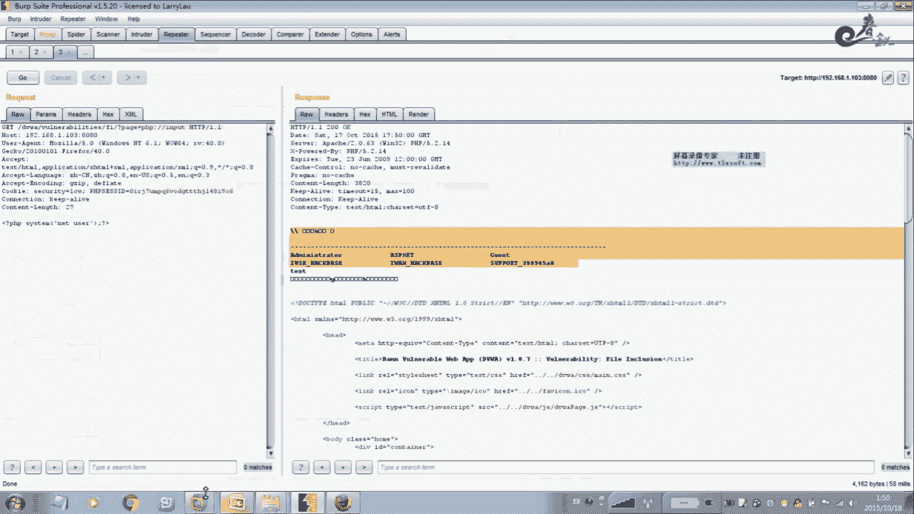
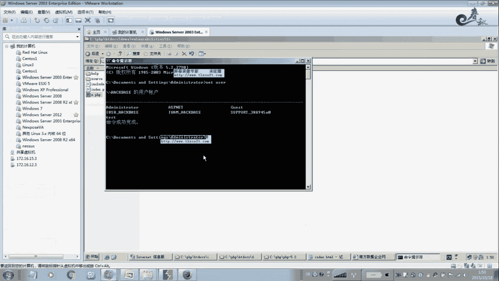
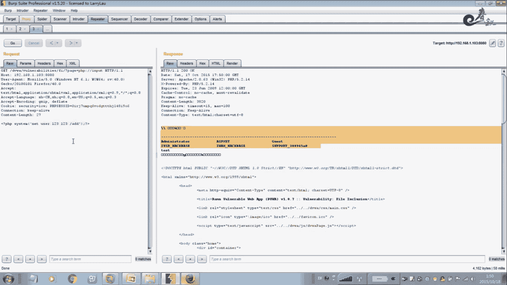
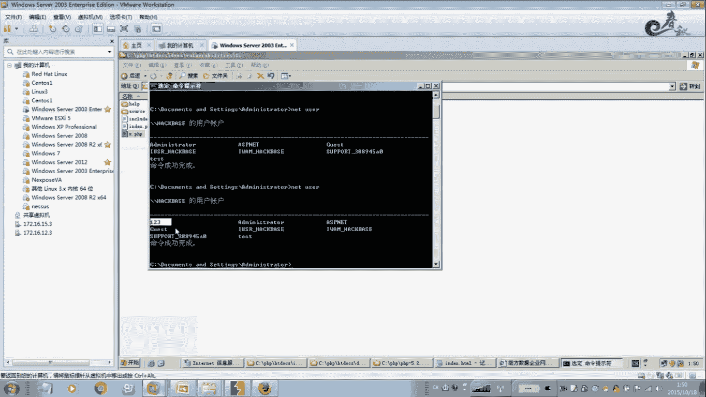
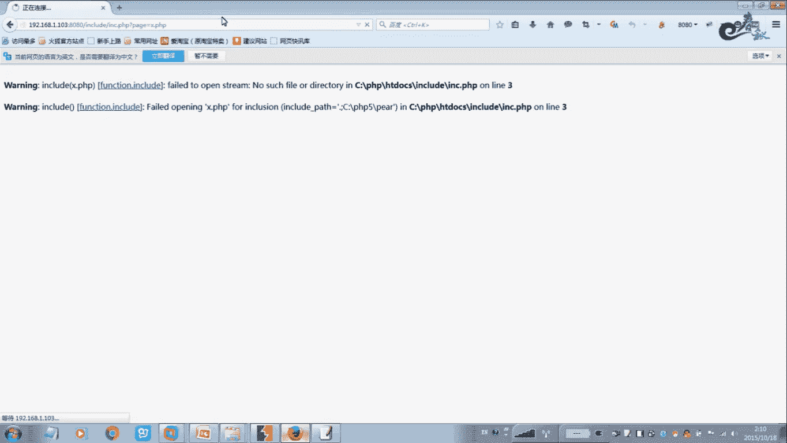

# 经典15年i春秋渗透测试系统化教程 - P32：课时2 文件包含读写文件 📄

在本节课中，我们将要学习PHP文件包含漏洞的高级利用方式，包括如何利用包含功能读取和写入文件，以及如何通过包含日志文件来获取Webshell权限。

---

## 概述

上一节我们介绍了文件包含漏洞的基本概念。本节中我们来看看如何利用PHP文件包含功能进行文件读写操作，并探索一些在实际渗透测试中可能遇到的特殊场景。

---

## 读取文件 📖

PHP文件包含功能不仅可以执行代码，还可以直接读取服务器上的文件内容。以下是读取文件的核心方法。

它使用了一个内置的PHP协议：`php://filter`。读文件时，常采用base64编码的方式读取，以避免特殊字符被直接解析。

**核心公式**：
`php://filter/read=convert.base64-encode/resource=目标文件路径`

举个例子，假设我们想读取当前目录下的 `x.php` 文件（该文件是一句话木马）。





**操作步骤**：
1.  构造包含参数：`?file=php://filter/read=convert.base64-encode/resource=x.php`
2.  提交请求后，页面会返回经过base64编码的文件内容。
3.  对返回的base64字符串进行解码，即可得到文件的原始内容。



以下是解码后的示例内容：
```php
<?php @eval($_POST[‘cmd’]);?>
```
通过这种方式，可以读取服务器上任意有权限访问的文件。如果想读取其他目录的文件，只需修改 `resource=` 后面的文件路径即可。


---




## 写入文件 ✍️

文件包含漏洞同样可以用于向服务器写入文件，其原理是利用 `php://input` 协议将POST请求体中的数据写入目标文件。

**核心代码**：
`php://input`

以下是写文件的具体过程。

**操作步骤**：
1.  构造包含参数：`?file=php://input`
2.  使用POST方法提交请求，并在请求体中写入要创建的文件内容。
3.  例如，写入一个能执行系统命令的PHP文件：
    ```php
    <?php system($_GET[‘cmd’]);?>
    ```
4.  提交后，即可在服务器相应位置生成该文件。

**重要注意事项**：
此功能能否成功，取决于PHP配置文件 `php.ini` 中的 `allow_url_include` 选项是否设置为 `On`。默认情况下，该选项通常是关闭的，以增强安全性。

此外，在配置安全时，建议禁用或删除 `php.ini` 中诸如 `system`、`exec`、`passthru` 等危险函数，以防止命令执行。

---

## 包含日志文件获取Webshell 🪵

在实际渗透测试中，可能会遇到目标网站既无文件上传功能，也未开启远程包含，且无法直接写入文件的情况。此时，包含Web服务器（如Apache）的日志文件成为一种有效的突破手段。

Apache服务器会记录所有的访问请求和错误信息。如果我们能在访问请求中插入一句话木马代码，并且这段访问被记录到日志文件中，那么通过文件包含漏洞去包含这个日志文件，就相当于执行了我们插入的代码。

**核心思路**：
1.  将一句话木马作为请求参数或路径的一部分，发送给目标网站。
2.  该请求会被记录在Apache的访问日志（如`access.log`）或错误日志（如`error.log`）中。
3.  利用文件包含漏洞，去包含这个已知路径的日志文件。

**操作步骤**：
1.  向目标网站发送一个包含一句话木马的错误请求，例如：`http://target.com/<?php @eval($_POST[‘pass’]);?>`
2.  该请求会导致404错误，并被记录在错误日志中。
3.  通过文件包含漏洞包含该日志文件：`?file=../../../../var/log/apache2/error.log`
4.  此时，日志文件中的PHP代码会被执行。随后，便可以使用中国菜刀等工具，以 `pass` 为密码连接生成的Webshell。

这种方法的关键在于知晓Web服务器日志文件的默认存储路径，这需要一定的经验积累。

---

## 截断包含 🪢

在早期PHP版本中，存在一种“截断包含”的技巧，主要用于绕过某些后缀过滤。

其原理是利用PHP在包含文件时，如果路径中存在空字符（`%00`），PHP会认为字符串在此终止。这样，攻击者可以绕过开发者添加的固定后缀。

**示例代码**：
假设代码为：`include($_GET[‘file’] . “.php”);`
攻击者可以提交：`?file=../../../test.jpg%00`
此时，最终包含的路径将是 `../../../test.jpg`，而 `.php` 后缀被空字符截断，从而可能包含非PHP文件（如图片马）。

**注意**：此技巧在PHP版本高于5.3.4时通常已失效，因为PHP默认不再截断由用户输入引入的空字符。

---

## 总结

本节课中我们一起学习了PHP文件包含漏洞的几种高级利用方式：
1.  **读取文件**：利用 `php://filter` 协议读取服务器文件内容。
2.  **写入文件**：利用 `php://input` 协议向服务器写入Webshell。
3.  **包含日志文件**：在无法直接上传或写入文件时，通过包含Web服务器日志来获取权限。
4.  **截断包含**：了解了一种历史上用于绕过后缀过滤的技巧。




这些技术展示了文件包含漏洞的强大威力，同时也提醒开发者在配置服务器时必须严格把关，关闭不必要的危险选项和函数。对于安全研究者而言，掌握这些方法有助于更全面地评估系统安全性。