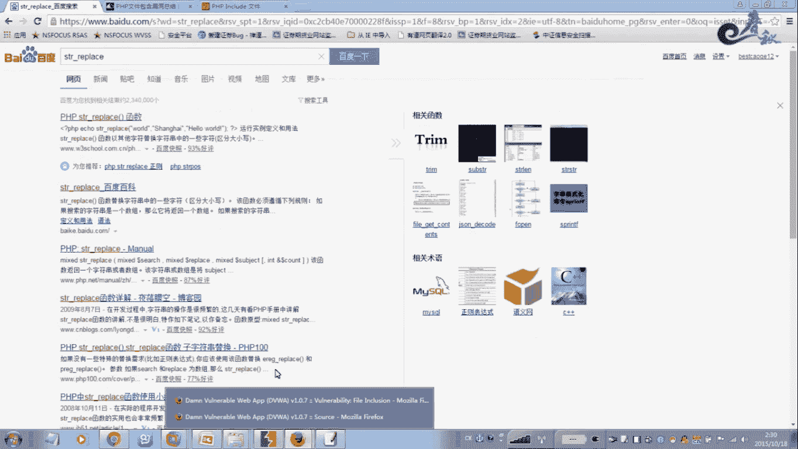

# 经典15年i春秋渗透测试系统化教程 - P33：课时3 文件包含高级利用及防御方法 🔐


在本节课中，我们将要学习PHP文件包含漏洞的高级利用技巧，并了解如何防御此类攻击。我们将通过实例演示如何绕过某些安全限制，并分析不同安全级别的防御代码。

---

## 概述

文件包含漏洞是Web安全中常见的高危漏洞之一。攻击者可以利用此漏洞读取敏感文件，甚至执行任意代码。本节将深入探讨文件包含的高级利用方法，特别是如何利用空字节截断来绕过文件后缀限制，并分析DVWA（Damn Vulnerable Web Application）中不同安全级别的防御代码。

上一节我们介绍了文件包含的基本概念，本节中我们来看看更高级的利用和防御手段。

---

## 空字节截断利用

在某些情况下，程序会在用户输入的文件名后强制添加特定后缀（如`.php`），这可能会阻止我们直接包含非PHP文件。

例如，程序代码如下：
```php
include($_GET[‘file’] . ‘.php’);
```
如果我们传入`test.jpg`，实际包含的是`test.jpg.php`，文件不存在。

为了绕过这个限制，我们可以使用空字节（`%00`）进行截断。空字节在C语言风格字符串中表示字符串的结束。当程序处理文件名时，遇到空字节会认为字符串已结束，从而忽略其后添加的后缀。

以下是利用过程：
1.  攻击者传入`test.jpg%00`。
2.  程序接收到参数后，将其与`.php`拼接，得到`test.jpg%00.php`。
3.  在内部处理时，`%00`被解码为空字节，程序读取到空字节即停止，实际包含的文件是`test.jpg`。
4.  如果`test.jpg`中包含恶意PHP代码，则会被成功执行。

**注意**：空字节截断技巧在PHP版本小于5.3.4且`magic_quotes_gpc`设置为`off`时有效。

---

## PHP内置协议利用

PHP提供了一系列内置的封装协议，允许像访问普通文件一样访问各种输入/输出流。这在文件包含漏洞利用中非常有用。

最常见的是`php://filter`协议，它可以用于读取文件源码，特别是在无法直接执行代码但可以读取文件内容的情况下。

例如，利用`php://filter`读取配置文件源码：
```
php://filter/read=convert.base64-encode/resource=config.php
```
这段代码会将`config.php`文件的内容经过Base64编码后输出。攻击者获取到Base64字符串后，解码即可得到文件明文内容。

其他有用的协议还包括`file://`、`phar://`等，可用于访问文件系统或ZIP压缩包内的文件。

---

## 文件包含漏洞防御分析

接下来，我们通过分析DVWA中文件包含模块的高、中、低三个安全级别的代码，来学习如何防御此类漏洞。

### 低安全级别

低安全级别未做任何过滤，直接包含用户输入，风险极高。
```php
$file = $_GET[‘file’];
include($file);
```

### 中安全级别

中安全级别尝试使用`str_replace`函数过滤输入中的`../`等目录遍历字符串。
```php
$file = str_replace(array(“../”, “..\”), “”, $_GET[‘file’]);
include($file);
```
然而，`str_replace`函数是**区分大小写**的。这意味着攻击者可以通过使用大写字母（如`..\`或`../`的变体）来轻松绕过过滤。

### 高安全级别

高安全级别采用了白名单机制，只允许包含指定的文件。
```php
$file = $_GET[‘file’];
if ($file != “include.php”) {
    echo “ERROR: File not found!”;
    exit;
}
include($file);
```
这种方法最为安全，它严格限制了可包含的文件范围，从根本上杜绝了包含任意文件的可能性。在实际开发中，如果必须使用动态文件包含，应优先考虑白名单机制。

---

## 课后作业与实践

为了巩固本节课的知识，请完成以下实践作业：

1.  **环境搭建**：在本地下载并搭建“易酷CMS”系统（或其他已知存在文件包含漏洞的靶场）。
2.  **漏洞复现**：尝试利用本节课所讲的空字节截断或PHP协议，复现文件包含漏洞。
3.  **日志包含**：寻找将PHP代码写入Web日志文件的方法，并尝试通过文件包含漏洞来包含日志文件并执行代码。
4.  **防御实践**：尝试编写一段更健壮的包含代码，使用白名单或安全的过滤方式。

以下是漏洞利用的一个典型思路参考：
*   首先，找到存在文件包含漏洞的参数点。
*   其次，尝试包含系统日志（如`/var/log/apache2/access.log`），并将PHP代码通过User-Agent或请求参数写入日志。
*   最后，通过文件包含漏洞直接包含该日志文件，从而执行代码。

---

## 总结

本节课中我们一起学习了文件包含漏洞的高级利用与防御方法。



我们掌握了如何利用**空字节截断**来绕过文件后缀限制，了解了**PHP内置封装协议**（如`php://filter`）在读取文件源码时的作用。同时，我们通过对比DVWA的高、中、低三种安全级别的代码，明确了有效的防御策略：**白名单机制**是最安全的方法，而简单的字符串替换过滤很容易被绕过。


理解这些攻击与防御的原理，对于开发安全的Web应用至关重要。