# 经典15年i春秋渗透测试系统化教程 - P36：课时3  验证码识别暴力破解密码 - 老网恋教父了 - BV1n54y1B7F7

🎼Yeah。好，我们现在把这个。呃，暴力破解验战码2实力2给大家讲解一下呃，这个案例就是给大家讲解这个验战码识别技术。我们直接来实藏吧，给大家。好，我们用到的工具啊就是PKAV这款工具。

还有就是我们这个一套程序啊，这个我在熏机搭建了1个SP环境啊，就是这个这套程序啊，中心小学的一个建造系统。那么我们就在这里呃先打开后台，那么我把这个环境也打开了。

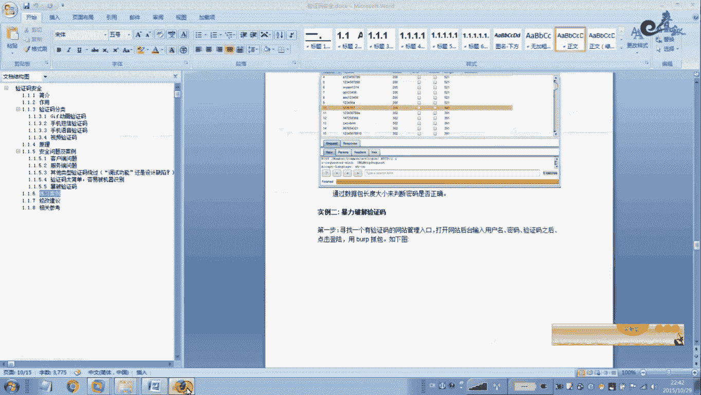

好，那么我们现在就给大家来嗯打开。首先它这款工具它是具备装挖的。

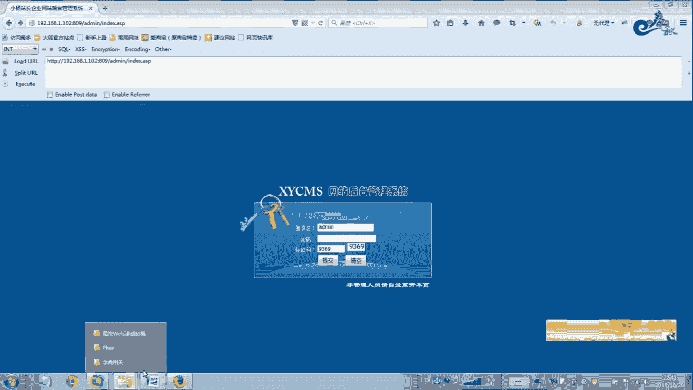

你看。

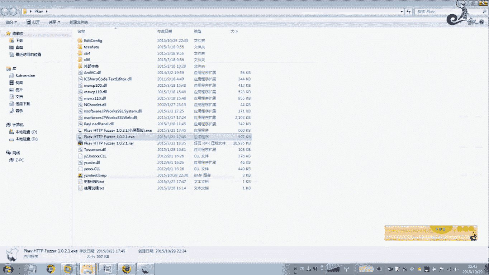

我们来看一下啊，它这里抓不到包哈，它是不行的。所以我们必须使用BURP这款工具来加。这个把这个包抓一下。嗯。

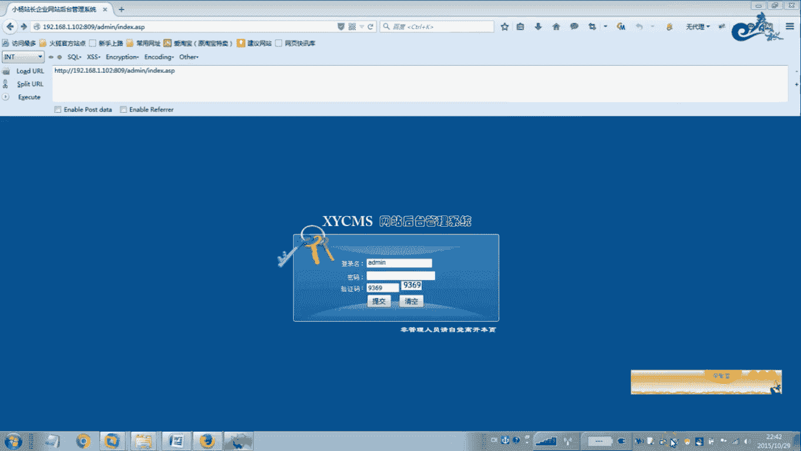

哎，我这个。好。

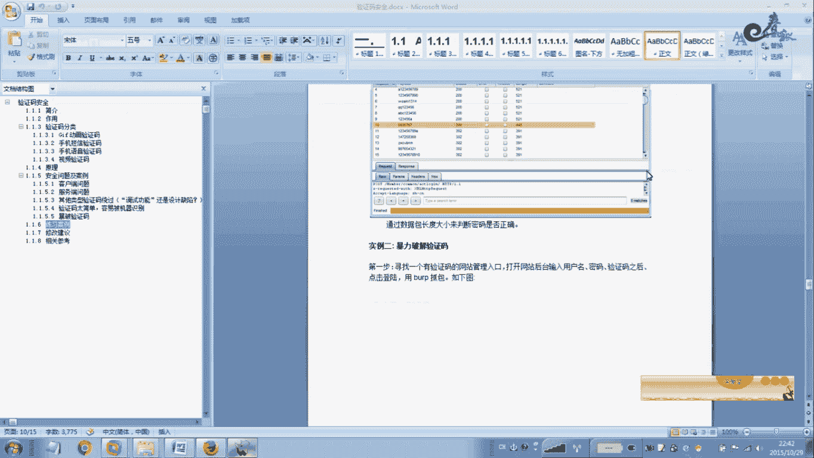

。好，我们在这里来看一下。把这个代理开启一下，我们再接着在这里设置一下代理。啊，这个验证码是变的哈。嗯，看看它是变动的。好，我们密码随便输。那正确密码是AD名啊，用户名也是AD名。呃，8933。

这个链代码，你输错的也行哈，这个无所谓的。Yeah。呃，这个密码我是错误的哈。好，我们拦截一下。

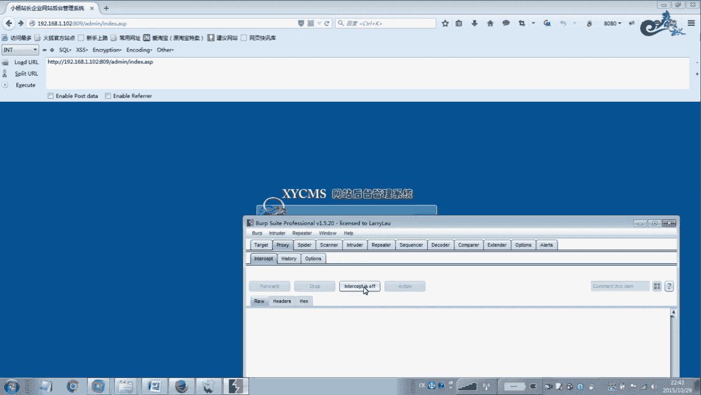

啊，抓到这个数据包之后，我们把这个数据包复制下来。把粘贴到这款工具里面。啊，接着我们BRRP就没用了。嗯，代理就没用了，关闭。

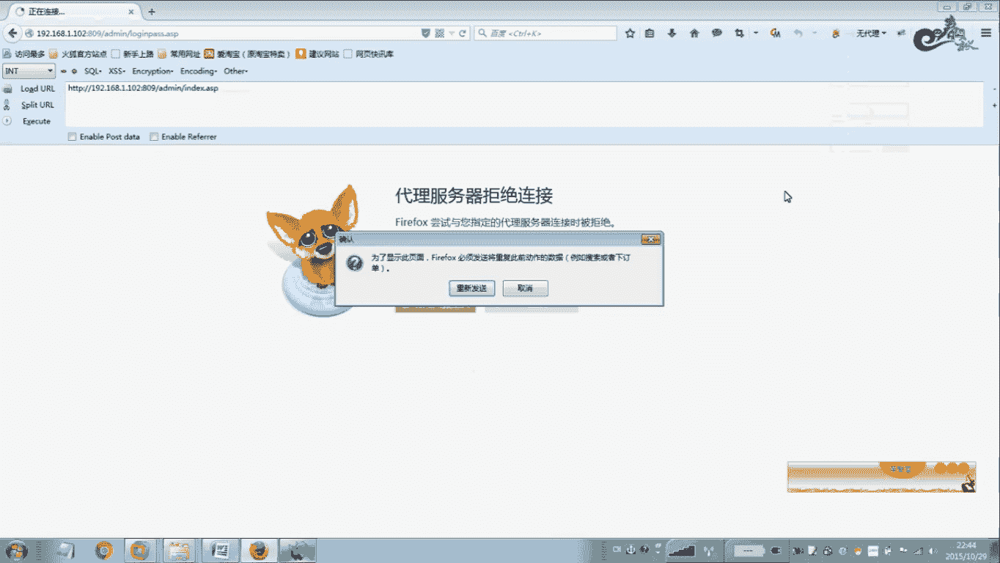

Yes。嗯。

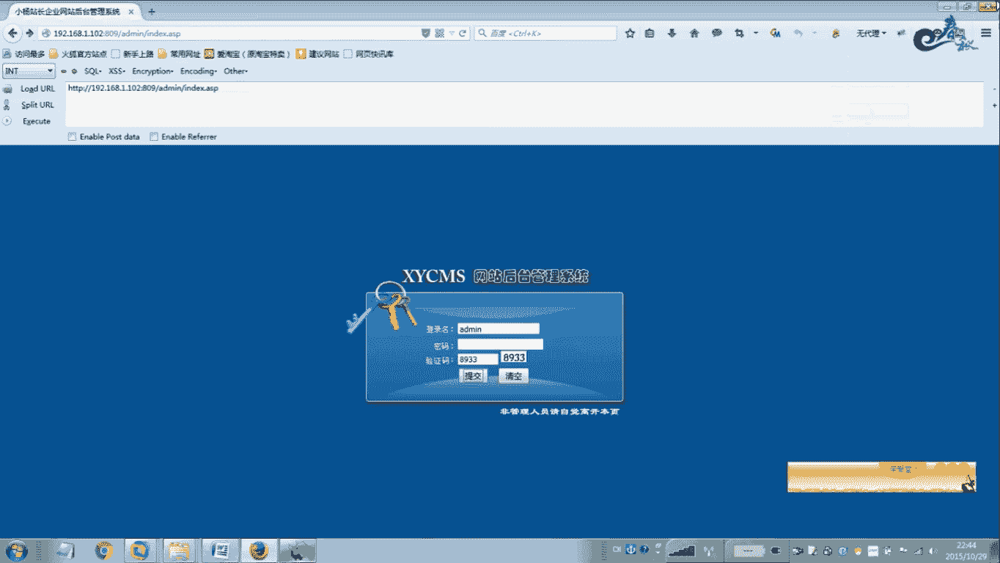

好，我们接着来给大家演示。那么这个分析地址，那么分析地是填写哪一个地址嘞？大家要注意啊，它这个地址就是我们的这个。

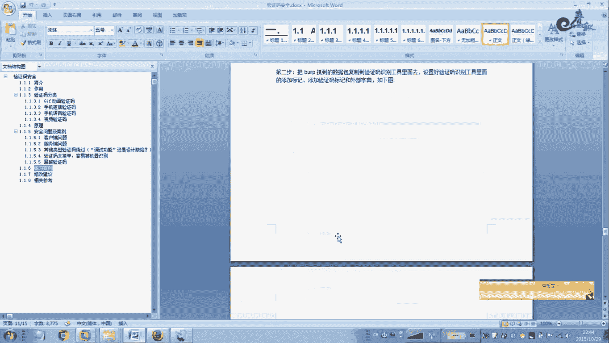

嗯，后台的登录地址就是说我们这个这款地址。

接着我们来添加一个标记哈，那么这个标记一般呢是我们。AD面这个用户面试保持不变。那么密码的话，我们。这个密码是错误的啊，正确的密码是AD。那么我们添加一个标记，验证码，我们也给大家添加一个念验战码标记。

好，就这么设置。那么接着我们在这里添加一个字典。那么字典的话，我就用这个。套过100吧。倒入一个，它这里有很多字典，它这款工具里面。然，这里显示top过100。好，我们再加一个正确密码进去。行吧。嗯。

再加一个凑的。666。你看他这里有很多字典哈，你你。嗯，那么我这里用套100。好，接着我们看一下。那么这里我们就设置完成。啊验证码识别这个地方，那么我们这里得的这个地址是填验证码的地址。

你直接在这里复制图像地址。

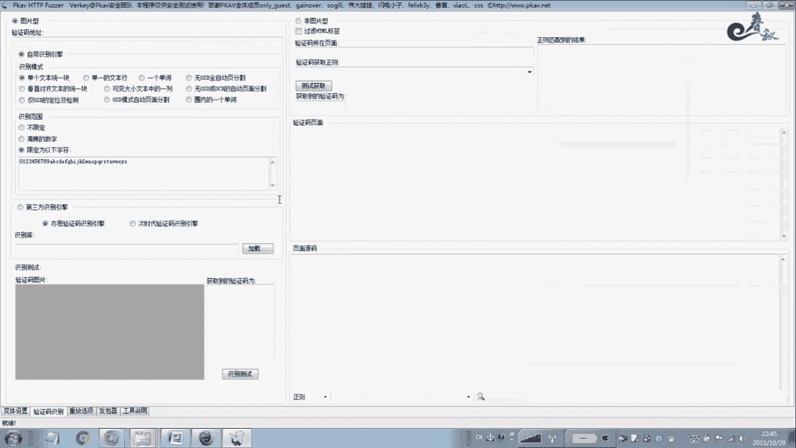

好。嗯。

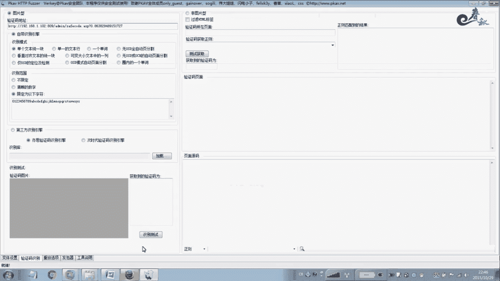

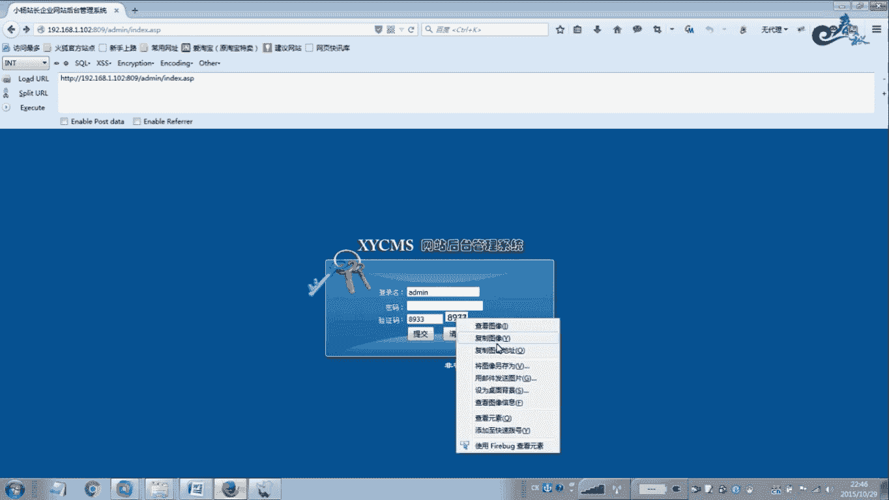

他是这种地址吗？

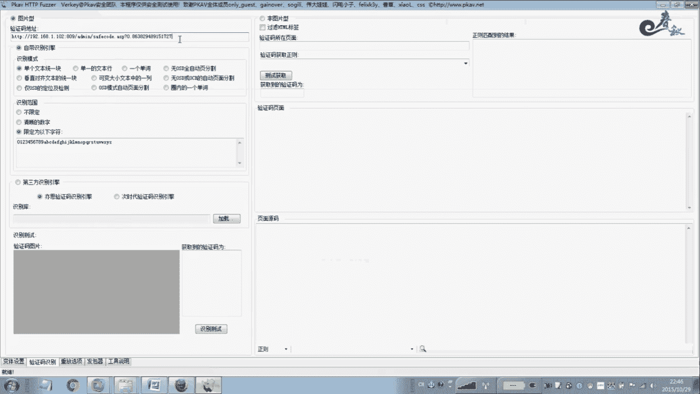

Yeah。看一下。

嗯，这后面怎么有一个这个？按理说应该是没有的。应该是没有这个后面一圈地址。稍等一下，我们把这个地方。

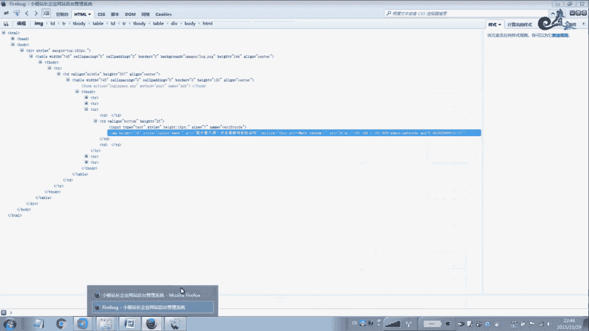

刷新一下。

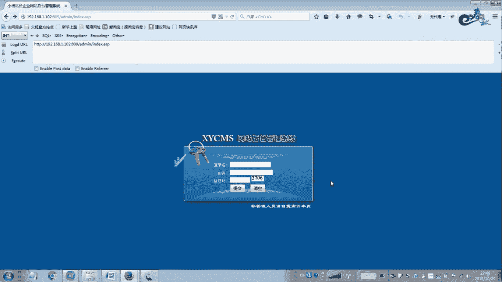

啊，应该是这个地，你看现在是OK了。

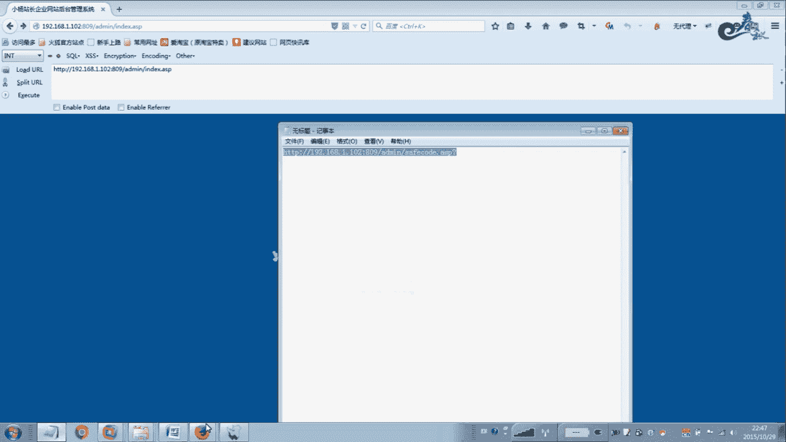

刚才他加了一个什么东西？啊一像后面的一个小数点用来。好，那么这里的话我们来看一下哈，这个就是单一文本。就单一文本这个成一块就行了。这个有很多选项哈，大家可以根据自己的情况。

因为我这个地方你看这里就是一个文本的啊，单一文本显示的。

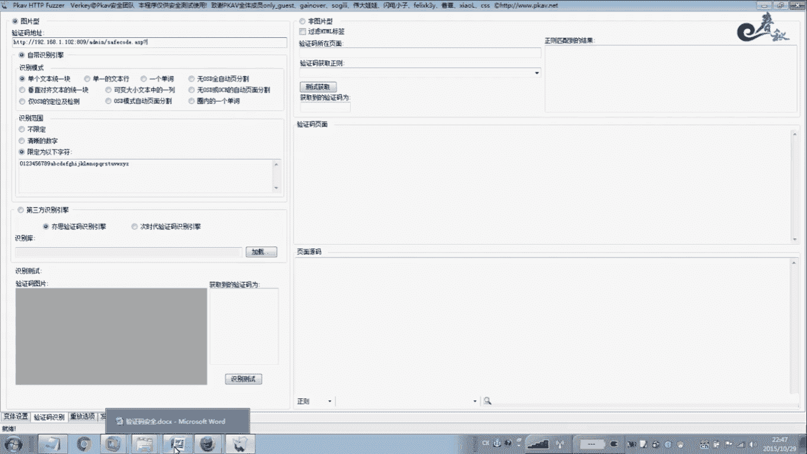

它这个就是单一文本的，它这里有嗯识别模式，有这些啊小文本的呀，我OS。

OSD的呀或者OCR这个呃自动页面分割的呀圈内的单词啊，就根据这种圈内的单词。那么在这个地方，你就是它它有一个。单词的形式啊就是就在一个圈内啊，它有很多一些模式啊，自动分割的。还有一个垂直对齐的啊。

那么这里的话我这个就是第一个选项，就是默认的。那么这里的话我看一下这里验证码只有数字啊，那么像这种验证码好识别，那么只要数字的话，我们就是0到9就行了啊，0到9。是数字验代码吗？那么我们限定一下哈。

0到9。嗯，接着我们这里就按默认的，我们不需要第三方识别。第三方的话，你像103的验证码是吧？京东的验证码，那么你需要个库啊，你就在这里加载进来呃，使用第三方面的。那么这里要需要这个呃有一个库就好啊。

就加载到这个工具里面来。好，接着我们来看一下啊。嗯，识别哎，看啊第一个没识别出来，你看第二个3627就识别出来了。如果能点击到这里面是获取到这个正确的验证码，那么这里就是识别程式就OK的。

如果是非图片形式的，那么你就在这里哈，有些是一个文本形式的，也就是说不是非图片的。那么在这里呢来进行设置啊，有些验代码啊。是非图片的啊，这里的话我这个是图片型的啊图片型的。那么我这里就是。

你可一看也看得到吗？我这个就是图片形取的。有文本形式的。那么这个根据大家嗯就是在这个实际过程中去调试去看。

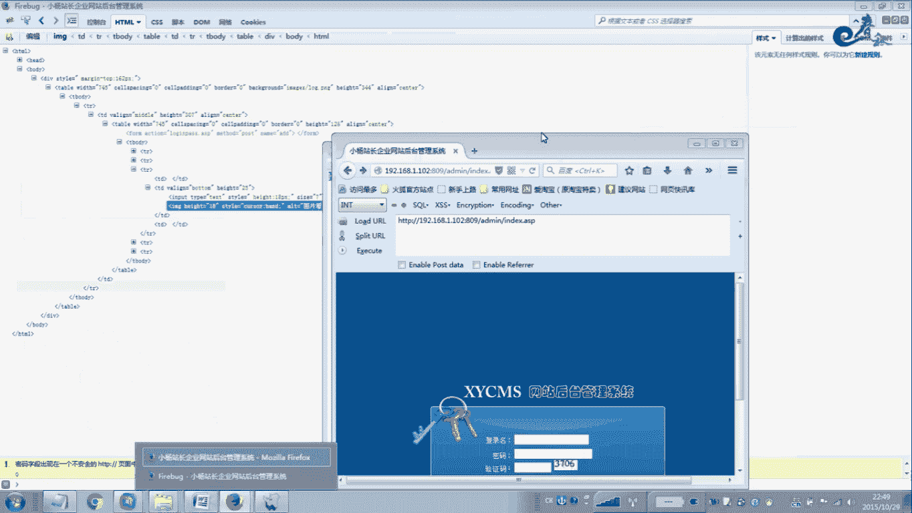

嗯，它这个这个工具也有相应的教程哈，有相应的教程。现在这个工具在福利b里面也有啊，也有教程。好，接着我们来看一下哈后面的一些设置。嗯，那么这个选项我们就设置完成。那么第三个这个。HDDHTTV请求头部。

那么这个一般按照默认的这个穷定向啊，你想所说穷定向，有的是我们就是正确码呃，用户名和密码正确的情况下，嗯，它就跳转到这个后台页面嘛，那么就可以跟踪过去嘛，那么这里有自动跟踪3。2穷定向还无条件跟踪啊。

那么这里的话我们就按根据这个数据包的大小来判到。那么我就不跟踪这个穷定向的。我一看如果是正确的账号跟密码的话，那么它的这个数据包的这个大小是不一样的。那么你可以在这里看得出来是吧？

错误的验证码它的这个数据包大小也是不一样的。啊，这个我们采用多线程模式，就是这样的话识别速度快啊，跑密码跑得快。那么固定长度啊，这里的话我这里是嗯四维验证码，你可以看到我这里是四维验证码。

那么这里的话我们就固定一下，固定长度为4维。嗯，病方现城的话。线成数我们可以C大一点啊，C1都可以一点哎。建议大家啊C乘十啊，建议大家C成十，比如说跑的快一点嘛，线程速越大越越快嘛。延迟2秒。代理的话。

我这里就不需要代理的哈。嗯嗯嗯。嗯，其他的这个地方我们就这个返回这个数据处理。这个这根据情况啊提取类源啊变题啊。那么我们这里有个重视规则，这个需要设置一下，我们用。字符上匹配吧。

字符上匹配就是匹配什么密码错误。注意啊，这个地方我们需要注意设置一下。就是我们在这个识别验证码的时候啊，这个识别这个验证码的时候，一定要注意。所以我们在这里地读，我们输入一个用户名义是吧？一个密码呃。

验证码错误。哎，你看啊它这里有个验证码错误，那么这就是关键字啊，就是关键字。那么遇到这个关键字的时候。嗯，如果验证码没第一个验证码没识别出来。呃，但是有一个正确密码在里面，遇到这种情况。

我们就在这里一个字符串匹配，字符串匹配是非常有用的。要当这个字符匹配时，这个验证码是错误的时候，再重试，针对这个密码再重试一次。还有我们这个。鱼。你说啥几个关键子。六。验证码错误。验证码错误。

一个感叹号唉，这个感叹号是这种吧。Yes。嗯，啊是这种的，应该是这种，刚刚添加一下。我添加完之后，我们进行发包。嗯，其他的现象就基本上没什么太多设置。就这样啊，我们来启动来破解一下，看能不能破解哈。

我们来启动啊，就开始暴力破解。你娘，这个速度很快的哈。他这个哎，你看几秒钟啊就完成了。你看我们来找正确密码，你看这个数据包括什么都是79的，那么这个一般的是错误的吗？Oh。啊。

我们看好哎这个数据包你看到这里哈，它这个是有不一样的。你看。这个数据包特别不一样，你看这个长度。长度特别180130130。那么这个就是一般是正确的，而且还这里有个302，36就是跳转的意思。啊。

删掉2就是跳转的意思。也就是说当用户名跟密码、验证码删则正确的情况下，它就删掉2跳转。而且数据包长度是不一样的。你看。啊。这样的话我们就碰到它就是一个正确的密码。你看到这里。嗯。这就是说验证码也是正确。

用户名义也是正确，密码也是也是正确的啊，这近情况下他就跳转了。而正你看它这个页面也不哎，你看。好，这就是我们这节课的一个重点，就是我们现在拿这个密码来登录一下，我们来看哈，你看看是否是否是AD名啊。

AD名啊，用户名密码也是AD名。让我们输路你怎么上汽旅游。你看就登录进来了，对不对？登录网站后台了。这就是我们的这个验证码识别进去啊，验证码识别进去。关于这个验证码识别技术。

我们就给大家把这节课就讲到这里。我们下面接着来看一下后面的。Oh。呃，这个修改建议就是修复啊，这个如何去针对这个应该修改建议修复吧。好，就这样吧。呃，就是说我们怎么样去对这个验战码去防御。

我们前面讲了这么多案例，呃，也给大家找了一些污远上面的一些案例。但是我们。真正要去防御防御这个验证码被识别有哪几个方面的？我在这里写了四个方面的知识点来进行。防御这方面。

第一个方面就是强制要求速度验战嘛。就是说很多一些嗯我做过对行业机构做过这个渗透测试，包括内度验站。就是说这个呃全果的一些嗯。证券这个证券基金期货这个行业啊做过大量的这个网站这个。后台是没有验证码的。

这个是相当不安全的，而且也没有做隐藏，没做任何安全陷制。嗯，包括现在一些网络设备，你像斯科设备啊，托么卡头后台都是没有你证码的。那么这个情况。那么你必须要。置这个强烈要求设设置一个验证码。

必须要用验证码后台登录，这样的话增加了一一个什么这个更击的一个难度。否则的话，你必须就是你如果你像tomo card或者sco设备这样的一些设备。嗯，有些东西不是你来进行。

就是说我想加个验证码就加一个验证码的啊，这个你你要改程序的，是不好改的。那么这种情况下，你就来实施IP脆点。嗯。呃增加主错理就是说你让这个密码对后台密码必须要符合什么策略，就像那个EX圈值邮箱一样。

在后台你就是说要设置要强大的策略。这个策略叫什么数字加字母加配置符号，8位以上的密码。而且限制IP登录，就是说我只允许一一般的网站后台只允许这个什么。

例如我内网用户登录内网的某一台机器可以就是维护人员才能管理人员才能进这个网站后台，其他人员统通拒绝。比如我限制IP啊。但是在限制IP的时候，我这里写了一下，一定要注意，不要被。Forward了。

在fo的是什么意思？就是在我们的BRP里面。单独加一个就是。X for for，那么这个是干什么用的呢？你可以在百度里面去查一下。它这个就是说呃像转发一样，就是说我们这个。

但是我知道了公击者知道了你这个限制了这个做了IP测点。那么我在这个PRP代理的时候，加上这个之后啊，后面你。这就像那个图一样，后面接上IP地址。就是你只允许哪1个IP地址。左碍。

那么我就接上那种只原许内网IP地址，那么我在这里接一个随便19168这个内网地址或者10开头的，或者17开头的。那么这样的1个IP地址，内网地址。我再点再点击。转发就是我再用工具来暴力破解。

这样的话就浪过了这个IPCIPC。啊，所以说一定要注意看是否可以绕过啊，看是否可以绕过。这个我也遇见过啊，这个男里我也遇见过。第二个就是验证码只能用一次，用完就立即过期，就是失效。

那么前面我们这个案例一就给大家讲励过了，一个念代马可用X。他不过期了，就没有，就是说没有去销毁那种吧，在最后一步的时候。没有去销毁验证码，所以说验证码不能用多次，只能用一次，这一点这一点一定要注意啊。

这是第二个防御方法。第三个方风格就是应该不要不要太弱。你像我们刚转的。

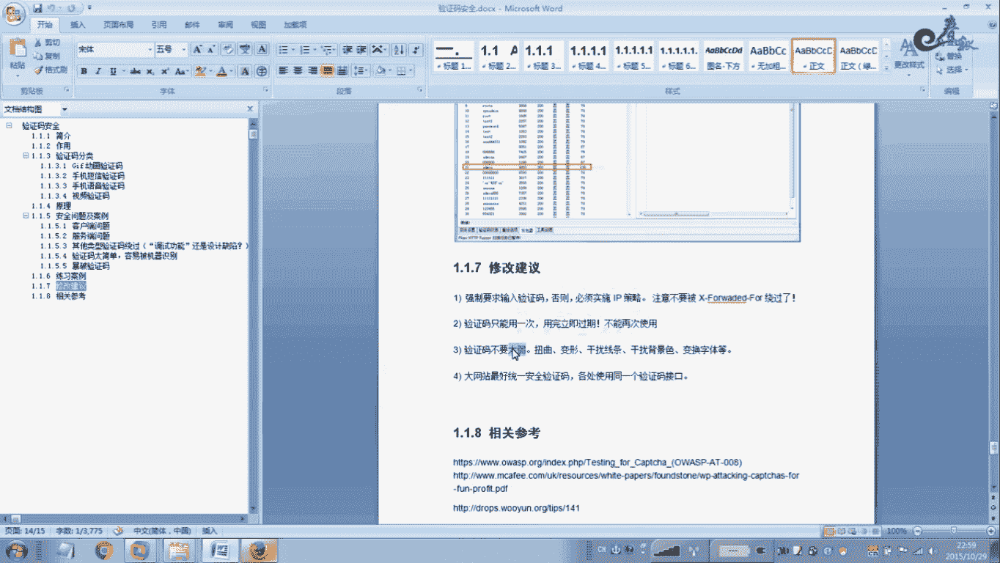

我们退出。像这中间的嘛就比较比较弱啊比较弱。

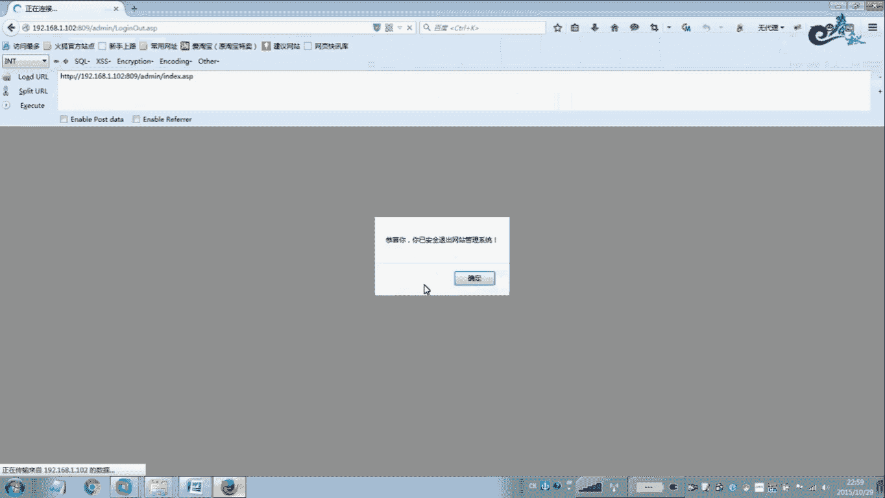

你要应该要打一些什么点点点点点点，中间加一个横那个横杠，横两杠在这里。啊，这样的话就增加了这个验证码的识别难度啊，估计这个验证码搞一个曲形的变形的干扰线条，干道背景色是吧，颜色千变万化变化字体等等。

是吧？数字是加字母结合形式的。

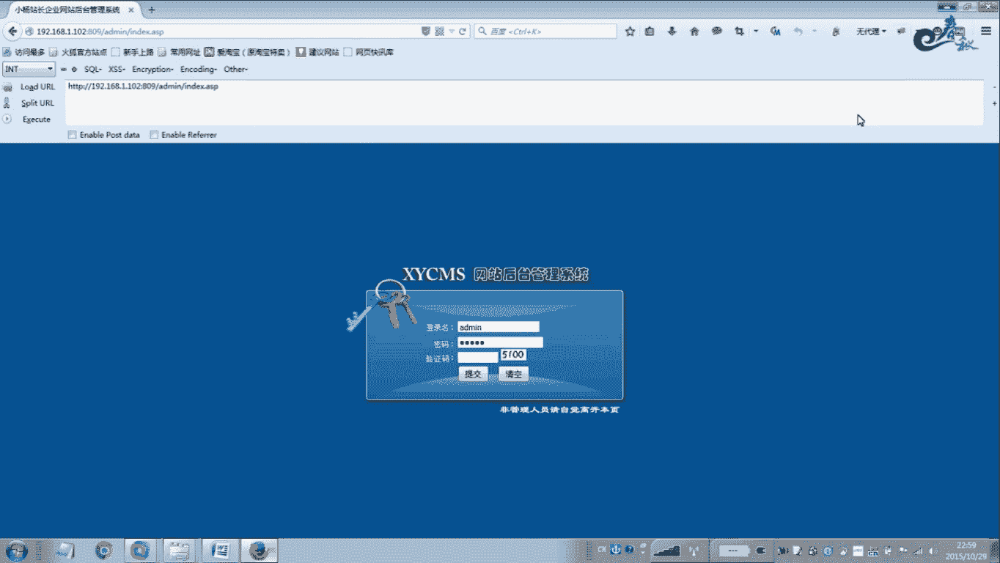

那么最终养了没久，想着有些东西就不好识别了啊，增加了这个难度。第四个就是大量。大网上最好统一安全验证码，那么各处使用同一个验证码接口。啊，就方一方面就是方便管理。第二方面就是。

我们就是做到就是增加这个安全性，增加安全性。我们只需要对这个验证码这个接口做好就行了。就增加这个验证码的这个就像前面三点一样复杂度。限制。那么这样的话就比较比较好了嗯比较好了。

那么下面有几个什么参考这个有关键代码的一些参考的资料，大家可以自己去万斯哥玛咖菲亚是吧，物远方面啊都有资料。那么这里我写了三个地址，大家自己去看一下客户。好，关于今天我们这节课的内容，我们就讲到这里。

大家有什么不懂的问题，到时候我们再进行嗯讨论。

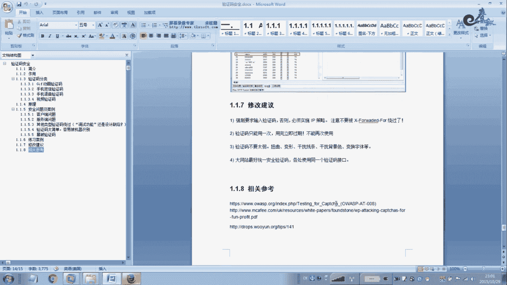

