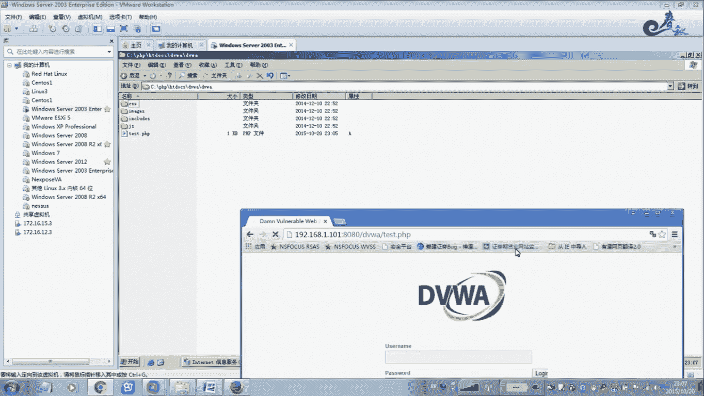

# 经典15年i春秋渗透测试系统化教程 - P37：课时1 远程命令执行-OS命令执行 🎯

在本节课中，我们将要学习远程代码执行的基本概念，特别是其中的一个重要分支——操作系统命令执行。我们将了解其原理、分类、常见场景以及一个简单的PHP实例。

## 概述

远程代码执行是一个广泛的安全漏洞类别。它指的是应用程序在处理用户输入时，由于缺乏严格的控制，导致攻击者可以构造包含恶意代码的参数，从而在服务器上执行任意命令，最终可能获取服务器权限。这类漏洞通常发生在应用程序的逻辑层。

上一节我们介绍了远程代码执行的基本概念，本节中我们来看看它的一个核心子类：命令执行。

## 什么是命令执行？💻

命令执行，特指系统命令执行。它是指应用程序在传入命令行参数时过滤不严，导致恶意用户能够控制并最终在系统中执行命令，从而造成严重破坏，属于高危漏洞。

Shell是系统的用户界面，它提供了用户与操作系统内核之间的交互接口。Shell接收用户输入的命令，并将其解释后传递给内核执行。实际上，Shell就是一个命令解释器。不仅如此，Shell还拥有自己的编程语言，允许用户编写由Shell命令组成的程序。

总结来说，Shell就像一个翻译官。例如，当用户（说中文）需要与系统内核（说机器语言）交流时，Shell就充当中间的翻译，确保双方能够理解并执行指令。这就是命令执行的基本过程。

## 命令执行的特点与分类 🗂️

命令执行的核心特点是，Shell作为命令解释器，解释用户输入并传输给内核。它支持变量、数组、程序控制结构等高级语言特性。

以下是命令执行在不同环境下的主要分类：

*   **Web命令执行**：在渗透测试中非常常见。通常由于PHP、JSP、ASP等脚本语言代码编写不严谨，未对用户输入进行安全过滤和审计，导致漏洞。许多Web脚本语言支持动态执行运行时生成的代码。如果用户输入未经检查就被拼接到动态执行的代码中，攻击者就可以提交精心设计的输入来执行非法命令。
*   **数据库命令执行**：在提权过程中经常使用。当获取网站数据库连接权限后，攻击者可以通过数据库连接执行非法操作，例如对数据库进行增删改查，甚至留后门。
*   **第三方软件命令执行**：随着安全研究深入，越来越多的第三方软件漏洞被挖掘出来。例如，某些远程管理软件、文本编辑器、甚至输入法（如旧版Windows系统自带的输入法）都曾存在漏洞，允许攻击者绕过认证或执行系统命令。

## PHP命令执行实例 🔧

在Web安全中，与脚本语言相关的命令执行最为常见。接下来我们重点看一下PHP环境下的命令执行。

PHP命令注入攻击是目前PHP应用程序最常见的脚本漏洞之一。其漏洞原因是，程序员在使用PHP中具有命令执行功能的函数时，未对用户提交的数据进行严格过滤，就直接带入函数中执行。

PHP中有多个可以执行外部程序的函数，最常见的有五个。首先我们来看 `system()` 函数。

`system()` 函数用于执行一个外部应用程序，并输出执行结果。其基本格式为：
```php
system(string $command, int &$return_var = ?): string
```
其中，`$command` 参数是要执行的命令，`$return_var` 用来获取命令执行后的状态值。

程序员的本意是通过此类函数与Web应用进行交互。例如，通过网页来获取服务器目录列表。但如果没有进行过滤，攻击者就可以利用它执行任何系统命令。

### 一个简单的演示

假设有以下存在漏洞的PHP代码（`cmd.php`）：
```php
<?php
$dir = $_GET[“dir”];
system(“ls -al “ . $dir);
?>
```
程序员希望用户通过 `?dir=.` 这样的参数来列出当前目录。

然而，攻击者可以构造恶意输入。例如，输入 `?dir=.; pwd`，那么实际执行的命令就变成了 `ls -al .; pwd`。分号 `;` 在Linux中用于分隔命令，因此系统会先执行 `ls -al .`，再执行 `pwd` 命令。

更危险的是，攻击者可以执行创建用户、修改密码等命令，例如 `?dir=.; useradd hacker` 或 `?dir=.; echo “hacker:passwd” | chpasswd`（需相应权限）。

**请注意：** 以上演示基于Linux系统命令。在Windows系统上，应使用对应的命令，如 `dir` 代替 `ls`，`&` 或 `&&` 作为命令连接符，例如 `?dir=. & whoami`。

## 总结




本节课中我们一起学习了远程命令执行的基础知识。我们了解了命令执行是远程代码执行的一种，其本质是应用程序未过滤用户输入，导致攻击者可通过Shell“翻译官”在服务器上执行任意系统命令。我们将其主要分为Web命令执行、数据库命令执行和第三方软件命令执行，并通过一个简单的PHP `system()` 函数示例，直观地展示了漏洞成因与潜在危害。理解这些原理是进行安全防护和渗透测试的基础。