# 经典15年i春秋渗透测试系统化教程 - P39：课时3 远程命令执行-DVWA命令执行代码分析 - 老网恋教父了 - BV1n54y1B7F7

好，我们接着讲解。呃，现在我们来直接来给大家演示一下这个DVWA它这个。

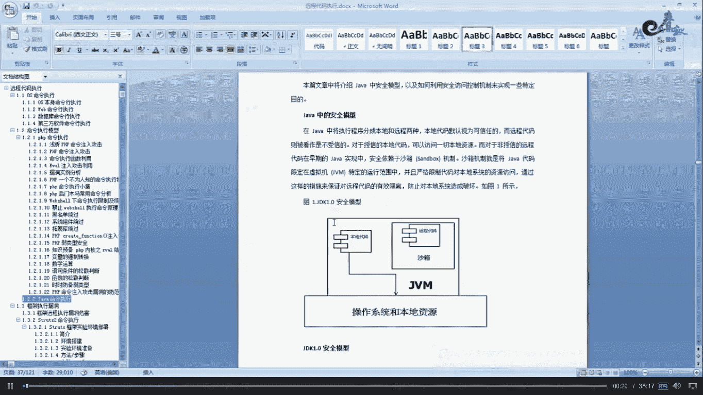

嗯，命令执行。

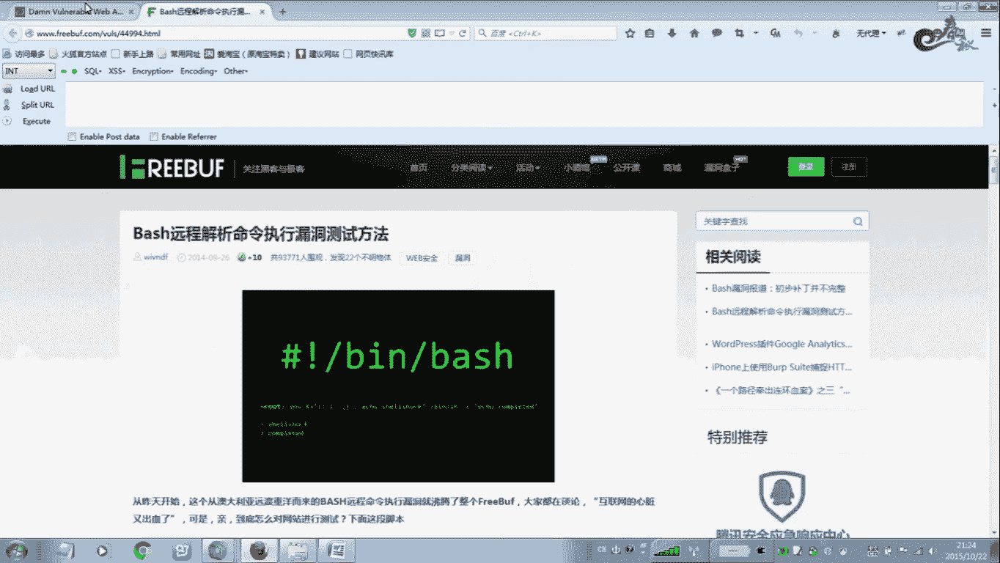

呃，就在这一块啊，comment啊这个。这个选项它就是DVWA的这个命令执行。那么呃它是怎么样去执行的呢？我们来看一下啊。嗯，你看一下，如果我们在这里输入这个P127。0。0。1，我们看一下。

你看在这里拼一下。姐姐。啊，不对，呃，直接写这个IP地址127。0。0。1。啊，它是OK的，可以可以通的对吧？没问题吧。那么我们首先看一下，那么接着我们来看一下它的IBI代码。看他们之前我们换一个。

例如，我输入let特右手，你说他会不会执行？你看。不能执行，对不对？有问题啊，请检查。那么我们。看他的大码是什么样子了。首先我们就是。他在这个地方就是说呃，我们就是输入1个IP地址给这个变量。

其着我们在这里一个碰荡哈，如果是呃。windows操作系统就windows NT的，那么它就执行下面这个命令，直接 pin啊， pin后面接什么IP地址，它这个 pin都已经写上去了哈，写进去了。

所以你在前面加再加一个 pin，那么就报错了啊，后面就是这个变量，它只接收什么IP地址，也就是说。但你为什么？这里呃因为它前面加了一个P，如果我在这个地方嗯再加一个就是输入later右手这样的一些命例。

那么它前面等于相当于它加了一个这个。啊，加一个这个再执行，那当等他就报错嘛，do能报错嘛，所以说。等于相当于。他这个地方就是我们输入1个IP地址给他，那么他真正执行的命令是什么？一个执行的命令是P。

IP地址IPIP就是我们内个127是吧，127。0。0。1啊，它是这样的一个形式啊，最终执行的是这样的一个形式。如果它这边再一个else就。如果不是win的操作系统的那是你那个操作系统，那么执行下面。

采用到的这个函数啊，是要点需要杠EXEC也就是说P杠C，也是P3次上次之自动终止啊，也就是执行来是相当于一个。如果是in系统嗯P杠C。3然后面是IP地址啊，就这个IP而就是拼三次自动终止啊。

因为那个个它是不像windows一样拼。4拼了四下之后，他就直接终止了。嗯，你呢就是说直接一直拼下去啊，是这么回事，所以他加了一个参数跟C参数，就是限制次数啊是3次。平时三下之后就是嗯三下之后。

你看他这里几嗯唉刚才我在这里啊。对。Yeah。你看。是吧他这个是我因为我的训机是windows操作系统，1234啊，你看。返回4个是吧？嗯嗯，举个例子，我们再如果输个百度嘞。相当于一下聘了一个百度。

对不对？这样是okK的吧。哎，因为我们拼也是可以接百度，但是我们解其他的命令啊letto。刚嗯要查看网络连接没女。那么这样的他绝对执行不了的。为什么？因为这个命令是错误的，那么为什么命令错误啊？你看啊。

所以大家一定要学会看代码，也相当于执行了一个这个。啊，现在一个这个。你说他他行吗？绝对不行的嘛，是错误的嘛，所以说。你我为什么填写玉米写啊？因为是拼玉米，等于相当于一个拼了一个玉米啊。

相当于拼了一个这个。那么为什么会出现这种情况？就是说我们输了东西他可以执行啊。那么大家接着我们看。呃，如果我想执行其他的秘，那么我们举个例子。我输两个这个输两个这个，我后面再接一个lattle右手。

你说能执行吗？你看。看情看看结果，哎，可以，他能查看我。

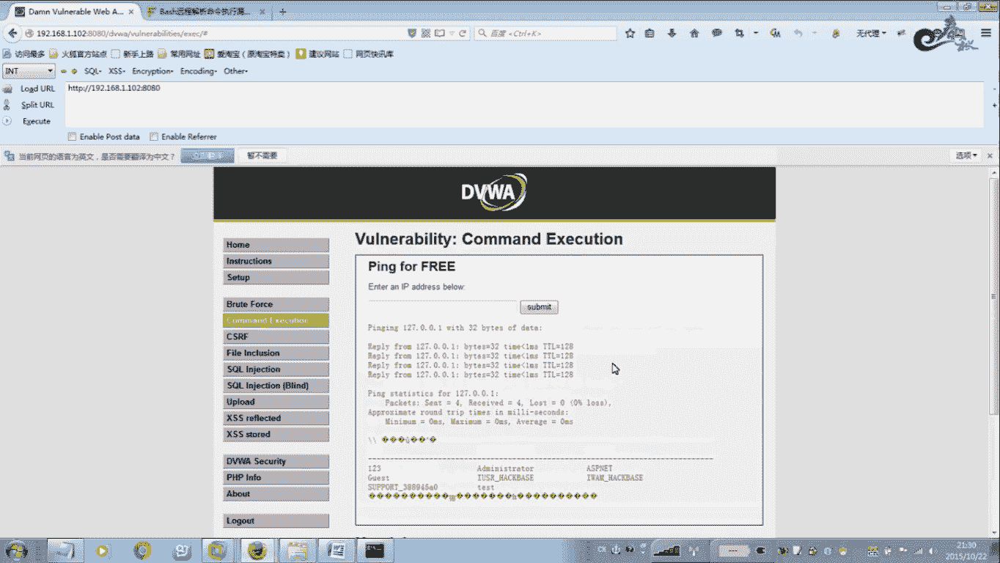

寻机。里面用户。

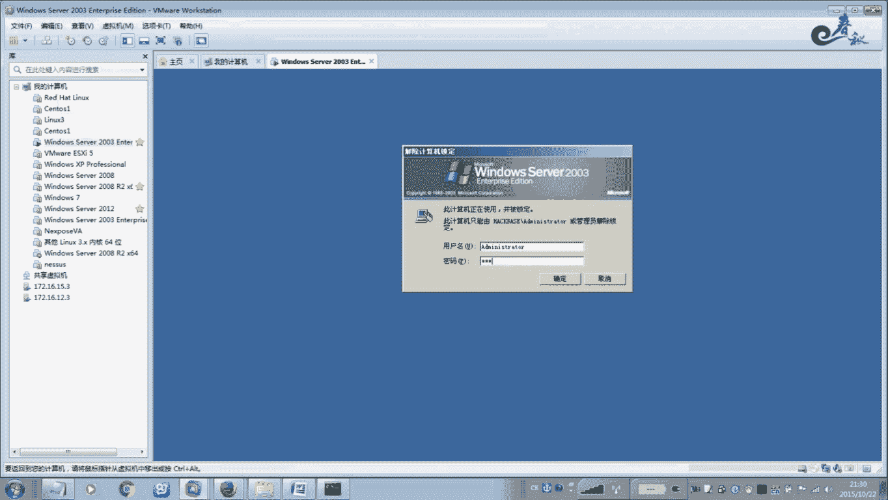

你看。他进来来查看我这里的，你看。诶。

为什么为什么这样就可以？就是说我们刚才执行的这个。为什么这样就行呢？注意在windows操作系统里面，这两个这个就相当于一个就连接一样。嗯。比如说把前面一条命令改后面的。连接起来，两条命令同时执行。

看是这么回事的，就执行完第一条接着执行第二条。还可以之前第3条。啊，比如late stand start杠N查看网络连接端口。我们看一下。能能不能实现？呃，他这个框架。嗯，不能显示这么多。啊。

不能显示这么多，它其实是可以的哈啊，它可以连接起来啊，连接起来去执行。那么我们可以看这里哈啊，其实我们在这里也是一样的。例如我们在这里连接啊。A little use。嗯，再连接。Little st。

干嘛呀。Yes。Oh。你看首先执行第一条。啊，执行聘拼完之后再执行lato钥。嗯，我这个凹在沙的。三个远你还。哎，竹子。呃，退出。你看。你看在当这个呃这个连接状态。那这个全部执行了吧，对不对？你看。啊。

用户的显示用户，这样的话这三个全部执行。看第一个P执行完之后执行第二个。是吧later钥letter钥执行完之后，letttle sa IN全部执行3个。那么跟这个一样。

就是这个是windows的一个连接符号，就连接前面的命令跟后面的命令都都可以执行。那么你看一下读一下P，就是说我们在嗯代码审计的时候啊，一定要注意，就是说在写程序的时候，像这种是最危险的一些写法啊。

就忽略了什么？我们对这个我们用户输入的这个参数啊。没有做任何限制，直接在这里来进行什么。执行直接在这里来执行。就是我们输了1个IP地址之后，或者输入任何东西，直接在这里一个简单的一个碰断。

是否windows改进来个系统啊，这个如果是windows执行下面，如果是啊不是这个windows，那么执行下面的命令啊，它就是这么一个简单的。一个。一个判断方法，所以说他没有对我们做过滤呃。

举个例子没过滤什么，没有过滤，像这样的一个符号，对不对？这个符号过滤了没有？没有过滤啊，最好如果是。我们再接着看啊，我们看一下中极啊，比较一下啊，你看DVW这里可以翻译哈，这里有翻译哈。嗯。

这个如果是中极的啊终极，你看一下它是怎么做的啊。中极终极的话，它就是把这个符号直接过滤了。你看还有一个如这个分号样的玩意儿，这个是inuxinux系统，它不是用这个来做连接哈。

是用这个就前面的命令跟后面命意连接都执行啊。那么用这个符号用这个啊winds是它用这个那么它在这里直接把它过滤掉啊，过滤掉。过滤掉之后呢，那么用这个符号，用这个啊window是它用这个。

那么它在这里直接把它过滤掉啊，过滤掉。过滤到之后，那么那么你就你你就怎么了？😡，你就不行了嘛？你就不能执行了。那么我们来来看一下效果啊，看一下效果。我们在这里级别改一下，改成中级。我们来看啊哎。哎。

我这里受不了啊，怎么？Yeah。我退出重新登录一下吧。Yes。换个浏览器吧。Yeah。Yeah。好。我这个地方。Yeah。我这个地方受不了。看这个里面。Yes。受不了的话，我等一下还要用BURP了。

我改一下。嗯。Yeah。嗯。嗯，没事吧。呃。我们。用PP来问。Yes。好，我们在这里嗯代理一下。Yeah。Yeah。好，我们在这里看SC吧。嗯，那个还不行的话。嗯，没没关系。我能这样。嗯。

这样之后我们就可以了。直接用BIB抢行。咱这个东西不强写还不行。Yeah。应该是我这个本机哪个地方的问题。Okay。嗯。现在是中了，对不对？好，现在当我在这里嗯。去执行命令127啊127。

我现在执行这个用这个符号，你看啊。Yeah。转发过去。嗯，他这个符号过滤掉了，还还会唉哦，这这个地方又变了。稍等，我们在这里再看。它这里又变成那个低一级了啊，刚才应该是没看到。怎么他自己切换回去了？嗯。

在这里好。卷发。再看下看会不会。哎，这个时候就不行了。你看当我这里是中级的级别的时候，它就不行了。你看执行这样的命令，它就不行。那么为什么看一下软代码？因为。那他把这个过滤掉。这连接符过滤掉。

这个也过滤掉。所以说你是没用的，但是注意。还有一个符号，他没有过励掉。举个例子。这个符号是什么符号呢？这个管道符号叫做管道符号。你看。我点自信。关支咩搞餐。中ong。你看他能不能执行，哎。

可以执行看这里级别也是中吧。安全级别准，你看能不能执行。嗯，这个lattle有所还没有去。没有执行出来啊。那么那应该是这一个符号吧。嗯，看到没有？这样就你看执行的哎，第一个没执行成功。

但是第二个已经OK了，你看到没有？是否没问题没问题吧。他就直接把我们lattle右手就成功了。我们想要的。我想加一个用户，lato右手123123杠ADD就加就加上去一个用户了。对不对？

这就是我们就说他把第一个大家注一下，他这个命令也是可以的哈。啊，这两个斜杠两个斜杠就是前面后面都可以来执行。嗯，都可以的。那这个显示有限。你看。还有几点。它后面你看他这里把这个格子粘完了哈。

它所以它这后面它没没办法显示出来啊，没办法显示出来。在在在这个下面没办法显示出来。我们看在这个。免拌码里面有。う。我也没显示出。所以我们这呃如果他因为在这里框夹住了啊，框架住了，后面没显示。

所以我们就用这个吧啊，这个还好一些啊。从第一个就是说我们就选择一个，你看。那我们只取一个。改有几表。你看这样就可以了吧，对不对？嗯。就是。记住命令执行这个。嗯，黑名单它是永远。

过就是说很多东西他是想不到的。采用这种方式，就是说我们过它过滤到这个我们就可以使用。这个管道符对不对？这个这两两个两个竖杠啊，这个管或者一个这个管道好，照样可以执行命令啊，执行我们想要的一些命令。

想要的行币。好，现在我们接着来看一下它的高级别。安全级别为高。当我这个地方如果是为高的情况下。那么不管你用什么，他都不行。为什么呢？你看这个它的源代码。当他为高的级别的时候，他的。他直接在这里做什么了？

嗯。他直接检测这个IP地址啊。判到这个IP地址是不是数字。啊，就是嗯他在这里，他就你看这个单词是做什么用的，他的意思是。分解就把1个IP地址就是点啊，你点为来进行分解，把IP地址分成这个四档。四个档。

你像一个IP地址，它有你有一档两档是吧，三档四档，四档是每档是8位二进制8位。也就是说。称为四档四档，每段是8位，总共是32位。这每八位是什么？必须是什么？就是每一个档必须是数数字形啊。

它进行碰的是不是数字啊？你IP地址没有字母的吧，你看见哪个IP地址地组172或者172或者啊10的开头的呀，或者什么公网地址啊，有没有字母开头的呀，有没有退出符号开头的，没有吧，都是这种形式吧。

就每个每一个档必须是数字型的，中间用点勾开，它进行这样子判的，就是只允许你。来进行这个输了这个IP地址，其他的通统被拒绝啊，这就是他这个高级资源。你这种做法。你就没办法突破了没办法突破了，因为为什么？

当我们在后面。就是说当我们加加了这个。你就不行。这个行不行也不行，因为为什么？不是素字。必须数字是8位。比就说你这个地方每一栋每一段必须是数字。问题是。符合IP地址的这个数字，也就是说每当是8位。啊。

那是最重的，就是说只有符合IP地址标准的。你才能执行你其他的。也是说你你在这个地方。你你这样还不行，你必须是IB地址分为四档的，只有这种形式的，或者192或者其他的形式的才能执行。你其他任个后面接什么？

你这个这样的话，你就命令执行，没办法执行了。啊，这种写法是最安全的。我严格通知，就我不采用黑名单的形式。我只是按照我的要求去去执行，按照我程序员严格限制的这个要求。分为四档，每档是必须要数字的。

就这种模式形式，你后面接其他的什么什么红开换符号啊，什么管道符号，后面接什么类头啊这些命令啊。通统不行，统统把他拒绝掉，啊不相信我们在这个时候我们。嗯，不用BRP的吧。哎呀，还是要比皮这样玩。老变态。

对不对对对，这单词打错了。这是GH。Yeah。现在位高了高级别。呃，你看一下哈。呃，我们。刚才这种是可以执行的吧，你们看一下。这个时候。Yeah。对于高级比赛系。这于高级比赛系。你看。不符合吧，错误。

你看。嗯，说错了，不允许。所以说。你不管装管管道服还是这个连接服，带换符都是不行的。你只允许你输了什么。这样的形式，按整个四档VIP地址。嗯，这种才可以。你看这种才可以。

所以说他这个啊我拿这这个DVWA这个命令执行来给大家这个案例给大家讲解，也希望大家在嗯。通过这一节课的学一习啊，就是学会了就是说自己在如果在写代码包括原码审计的时候，一定要。考虑方方面面啊方方面面啊。

不要采用黑名单来进行过滤，只最好是白名单的形式。我我们就是说只允许什么，其他的通通拒绝，这些防护像规则一样，我只允许8点当个返围，其他的端客通通拒绝。来这种模式来去写。

那么这种方法是比较安全的啊比较安全的。啊，目前没有人去突破啊，没能突破那DVWA的高级。好，关于命令执行，我们就是说嗯这些案例啊也讲了不少了。那么下面我们再给大家讲一下这个。

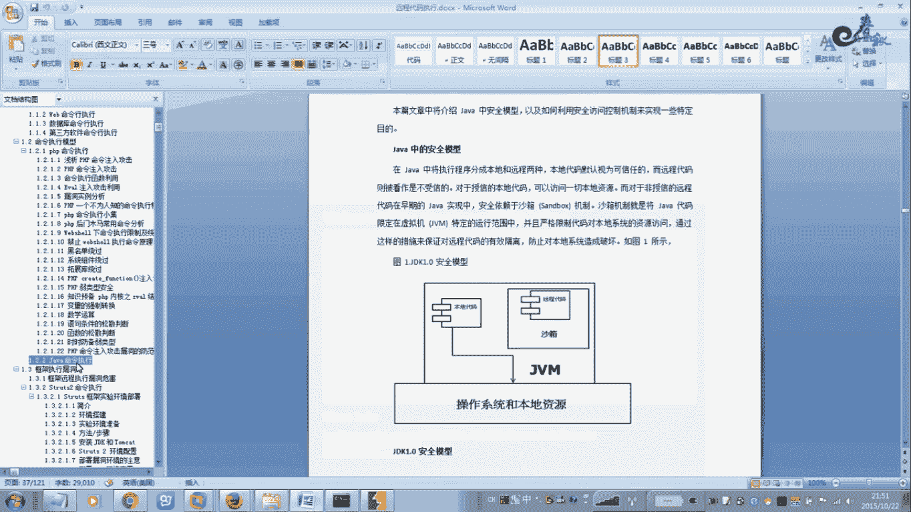

嗯，14年这个出现一个被这个远程解析内容啊，这个内容影响比较大。这个内洞我前段时间在这个服务器里在渗度测试过程中遇见一个啊，也承认过。但是呢嗯因为这个通知对方修复了这个内容啊。

所以我在这里没有录制教程啊，这个因为涉及到项目上的东西，所以不方便录教程。

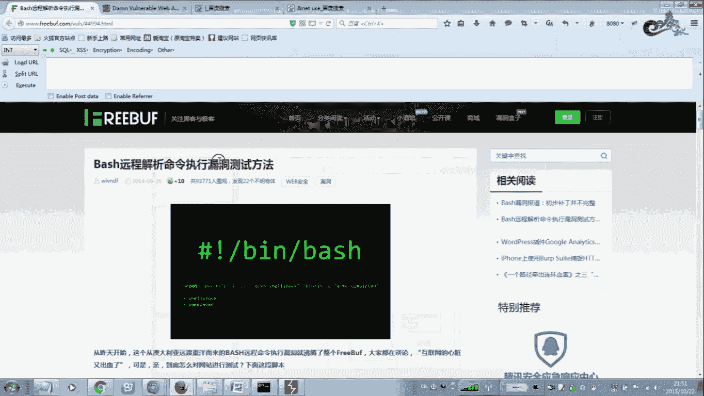

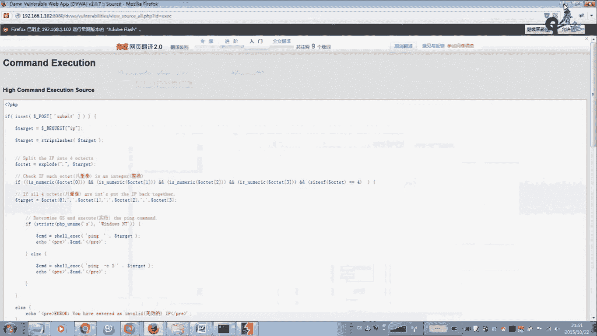

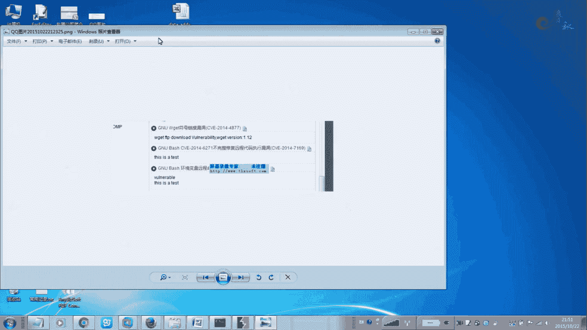

呃，那么我在这里就给大家讲一下，这个是用绿蒙扫描器扫出来的啊，载了一个图啊载了一个图。这个GOM base就不完整的这个修复原生执行命令内网它发生的一个代码啊。

就ECSOZ是一只at test啊返回了一个这样的关系。那说明了对方就是说存在这个被动啊，就是环境变量原程命令执行。所以说命令执行命令执行不一定就是只要细啊，什么PSPR作物啊。

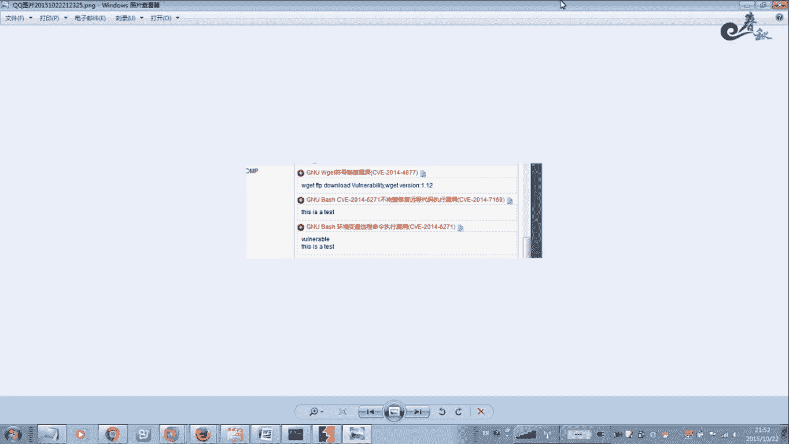

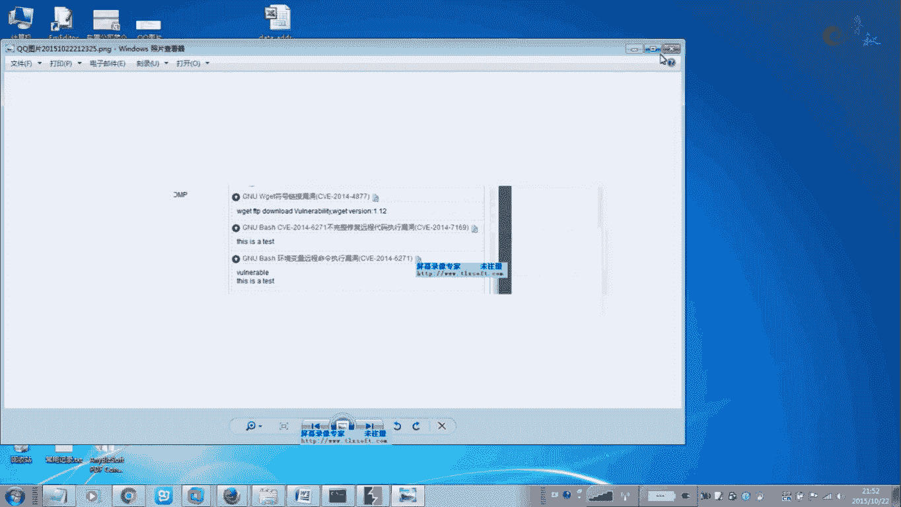

什么中间键啊，这种嗯Gboss啊，还有这个嗯这个。strs to啊。等等很多这些嗯。命令执行一些漏洞。那么它出现的命令执行的时，你像windows啊I也有，还有这些什么inux系统也有。那这个bes。

那就是在另两个是系统里面，因为我们就我们的税啊，税额都是默认的，就是被数吧，背数。那么这种啊就是危险性比较大的。那么后面呢我也经准备了好多接课给大家，这里用了3也3个命令执行123是吧？

打包会打包给大家啊录制教程的那有些在命令执行呢，我就没有录教材啊。呃，环念文档我也写好了，这这时间关系就录制结构就差不多了，不然录制的话，等一下变成。迟来进口了啊，这个库存也太多了。

那把这个呢我就给给大家讲解一下啊，它这个嗯当时影响比较大哈，而且使用方法也很简单。如果你在本机的话，你直接使用这种模式就可以了，就可以测试你当前这个服务器是否存在这种内段啊，用这个贝杠C啊。

那这个如果返回这个啊，这是一则t这个测试页测这这几个。因为字母，那说明这就是存在的，过难的话就不存在。它这个内存相当于其这个心脏地区，跟那个MS008000046的差不多，这个影响也都是很大的。嗯。

你看。它的这个原理是，除了可以将所有变量倒置为环境变量，还可以将所有函数倒置为环境环境变量。那么当前版本的这个。呃，贝ase可以通过函数名为环境变变量名。

以这个符号开头的这个什么就括号开头的这个字符作为这个环境变量，就函数定为环境变量。看这个内洞是什么？不内同是在于这个被数的这个区离这样的这个函数环境变量的时候，并没有以函数结尾就是这个结尾为结束。

而是一直执行结后的这个税额命令。所有的命令。也就是说它简单的来讲的话，就是b啊，他在解析某些字符串的时候，字符串的时候出现了一个逻辑错误，所以才导致了这个啊命令执行啊命令执行。啊。

详细的在网上也解释哈嗯。你看相当于08046啊，微员的08040讲08067就E区那种直接拉控制服务器的。这个当年的这个4508067那个影响相当的意思啊，一个往上扫。扫扫路鸡的时候。

一一个晚上扫六千台，你知道一个好的秒杀的木马啊，当时用08067，他就扫一片片。当时我锤去的时候。反正这个内容也不也也比较那个啊，比较影响大。也一样也一样，可以控制很多。

那么它如果我一般都是是扯出的时候，针的外博站点的话，就是他的服务器用的红帽子啊。啊，并且他这个有个C加R，一件邮，尤其是一件邮件系统啊，应该C加R问号这你什么ID等于多少，这样的一个地址啊。

就是你这访问这样一个地址。那么接着我们就是说它的构造方法啊，构造方法很简单的哈，也需要脚本直嗯嗯就是别人写好的，需要脚本可以直接用的。但是呢我这里交大嗯，我方就是说在实际这个测试过程中。

一般的对方是怎么用的，是这么用的。我们有BRP抓一个包。就是首先我们访问这个地址吧，举个例子啊，访问这个地，例例如这个地址嗯，这个地址有漏洞啊，存在这个被受漏洞，这台服务器啊，这台服务器存在这个漏洞。

那么在使用的过程中就ge这个请求用BRRP加个包，再把这个头啊，你看右手XXX啊，再把这张代码你看。要二用这个这个是W gate是什么？就是inex系统，你要安装的W gate，默认有些这个嗯。啊。

经天版的这些另那个事情啊就是比较小的呀，几巴绕的呀。我们有这系统没样装这个Wg。他这个他这个就直接来下载。啊。你下载什么木马，直接到相应的目录下来。啊。嗯他是这样的。当然还有你看他这里再构造一个大神。

是这样才是那种的。你看他他怎么做？他都W不了g，你看。来执行这个，你想问买一些胶板。他跟跟这个windows直线命的一样把，CSM的改变权限，对不对是吧？你看下载怎么样去下载。

就是说你前面加一个这个闭合一下啊，后面就是直接调用这个我们的命令，就是我们什么命令。就是说你如果想使用Wcase，Wcase，你就是要下载，后面可以接网址都可以。

就是你把木板放到你的网站上面去下载到对方的服务器上面。啊，你先下载这个linkexux什入码，接另那个什么码，想下载什么就下载什么，想改变权限就改变权限，在后面直接接另ex命令就行了。

那么他只只少他执行了这三个，它其实相当于这个你看这个模式。这种模式。会打了给他讲我。就现了这个，你看。嗯，他就是在远城去下了一个木网。嗯，下载一个木码点SS。啊，木马点SS。到这个到哪一个目录。

到这个目录下面。再接着我们把这个木木马给他77系列权限就是最高权限。啊。女执行的。这接就执行这个。执行这个木码就是说你这个这个木马点SS就是呃这个点就是TMP就执行一下。

就是需要脚本执行的时候都是用这种模式，基本上它有几种模式啊。一般这种是比较常见的话，来执行。那么这个脚本里面写的是什么，那么你自己去写写什么，你想写东西，想写什么就写什么。

你的么把下载地址啊或者其他的调用任何东西啊，建一个账号啊，建一个路手账号啊，改一下路手密码，都是可以实现的这个东西。都可以这么做，开一个端口啊，你再写到那个脚板里面啊进下载。到底应该么路。

这就是这个漏段啊，就是这个漏段。大家可以去怎么做。在百度里面在各gle里面这样搜索。你看用这个命令文件类型搜索搜索C加的啊。啊，接GP的这个这个C就是GP是二本二版小二本，原来是这种啊，除其他国家的啊。

这是接语言，这个是因幼而来的，就是C样跟并结尾的啊，这样手一大收一大片这些。呃。有这个类动的啊有这个类动的。那么这样的话可以批量提交类似的这个get请求。啊，怎么去请求你自己去测试啊。

有很多这个啊一般的对话也告诉你了，500个URL里面有6到8个这个倍数对的。那首先你要准备一个好的木码，这个呃这个这个脚本木码，大条的木码。那么在这里我就不再演是了，对呀你自己去搜索啊。

涉机到这个互联网上的些。放你度。嗯，你对着这个文综很简单。对那这个都告诉你了，怎么使用方法啊。你爸我怎样去下载网吧，对不对？行，那么我们这节课就给大家嗯讲解到这里。

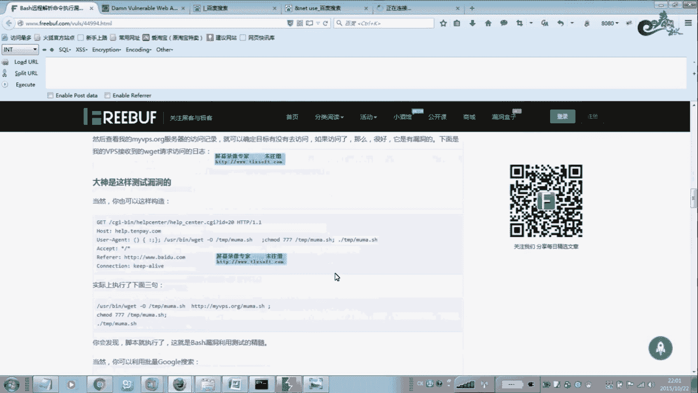

嗯，后面这些大家自己看一下教程吧。嗯，呃最后给大家讲解一下这个吧。修复类的啊。嗯，这个我们。给大家讲就过了，就是严格检查这个参数，特别是这些符号。啊。

这个在代码中在这个代码中去去取这个sstem这样的一些命令函数啊，或者禁止外部传入参数，传入该类执行这个函数中。嗯，还有限制指令的一些范围啊，就以以及文件路径参数啊严格限制。

不允许用户呃控制命来执行相关的参数。还有与SK的建议一样啊，进行相应的操作啊，过滤一些什么。修落在什么时候对排框架来进行严格检查。呃，这些方法大家自己看一下啊，呃大家尤其在我们嗯。做三代测试的时候啊。

就是说后面要写修复键一样。报和程序员。嗯，遇见这些大妈之前内种的时。嗯，我这些方法。小妇子哥给你出现方法，大哒。嗯，那过去直接使用就是了。用电视的都包含了很多方法。

只要你自己选择适合你的方法来进行修复这些命令执行路等。好，大家有什么到时有什么不懂的问题，我们在到时马上课一起讨论。

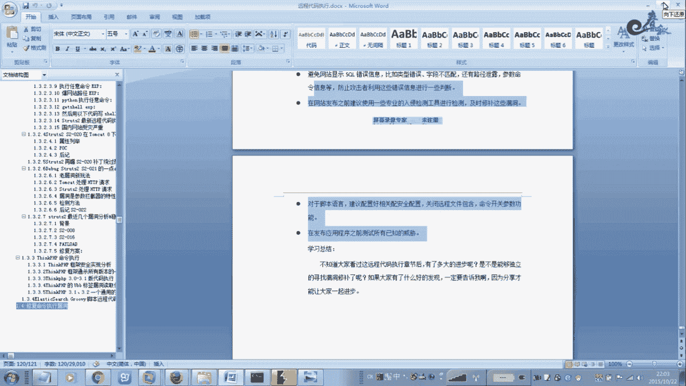

