# 经典15年i春秋渗透测试系统化教程 - P43：课时1 OpenSSL HeartBleed漏洞 💔

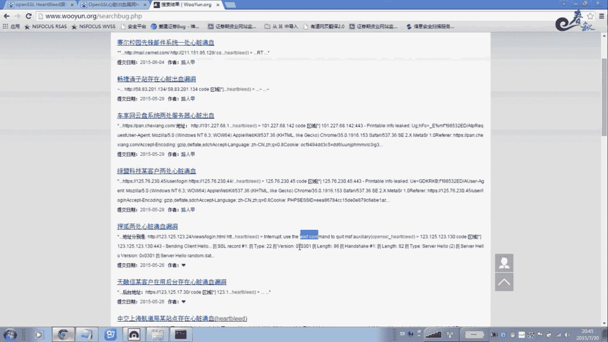

在本节课中，我们将要学习OpenSSL HeartBleed（心脏滴血）漏洞的原理、危害以及基本的利用方法。这是一个影响广泛的历史性高危漏洞，能够导致服务器内存中的敏感信息泄露。

## 漏洞概述与背景

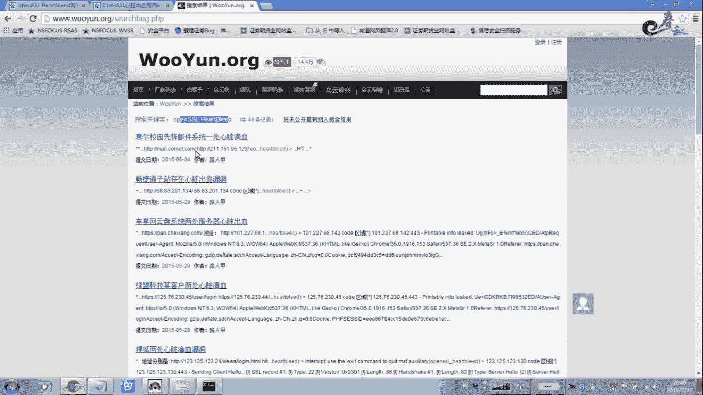

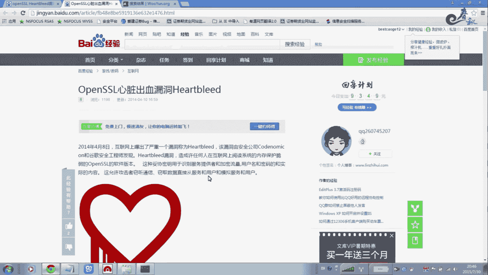

OpenSSL HeartBleed漏洞存在于OpenSSL 1.0.1到1.0.1f版本以及1.0.2-beta1版本中。该漏洞于2014年公开，在当时影响了互联网上大量采用HTTPS加密传输的网站和服务。


上一节我们介绍了漏洞的基本概念，本节中我们来看看它的具体影响范围。


以下是当时受影响的知名网站示例：
*   搜狐
*   天涯社区
*   韩国的Naver
*   赶集网


该漏洞一般存在于大型网站的后台，特别是那些需要采用HTTPS（即OpenSSL）进行加密传输的场景，例如邮箱、网银登录窗口等。只有目标服务器采用了存在漏洞的OpenSSL版本，攻击者才能利用此漏洞进行攻击。

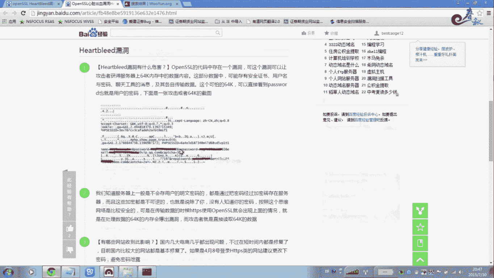

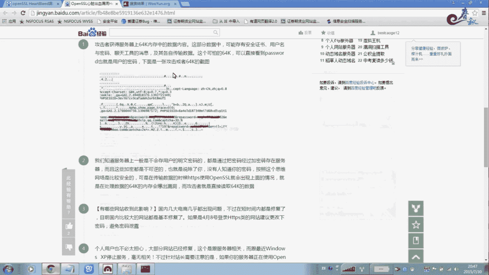

## 漏洞原理与危害

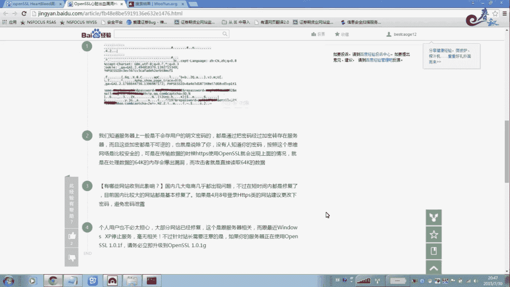


该漏洞的根源在于OpenSSL处理TLS/DTLS心跳扩展协议时的边界检查错误。攻击者可以发送恶意构造的心跳请求，诱骗服务器返回超出其分配内存范围的数据。

其核心危害在于，攻击者可以直接读取服务器内存中最多64KB的随机数据。这些数据可能包含非常敏感的信息。

以下是该漏洞可能泄露的关键信息：
*   用户的登录用户名和密码
*   Session ID（会话标识）或Cookie
*   私钥等加密材料

通过获取这些信息，攻击者可以劫持用户会话，直接登录用户账户，甚至解密过往的通信内容。


## 漏洞利用演示

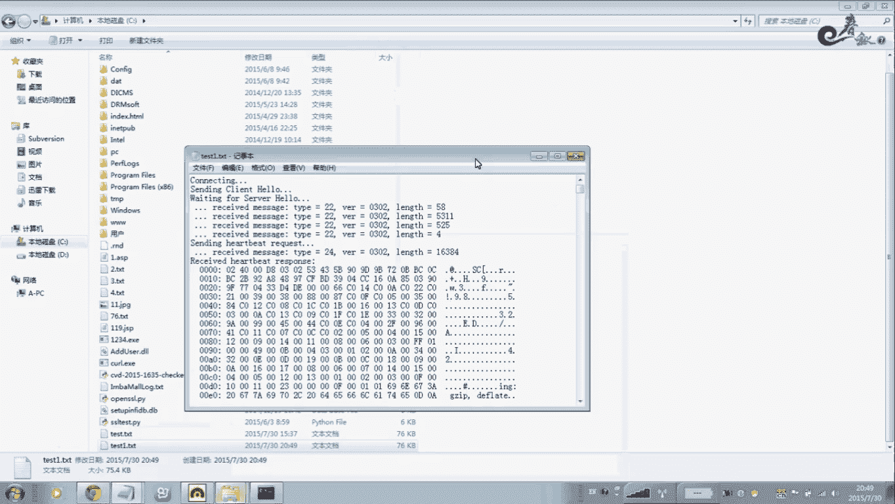

下面我们来看看如何实际操作来验证和利用这个漏洞。首先，需要从网络上下载一个名为 `openssl-heartbleed` 的Python利用脚本。

该脚本的基本使用方法是通过命令行执行。其核心命令格式如下：

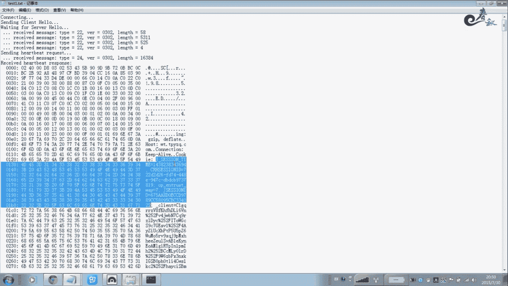

```bash
python openssl-heartbleed.py 目标域名 -p 端口号
```

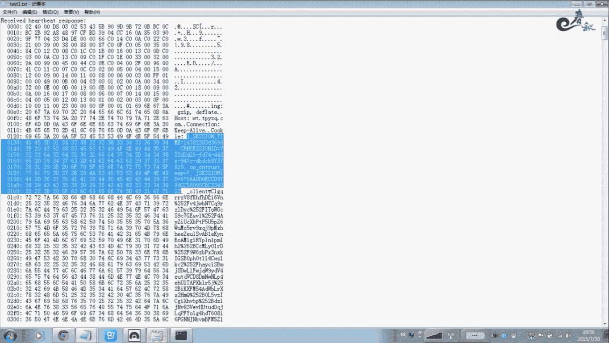


参数解释：
*   `-p` 参数指定端口号，HTTPS服务的默认端口是443。
*   执行后，脚本会尝试从目标服务器读取内存数据。


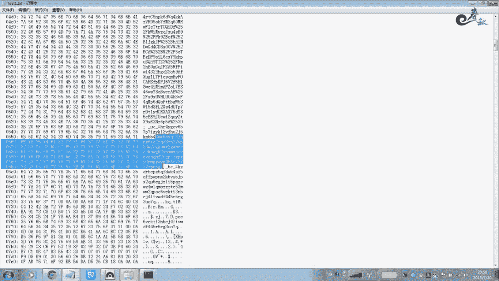

例如，针对一个假设的目标，命令可能如下所示：
```bash
python openssl-heartbleed.py vuln.example.com -p 443 > output.txt
```
这条命令会将读取到的64KB内存数据输出并保存到本地的 `output.txt` 文件中。


执行攻击后，我们打开输出的文件进行分析。在输出内容中，我们需要寻找敏感信息。

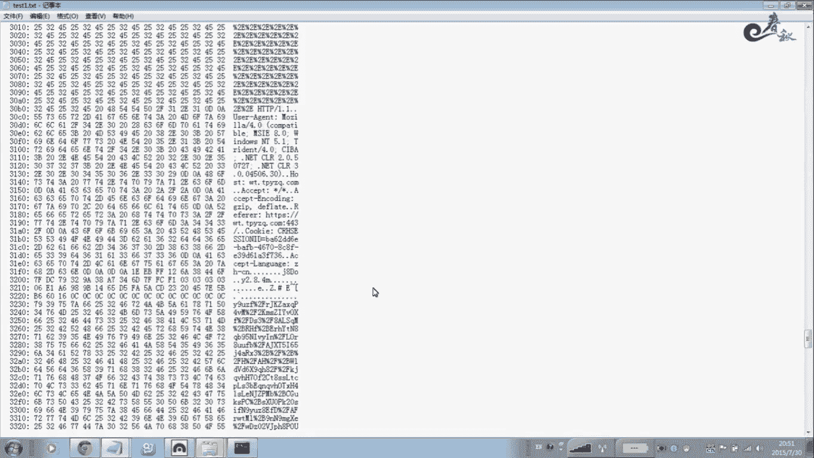

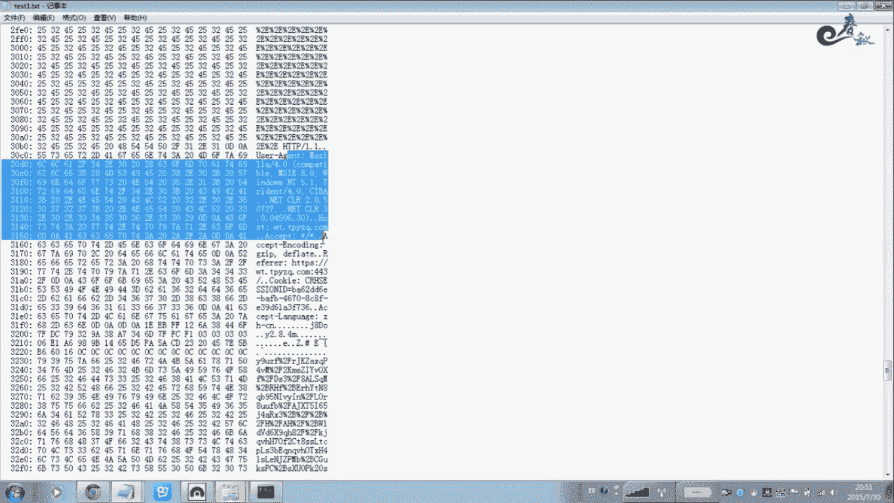

以下是可能在输出文件中找到的信息类型：
*   `Cookie:` 或 `sessionid=` 等会话标识。
*   `username=` 或 `password=` 等明文凭证（如果恰逢有用户登录）。
*   其他服务器内存中的临时数据。

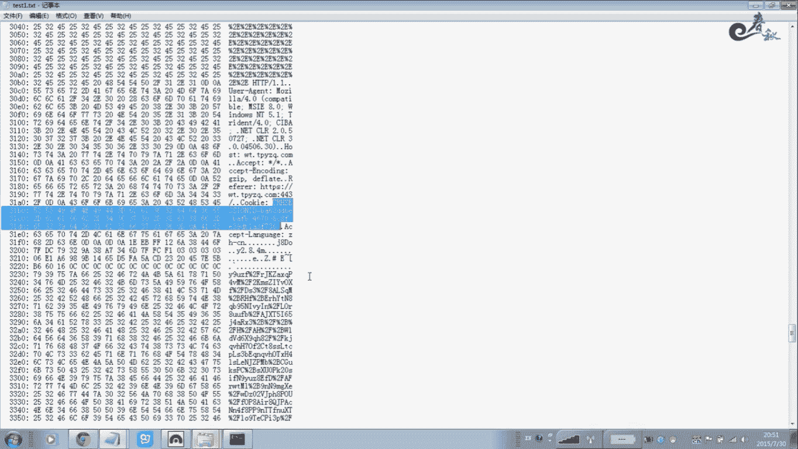

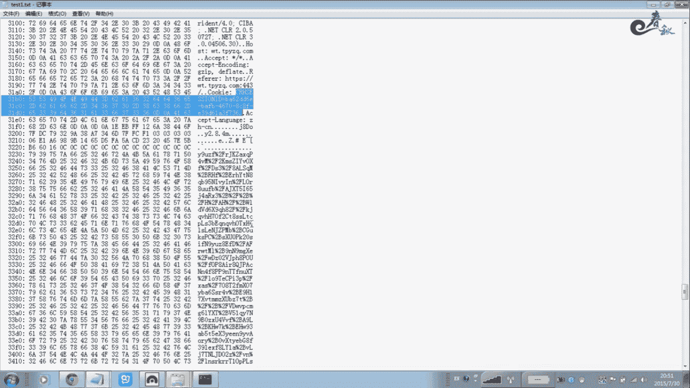

如果成功获取到有效的Session Cookie，攻击者可以将其填入浏览器，直接劫持该用户的会话，无需密码即可登录。关于如何利用Cookie进行会话劫持，在跨站脚本（XSS）相关课程中已有详细讲解。


## 总结与修复建议


本节课中我们一起学习了OpenSSL HeartBleed漏洞。我们了解了它是一个由于心跳扩展协议处理不当导致的内存信息泄露漏洞，危害极大，可以直接泄露用户密码、会话密钥等核心数据。

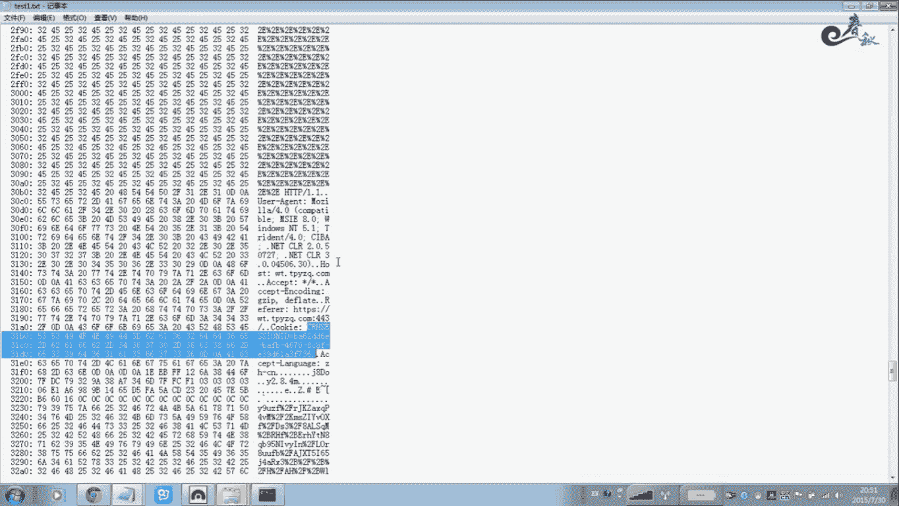

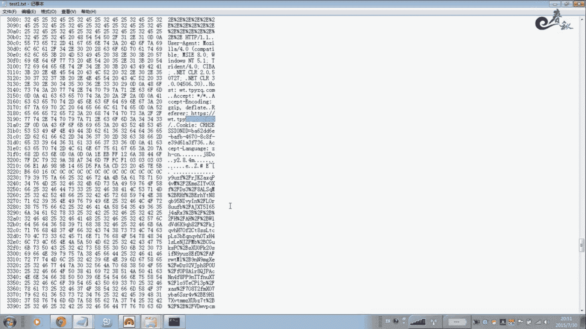

作为防御方，修复此漏洞的方法非常简单直接：**立即将OpenSSL升级到修复版本（1.0.1g及以上或1.0.2-beta2及以上）**。同时，在漏洞修复后，管理员应吊销并重新签发服务器的SSL证书，因为私钥可能已在内存泄露中被攻击者获取。


对于安全研究人员和学习者而言，该漏洞是一个理解内存安全、协议安全及漏洞利用基础的经典案例。请注意，此漏洞利用仅用于合法的安全测试与学习，在未获得明确授权的情况下，切勿对任何系统进行测试。