# 经典15年i春秋渗透测试系统化教程 - P50：课时8 编辑器漏洞讲解（上） 🔓

在本节课中，我们将要学习网站编辑器中常见的安全漏洞。编辑器是网站用于内容编辑和文件上传的重要组件，其安全配置不当往往成为攻击者入侵的突破口。我们将重点分析几种流行编辑器（如eWebEditor、FCKeditor）的典型漏洞，包括默认凭据、数据库泄露、目录遍历、会话欺骗、文件上传绕过等，并通过实例演示其利用方法。

## 编辑器概述与常见类型

上一节我们介绍了课程的整体内容，本节中我们来看看什么是网站编辑器及其常见类型。

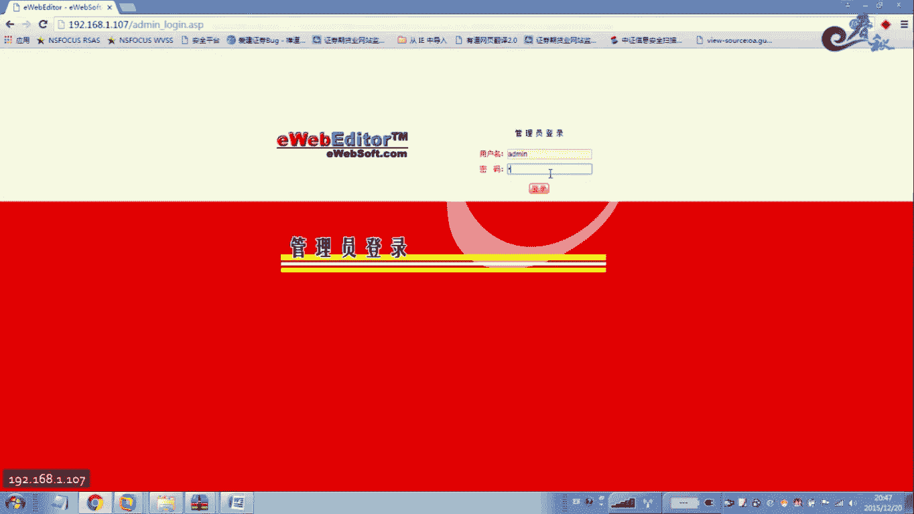

网站编辑器通常嵌入在网站的前台或后台，用于进行内容编辑和文件上传。其脚本语言通常与网站的开发语言保持一致，例如ASP网站使用ASP编辑器，PHP网站使用PHP编辑器。

以下是目前最常见的三种Web编辑器：
*   eWebEditor
*   FCKeditor
*   KindEditor

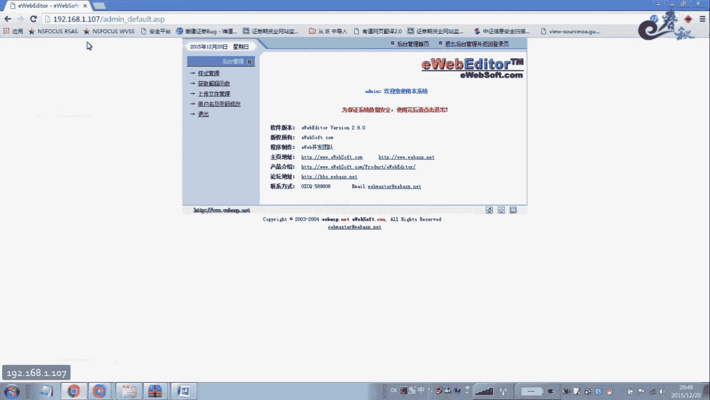

其中，eWebEditor和FCKeditor是使用最为广泛的两种。

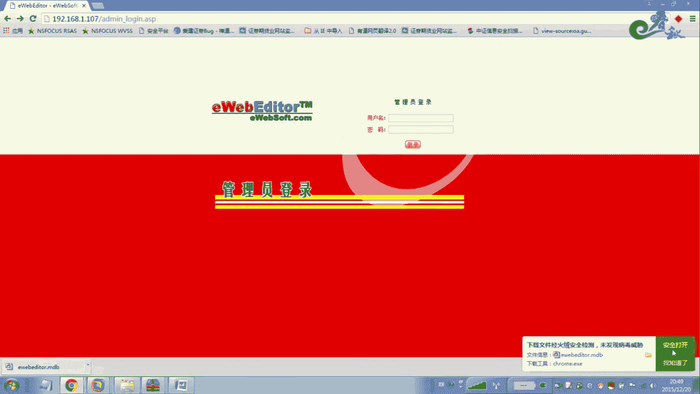

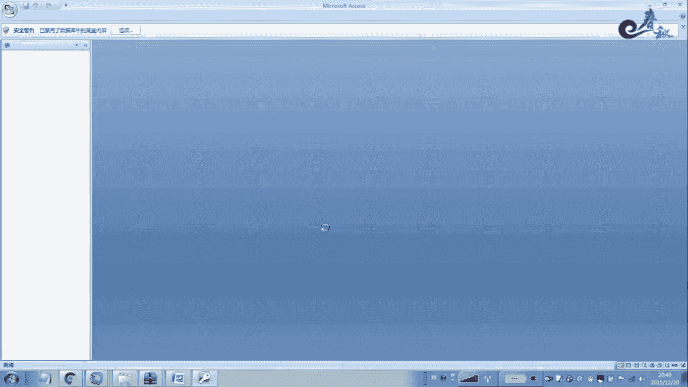

## eWebEditor编辑器漏洞分析

了解了编辑器的基本概念后，本节我们将深入分析eWebEditor编辑器的具体安全漏洞。

### 默认管理员账号密码

许多管理员在部署编辑器后，并未修改默认的账号密码，这构成了严重的安全风险。

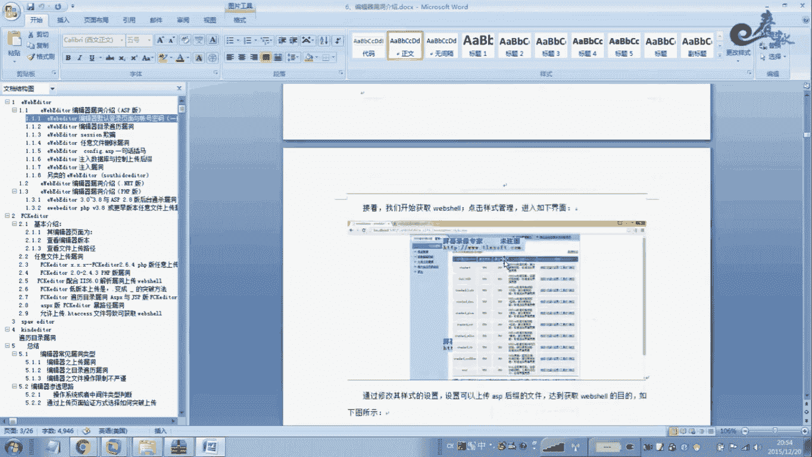

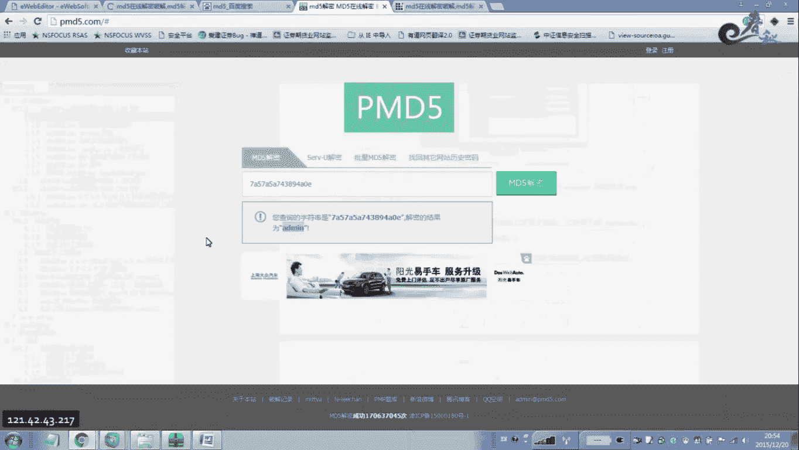

eWebEditor编辑器存在默认的管理员账号和密码。默认账号通常是`admin`，而默认密码则因版本不同而有所差异，例如`admin888`、`admin`等。攻击者可以通过搜索特定版本的默认密码来尝试登录后台。

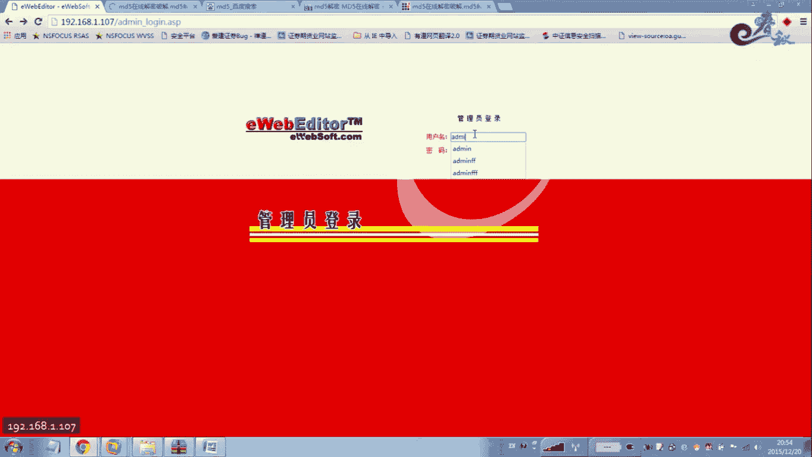

### 默认数据库路径与下载

除了默认凭据，另一个常见问题是数据库文件的默认存放路径可被直接访问下载。

eWebEditor的数据库文件默认通常存放在`/db/`或`/ewebeditor/db/`目录下，文件名常为`ewebeditor.mdb`或`ewebeditor.asp`。如果管理员未重命名该文件或进行访问限制，攻击者可以直接通过URL下载该数据库文件。

下载后，可以使用Access等工具打开`.mdb`文件，或在`.asp`文件中查找数据库连接字符串。管理员密码通常以MD5形式存储，可以通过在线MD5解密网站或暴力破解工具进行破解。

### 文件上传过滤绕过

编辑器核心功能之一是文件上传，但其过滤机制往往存在可被绕过的缺陷。

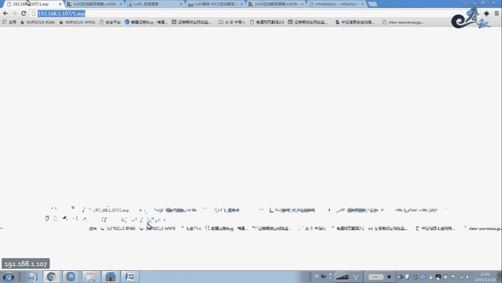

eWebEditor在上传文件时会对扩展名进行过滤，禁止上传如`.asp`、`.php`等脚本文件。但存在多种绕过方法：

1.  **修改允许列表**：在后台的“样式管理”中，可以直接添加允许上传的扩展名（如`.asp`）。
2.  **双重扩展名绕过**：当编辑器仅过滤第一个遇到的危险扩展名时，可以使用类似`shell.asp.jpg`的文件名。过滤掉`.asp`后，剩余部分`.jpg`可能被允许，而某些服务器（如IIS 6.0）仍会将其中的`.asp`部分解析为脚本。
3.  **利用解析漏洞**：利用IIS 6.0的目录解析漏洞（`/xx.asp/`目录下的所有文件都会被当作ASP解析）或文件解析漏洞（`xx.asp;.jpg`会被解析为ASP）。

### 目录遍历漏洞

某些旧版本的eWebEditor存在目录遍历漏洞，允许攻击者访问服务器上的任意目录。

例如，在eWebEditor 2.8版本中，在文件浏览的URL参数后添加`.../`或`..../`等路径穿越符，可以向上跳转目录，从而列出并操作（查看、下载、删除）网站根目录甚至其他盘符下的文件。

### 会话欺骗漏洞

会话欺骗漏洞允许攻击者在不持有正确密码的情况下，通过伪造会话身份进入后台。

其原理是后台验证逻辑存在缺陷，例如仅检查会话（Session）中的用户名是否为`admin`，而不验证密码或会话是否有效。攻击者可以构造一个特殊的请求页面，将自己的会话用户名设置为`admin`，从而直接登录后台。

### 任意文件删除漏洞

eWebEditor 2.8等版本存在任意文件删除漏洞。

攻击者可以通过构造特定的请求，调用编辑器中的文件保存或删除功能，并利用路径穿越等手段，删除服务器上的任意文件。此漏洞常与目录遍历漏洞配合使用，先定位目标文件，再实施删除。

### 一句话木马插入漏洞

在eWebEditor 5.2等版本中，存在一个将一句话木马写入配置文件的高危漏洞。

该版本的管理员账号密码明文存储在`config.asp`文件中。当在后台修改密码时，如果新密码未经过滤，攻击者可以将密码设置为一句话木马代码。保存后，该代码便被写入`config.asp`文件。攻击者随后即可使用中国菜刀等工具连接该配置文件，密码即为设置的一句话木马连接密码。

### SQL注入漏洞

与许多Web应用一样，eWebEditor也存在SQL注入漏洞。

通过SQL注入，攻击者可以获取数据库中的管理员账号密码，进而登录后台。或者，在某些注入点可以直接获取Web绝对路径，为后续的文件上传漏洞利用提供必要条件。发现此类漏洞可使用安恒、御剑等国内扫描器进行探测。

### 任意文件上传漏洞（通杀版本）

这是eWebEditor一个影响非常广泛的严重漏洞，在3.8及以下多个版本中均存在。

该漏洞存在于`upload.asp`文件中，无需登录即可直接调用。攻击者可以构造一个本地HTML表单页面，通过该页面直接向目标站点的`upload.asp`提交文件。虽然编辑器会过滤`.asp`等扩展名，但允许上传`.cer`、`.asa`等扩展名，而这些文件在IIS服务器上同样会被解析为脚本文件。

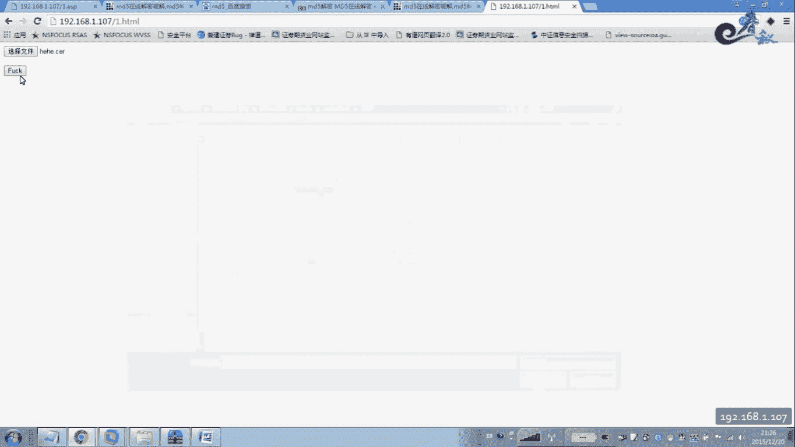

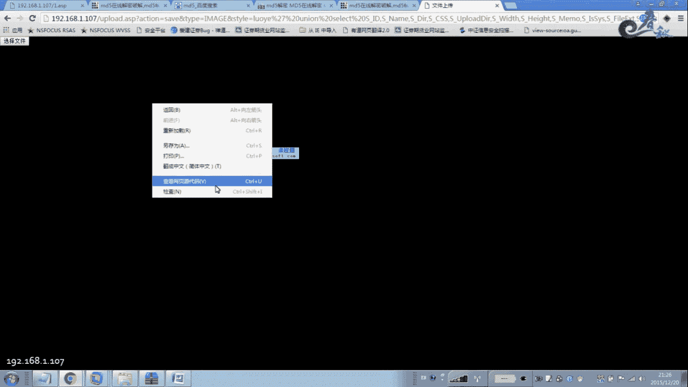

利用步骤如下：
1.  创建本地HTML文件，表单`action`指向目标站的`/ewebeditor/upload.asp?action=save&type=image`。
2.  在表单中选择一个扩展名为`.cer`的一句话木马文件进行上传。
3.  上传成功后，查看页面源代码，其中包含文件保存的路径信息（通常为`/uploadfile/`目录下）。
4.  使用中国菜刀连接上传的`.cer`木马文件，获取服务器权限。

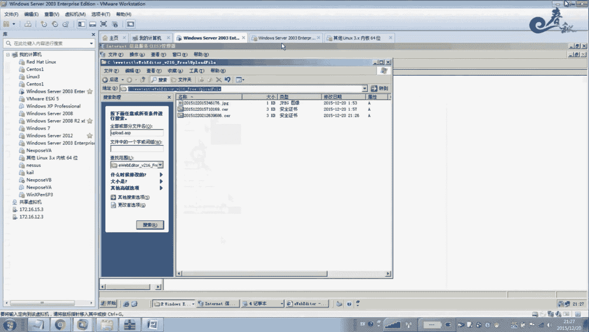

## 总结

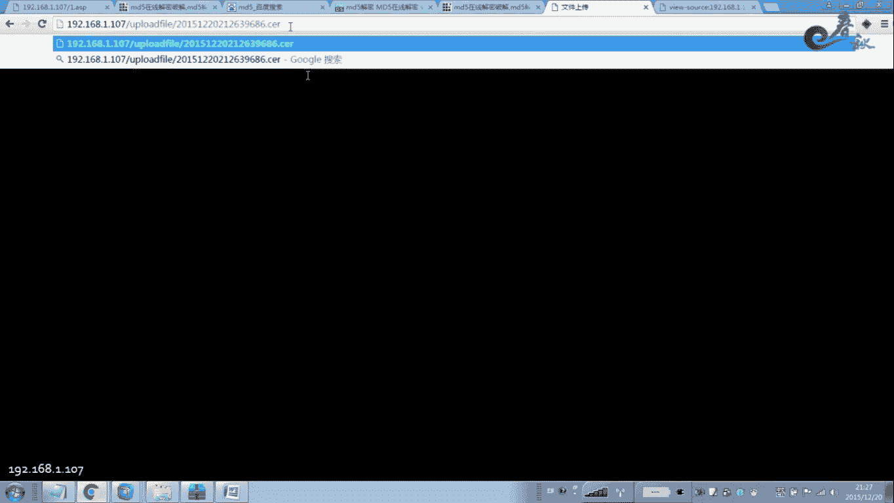

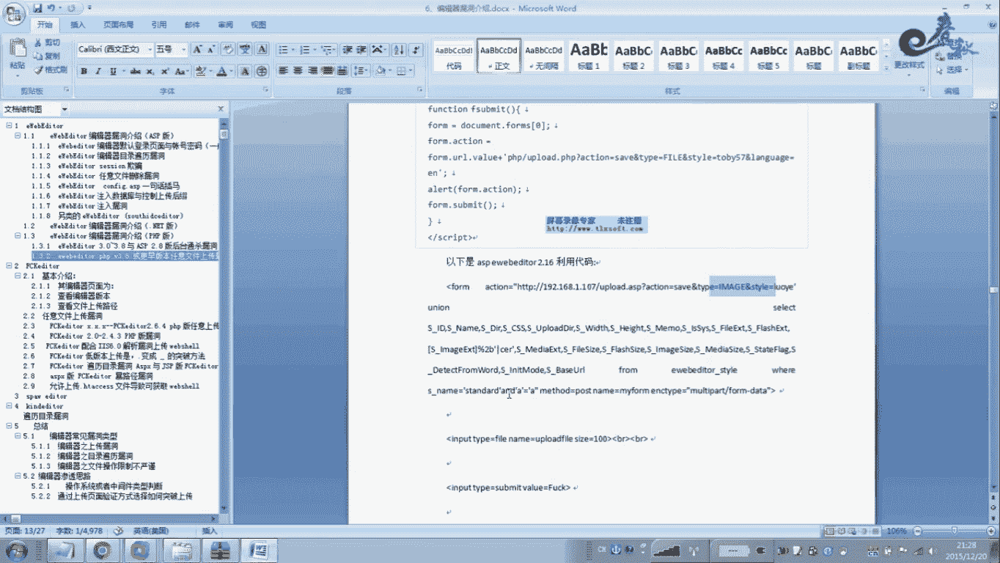

本节课中我们一起学习了网站编辑器，特别是eWebEditor的多种安全漏洞。我们从默认配置泄露（账号、数据库）入手，探讨了权限绕过（会话欺骗）、安全功能绕过（文件上传过滤）、到直接的高危漏洞（目录遍历、任意文件删除/上传、SQL注入、配置写入）等。理解这些漏洞的原理和利用方式，对于渗透测试中的信息收集和漏洞利用至关重要。大家课后应搭建环境，对提到的每个漏洞进行复现练习，以加深理解。下一节课，我们将继续讲解其他编辑器的漏洞。