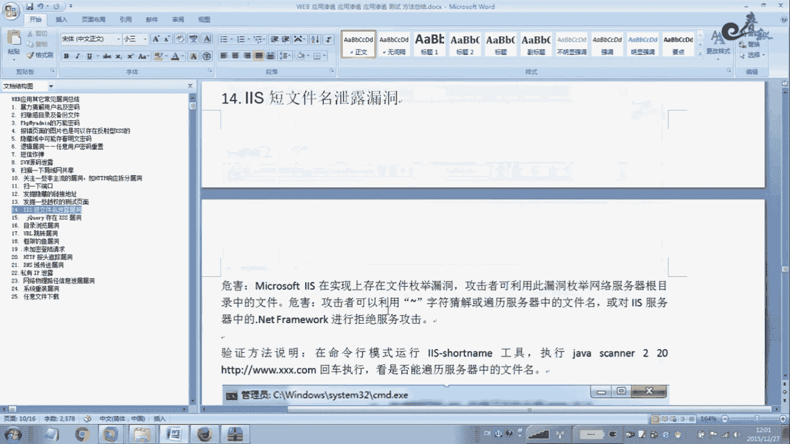

# 经典15年i春秋渗透测试系统化教程 - P53：课时1 Web应用其它常见漏洞总结（上） 🔍

在本节课中，我们将要学习Web渗透测试中，当无法获得测试账号密码、仅面对登录页面时，如何寻找突破口。我们将总结一系列在实际渗透测试报告中常见且有效的方法，帮助初学者理解并发现潜在的安全风险。

## 概述 📋

在渗透测试过程中，测试人员经常面临无法获得有效测试账号密码的困境，此时仅有一个登录页面可供操作。尽管如此，仍然存在多种方法可以寻找漏洞。本节课程将总结这些方法，内容源自实际渗透测试报告和工作经验，旨在提供实用的指导。

## 1. 暴力破解与默认凭证 🔑

上一节我们介绍了课程背景，本节中我们来看看第一个突破口：尝试使用默认或弱密码进行登录。

在针对企业进行渗透测试时，若未提供管理员账号密码，将难以进行深入的登录后扫描。虽然企业出于安全考虑（如防止扫描指令误删数据）通常不提供凭证，但测试人员仍可尝试一些常见默认账号密码。

以下是常见的默认账号密码组合示例：

*   **通用测试账户**：`admin/admin`、`test/test`、`test/test123`、`test/123456`
*   **中间件后台**：如WebLogic的默认账户。
*   **数据库与服务器**：`root/password`、Tomcat默认账户、`phpMyAdmin`的`root/root`等。

**核心操作**：首先尝试上述默认组合。若无果，则使用密码字典进行暴力破解。在实际测试中，弱口令漏洞非常普遍，尤其在OA、邮件等系统，结合从互联网泄露的社工库获取的用户名（如邮箱），成功率很高。

## 2. 扫描敏感目录与备份文件 📁

成功登录是理想情况，若无法登录，信息收集同样关键。扫描网站的敏感目录和备份文件是发现漏洞的重要途径。

使用工具（如`DirBuster`、`Burp Suite`的Intruder模块）配合字典进行目录暴力破解，常能发现敏感文件，例如备份文件、上传页面、编辑器管理页面等。

以下是两个真实案例：

*   **案例一：发现Struts2漏洞**
    通过目录扫描发现路径 `/example/login.action`。使用Struts2漏洞检测工具（如`K8`）进行测试，确认存在远程命令执行漏洞。
*   **案例二：备份文件泄露导致内网沦陷**
    扫描发现网站根目录存在 `web.rar` 文件，下载解压后得到 `web.config` 配置文件，其中明文存储了MSSQL数据库的`sa`账号密码。进一步发现服务器开放了1433端口并允许远程连接。使用该凭证连接后，通过数据库权限提升至系统权限，开启远程桌面。最终利用管理员密码重用的习惯，横向渗透拿下了内网50多台服务器。

**核心要点**：网站目录下不应存放可直接下载的备份文件（如`.rar`、`.zip`），这可能导致严重的信息泄露。

## 3. 特定系统的万能密码 🗝️

某些特定系统或版本存在“万能密码”漏洞，虽然遇见概率低，但值得尝试。

例如，在某次测试中发现一个`phpMyAdmin`后台，尝试使用万能密码：用户名填`root`，密码填特定字符串（如`xxx‘ or ’1‘=’1`），成功登录。利用此入口进一步渗透了内网。

## 4. 非常规XSS漏洞触发点 🎯

跨站脚本（XSS）漏洞不一定只出现在明显的参数输入点。

在一些非传统场景也可能触发XSS：
*   **错误页面中的资源引用**：例如，一个加载失败的图片标签 ``，在其`src`属性值后构造Payload可能触发XSS。
*   **安全防护软件自身漏洞**：某些WAF（Web应用防火墙）在拦截攻击时，会弹出提示框。攻击者可能通过构造Payload，使提示框的内容变为恶意脚本，从而绕过WAF实现XSS。

其原理在于，WAF的拦截提示本身是一个前端交互，如果其内容可控，就可能被利用。

## 5. 隐藏域与客户端明文密码 🔓

漏洞可能隐藏在页面源码或客户端逻辑中。

*   **响应包中的明文密码**：使用扫描器或代理工具（如Burp Suite）拦截登录请求的响应包，有时会在其中发现明文的管理员账号密码。
*   **前端源码硬编码密码**：查看网页源代码或使用浏览器开发者工具（如Firefox的调试器），可能在JavaScript文件中发现用于本地验证的硬编码账号密码。例如，在JS中找到 `password = "abc123"` 的赋值语句。
*   **配置文件可被直接访问**：如`config.inc`、`web.xml`等配置文件未做访问限制，通过浏览器直接访问即可读取其中的数据库连接密码等敏感信息。

**核心操作**：渗透测试需仔细检查每一个细节，包括所有响应数据和前端代码。

## 6. 逻辑漏洞：任意用户密码重置 💣

逻辑漏洞在大型业务系统中广泛存在，危害巨大。

*   **短信验证码可暴力破解**：在密码重置页面，输入手机号获取短信验证码。若验证码位数过短（如4位数字）、无尝试次数限制、无有效时间限制，则攻击者可通过Burp Suite拦截请求，并快速暴力破解出正确验证码，从而重置任意用户密码。
*   **短信轰炸漏洞**：在用户注册或密码找回等发送短信的环节，拦截发送验证码的请求数据包，通过工具（如Burp Intruder）进行批量重放，即可向目标手机号短时间内发送大量短信，构成拒绝服务攻击。

**修复建议**：短信验证码应使用6位以上、并包含字母；严格限制单位时间内的发送频率和验证尝试次数。

## 7. 源码泄露：SVN与内网共享 🗂️

源代码管理工具配置不当会导致源码泄露。

*   **SVN源码泄露**：扫描器可能发现`.svn/entries`或`.git/config`等目录。访问这些目录可能列出源码文件。使用特定工具或浏览器可直接浏览、下载源代码，从中寻找数据库配置等敏感信息。
*   **内网共享文件扫描**：在取得内网一台服务器的权限后，可以使用局域网共享扫描工具，发现内网其他机器开放的共享文件夹。访问这些共享目录，可能找到配置文件、文档等敏感信息，用于进一步渗透。

## 8. HTTP响应头信息泄露 📄

HTTP响应头有时会泄露敏感信息。

虽然示例图中未能清晰展示，但在实际测试中，检查服务器的HTTP响应头是必要步骤。可能泄露的信息包括：
*   内部IP地址
*   服务器详细版本信息（如`Apache/2.4.1 (Unix)`）
*   框架或中间件的特定标识
这些信息可为攻击者提供攻击思路和利用线索。

## 9. 端口扫描与服务发现 🔍

不要只局限于Web应用本身，服务器开放的其他端口可能隐藏着突破口。

在获得目标域名或IP后，应使用`Nmap`等工具进行全端口扫描。有时会发现服务器除了80端口的Web服务，还开放了8080、9090、21（FTP）、3306（MySQL）等其他端口。这些端口可能对应着测试环境、管理后台、旧版本应用或配置不当的服务，其安全性可能弱于主站，成为攻击的入口。

## 10. 任意文件读取漏洞 📖

这是一个高危漏洞，允许攻击者读取服务器上的任意文件。

在某些功能点（如文件下载、帮助文档查看），参数可能被构造用于读取系统文件。例如：
`/download.jsp?file=../../../../etc/passwd`
通过使用`../`进行目录遍历，可以读取到`/etc/passwd`、`/etc/shadow`（Linux）或`C:\boot.ini`（Windows）等系统关键文件，甚至网站源码配置文件（如`config.php`），从而获取敏感信息。

## 11. 越权访问测试页面 🚧

业务逻辑缺陷，允许用户绕过正常流程访问未授权页面。

例如，一个“修改密码”流程分为两步：1. 验证身份；2. 输入新密码。如果攻击者直接通过浏览器访问第二步的URL（`/changePasswordStep2.jsp`）就能进入改密页面，而无需经过第一步身份验证，这就构成了越权访问漏洞。在交易、金融类网站中需重点测试此类逻辑。

---

本节课中我们一起学习了Web渗透测试中十余种常见的其他漏洞类型及利用方法，包括暴力破解、信息泄露、逻辑漏洞、配置错误等。这些漏洞通常不需要复杂的攻击技术，但需要测试人员具备细致的观察力和对业务流程的深入理解。在接下来的课程中，我们将继续总结其他类型的常见漏洞。