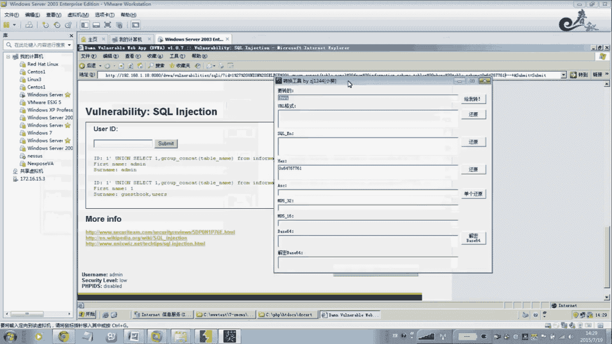
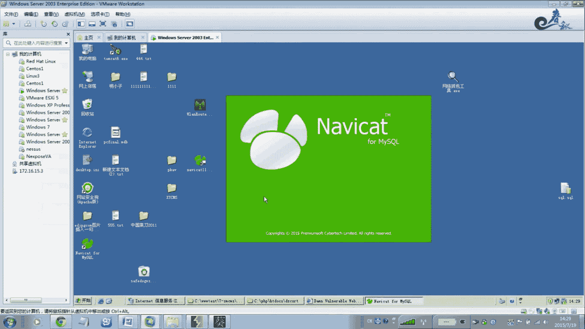
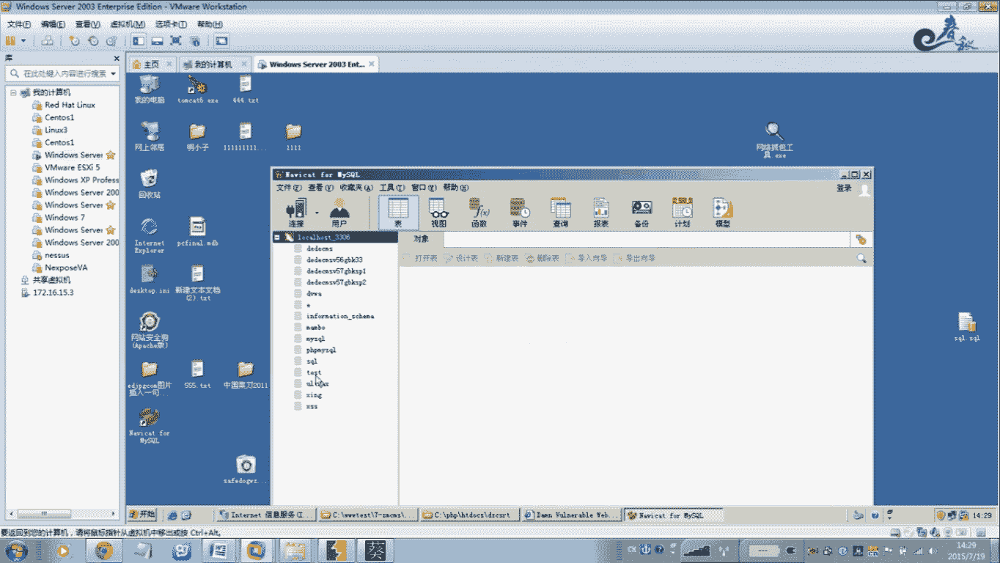
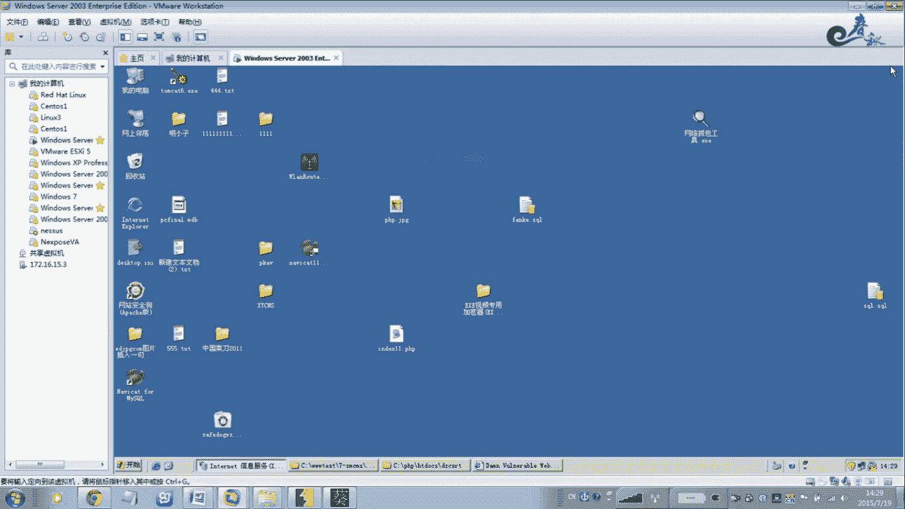
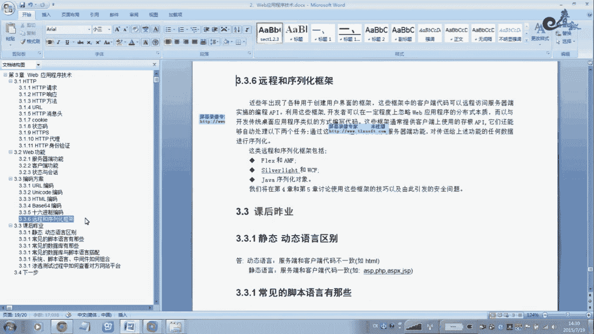
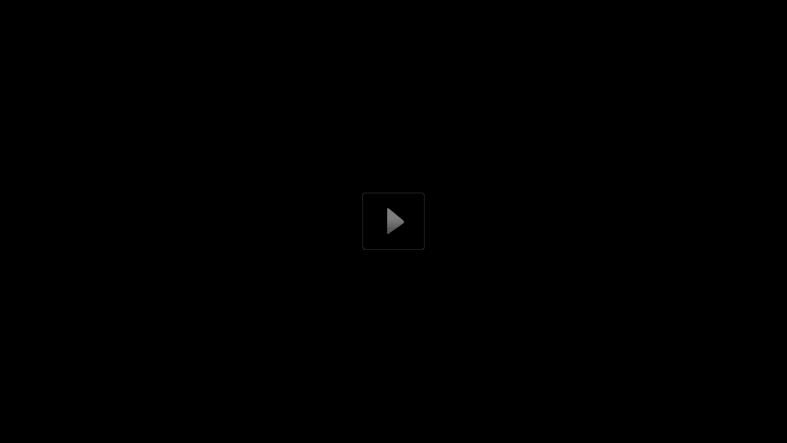

# 经典15年i春秋渗透测试系统化教程 - P5：课时5  URL编码讲解 - 老网恋教父了 - BV1n54y1B7F7

我们讲解一下这个UR的编码。把这个编编码这个方案给大家。缓解一下，就是这个。接下就于是讲介一下BORP的这个。呃一个编码解密吧，叫这个姑娘吧，一个小姑娘吧。

这个功能呃所以说为什么看才神器这个BUIP里面什么功能都有。单独陈述订单上必备的一个工具。那么这个。天马。以前是都是采用地域文本形式的。在在宝鸡的时候。呃，现在是有过程种变化。

什么URI的unic codeHPML啊贝斯64啊，16金字等等等等很多很多啊，所以说。听听天我好。那么在这里它的编码的主要是作用，它是。本来是设计这个编码的作用，它是做什么呀？他主要是确保这个。

能够安全确理一些不常见的这个字符和案件的数据，它的作用是能做这个。是的现在演面产的AK根技。一个方法就是说在一些例度素描上采用编码。你编嘛一下。大多员你先不认识了，就相当于化妆了一下。那含义是一样的。

对不对？你不往死一变了。啊，就防过墙wouff啊有的时候干了一下也过去了呃，他也也就不认识了，这wo就不认识了，对不对？你看猪路也采用了编码，所以说要编码它的作用嗯，还就。很多啊很多。

那么现在我们来看一下，首先呢这个UR给。那么看在你到36岁试过程中，你要记住这些编码最常见的就是说。你看见这个等于号就知道这3D，3D是你定要知道它是由2L变的。啊URA这边。那么不相信我们来看一下。

啊，你看3D。Oh。3D哈URA了。嗯。看一下对不对。这这个等于好吧，对不对？那你也可以把等于这些他这个是互换的，加密解率都是可以你就等于号。别看UIL那跟DUIL这不是一样的。啊什么晚上号。😊。

25%20%代表空格。这个你自己看一下。今天客的变。嗯，防斜杠它是这种模式。这个这个符就这个对不是这个这个所以说你要看到这里，看到这个东西啥意思啊，就知道它是优先克的编码。对，用un的编码可以在线可以。

编码有很多呃在线的。加的见。这是TMS编码在这款工据里面有。就ATMI的。跟哪里了我们这个单一号。那个大一条是吧，你们记录一下。翻译好，我们要采用GTMA了。变埋日。那就是这个模式。啊。

这个地方好像有点问题啊。嗯，看一下。好像还有一点小小的区别。有没定一的？我们这个地方应该写错了。这地方也该有点问题。我们看这个单银行是不。Yeah。那你们干线去好吧。Yeah。跟日要啊。Yeah。

这道怎么打不开啊？你为干在干干到那，你们自己去看一下。嗯，那你这我在这打，嗯，这里有。U2L编码STMLU2L编码。在那里都有硬的，你自己可以看一下。这这个。这个天美的URA的变了。举个例子。

我们找一个大于号。还有这个。听到吗？诶点四三四。那跟我这个。哦，我这个应该是是那个。这是TML里面的配数字。这个是HTMI，就是这个语言里面。先写HTMS这个代码的时候，这个玩意应该是这个玩。

我们不用管太多吧。嗯，但你了解一下，他他是做这个用的。你快线查一下吧，那个贝是644编码。还有16进级的变化。那么最关键我用的多的啊，还是这些，就是说你在这个地方来进行，有URA的这是TMI的。

倍是6轴4，你觉道这是定轴4是吧？如果是单引号还是什么样的形式？我们在这里。呃，内种的。对，那里有有几种电码，你不进行测试测试。这个没什么太多的这个讨论啊，就是说你熟练吧，嗯。

你一般的URA的变码用的比较多，有点子吧哈，光然还有一款工具。嗯，对了，小葵都分来比比较麻。呃，在这里我给你演示一个实例。这16我就要给你。你要知下这个编码在这个实际过程中的用途。

你可以可发现我这条语句的SK的注入语句这条语。在之录的时候，你会发现在这里它会变成了你看27%啊，20%啊。那么就是我们刚才所学到的。共2A的边码。就这个看到没有？不玩人A了。下你看一下27%。

占20%。嗯，你看一下啊。27%、20%。Okay。听到没？它是一个单引号，加一个空格。这有个空格在这里。而且有一个空格。0是空格的意思。就说你一般的。嗯，这个是安一他的意思。所以说他这个。

在我们这个实际后边登录过程中，经常会遇通过这个过 off的时候，经常会遇到。这个各种变码，还有对己你看这种。这种联码是干嘛用的？这个下一节课我们马上会讲解的。你不用这个编码还真不行。他的酷。

他只接受这种代码。查询过程中。我说了。三个房园。有东西还没还不来。能看没有？AVW就是我们这个数据库里面的。数据库就是我们因为WA数据库，就相当于这个数据库。

A vW乐裤。被个库敏。

所以说如果你在这个地方，你可以看一下啊。我得的。忘出这两个吧。我我我不用编了，你说他能接受吗？绝对是不行的。就他询应该报错了。不行，发不出来。没有必要变了。我编码但。所以我这节课让你。那你们对了解这个。

变了。就是说这个战独测试不对。在投入面投脑里面一定要有一个框架，这个编码的这个框架。啊，当然在散出这的过程中，你会遇到各种变码。嗯要可能就知道用什么工具进行。编码对对我们开始字符进行编码啊。

那么要就还原编码解码。嗯，们这里面一定要非常熟悉。

