# 经典15年i春秋渗透测试系统化教程 - P7：课时7 渗透测试常见数据库、脚本语言、中间件讲解 🗂️

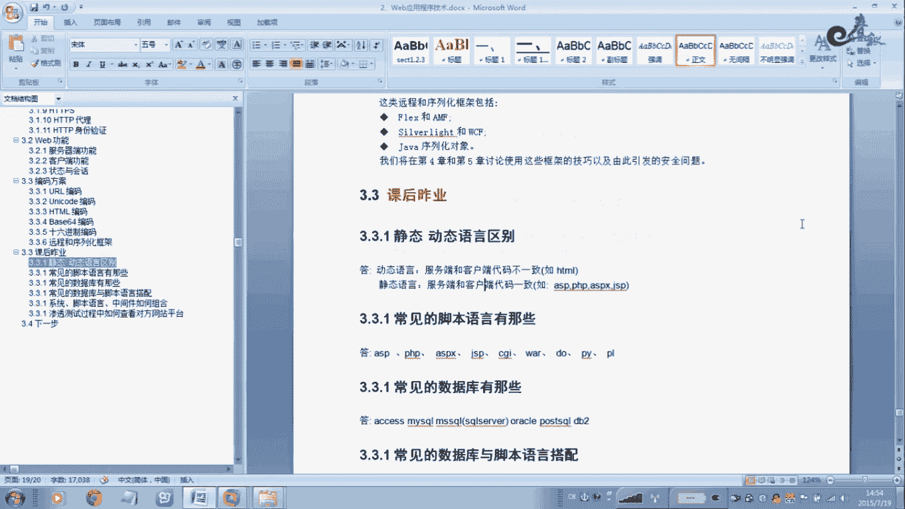

在本节课中，我们将要学习渗透测试中必须掌握的基础知识：静态与动态语言的区别、常见的脚本语言与数据库，以及它们与中间件、操作系统的搭配关系。理解这些是后续进行漏洞挖掘（如SQL注入）的前提。

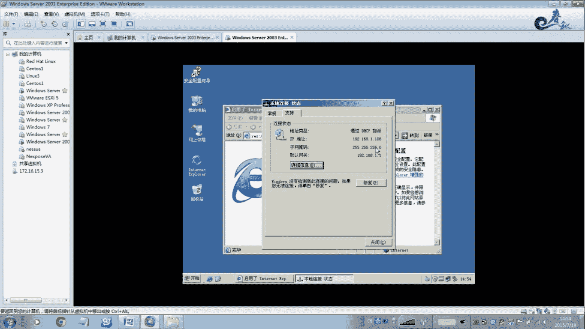

## 静态语言与动态语言的区别 🔄

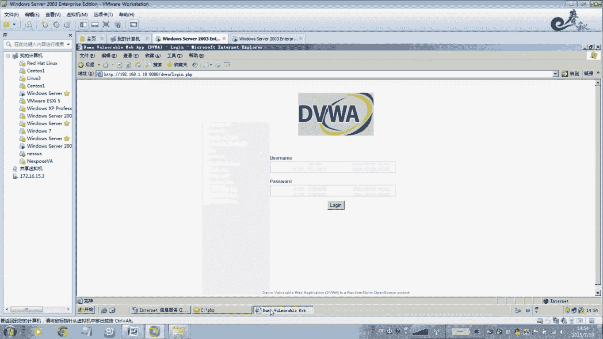

上一节我们介绍了课程概述，本节中我们来看看静态语言与动态语言的核心区别。这是理解Web应用工作原理的基础。

**静态语言**是指客户端（浏览器）接收到的代码与服务器上存放的代码完全一致。最典型的例子是纯HTML文件。

**动态语言**则是指服务器端执行了脚本或程序，生成了与原始代码不同的内容，再发送给客户端。因此，查看网页源代码时，看不到服务器端的真实逻辑代码。

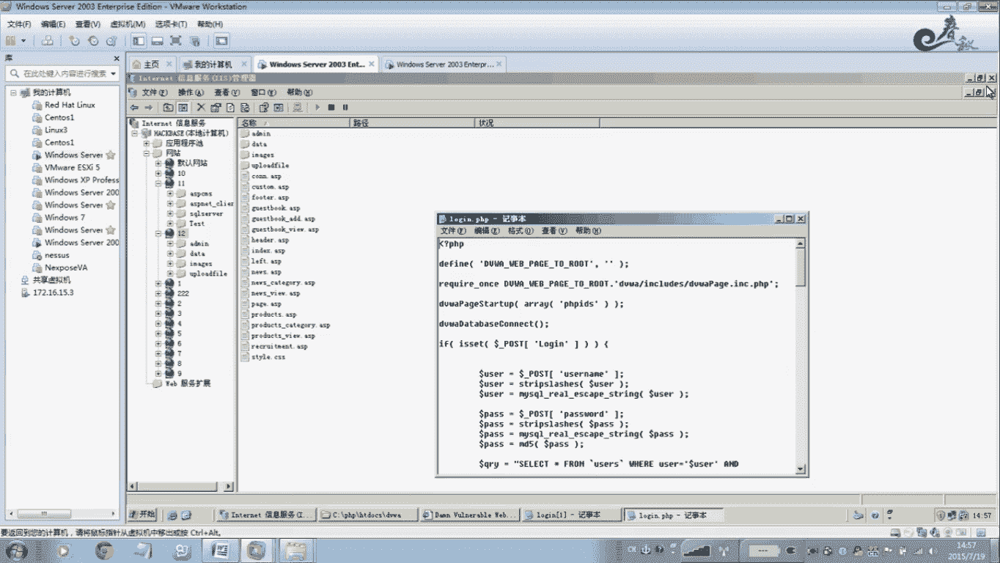

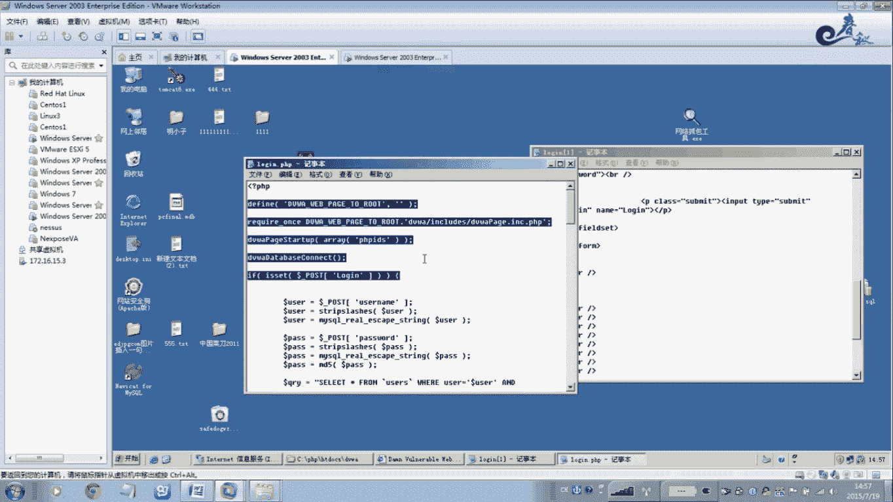

我们可以通过一个简单的实验来理解：

1.  创建一个纯HTML文件（例如 `test.html`），内容为 `<h1>这是测试文本</h1>`。
2.  通过浏览器访问这个文件。
3.  在浏览器中右键点击，选择“查看网页源代码”。

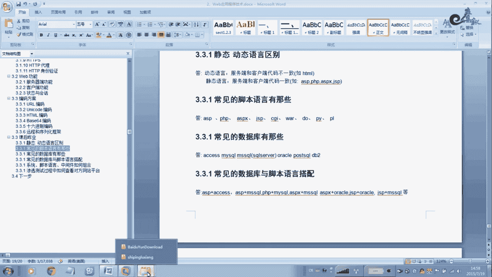

你会发现，源代码中的内容与你写在 `test.html` 文件里的内容**完全一致**。这就是静态页面的特征。

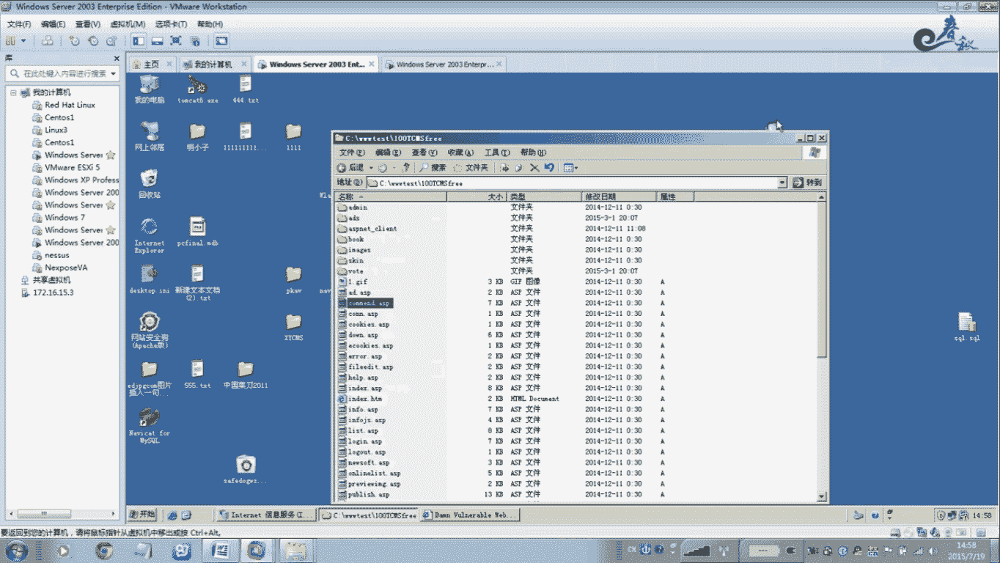

然而，如果你访问一个动态页面（例如一个 `.asp` 或 `.php` 的登录页面），并使用“查看网页源代码”，你将**无法**看到服务器端用于处理登录逻辑的代码（如数据库查询语句）。你只能看到服务器执行后生成的HTML结果。

**核心概念公式化：**
*   **静态页面：** `客户端代码 == 服务器源文件`
*   **动态页面：** `客户端代码 == 服务器执行(源文件) 的结果`

理解动态语言至关重要，因为只有在动态交互的场景下，才存在SQL注入、命令执行等漏洞挖掘的可能性。静态页面不存在这类问题。

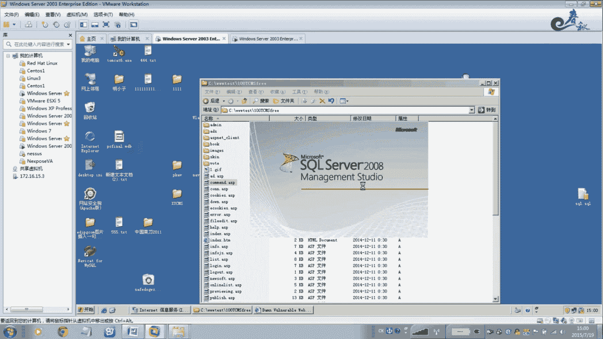

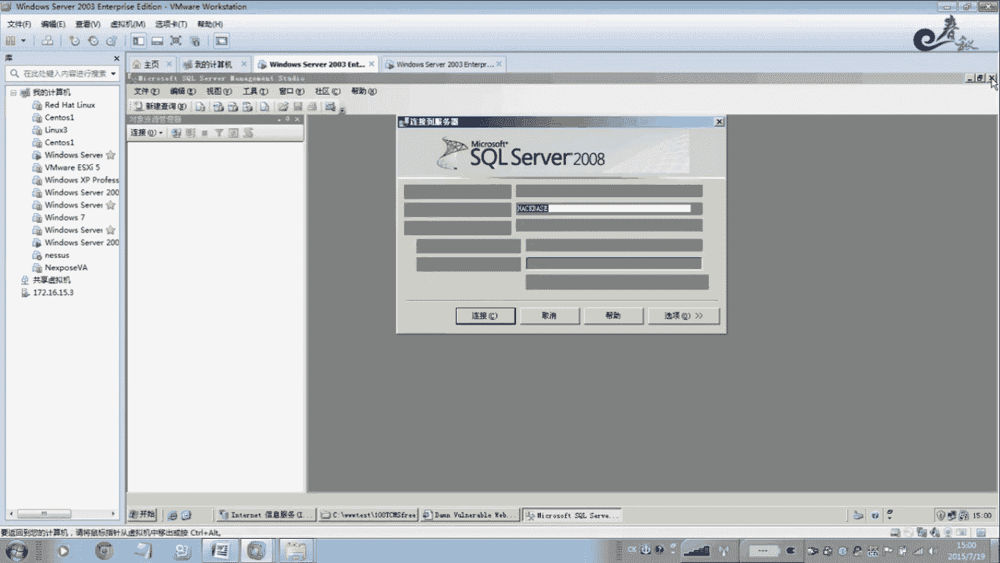

## 常见的脚本语言与数据库 🗃️

在理解了动静态区别后，我们需要认识渗透测试中常见的“演员”：脚本语言和数据库。

以下是常见的服务器端脚本语言：
*   ASP (扩展名通常为 `.asp`)
*   ASPX (扩展名通常为 `.aspx`)
*   PHP (扩展名通常为 `.php`)
*   JSP (扩展名通常为 `.jsp`)

以下是常见的数据库系统：
*   **Access：** 微软的小型数据库，适用于轻量级应用。其数据库文件扩展名为 **`.mdb`**。
*   **SQL Server：** 微软的中大型数据库，应用广泛。其数据库文件扩展名通常为 **`.mdf`**（主数据文件）和 **`.ldf`**（日志文件）。
*   **MySQL：** 开源的中型数据库，非常流行。其数据表文件扩展名通常为 **`.frm`**、`.MYI`、`.MYD`等。
*   **Oracle：** 大型企业级数据库。

对于Access或SQL Server数据库，如果网站存在目录遍历或配置错误，攻击者有时可能直接找到数据库文件的存放路径（例如在 `/database/` 目录下），并下载该文件。如果其中明文存储了管理员密码，则可直接登录后台。

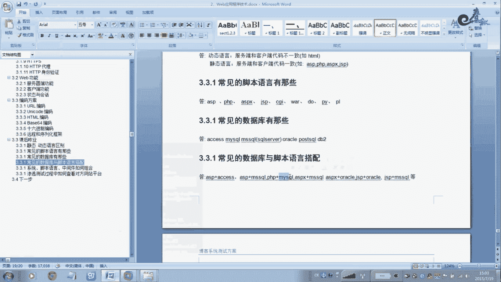

## 脚本语言、数据库与中间件的搭配 🧩

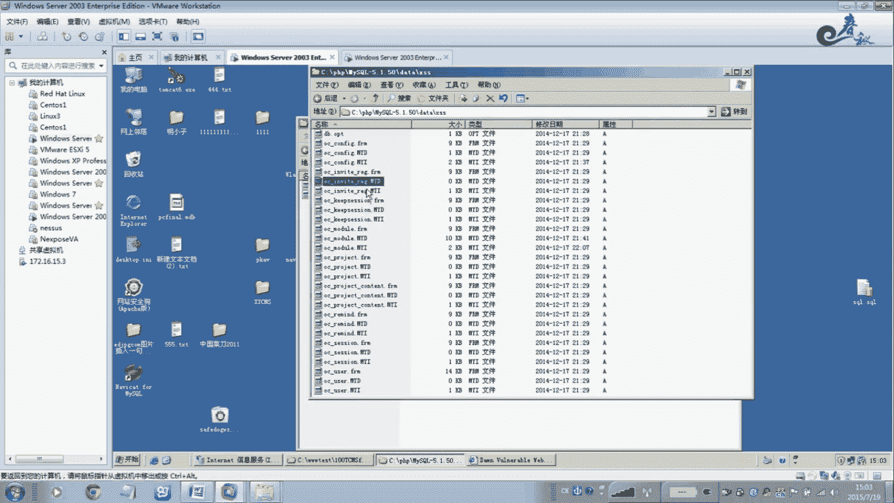

了解了单个组件后，我们来看看它们在实战中是如何组合工作的。不同的脚本语言通常有惯用的数据库和服务器环境搭配。

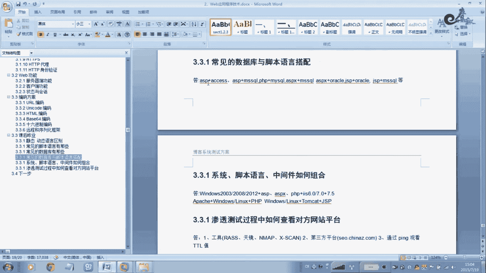

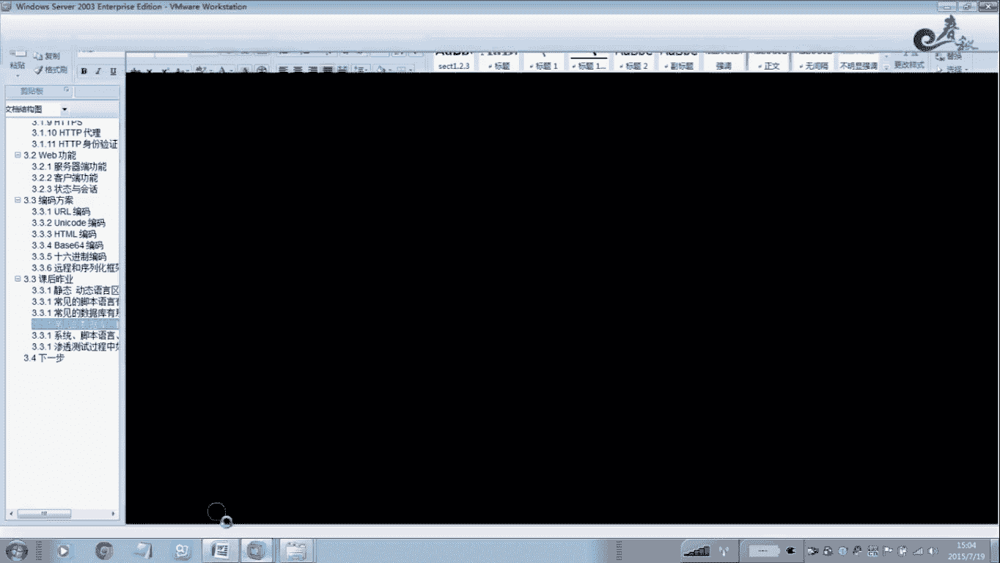

常见的搭配模式如下：
*   **ASP** 站点通常搭配 **Access** 或 **SQL Server** 数据库。
*   **PHP** 站点通常搭配 **MySQL** 数据库。
*   **ASPX** 站点通常搭配 **SQL Server** 数据库。
*   **JSP** 站点通常搭配 **Oracle** 或 **MySQL** 数据库。

通过观察网站的URL后缀（如 `.asp`），我们可以初步推断其可能使用的数据库类型，这对后续的渗透测试思路有指导意义。

## 操作系统、中间件与脚本环境 🖥️

系统的运行环境由操作系统、Web服务器（中间件）和脚本语言共同构成。它们之间也存在典型的搭配关系。

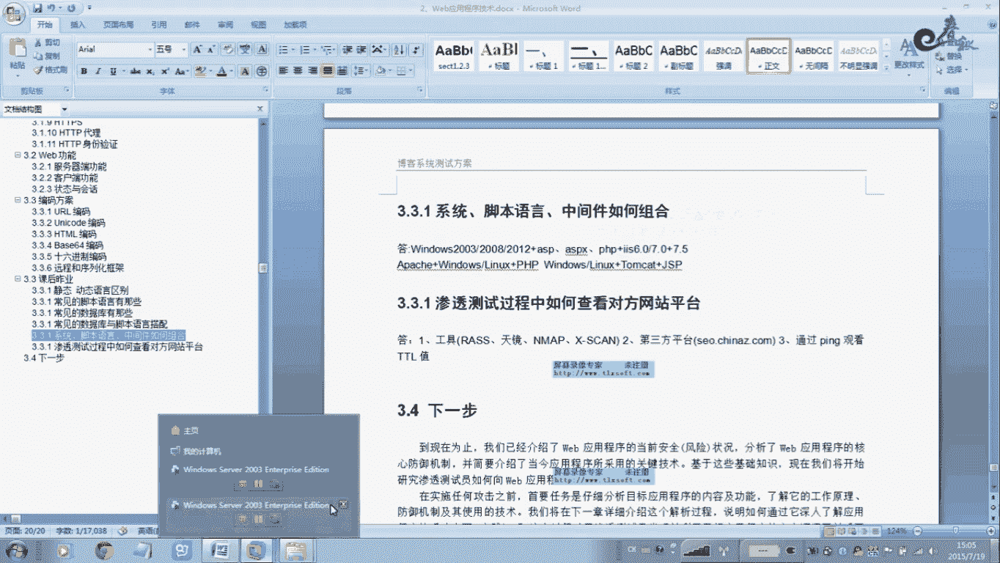

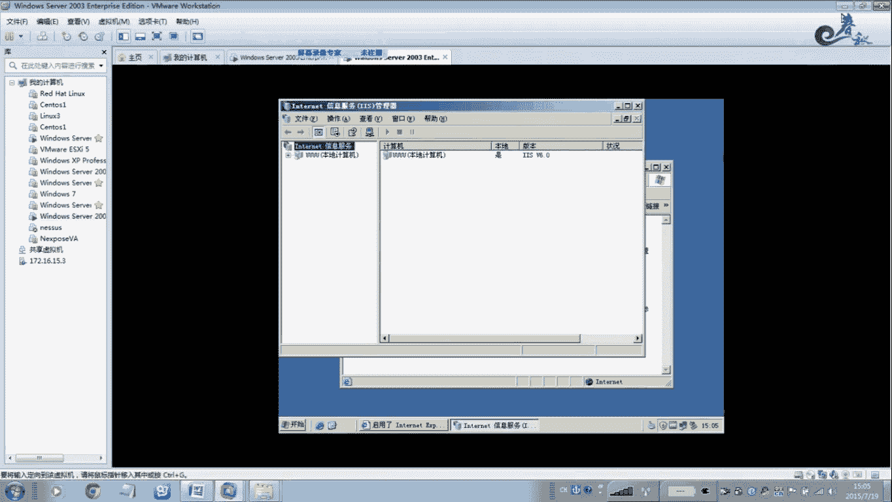

**Windows 服务器环境：**
*   **操作系统：** Windows Server 2003, 2008, 2012 等。
*   **中间件：** 通常使用 IIS (Internet Information Services)。
    *   Windows Server 2003 默认搭载 **IIS 6.0**。
    *   Windows Server 2008/2012 默认搭载 **IIS 7.0 / 7.5**。
*   **脚本语言：** 主要运行 ASP, ASPX。PHP 也可通过配置在IIS上运行。

**Linux/Unix 服务器环境：**
*   **操作系统：** 各类Linux发行版（如CentOS, Ubuntu）或Unix系统。
*   **中间件：** 通常使用 Apache 或 Nginx。
*   **脚本语言：** 主要运行 PHP, JSP。ASP/ASPX 通常不会在此环境运行。

因此，如果你看到一个网站是 `.aspx` 结尾，基本可以判断其服务器操作系统是 **Windows**。

## 信息收集：探测对方技术栈 🔍

在实战中，我们如何验证对方的真实技术栈呢？这属于信息收集阶段的工作。

以下是几种常用的探测方法：

**1. 使用扫描工具：**
可以使用专业的扫描器（如 Nmap, WhatWeb, 在线指纹识别平台）对目标进行扫描。这些工具能识别出Web服务器类型、版本、脚本语言、框架等信息。
例如，使用命令 `nmap -sV -p 80 <目标IP>` 可以扫描目标80端口的服务版本信息。

**2. 分析HTTP响应头：**
浏览器按F12打开开发者工具，在“网络”(Network)标签中查看任意一个HTTP请求的响应头(Response Headers)。`Server` 字段通常会透露Web服务器信息（如 `IIS/7.5`, `Apache/2.4.41`）。

**3. 通过TTL值初步判断操作系统：**
在命令提示符中使用 `ping <目标域名或IP>` 命令，观察返回的TTL（Time To Live）值。
*   TTL ≈ **64**：初始值通常为64或128，常见于 **Linux/Unix** 系统。
*   TTL ≈ **128**：初始值通常为128，常见于 **Windows** 系统。
（注意：TTL值经过网络跳转会递减，因此这是一个粗略的判断依据，需结合其他信息。）

**本节课中我们一起学习了：**
1.  **静态与动态语言的根本区别**，这是Web安全测试的认知基础。
2.  **常见的脚本语言（ASP/ASPX/PHP/JSP）和数据库（Access/SQL Server/MySQL/Oracle）** 及其特点。
3.  这些技术组件之间常见的**搭配组合**，帮助我们快速推断目标环境。
4.  不同**操作系统（Windows/Linux）与中间件（IIS/Apache）** 的典型运行环境。
5.  初步了解了如何通过**扫描工具、HTTP响应头、TTL值**进行信息收集，探测目标技术栈。

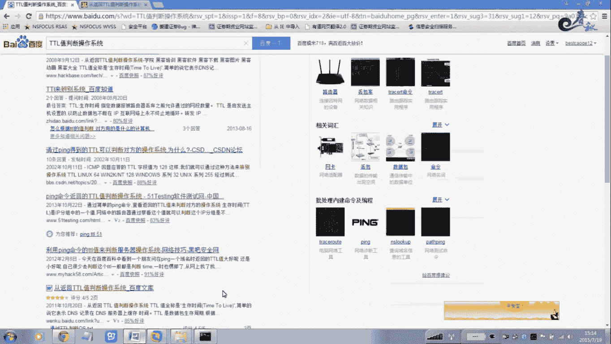

掌握这些基础知识，能够帮助你在面对一个目标时，快速建立测试思路，选择合适的方法和工具。请务必认真完成相关的实践作业，巩固理解。