# 经典15年i春秋渗透测试系统化教程 - P8：课时8 渗透测试环境搭建 🛠️

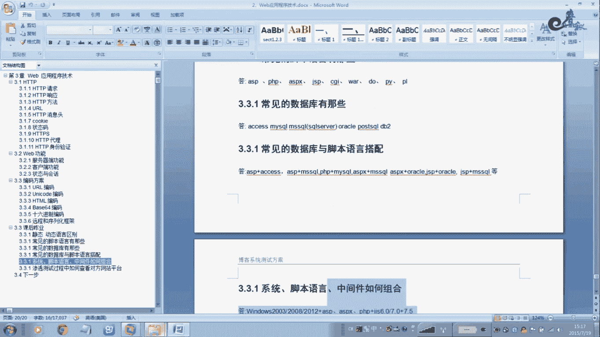

在本节课中，我们将学习如何搭建渗透测试所需的基础环境，包括IIS服务器、PHP支持以及集成化的Apache+MySQL+PHP环境。我们将通过手动和自动两种方式进行讲解，帮助你理解不同搭建方式的原理与适用场景。

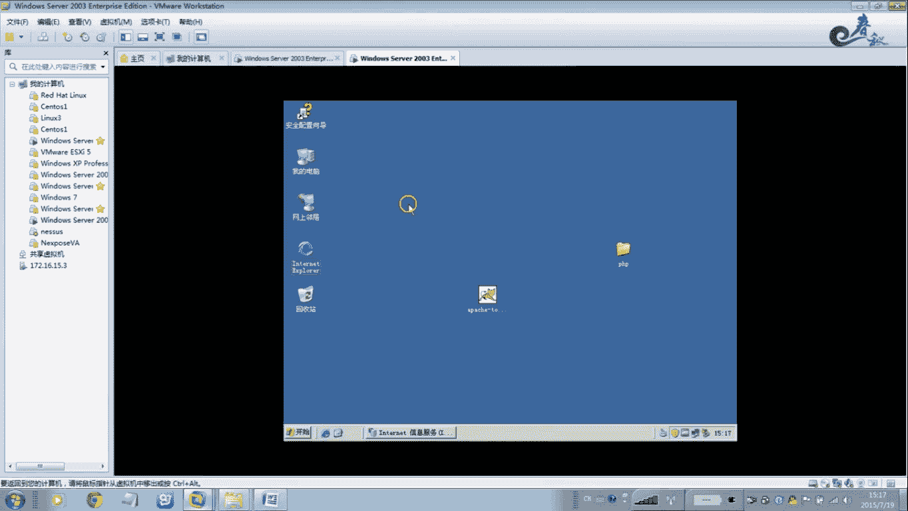

---

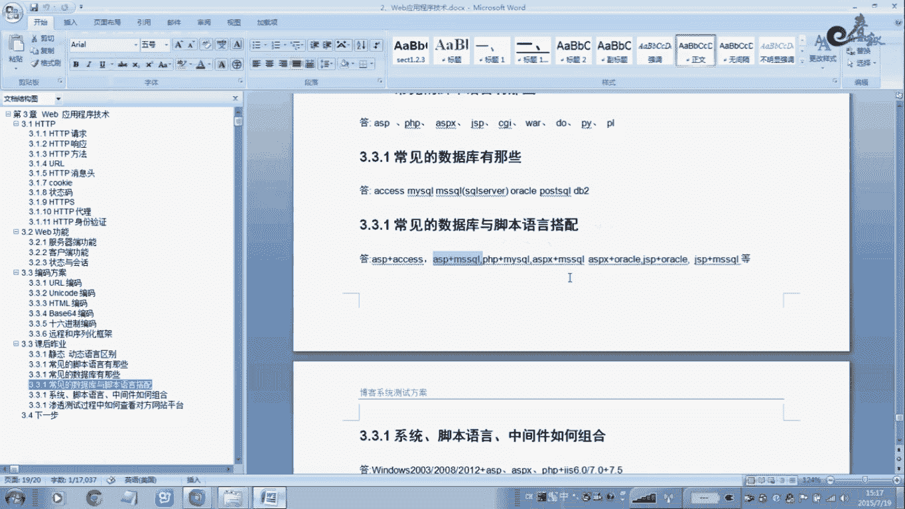

## 一、 IIS服务器与PHP环境搭建

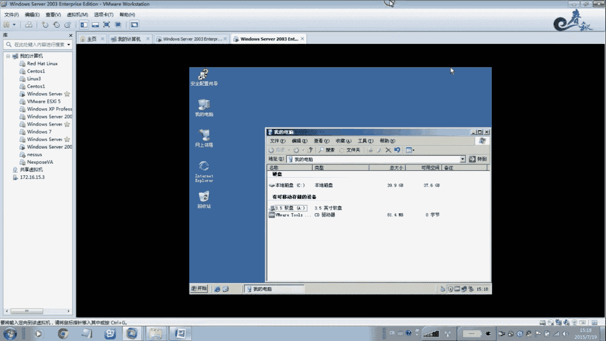

上一节我们介绍了渗透测试的基本概念，本节中我们来看看如何搭建一个基础的Web服务器环境。我们将从Windows平台自带的IIS服务器开始。

### 1.1 安装IIS服务器

首先，我们来讲解如何安装IIS服务器。以下是安装步骤：

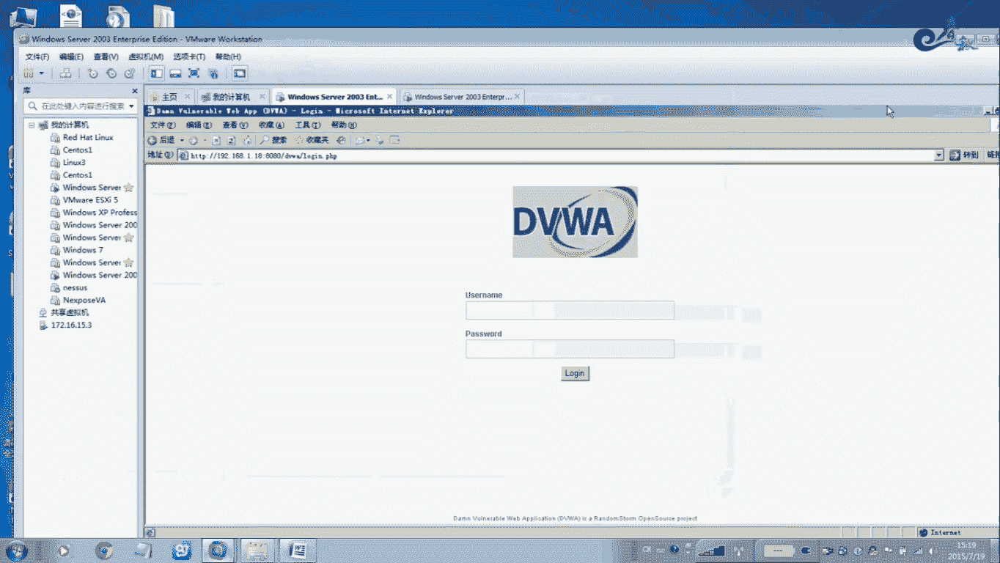

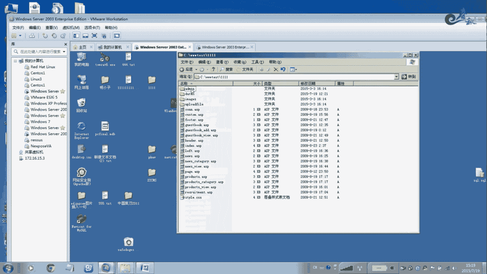

1.  将Windows Server 2003的安装光盘镜像加载到虚拟机的光驱中。
2.  打开“控制面板” -> “添加或删除程序” -> “添加/删除Windows组件”。
3.  在组件列表中，找到并勾选“应用程序服务器”。
4.  点击“详细信息”，确保“Internet信息服务(IIS)”被选中。
5.  点击“确定”后，按照向导提示，点击“下一步”完成安装。

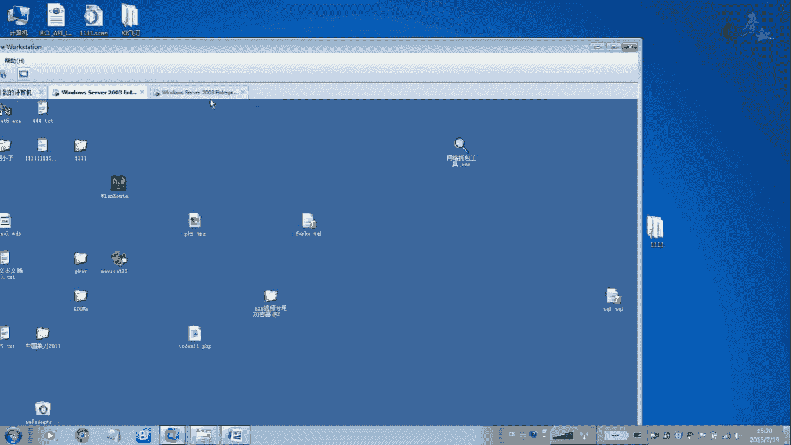

安装完成后，你可以在“管理工具”中找到“Internet信息服务(IIS)管理器”，通过它来管理网站。

### 1.2 配置IIS网站与权限

安装好IIS后，我们需要配置一个网站并设置其访问权限。IIS的默认权限比较严格，通常需要手动添加用户权限。

以下是配置一个基本网站的步骤：

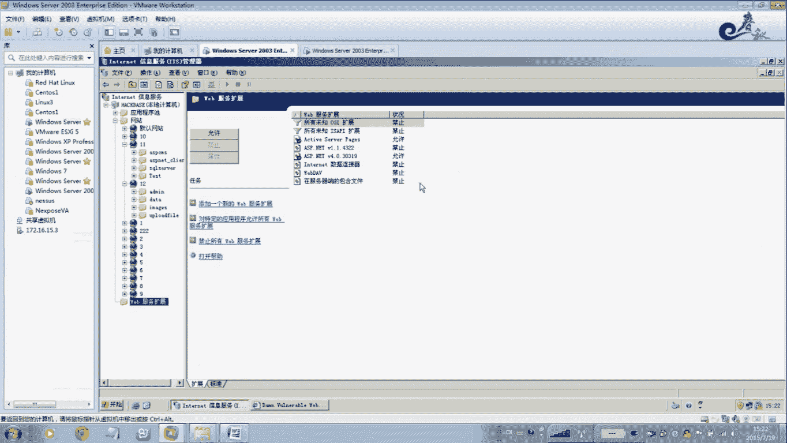

1.  在IIS管理器中，右键点击“网站”，选择“新建” -> “网站”。
2.  按照向导设置网站描述、IP地址、端口和主目录路径。
3.  默认情况下，IIS不支持PHP。我们需要为其添加PHP支持模块。
4.  完成配置后，通过浏览器访问你设置的IP和端口，即可打开网站。

### 1.3 为IIS添加PHP支持

要使IIS服务器能够运行PHP程序，需要安装并配置PHP。以下是关键步骤：

1.  从PHP官方网站（例如 `https://windows.php.net/download/`）下载适用于Windows的PHP安装包（如 `php-5.x.x-nts-Win32-VC11-x86.zip`）。
2.  将下载的ZIP包解压到服务器的一个目录中（例如 `C:\PHP`）。
3.  在IIS管理器中，为你的网站添加处理程序映射。将 `.php` 扩展名映射到 `php-cgi.exe` 这个可执行文件。
4.  配置完成后，你的IIS服务器就支持运行PHP脚本了。

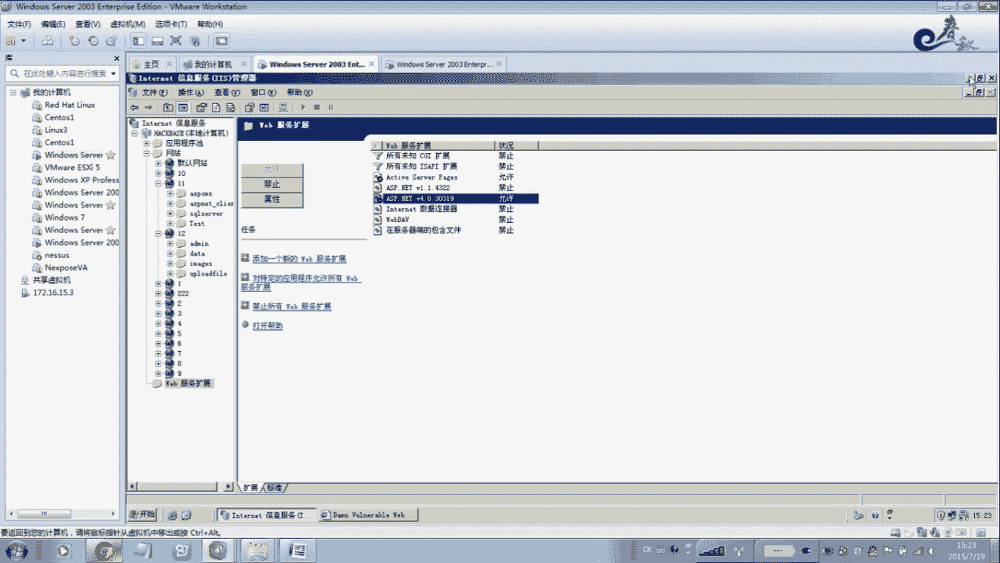

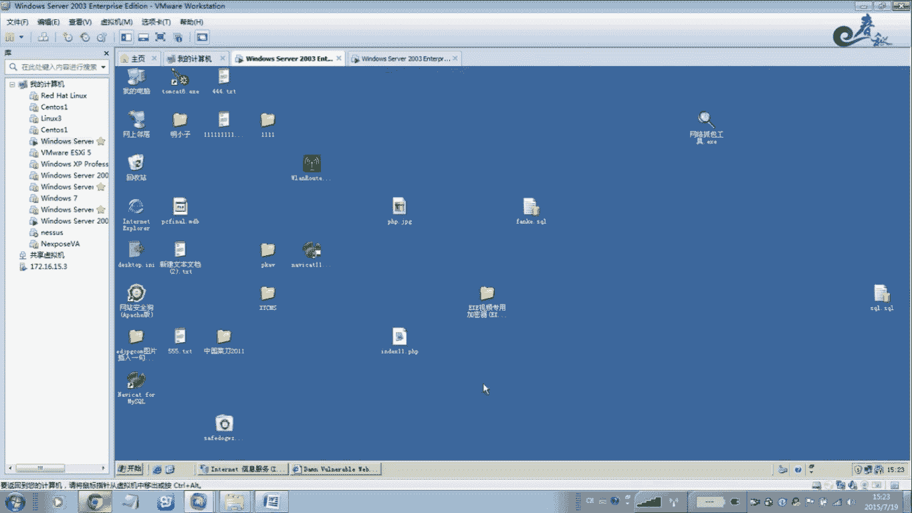

---

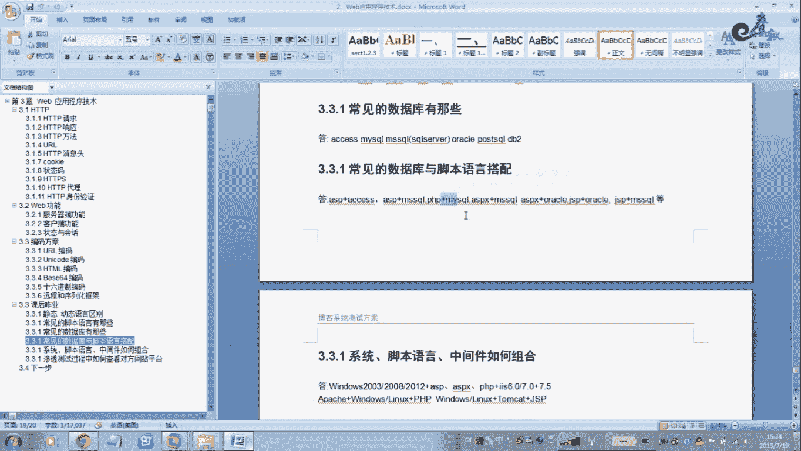

## 二、 集成化环境搭建工具

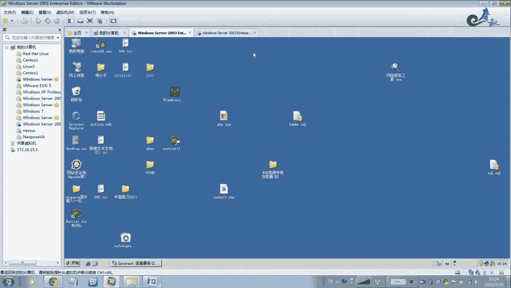

手动搭建环境步骤繁琐，对于学习和快速测试，我们可以使用集成化的环境搭建工具。这类工具将Apache、MySQL、PHP等组件打包，实现一键安装和配置。

### 2.1 常用集成环境工具介绍

以下是几款常用的、适合渗透测试学习的一键安装环境工具：

*   **PHPStudy**：一款国内流行的Apache+PHP+MySQL集成环境，配置简单，适合初学者。
*   **XAMPP**：一个功能强大的跨平台集成软件包，包含Apache、MariaDB、PHP和Perl。
*   **WampServer**：专为Windows设计的集成环境，同样包含Apache、MySQL和PHP。

**请注意**：这些一键安装包虽然方便，但默认配置可能存在安全风险（如使用默认的弱密码），且是精简版本，部分功能可能有缺陷。**它们仅适用于本地学习和测试环境，严禁直接用于生产环境。**

### 2.2 使用PHPStudy搭建环境

我们以PHPStudy为例，演示如何快速搭建一个渗透测试环境。

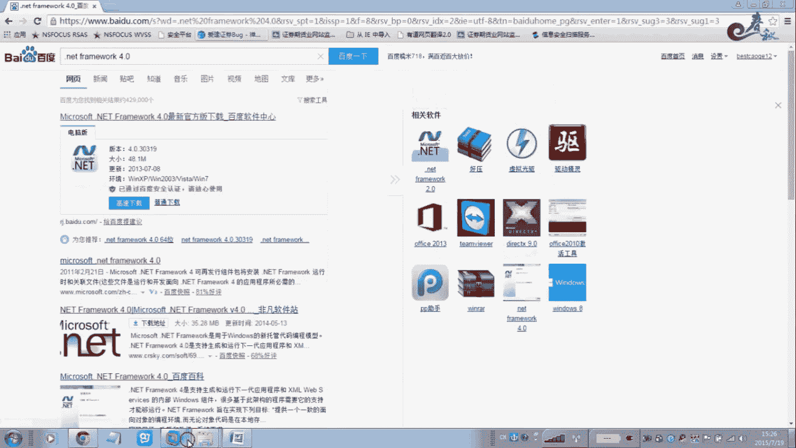

1.  从官网下载PHPStudy安装包。
2.  双击安装程序，按照提示选择安装路径，通常一路点击“下一步”即可完成安装。
3.  安装完成后，启动PHPStudy控制面板。
4.  在面板上，你可以一键启动或停止Apache、MySQL等服务。
5.  默认的网站根目录位于安装路径下的 `www` 文件夹。将你的测试网站（例如DVWA）文件放入该目录。
6.  通过浏览器访问 `http://localhost` 或你配置的端口，即可访问搭建好的网站。

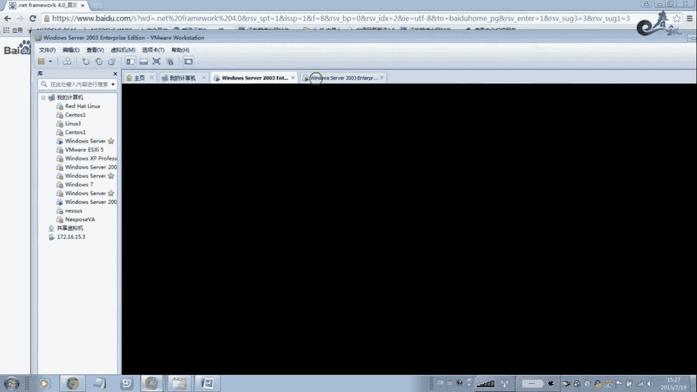

### 2.3 端口冲突处理

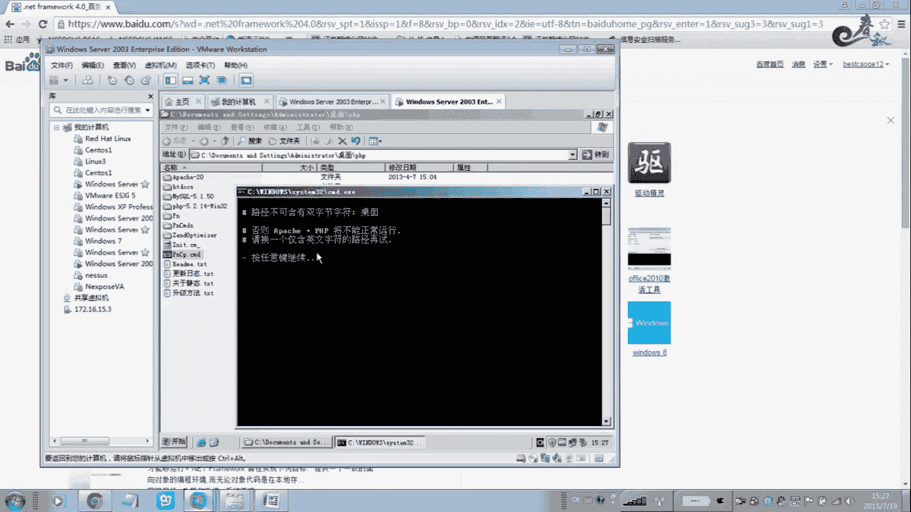

如果系统中已经运行了其他Web服务器（如IIS占用了80端口），可能会导致PHPStudy的Apache启动失败。

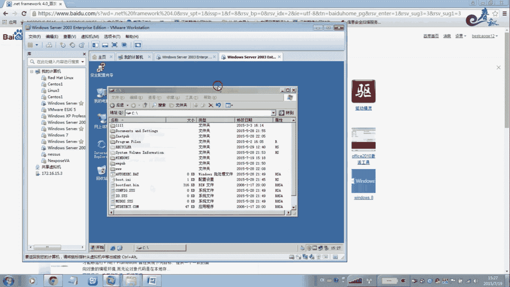

解决方法如下：
*   在PHPStudy控制面板中，修改Apache的监听端口（例如从80改为8080）。
*   或者，停止正在占用80端口的服务（如IIS）。

---

## 三、 JSP/Tomcat环境搭建

除了PHP环境，有时我们也需要搭建JSP的运行环境。这通常需要安装JDK和Tomcat服务器。

### 3.1 安装与配置Tomcat

以下是搭建JSP环境的基本流程：

1.  确保系统已安装Java运行环境（JDK）。
2.  从Apache官网下载Tomcat的Windows安装版（`.exe`文件）。
3.  运行安装程序，设置安装路径、管理端口（默认为8080）和管理员账号密码。
4.  完成安装后，启动Tomcat服务。
5.  Tomcat的默认Web应用目录位于其安装路径下的 `webapps` 文件夹。
6.  将你的JSP网站文件放入 `webapps` 目录中，即可通过 `http://localhost:8080/你的应用名` 来访问。

### 3.2 修改默认端口

如果你想将Tomcat的默认8080端口改为80端口，需要修改其配置文件。

操作步骤如下：
1.  找到Tomcat安装目录下的 `conf` 文件夹。
2.  用文本编辑器打开 `server.xml` 文件。
3.  找到类似 `<Connector port="8080" ... />` 的配置行。
4.  将 `port="8080"` 修改为 `port="80"`。
5.  保存文件并重启Tomcat服务。

---

## 四、 课程总结与建议

本节课中我们一起学习了多种渗透测试环境的搭建方法。

我们首先介绍了如何手动在IIS服务器上搭建并配置PHP支持，理解了Web服务的基本构成。接着，我们探讨了使用PHPStudy、XAMPP等集成化工具进行一键式快速环境搭建的便利性，同时也强调了其用于学习测试而非生产环境的局限性。最后，我们简要介绍了JSP/Tomcat环境的搭建流程。

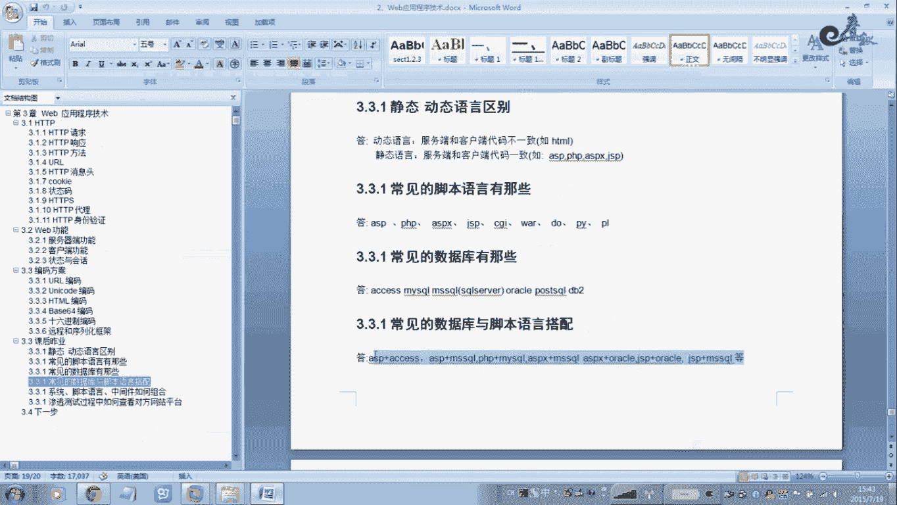

**核心建议**：对于初学者，可以使用一键安装包快速搭建环境以专注于渗透测试技术本身。但在课后，**强烈建议你根据详细的教程文档，手工在虚拟机中完整地搭建一遍IIS+PHP或LAMP（Linux+Apache+MySQL+PHP）环境**。这个过程能帮助你更深入地理解服务器、服务和网络配置的细节，这对你未来的学习和职业发展至关重要。

课后请结合提供的文档，动手实践，巩固所学知识。