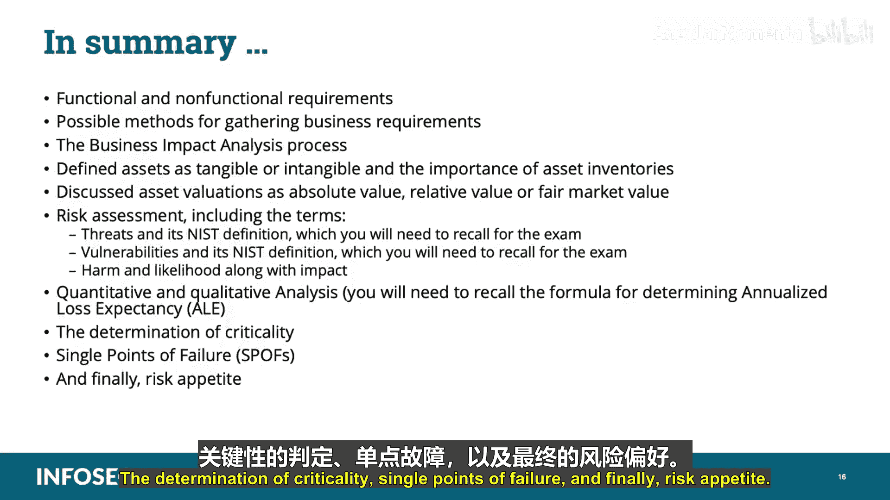

# 012：云设计需求 🏗️

在本节课中，我们将学习CCSP认证“架构概念与设计”领域的一个核心部分：云设计需求。我们将探讨如何分析业务需求、进行业务影响分析、评估资产与风险，以及理解组织的风险偏好。这些知识是规划成功云迁移和安全云架构的基础。

## 需求分析

在深入探讨之前，需要指出，对于CCSP考试必须掌握的特定信息，我会用双星号（**）标出，并在屏幕上以不同颜色高亮显示。

许多组织目前正考虑将其网络运营迁移到基于云的设计中。显然，推动组织进行云迁移的最大驱动力是成本节约。但由于云计算存在不同的服务与交付模型，组织必须决定哪一种模型能优化其成功。这个决定不能轻率做出，业务转型必须支持业务需求。因此，企业必须对其流程、资产和需求进行真实的评估和理解。

您需要理解两种类型的需求：
*   **功能性需求**：指设备、流程或员工为完成业务任务所必需的性能方面。例如，外勤销售人员必须能够远程连接到组织的网络。
*   **非功能性需求**：指设备、流程或员工那些对于完成业务任务并非必需，但却是期望或要求的方面。例如，销售人员的远程连接必须是安全的。

进行全面的资产、利润和需求清点是必要的。收集这些数据有多种方法。通常，会联合使用几种方法，以减少遗漏的可能性。以下是一些（并非全部）收集业务需求的方法：
*   访谈职能部门经理
*   访谈用户
*   访谈高级管理层
*   调查客户
*   收集网络流量数据
*   清点资产
*   收集财务记录
*   收集保险记录
*   收集市场数据
*   收集监管要求

收集到足够的数据后，需要进行详细分析。此时将进行业务影响分析，我们接下来将对此进行讨论。

## 业务影响分析

业务影响分析是对组织内每项资产和流程的优先级评估。资产可以是有形的，也可以是无形的。它们可以包括硬件、软件、知识产权、个人财产、流程等等。有形资产的例子包括路由器和服务器，而无形的资产通常是您无法触及的东西，例如专利、商标、版权和业务方法。

恰当的分析应考虑影响，即每项资产的任何损害或损失对组织整体可能意味着什么。在业务影响分析过程中，我们需要识别关键路径和任何单点故障。您还需要确定合规成本，即组织必须遵守的立法和合同要求。您组织的监管限制将基于许多变量，包括组织运营所在的司法管辖区、组织所在的行业、客户的类型和所在地等。

一旦您清楚地了解了组织在业务线和流程方面的运作情况，您就能更好地理解组织可能从云迁移中获得哪些好处，以及与迁移相关的成本。业务影响分析旨在识别并生成对业务正常运作至关重要的系统和服务的优先级列表。

业务影响分析有三个主要目标：确定关键性、估算最大允许停机时间、评估资源需求。

在确定关键性时，必须识别每一项关键业务功能，并确定中断所造成的影响。估算最大允许停机时间（也称为最大可容忍停机时间），本质上是衡量组织在关键功能中断后能存活多久。换句话说，您需要估算组织在没有其关键资产或服务的情况下可以容忍的最长时间。您需要确定连续性目标和恢复目标的优先级，例如非常高、中等或低。优先级非常高的可能需要立即恢复，中等的可能需要三天，非常低的可能需要30天。

组织内的每个业务功能和流程应归入以下五类之一：关键、紧急、重要、正常、非必要。关键类可能需要在几分钟到几小时内恢复，紧急类在24小时内，重要类72小时内，正常类7天内，非必要类可能30天内。这样管理层可以更好地评估关键性和恢复需求。

恢复点目标是指必须从最近一次已知备份中恢复的文件的时间点。恢复时间目标是指从恢复点目标恢复到正常状态所需的时间。因此，我们要确保处于最大中断时间或最大可容忍中断周期之内。恢复时间目标基本上是从中断到恢复处理的总时间。恢复时间目标必须始终小于最大允许停机时间或最大可容忍停机时间。它包括基础设施、设施和工作空间的恢复。

最后一个目标是评估资源需求和恢复工作。我们在此关注的是恢复关键运营及相关相互依赖关系所需的资源。这涉及记录所有流程、程序、分析结果，然后向高级管理层汇报，识别关键部门和流程、重要的相互依赖关系、漏洞评估摘要以及从分析中生成的建议恢复优先级。

## 风险评估与资产

为了决定如何处理组织内的风险，我们需要了解某些信息，包括：所有资产的清单、对每项资产的评估、对关键路径、流程和资产的确定，以及对组织风险偏好的清晰理解。换句话说，就是他们愿意承担的可接受风险水平。

风险评估是用于识别、估算和优先处理信息安全风险的过程。这是美国国家标准与技术研究院特别出版物800-39中定义的风险管理过程的关键组成部分。根据NIST SP 800-39，进行风险评估的目的是识别对组织的威胁、组织内部和外部的漏洞、威胁利用漏洞可能造成的损害，以及损害实际发生的可能性。识别这些事实有助于确定风险，包括损害发生的可能性和潜在的损害程度。

评估风险需要仔细分析威胁和漏洞信息，以确定某些情况或事件可能对组织造成不利影响的程度，以及这些情况或事件发生的可能性。这是业务影响分析的一部分。

NIST将威胁定义为任何可能通过信息系统对组织运营和资产、个人、其他组织或国家造成不利影响的情况或事件，方式包括未经授权的访问、破坏、泄露或修改信息和/或拒绝服务。威胁源可分为以下几类，每类都可以扩展为具体的威胁：
*   **人为**：例如恶意外部人员、恶意内部人员、生物恐怖主义、破坏者、间谍、政治或竞争行动者、关键人员流失、人为干预或文化问题导致的错误。
*   **自然**：例如火灾、洪水、龙卷风、飓风、暴风雪、地震。
*   **技术**：例如硬件故障、软件故障、恶意代码、未经授权的使用以及无线或新技术等新兴服务的使用。
*   **物理**：例如闭路电视故障、设施组件故障或外围防御故障。
*   **环境**：例如危险废物、生物制剂和公用事业故障。
*   **操作**：影响机密性、完整性和可用性的流程（手动或自动）。

NIST将漏洞定义为信息系统、系统安全程序、内部控制或实施中可能被威胁源利用的弱点。在我们的专业领域，通常从人员、流程、数据、技术和设施方面识别漏洞。漏洞的例子可能包括：设施入口处缺少接待员、 mantra 陷阱或其他物理安全机制；财务交易软件中完整性检查不足；未要求用户签署承认其安全责任以及确认已阅读、理解并同意遵守组织安全政策的文件；组织的信息系统补丁和配置临时进行，因此既无文档记录也未及时更新。

可能性与影响共同决定风险，这是定性风险评估的一个组成部分。可能性可以通过威胁的能力以及是否存在对策来衡量。没有趋势数据可用的组织可以使用标记为高、中、低的序数尺度来评分可能性排名。影响的排名方式与可能性大致相同，主要区别在于影响尺度被扩展，并且依赖于定义而非序数选择。对组织影响的定义通常包括生命损失、金钱损失、声誉损失、市场份额损失等方面。一旦定义了这些术语，您就可以计算影响。如果一次攻击有可能导致生命损失，那么排名将始终是高的。

风险被确定为可能性和影响的乘积。例如，如果一次攻击的可能性为1（高），影响为100（高），则风险为100。因此，100将是可用的最高攻击排名。这些高可能性和高影响的场景应引起组织的立即关注。

组织可以选择以两种方式之一进行风险评估：定量或定性。

**定量分析**为分析过程的要素分配真实的数字（成本）。例如，保障措施成本、资产价值、业务影响、威胁频率、保障措施有效性和攻击概率。这里的关键在于它基于真实的数字和成本。进行定量分析时，请记住，定量分析基于真实的数字，如资产或资源的成本。

首先，我们确定资产价值。假设我们有一栋价值100万美元的建筑。第二件事是计算暴露因子。假设上次有人撞上这栋建筑造成了10万美元的损失。单一损失期望值是与所评估的特定风险相关的预期负面影响。结果将是我们的单一损失期望值：资产价值100万美元乘以暴露因子10%，等于10万美元的单一损失期望值。

接下来，我们计算年发生率。年发生率是每年预期发生给定影响的次数，以数字表示。假设似乎每四年就有人撞上我们的建筑一次，即0.25。单一损失期望值10万美元乘以年发生率0.25等于2.5万美元。年损失期望值则是单一损失期望值乘以年发生率，这给出了与特定风险相关的估计年度成本。在这种情况下，年损失期望值等于单一损失期望值乘以年发生率。因此，基本上您可以预期每年预留2.5万美元，持续四年，以覆盖10万美元的预期建筑损坏，这成为您的保障价值。或者，您可以投资2万美元，例如，在建筑前安装混凝土护柱或屏障，以减轻人们撞上建筑或撞击建筑的威胁，从而降低风险。

**另一种方法是定性分析**。这种方法更主观，没有真实的数字，主要基于风险可能性的情景以及对威胁严重性和对策有效性的意见进行排名，通常为高、中、低或1、2、3、4、5，甚至可能在1到10的尺度上。这里的关键在于它是基于判断、最佳实践、直觉和经验，没有与定性评估相关的真实数字。当关注攻击者时，您首先尝试识别攻击者可能想要攻陷以进入您系统的目标或资产，然后首先加固这些潜在目标。当关注软件时，您正在针对潜在威胁测试您的软件，例如SQL注入、身份验证破坏、跨站脚本、不安全的重定向、安全配置错误、敏感数据暴露、跨站请求伪造等。例如，网页代码缺陷可能导致威胁利用该漏洞攻陷您的系统或数据。

## 资产识别与估值

为了保护我们的资产，我们首先必须知道它们是什么。组织拥有或控制的一切都可以被视为资产，并且资产有多种不同的形式。资产可以是有形的物品，如IT硬件、零售库存、建筑物和车辆。资产也可以是无形的，如知识产权、公众认知和与业务伙伴或供应商的良好关系。人员也可以被视为资产，因为他们为组织提供的技能、培训和生产力。

为了保护我们所有的资产，我们必须知道它们是什么，在较小程度上知道它们在哪里以及它们做什么。如果我们失去了对我们控制下某物的跟踪，就不可能保护它。因此，创建健全的安全计划的第一步将是执行彻底、全面的清点。有许多方法和工具可以做到这一点，例如调查、访谈、审计等。在执行IT清点时，我们还可以将自动化纳入流程，以提高我们的能力和效率。

在我们确定资产的数量、位置和类型的同时，我们也希望确定每项资产的价值。我们需要能够知道这些资产中哪些提供了我们组织的内在价值，哪些支持这种价值。我们需要知道我们保护的资产的价值，以便我们知道投入多少时间、金钱和精力来保护它们。我们不想在价值5美元的自行车上安装10美元的锁。

估值通常是业务影响分析的一部分。我们为每项资产确定一个价值，通常以美元计，即如果我们失去该资产（无论是暂时还是永久）会给组织带来多少成本，更换或修复该资产需要多少成本，以及处理该资产损失的任何替代方法。有各种分配成本的方法。我们可以使用保险价值、重置成本或其他一些估值方法。

价值度量通常关注三个领域：绝对价值、相对价值和公平市场价值。
*   **绝对价值**：仅关注资产的内在价值，不与其他资产进行比较。例如，一辆2019年款Oldsmobile 442，制造商建议零售价为6000美元。这就是该资产的成本。
*   **相对价值**：类似资产的价值。例如，其他Cutlass 442，价格在3000到7000美元之间。
*   **公平市场价值**：资产作为二手货可以出售的价格。例如，您买了一辆新车，在经销商处是6000美元。一旦您登记了所有权并开离停车场，它就成了二手车。现在，同一辆车价值1200美元，而不是6000美元。

## 关键性与单点故障

一旦清点评估完成，业务影响分析工作将继续进行，由高级管理层确定关键性。关键性是指组织没有它就无法运作或生存的那些方面。这些可能包括有形资产、无形资产、特定的业务流程、数据路径甚至关键人员。

以下是组织中关键方面的一些例子：
*   **有形资产**：组织是一家租车公司。汽车对其运营至关重要。如果没有汽车租给客户，它就无法开展业务。
*   **无形资产**：组织是一家音乐制作公司。音乐是公司的知识产权。如果音乐的所有权受到损害，例如版权受到挑战，然后公司失去所有权，或者保护音乐文件的加密被移除，音乐可以被无保护地复制，那么公司就没有任何有价值的东西，将无法生存。
*   **流程**：组织是一家以其速度著称的快餐店。接受订单、准备和交付食物以及收款的流程对其运营至关重要。如果餐厅因某种原因无法完成该流程，例如收银机故障导致餐厅无法接受付款，餐厅就无法运作。
*   **数据路径**：组织是一家国际航运公司。将订单与货运承运人匹配对其运营至关重要。如果公司无法完成其物流协调，将货物请求分配给有足够运力的承运人，它就无法提供服务，也将无法生存。
*   **人员**：组织是一家外科服务提供商。外科医生对公司的存在至关重要。如果外科医生不能做手术，就没有公司。

虽然高级管理层拥有确定关键性的正确视角，但高级专业人员应该对组织的整体使命和功能有良好的理解，以便更好地服务和指导组织保护关键要素。

业务影响分析过程中另一个可以支持安全工作的是识别单点故障。如果在某个流程、程序或生产链中存在任何瓶颈点，即整个工作流会因为失去单一元素而停止的地方，那就是一个单点故障。单点故障，尤其是在关键路径上，对组织构成重大风险，应在识别后尽快解决。

与关键方面一样，单点故障可能由硬件、软件、流程或人员引起。处理单点故障的方法包括：
*   增加冗余，以便如果单点故障失效，可以立即获得替代品。
*   创建替代流程，在单点故障停机时取代其功能。
*   交叉培训人员，使他们能够担任多种角色。
*   持续、彻底地备份数据，并确保可以轻松快速地恢复，例如负载共享或平衡IT资产。

在云环境中，客户应期望提供商在其设施和架构内没有单点故障。迁移到云端的部分好处是云提供商能够提供健壮且有弹性的服务，不易因单点故障而失效。因此，客户可以专注于减少其自身运营侧在访问和使用云中数据时的任何单点故障。

请注意，并非所有单点故障都是关键方面的一部分，也并非组织的所有关键方面都包含单点故障。

## 风险偏好与风险处理

风险偏好或可接受风险水平并不是一个新概念，使用云服务并不会显著改变其任何方面。由于这个概念对整体安全实践的重要性以及它被纳入CCSP公共知识体系，在此值得提及。风险偏好或可接受风险水平是组织认为可以接受的风险水平、数量或类型。这因组织而异，基于许多内部和外部因素，并且可能随时间变化。

以下是对一些风险基础知识的快速回顾：风险是可能性和影响将被实现的可能性。风险可以减少，但永远无法消除。组织接受一个允许运营以成功方式继续的风险水平。只要不涉及健康与人身安全，接受高于常态或高于竞争对手的风险是合法且可辩护的。健康与人身安全相关的风险必须按照行业标准或组织所遵守的监管要求进行处理。

组织有四种主要方式处理风险：风险规避、风险接受、风险转移和风险缓解。
*   **风险规避**：这并非真正处理风险的方法。它意味着放弃一个商业机会，因为风险实在太高，且无法通过足够的控制机制进行补偿。换句话说，风险超出了组织既定的风险偏好或可接受风险水平。
*   **风险接受**：这与规避相反。风险在组织的风险偏好范围内，因此组织继续运营，不对该风险采取任何额外措施。
*   **风险转移**：在这里，组织支付费用让他人以低于风险实现时潜在影响的成本来承担风险。这通常以保险的形式出现。这类风险通常与发生概率低但一旦发生影响高的事情相关。
*   **风险缓解**：在这里，组织采取措施降低风险的可能性或影响，通常是两者都降低。这可以采取控制措施或对策的形式，通常是安全从业人员参与的领域。

风险存在于每一项活动中。我们可以管理风险、减弱风险，甚至最小化风险，但运营中始终存在风险因素。当我们选择通过应用对策和控制来缓解风险时，剩余的风险称为残余风险。安全计划的任务是持续降低风险，直到其符合组织风险偏好下的可接受风险水平。组织的风险偏好由高级管理层设定，是组织内所有风险管理活动的指南。安全从业人员必须透彻理解组织的风险偏好，才能正确有效地履行其职能。

## 总结与应用

一旦确定了业务需求并完成了业务影响分析，所获得的信息可以并且应该在整个组织的许多安全工作重复使用。例如，业务影响分析结果可用于风险评估、整个环境中特定安全控制的选择以及业务连续性或灾难恢复计划。了解组织的关键方面和所有资产的价值对于完成这些任务至关重要。

在本节课中，我们一起学习了：
*   功能性和非功能性需求。
*   收集业务需求的可能方法。
*   业务影响分析流程。
*   将有形或无形资产定义为资产，以及资产清点的重要性。
*   讨论了资产估值为绝对价值、相对价值或公平市场价值。
*   我们讨论了风险评估，包括威胁及其NIST定义（考试需要回忆）、漏洞及其NIST定义（考试需要回忆），以及损害、可能性和影响。
*   我们还讨论了定量和定性分析。您需要回忆用于确定年损失期望值的公式以备考试。
*   确定了关键性、单点故障，最后是风险偏好。