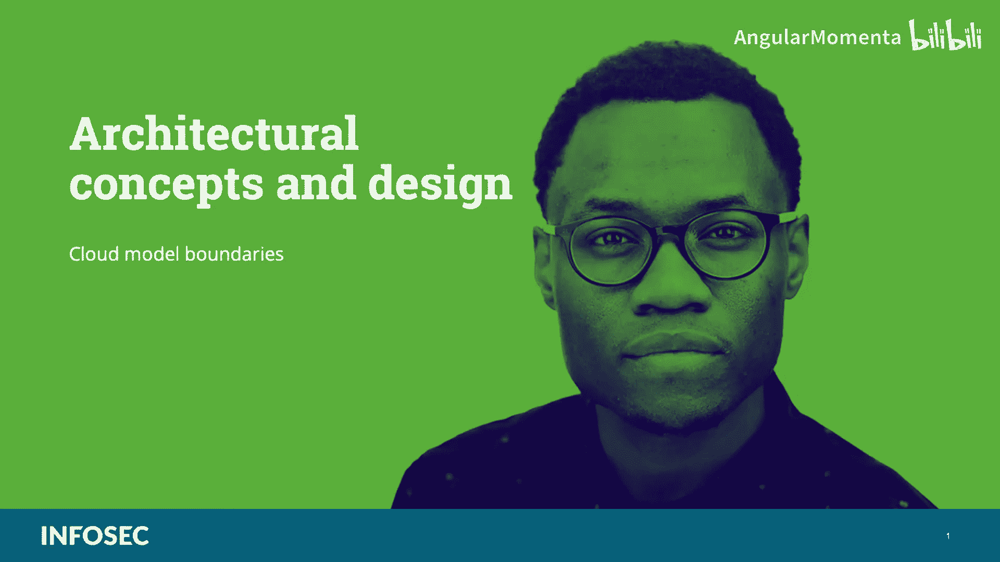
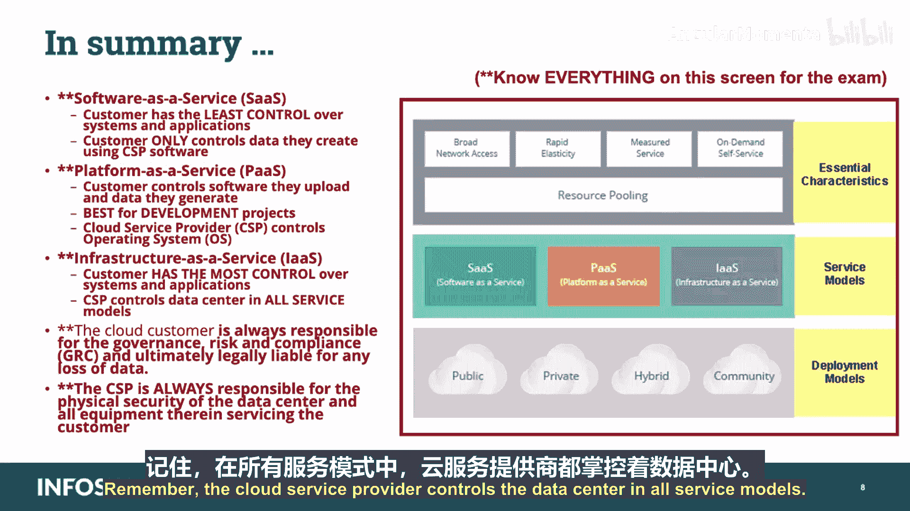

# 013：云模型边界 🏗️

在本节课中，我们将要学习CCSP认证“架构概念与设计”领域的一个重要主题：云模型边界。我们将探讨不同云服务模型（SaaS、PaaS、IaaS）中，客户与提供商之间的责任划分与控制边界，这对于理解云安全至关重要。

---

## 概述

云服务通常根据供应商提供的服务、客户的需求以及服务合同规定的各方责任，分为三种通用模型。理解这些模型中的控制边界是确保云安全合规的基础。



---

## 云服务模型

以下是三种主要的云服务交付模型。

### 软件即服务 (SaaS)

在SaaS模型中，客户对其所订阅的系统和应用程序的控制权最小。
*   客户仅控制他们使用云服务提供商软件所创建的数据。
*   云服务提供商控制底层的基础设施、平台和应用程序软件。

### 平台即服务 (PaaS)

在PaaS模型中，客户的控制权有所增加。
*   客户控制他们上传的软件以及他们生成的数据。
*   云服务提供商控制客户用来上传其软件的操作系统及以下层级（如运行时环境、服务器、存储、网络）。

### 基础设施即服务 (IaaS)

在IaaS模型中，客户对其使用的系统和应用程序拥有最多的控制权。
*   客户控制从操作系统往上的所有层面，包括应用程序、数据和运行时环境。
*   云服务提供商控制数据中心的基础设施（物理设施、服务器、网络硬件）。

**核心关系可以概括为：**
```
客户控制范围： SaaS < PaaS < IaaS
提供商控制范围： IaaS < PaaS < SaaS
```

---

## 传统环境与云环境的边界对比

上一节我们介绍了三种云模型的基本定义，本节中我们来看看云环境与传统IT环境在安全边界上的根本区别。

在传统环境中，组织拥有明确的IT边界。边界内的一切（数据、硬件、风险）都属于组织，边界外则是他人的问题。我们可以在内部环境与外部因素之间的接口处加固防御，例如建立非军事区（DMZ）。

云计算则并非如此。在云设计中，我们的数据存放在他人拥有的IT环境中，运行在不属于我们且基本不受我们控制的硬件基础设施上。我们的用户操作着我们访问权限有限、了解有限的程序和机器。因此，很难确切知道云模型中的边界在哪里、我们的风险位于何处以及它们实际延伸的范围有多广。

---

## **法律责任边界**

**在现行的法律和监管制度下，云客户最终要对任何数据损失承担法律责任。** 即使云提供商被证明存在疏忽或恶意行为，这一点也成立。

如果云提供商因某种过失对客户造成损害，客户可以向提供商寻求赔偿。例如，如果云提供商雇佣的管理员非法出售属于云客户的数据访问权，客户可以起诉提供商要求赔偿。

然而，云客户仍然对适用于该数据损失的所有法定义务承担法律责任，例如遵守该司法管辖区内的数据泄露通知法律（如《通用数据保护条例》（GDPR）或美国隐私盾框架）。这一责任不会因为云客户将运营外包给云提供商而终止。客户始终要对其控制的数据负责。

---

## 不同云模型中的控制边界

了解了不变的法律责任后，我们来看看这些控制边界在不同云模型中的具体表现。

### 基础设施即服务 (IaaS) 中的边界

在IaaS中，云客户在所有可能的云模型中拥有最多的责任和权限。
*   **提供商负责**：构成数据中心的建筑和土地、提供连接和电力、创建和管理硬件资产。
*   **客户负责**：从操作系统往上的所有一切。所有软件将由客户安装和管理，所有数据将由客户提供和管理。

在安全方面，云客户仍然失去了传统环境中的部分控制权。例如，客户显然无法选择特定的IT资产，因此采购过程中的安全性（通常包括对供应商的审查）必须委托给云提供商。客户也可能失去监控数据中心内部网络流量的部分能力，这使得审计变得困难，进而影响安全策略和监管合规。组织在迁移上云时，可能需要调整安全策略以反映新的约束，并必须找到某种方式来提供必要的交付成果以满足监管机构的要求。

**重要提示**：在IaaS中，云客户仍然可以收集和审查从其部署的软件（包括操作系统）生成的事件日志，这能提供大量关于数据使用和安全性的信息和洞察，可能满足审计员的要求。

### 平台即服务 (PaaS) 中的边界

在PaaS中，云客户对环境的控制权进一步减少，因为云提供商现在负责安装、维护和管理操作系统。这将需要对安全策略进行进一步修改，并付出额外努力以确保符合法规。

然而，云客户仍然可以监控和审查软件事件，因为在操作系统上运行的程序属于客户，更新和维护软件的责任也在于客户。但操作系统的更新和管理现在落到了提供商身上，这虽然在运营和安全目的上意味着客户控制权的丧失，但也代表了成本节约和效率提升。

### 软件即服务 (SaaS) 中的边界

在SaaS中，对环境的大部分控制权都让渡给了提供商。云客户不拥有硬件、软件或两者的管理权。客户只负责向系统中提供和处理数据。就所有相关目的而言，云客户作为一个组织，承担了传统环境中普通用户的角色和职责，拥有很少的管理权限、特权账户和许可。

重申前面提到的，客户仍然对与数据保护相关的所有法定义务和合同义务负责，但在这种情况下，客户对数据如何受到保护几乎没有控制权。云提供商现在几乎独家负责所有系统维护、所有安全对策以及影响数据的大部分策略及其实施，但客户仍然要对其收集或保留的任何数据损失负责。

---

## 风险的共同点与缓解措施

在以上三种模型中，客户都放弃了一种基本形式的控制：对数据所在设备的物理访问权限。从组织的角度来看，这带来了风险的严重增加和保证度的降低。任何能够物理访问服务提供商数据位置的人最终都可能（无论是否经过许可）获取数据。

我们可以采取措施来降低此类风险导致泄露的可能性，并且我们需要这样做以履行尽职调查义务。例如：
*   作为合同或服务级别协议的一部分，我们可以确保云提供商有一个流程来对所有能够访问数据中心和客户数据的人员进行背景调查和持续监控。
*   我们可以验证在数据中心位置实施了物理安全措施。
*   我们可以确保在云中处理和存储的数据经过加密。
*   我们也可以在将数据发布到云之前对其进行加密，或在云中加密，并在提供商外部控制加密密钥。
*   最后，我们可以在合同中规定提供商应承担的合同责任，同时牢记，对于任何数据损失，法律责任仍由客户承担。

---

## 总结

本节课中我们一起学习了各种云服务模型的名义边界，以及从客户和提供商角度看的与每种模型相关的权利和责任。



**考试要点回顾：**
*   **软件即服务 (SaaS)**：客户对系统和应用程序的控制权最小。客户仅控制他们使用云服务提供商软件所创建的数据。
*   **平台即服务 (PaaS)**：客户控制他们上传的软件以及他们生成的数据。这是软件开发或任何开发项目的最佳模型，因为你控制了用于开发的软件。在此模型中，云服务提供商控制操作系统。
*   **基础设施即服务 (IaaS)**：客户对系统和应用程序的控制权最大。请记住，在所有服务模型中，云服务提供商都控制着数据中心。