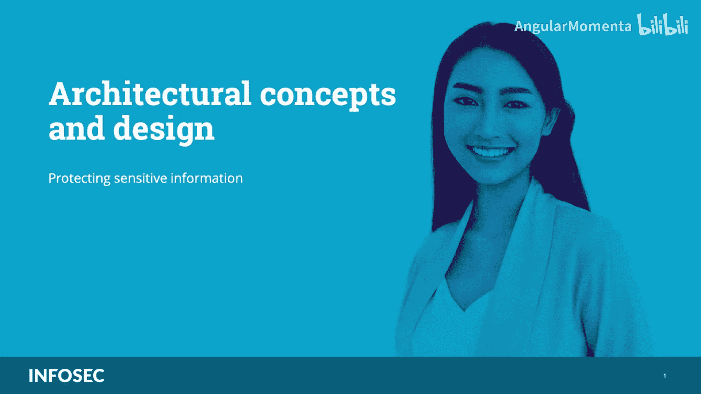
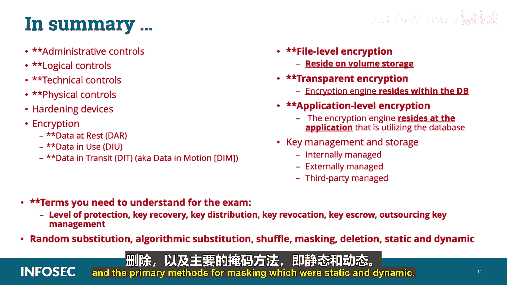

# 014：保护敏感信息 🔐

在本节课中，我们将要学习CCSP认证架构概念与设计领域中的一个核心部分：如何在云环境中保护敏感信息。我们将探讨纵深防御的概念、设备加固、加密技术的应用、数据生命周期保护以及密钥管理等关键主题。

---

## 纵深防御与安全控制

上一节我们介绍了保护敏感信息的总体框架，本节中我们来看看实现这一目标的基础策略：纵深防御。

纵深防御并非新概念，但它同样适用于云环境。其核心实践是采用多种方法，通过重叠的安全手段来保护环境。这些手段应包括管理性、逻辑性、技术性和物理性控制的混合。

*   **从云服务提供商（CSP）的角度看**，分层防御应包括：
    *   **人员控制**：严格的背景调查和持续监控。
    *   **技术控制**：如加密、事件日志记录和访问控制执行。
    *   **物理控制**：涉及整个园区、各个设施、数据中心内处理数据的区域、单个机架、特定设备以及进出园区的便携式介质。
    *   **治理机制与执行**：如强有力的政策和定期彻底的审计。

*   **从云客户（CSC）的角度看**，类似的努力应包括：
    *   为员工和用户提供包含全面安全主题的培训计划。
    *   通过合同强制执行政策要求。
    *   在自带设备（BYOD）资产上使用加密和逻辑隔离机制。
    *   强有力的访问控制方法，可能包括多因素认证（MFA）。

---

## 设备加固：物理与虚拟

理解了基础策略后，我们需要将其落实到具体对象上。无论是传统环境还是云环境，设备加固都是关键实践。

在传统环境中，位于DMZ（内部网络与外部世界连接的区域）的设备会作为惯例进行加固。我们知道这些设备更可能遭受入侵尝试，并相应地对它们进行强化。对于云环境，最好遵循相同的实践，无论是从云提供商的角度，还是从云用户的角度，都将所有云相关设备视为位于DMZ中。这有助于我们形成良好的习惯和看待云的概念方式。

以下是设备加固的具体任务列表：

*   **云服务提供商应确保**数据中心内的所有设备都得到加固，具体包括：
    *   移除所有来宾账户。
    *   关闭所有未使用的端口。
    *   不存在默认密码。
    *   实施强密码策略。
    *   对任何管理员账户进行严格保护和日志记录。
    *   禁用所有不必要的服务。
    *   严格限制和控制物理访问。
    *   根据供应商指南和行业最佳实践对系统进行打补丁、维护和更新。

*   **云客户则有相似但不同的任务列表**。客户必须注意其访问云方式带来的风险，这通常涉及自带设备（BYOD）环境和远程访问。例如，云客户应确保：
    *   其BYOD基础设施中所有访问云的资产都受到某种形式的反恶意软件或安全软件的保护。
    *   在设备丢失或被盗时，具备远程擦除或远程锁定能力（用户需通过签署授权使用政策授予组织此权限）。
    *   使用某种形式的本地加密。
    *   通过强访问控制或多因素配置中的生物识别技术进行保护。
    *   拥有并正确使用虚拟专用网络（VPN）解决方案进行云访问。
    *   安装某种形式的数据丢失/泄露防护（DLP）解决方案，通常以移动设备管理（MDM）系统的形式存在。这允许组织对个人拥有的设备进行容器化，以将其个人数据与组织信息隔离。

不仅物理设备需要加固，虚拟设备也应以同样方式对待。由于云计算严重依赖虚拟化来实现负载平衡和可扩展性，因此必须记住，虚拟实例需要强有力的保护，无论是在活动时（防止处理中的数据被其他实例或用户检测到），还是在存储为文件时（因为它们包含攻击者想要获取的大量材料且配置上非常便携）。它们也必须以我们保护物理机器的所有相同方式进行加固。

---

## 加密技术：保护数据的机密性

设备是数据的载体，而数据本身需要更核心的保护。加密是保障企业机密性服务的通用且关键的技术。

了解可能需要部署或与之协作的相关数据安全技术非常重要，以确保云中数据的机密性、完整性和可用性（也称为CIA三要素）。潜在的控制和解决方案包括：

*   **加密**：用于防止未经授权的数据查看。
*   **数据丢失防护（DLP）**：用于审计和防止未经授权的数据外泄。
*   **文件和数据库访问监控**：用于检测对存储在文件和数据库中的数据的未经授权访问。
*   **混淆、匿名化、令牌化和掩码**：这些是不使用加密保护数据的不同替代方案。它是用随机字符或数据隐藏原始数据的过程。

加密支持CIA三要素中的机密性支柱。其原理是防止未经授权的数据查看。没有加密，以任何安全方式使用云都将是不可能的。远程用户使用加密来创建安全通信连接；云客户在企业内部使用加密来保护自己的数据；在数据中心内，云提供商使用加密来确保不同的云客户不会意外访问彼此的数据。

就本次具体讨论而言，足以说明应在数据中心中利用加密来：
*   保护长期存储或归档的数据。
*   保护短期存储的文件，如虚拟化实例的快照。
*   防止授权人员对特定数据集的未经授权访问（例如，保护数据库中的字段，以便数据库管理员可以管理软件但不能修改或查看内容）。
*   在云提供商和用户之间的通信中，用于创建安全会话或确保传输中数据的完整性和机密性。

最终，我们希望能够在数据加密的状态下在云中处理数据，而无需解密，这样数据即使暂时也不会暴露给授权用户以外的任何人。尽管此功能目前尚不可用，但正在进行的研究显示出希望。这项技术被称为**同态加密**，值得了解这个术语并理解其可能性，即使它仍处于实验阶段。

在整个企业架构中启用所有数据的加密可以降低与未经授权的数据访问和暴露相关的风险，但存在需要解决的性能限制和问题。开发人员需要考虑其应用程序将运行的环境以及它们可能具有的加密或掩码依赖关系。作为认证云安全从业者，有责任以提供最大安全效益的方式在企业内实施加密，在保护最关键任务数据的同时，最小化因加密导致的系统性能问题。

加密可以在数据生命周期的不同阶段实施，并涉及密钥的使用。没有正确的密钥，数据将不可读且不可用。对于考试，你需要记住的是：我们使用加密来保护**静态数据**、**使用中数据**和**传输中数据**。

以下是这三种状态的详细分解：

*   **静态数据**：加密静态数据是防止任何人在数据归档或存储时看到他们无权查看的数据的好方法。可以根据要求使用不同的加密技术。例如，我们是实施长期保留还是短期存储？数据位于数据库中还是文件系统中？加密机制本身及其部署方式可能会有所不同。当我们在云中部署数据丢失防护（DLP）系统时，静态数据有时被称为**基于存储的**。你需要记住，在这种拓扑结构中，DLP引擎安装在数据静止的地方，通常是一个或多个存储子系统以及文件和应用程序服务器。
*   **使用中数据**：此阶段的数据正在被共享、处理或查看。数据生命周期的这个阶段比其他数据加密技术更不成熟，通常侧重于数据丢失防护（DLP）系统等技术。DLP（也称为数据泄露防护）可用于检测未经授权的共享，而信息权限管理（IRM）或数字版权管理（DRM）解决方案可用于保持对信息的控制。可能还需要遵守HIPAA或PCI DSS等法规，这些法规反过来要求对穿越不受信任网络的数据以及特定数据类型进行相关保护。当我们在云中部署DLP时，使用中数据有时被称为**基于客户端或端点的**。DLP应用程序安装在用户的工作站和终端设备上。
*   **传输中数据**：也称为动态数据。为了避免在传输过程中信息暴露或数据泄露，我们使用诸如IPsec、虚拟专用网络（VPN）、TLS/SSL和其他有线/无线协议等加密技术。传输中数据的一个例子是数据进出云进行处理、归档和共享时。当我们在云中部署数据丢失防护（DLP）时，动态数据有时被称为**基于网络或网关的DLP**。在这种拓扑结构中，监控引擎部署在组织网关附近，以监控HTTP、HTTPS、SMTP和FTP等传出协议。

---

## 数据库加密的三种方式

数据根据其状态需要不同的保护，而当数据存储在数据库中时，又有几种特定的加密方法。对于考试，你需要理解数据库加密的三种基本选项：

以下是这三种选项的详细分解：

*   **文件级加密**：数据库服务器通常驻留在卷存储上。对于这种部署，你加密的是数据库所在的卷或文件夹。加密引擎和密钥驻留在附加到卷的实例上。例如，信息权限管理系统（IRM）或数字版权管理（DRM）解决方案，其中加密引擎通常在客户端实现，并将保留原始文件的格式。
*   **透明加密**：许多数据库管理系统包含加密整个数据库或特定部分（如表）的能力。使用透明加密，加密引擎驻留在数据库内部，并且对应用程序是透明的。密钥通常驻留在实例内，但处理和管理它们可以卸载到外部密钥管理系统（KMS）。这种加密可以有效防止介质盗窃、备份系统入侵以及某些数据库和应用程序级别的攻击。
*   **应用程序级加密**：加密引擎驻留在使用数据库或对象存储的应用程序中。它可以集成到应用程序组件中，或者由一个代理负责，该代理在数据进入云之前对其进行加密。代理可以在客户网关上实现，也可以作为驻留在外部提供商处的服务。由于数据在到达数据库之前已被加密，因此执行索引、搜索和元数据收集具有挑战性。

当加密由云提供商提供或支持时，需要对加密类型、强度、算法、密钥管理以及其他相关方的任何责任有清晰的了解，并记录在服务级别协议（SLA）或合同中。

---

## 云存储加密：卷与对象

数据库是存储数据的一种形式，而云中更基础的存储形式是卷存储和对象存储，它们也需要相应的加密策略。

根据数据的位置（静态、传输中或使用中），使用不同的技术。在处理特定威胁时，例如保护个人可识别信息（PII）或法律监管信息，或防御系统和平台管理员的未经授权访问和查看时，可能会应用不同的选项。

*   **基本级存储加密**：加密引擎位于存储管理层，密钥通常由云提供商持有、存储或保留。引擎将加密写入存储的数据，并在数据退出存储（例如，将被使用时）解密。这种类型的加密与对象和卷存储都相关，但它只能防止硬件盗窃或丢失，无法防止云提供商管理员访问或来自存储层之上的任何其他未经授权的访问。
*   **卷存储加密**：要求加密的数据驻留在卷存储上。这通常通过一个加密容器来完成，该容器被映射为文件夹或卷。基于实例的加密只允许通过卷操作系统访问数据，并提供防止物理丢失或盗窃、外部管理员访问存储、从系统获取和移除存储快照以及存储级备份的保护。卷存储加密不能防止通过实例进行的任何访问，例如在实例上运行的应用程序内进行操作的攻击。
    *   有两种方法可用于实现卷存储加密：**基于实例的加密**和**基于代理的加密**。
        *   当使用基于实例的加密时，加密引擎位于实例本身上。密钥可以在本地生成，但应在实例外部进行管理。
        *   当使用基于代理的加密时，加密引擎在代理实例或设备上运行。代理实例是一台安全机器，将处理所有加密操作，包括密钥管理和存储。代理将映射卷存储上的数据并提供对实例的访问。密钥可以存储在代理上或通过外部密钥存储（推荐方法），代理负责密钥交换和内存中所需的密钥保护。
*   **对象存储加密**：大多数对象存储服务提供服务器端存储级加密（如上所述）。这种加密效果有限，因此建议使用外部加密机制在数据推送到云存储环境之前对其进行加密。

---

## 密钥管理：加密的核心挑战

实施加密后，管理加密密钥本身成为了安全链条中最关键也最具挑战性的一环。

密钥管理是任何加密实施中最具挑战性的组成部分之一。控制密钥的颁发、撤销、恢复和分发非常复杂。尽管像密钥管理互操作性协议（KMIP）这样的新标准正在出现，但保护密钥和适当的密钥管理仍然是你规划云数据安全时需要参与的最复杂任务。

此外，强大的密钥管理服务和安全的密钥管理生命周期对于集成到加密解决方案中也至关重要。

从安全角度来看密钥管理的重要性：
1.  你需要消除对云提供商正确处理加密过程和控制的依赖或假设。
2.  由于你拥有独特且独立的加密机制，可以在数据和传输级别应用额外的安全性和机密性层，因此你不会受到云环境中共享密钥或数据泄漏的束缚或限制。

我们需要理解的密钥管理考虑因素包括：加密密钥的存储方式和位置，以及它们如何影响数据的整体风险。规划密钥管理时，应考虑：
*   在整个生命周期中随机数生成。
*   加密密钥绝不应以明文形式传输，并应始终保留在可信环境中。
*   当考虑密钥托管或密钥管理即服务时，应仔细规划，考虑所有相关法律、法规和管辖要求。
*   无法访问加密密钥将导致无法访问数据。在讨论机密性威胁与可用性威胁时应考虑这一点。
*   **尽可能，密钥管理功能应与云提供商分开进行，以强制执行职责分离，并在尝试未经授权的数据访问时迫使串通发生。** 换句话说，你不想将加密密钥存储在与提供加密服务的同一云提供商那里。

密钥管理存在一些常见挑战，例如密钥访问。最佳实践与监管要求相结合，可能会为密钥访问设定特定标准，同时限制或不允许云服务提供商员工或人员访问密钥。

**密钥存储**：密钥的安全存储对于保护数据至关重要。在传统的内部环境中，密钥存储在安全的硬件安全模块（HSM）中。这在云环境中可能并不总是可行。云中的密钥存储通常使用以下一种或多种方法实现：
*   **内部管理**：在这种方法中，密钥存储在也充当加密引擎的虚拟机或应用程序组件上。这种类型的密钥管理通常用于存储级加密、内部数据库加密或备份应用程序加密。这种方法有助于减轻与介质丢失相关的风险。
*   **外部管理**：在这种方法中，密钥与加密引擎和数据分开维护。它们可以在同一云平台上、组织内部或在不同的云上。实际的存储可以是一个单独的、专门为此任务加固的实例，或者是一个硬件安全模块（HSM）。实施外部密钥存储时，你需要查看密钥管理系统如何与加密引擎集成，以及密钥的整个生命周期（从生成到销毁）是如何管理的。
*   **由第三方管理**：这是指由可信的第三方提供密钥托管服务。密钥管理提供商使用专门开发的安全基础设施和集成服务进行密钥管理。你必须评估任何你打算签约的第三方存储服务提供商，以确保允许第三方持有加密密钥的风险得到理解和记录。

**备份和复制**：在云中，数据备份和复制以多种不同的格式进行。这可能会影响长期和短期密钥管理有效维护和管理的能力。

对于云计算密钥管理服务，最常用的是以下两种方法：
*   **远程密钥管理服务**：客户在现场维护密钥管理服务（KMS）。理想情况下，客户将拥有、运营和维护KMS，从而使客户能够控制信息机密性，而云提供商则可以专注于服务的托管、处理和可用性。
*   **客户端密钥管理**：与远程密钥管理类似。客户端方法旨在让客户或云用户完全控制加密和解密密钥。这里的主要区别在于，大部分处理和控制都在客户侧完成。云提供商可以提供密钥管理服务，但KMS驻留在客户场所，密钥由客户生成、持有和保留。这种方法通常用于软件即服务（SaaS）环境和云部署。

无论最终采用何种方法，首选的解决方案都是**不要将加密密钥与云提供商存储在一起**。

对于考试，你需要理解以下几个关于密钥管理的术语：
*   **保护级别**：密钥必须受到与其保护的信息相同或更高级别的保护。
*   **密钥恢复**：一种备份机制，确保在密钥丢失、损坏或持有者被解雇或死亡时，组织能够持续访问其自己的加密信息。
*   **密钥分发**：这是我们与对称密钥交换遇到的相同问题。加密密钥不能与数据在同一信道或传输介质中发送。因此，使用带外分发。带外意味着使用不同的信道传输密钥，如信使、传真、电话或其他方法。
*   **密钥撤销**：基本上是撤销或终止对密钥的访问。
*   **密钥托管**：确保可信第三方保存私钥或解密信息所需密钥副本的过程。
*   **外包密钥管理**：在云计算中，最好将密钥存储在云提供商数据中心以外的地方。一种选择是使用云访问安全代理（CASB）。CASB是第三方提供商，为云客户处理信息访问管理和密钥管理服务。

通常，云服务提供商使用基于软件的解决方案来保护密钥，以避免基于硬件的安全模型带来的额外成本和开销。问题是，这些基于软件的密钥管理解决方案通常不符合美国国家标准与技术研究院（NIST）的联邦信息处理标准（FIPS）140-2中规定的物理安全要求。因此，缺乏FIPS加密认证可能对美国联邦政府机构和其他组织构成问题，尤其是在审计期间。

---

## 数据脱敏与匿名化

由于性能、成本和技术能力等多种原因，使用加密并不总是一个现实的选择。因此，需要采用额外的机制来确保可以实现数据机密性。掩码、混淆、匿名化和令牌化可以用于此目的。

*   **数据掩码或数据混淆**：是从特定数据集中隐藏、替换或省略敏感信息的过程。数据掩码通常用于保护特定数据集，如个人可识别信息（PII）或商业敏感数据，或为了遵守某些监管要求（如HIPAA或PCI DSS）。它也可用于测试平台无法获得测试数据的情况。

对于考试，你需要熟悉屏幕上列出的这些常见的数据掩码方法：
    *   **随机替换**：值被替换或附加一个随机值。
    *   **算法替换**：值被替换或附加一个算法生成的值。这通常允许双向替换。
    *   **混洗**：混洗数据集中的不同值，通常来自同一列。
    *   **掩码**：使用特定字符隐藏数据的某些部分。通常适用于信用卡数据格式，其中前几位数字被全部替换为X，只显示最后四位或六位数字。
    *   **删除**：简单地使用空值或删除数据。

数据掩码的主要方法是静态和动态：
*   **静态掩码**：创建带有掩码值的数据新副本。
*   **动态掩码**：有时称为即时掩码。它在应用程序和数据库之间添加了一个掩码层。掩码层负责在表示层访问数据库时即时掩码其中的信息。例如，这种类型的掩码可以向客户服务代表隐藏完整的信用卡号，但数据仍可用于处理。

*   **数据匿名化**：是移除间接标识符的过程，以防止数据分析工具或其他智能机制从多个来源收集或提取数据以识别个人或敏感信息。匿名化过程类似于掩码，包括识别要匿名的相关信息并选择相关的数据混淆方法。识别个人、用户或个人信息有两个主要组成部分：直接标识符和间接标识符。
    *   **直接标识符**：是唯一标识主体的字段，通常称为个人识别信息（PII）。掩码解决方案通常用于保护直接标识符。
    *   **间接标识符**：通常包括人口统计或社会经济信息、日期或事件。间接标识符本身无法识别个人。风险在于数据聚合，当我们开始将许多间接标识符与外部数据结合起来时，可能会导致信息主体的暴露。间接标识符的挑战在于，这类数据能够被集成到自由文本字段中，这些字段往往比直接标识符更缺乏结构性，从而使过程复杂化。

*   **令牌化**：是用一个非敏感的等价物（称为令牌）替换敏感数据元素的过程，该令牌通过令牌化系统映射回敏感数据，该系统没有内在或可利用的意义或价值。令牌通常是一组随机值，具有原始数据的形状和形式，并通过令牌化应用程序或解决方案映射回原始数据。**令牌化不是加密**。令牌化将数据完全从数据库中移除，用识别和访问资源的机制替换它。它用于在安全、受保护或受监管的环境中保护敏感数据。

令牌化可以在内部实现（需要集中保护敏感数据），也可以使用令牌化服务在外部实现。令牌化有助于遵守法规或法律，降低合规成本，减轻存储敏感数据的风险，或减少对该数据的攻击向量。

---

## 总结 📝

本节课中我们一起学习了在云环境中保护敏感信息的全面策略。

我们讨论了**纵深防御**的概念以及管理性、逻辑性、技术性和物理性控制的实施。探讨了**设备加固**的重要性，包括物理和虚拟设备。深入研究了**加密技术**，以及它如何保护静态数据（使用DLP时称为基于存储的，DLP引擎安装在数据静止处）、使用中数据（使用DLP时称为基于客户端或端点的，DLP应用程序安装在用户工作站和终端设备上）和传输中数据（也称为动态数据，使用DLP时称为基于网络或网关的DLP，监控引擎部署在组织网关附近监控传出协议）。

我们还分析了**数据库加密的三种选项**：文件级加密（驻留在卷存储上）、透明加密（加密引擎驻留在数据库内）和应用程序级加密（加密引擎驻留在使用数据库的应用程序中）。详细阐述了**密钥管理和存储**：内部管理、外部管理和第三方管理。强调了密钥管理功能应尽可能与云提供商分开进行，且切勿将加密密钥与同一云服务提供商存储在一起。解释了考试需要理解的术语：保护级别、密钥恢复、密钥分发、密钥撤销、密钥托管和外包密钥管理。

最后，我们介绍了当加密不可行时的替代方案：**数据掩码或数据混淆**及其常见方法（随机替换、算法替换、混洗、掩码和删除）和主要方法（静态和动态），以及**数据匿名化**和**令牌化**。