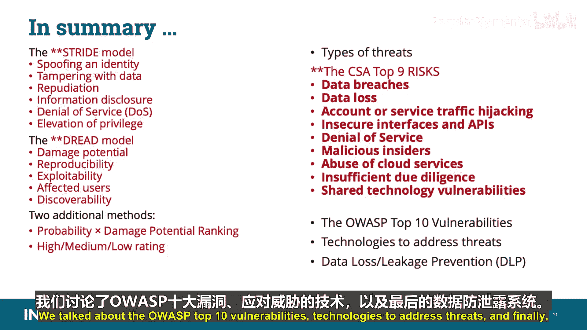

# 015：威胁建模 🛡️

在本节课中，我们将要学习CCSP认证中“架构概念与设计”领域的一个重要部分：威胁建模。我们将了解威胁建模的目的、核心模型（如STRIDE和DREAD）、云存储面临的特定威胁、云安全联盟（CSA）提出的九大风险，以及如何通过数据防泄漏（DLP）等技术来应对这些威胁。

## 威胁建模概述

威胁建模在应用设计完成后进行。其目标是确定应用中的任何弱点，以及在引入生产环境之前，潜在的入侵、出站路径和涉及的参与者。必须记住，云环境中的整体攻击面会被放大。因此，需要从攻击者（黑帽）的角度思考黑客可能攻击系统或连接的各种方式。

## STRIDE威胁模型

STRIDE模型通常用于关注应用和操作系统威胁，但也可用于识别对网络和主机的威胁。您必须能够为考试回忆这个缩写词及其描述术语。

以下是STRIDE模型的组成部分：

*   **身份欺骗**：攻击者冒充授权用户。
*   **数据篡改**：攻击者试图以未经授权的方式修改目标数据。
*   **抵赖**：攻击者或交易参与者可以否认或隐瞒其在该交易中的参与。这与**不可抵赖性**相反，后者指无法否认您确实参与了交易。
*   **信息泄露**：此类别包括授权用户意外向未授权用户披露受保护数据的无意泄露，以及攻击者未经授权访问数据的恶意访问。
*   **拒绝服务**：这是对保密性、完整性、可用性（CIA）三元组中**可用性**方面的攻击，导致授权用户无法访问系统、应用或数据。
*   **权限提升**：当攻击者不仅获得对目标的访问权限，还能获得足以完全禁用或摧毁整个目标系统的控制级别时发生。

## 威胁优先级划分方法

识别或记录威胁后，需要分配威胁优先级，换句话说，对威胁进行排序或评级以便缓解。DREAD是考试中需要回忆的三种方法之一。

DREAD由以下术语组成：

*   **损害潜力**：如果威胁实现，损害有多严重？
*   **可复现性**：攻击者复制或利用该威胁有多复杂？
*   **可利用性**：执行攻击有多困难？
*   **受影响用户**：如果此漏洞或威胁实际发生，有多少用户（数量或百分比）会受到影响？
*   **可发现性**：攻击者发现此弱点有多困难？

另外两种威胁优先级划分方法是：

1.  **概率乘以损害潜力排名**：使用1到100的等级（100为最严重）。为概率和损害潜力各分配一个1到10的值（1低，10高），相乘，然后将结果按比例缩放到1到100。这是一种非常主观的方法。
2.  **高/中/低评级**：这种方法更简单，为关键性分配高（立即处理）、中（最终处理）、低（可视为可选）的评级。

## 云存储面临的威胁类型

数据存储面临屏幕上列出的威胁类型，您应该为考试理解它们是什么。

*   **未经授权的使用**：基本上指通过账户劫持或上传非法内容，未经许可使用数据存储。云存储的多租户特性使得追踪未经授权的使用更具挑战性。
*   **未经授权的访问**：由于黑客攻击、多租户环境中权限设置不当或云提供商内部员工责任，可能导致未经授权的访问。
*   **拒绝服务**：针对存储系统的DoS攻击（如针对性攻击）或DDoS攻击（如使用各种系统协调攻击目标系统），攻击CIA三元组中的可用性方面。可用性是云存储的一个强烈关注点，因为没有数据，任何实例都无法启动。
*   **数据损坏、修改和销毁**：这可由多种原因引起，包括人为错误、硬件或软件故障、火灾或洪水等事件，或故意黑客攻击。它可能影响存储的特定部分或整个阵列。
*   **数据泄露**：消费者应始终意识到云数据容易受到数据泄露的影响。泄露可能来自外部，也可能来自具有存储访问权限的云提供商员工。数据在云中倾向于被复制和移动，这增加了泄露的可能性。
*   **媒体被盗或意外丢失**：此威胁适用于便携式存储，但随着云数据中心的增长和存储设备变得越来越小，它们遭遇盗窃或类似威胁的途径也越来越多。
*   **恶意软件感染或引入**：几乎所有恶意软件的最终目标都是最终到达数据存储。
*   **使用后处理或清理不当**：在云计算中，使用后处理具有挑战性，因为我们通常无法强制执行媒体的物理销毁。云中数据的动态特性（数据保存在不同存储中，且有多租户）带来了数字残留物可能被定位的风险，除非得到妥善处理（例如，通过加密粉碎，即加密数据存储然后销毁密钥，这使得在正常恢复情况下无法检索数据）。

## 云安全联盟（CSA）九大风险

屏幕上列出了云安全联盟（CSA）确定的九大风险。您应该为考试熟悉这些常见威胁并能够回忆它们。考试中可能会看到专门针对这九大CSA风险的题目，因此请记住它们的名称。

*   **数据泄露**：泄露通常是由于数据库安全设计或配置不当，导致数据在没有适当授权的情况下暴露。如果多租户云服务数据中心设计不当，一个客户应用中的缺陷可能允许攻击者不仅访问该客户的数据，还能访问所有其他客户的数据。
*   **数据丢失**：指与云环境中存储、处理或传输的信息相关的信息丢失、删除、覆盖、损坏或完整性丧失。云服务提供商的任何意外删除，或者更糟的物理灾难（如火灾或地震），都可能导致客户数据的永久丢失，除非提供商采取足够措施备份数据。此外，避免数据丢失的责任并不仅仅落在提供商身上。如果客户在上传到云之前加密了数据，但丢失了加密密钥，数据也将丢失。
*   **账户或服务流量劫持**：成功后，这允许攻击者监视和窃听通信、跟踪流量、捕获相关凭据以及访问或更改账户和用户配置文件特征（例如更改密码）。如果攻击者获得您的凭据，他们可以窃听您的活动和交易、操纵数据、返回虚假信息并将您的客户重定向到非法站点，您的账户或服务实例可能成为攻击者的新基地。
*   **不安全的接口或API**：云计算提供商公开一组软件接口或API，供客户用于管理和与云服务交互（配置、管理、编排和监控都是使用这些接口执行的）。通用云服务的安全性和可用性取决于这些基本API的安全性。从身份验证和访问控制到加密和活动监控，这些接口必须设计成能够防止意外和恶意的策略规避企图。API的附加组件显著增加了复杂性，导致可能被不安全地使用的多层API。
*   **拒绝服务**：通过迫使受害者的云服务消耗过多的有限系统资源（如处理能力、内存、磁盘空间或网络带宽），攻击者导致系统速度慢到无法忍受。这些攻击基本上阻止用户从指定系统或位置访问服务和资源。
*   **恶意内部人员**：根据美国国家标准与技术研究院（NIST）的定义，这是当前或前雇员、承包商或其他业务合作伙伴，他们拥有或曾经拥有对组织网络、系统或数据的授权访问权限，并故意超越或滥用该访问权限，以对组织信息或信息系统的保密性、完整性或可用性产生负面影响的方式行事。
*   **云服务滥用**：我们已经知道，云并不总是以向用户提供的方式被使用。攻击者能够使用目录攻击、执行拒绝服务攻击、破解加密密码，或托管非法软件和材料以进行广泛分发。攻击者使用自己有限的硬件破解加密密钥可能需要数年时间，但使用一系列云服务器，他可能能够在几分钟内破解。或者，他可能使用那系列云服务器来发起分布式拒绝服务攻击。
*   **尽职调查不足**：基本上指在推出云解决方案之前，没有调查和了解公司面临的风险。如果没有完全理解云服务提供商的环境、推送到云的应用程序或服务以及运营责任（如事件响应、加密和安全监控），组织正在承担未知水平的风险，其方式他们甚至可能无法理解，但与他们当前的风险相去甚远。这里有两个要素：**应有注意**和**尽职调查**。应有注意是制定和实施政策和程序，以帮助保护公司、其资产和人员免受威胁；尽职调查是我们如何证明我们的应有注意。
*   **共享技术漏洞**：这是基于云服务提供商以可扩展的方式交付其服务的事实。他们在租户之间（并可能与其他提供商之间）共享基础设施、平台和应用程序。这可能包括基础设施的底层组件，从而导致共享的威胁和漏洞。建议采用深度防御策略，并应包括计算、存储、网络、应用程序和用户安全执行与监控，无论服务模型是基础设施即服务（IaaS）、平台即服务（PaaS）还是软件即服务（SaaS）。关键在于，单个漏洞或配置错误可能导致整个提供商云的泄露。

## OWASP十大漏洞与威胁应对技术

开放Web应用安全项目（OWASP）开发了许多免费有用的产品，并提供了多个Web应用开发指南，包括开发指南、代码审查指南、测试指南、屏幕上列出的十大Web应用安全漏洞以及OWASP移动指南。攻击者经常利用这些类型的漏洞来完全控制软件、窃取数据或完全阻止软件工作。不要被愚弄，黑客使用这些信息来瞄准系统和漏洞，因为它概述了他们可以瞄准的常见漏洞，可以说是一张路线图。

您需要利用不同的技术来解决企业在云中数据的安全存储和使用方面，关于保密性、完整性和可用性所面临的各种威胁。

## 数据防泄漏（DLP）系统

了解数据分散如何在云中使用非常重要。数据分散类似于RAID（独立磁盘冗余阵列）解决方案，但实现方式不同。数据块被复制到云中的多个物理位置。RAID是一种数据存储虚拟化技术，它将多个物理驱动器组件组合成一个逻辑单元，以实现数据冗余、性能改进或两者兼得。在私有云中，您需要自己设置和配置数据分散。使用公共云则没有能力设置和配置数据分散，尽管您的数据可能受益于云提供商使用的数据分散。该技术的底层架构涉及使用**擦除编码**，它将数据对象（想象成一个带有自描述元数据的文件）分块成段。每个段被加密并切成片，然后分散到组织的网络中，驻留在不同的硬件驱动器和服务器上。如果组织失去对一个驱动器的访问，原始数据仍然可以重新组合。

如果数据通常是静态的，很少重写（如元数据文件和归档日志），则创建和分发数据是一次性成本。如果数据非常动态，则必须重新创建擦除码，并将生成的数据块重新分发。

其他潜在的控制和解决方案包括：

*   **数据防泄漏（DLP）**：也称为数据泄露防护，用于审计和防止未经授权的数据外泄。
*   **加密**：用于防止未经授权的数据查看。
*   **混淆、匿名化、令牌化和掩码**：保护数据的不同替代方案，无需加密（这不是加密，而是加密的替代方案）。

### DLP组件与架构

数据防泄漏（DLP）描述了组织为确保某些类型的数据（结构化和非结构化）根据政策、标准和程序保持组织控制之下而实施的控制措施。换句话说，您想知道您的数据在哪里、它在做什么以及谁在对它做什么。它用于审计和防止未经授权的数据外泄。要做到这一点，您首先需要知道您拥有什么、它在哪里以及谁有权访问它。

DLP由三个组件组成，您需要为考试记住：

1.  **数据发现与分类**：这是DLP实施的第一阶段，也是一个持续和重复的过程。发现过程通常映射云存储服务和数据库中的数据，并支持基于数据类别（受监管数据、信用卡数据、公共数据等）进行分类。
2.  **监控**：数据使用监控构成DLP的关键功能，监控跨位置和平台的数据使用，同时使管理员能够定义一个或多个使用策略。监控数据的能力可以在网关、服务器、存储以及工作站和终端设备上执行。监控应用程序应能覆盖用户可用的大多数共享选项（如电子邮件应用程序、便携式媒体和互联网浏览），并提醒他们策略违规。
3.  **执行**：许多DLP工具提供检查数据并根据一组策略比较其位置、使用或传输目的地的能力，以防止数据丢失。如果检测到策略违规，可以自动执行指定的相关执行操作。执行选项可以包括提醒和记录、阻止数据传输、将其重定向以进行额外验证或在数据离开组织边界之前对其进行加密的能力。

我们已经说过，加密用于防止未经授权的数据查看和保护静态数据（如文件存储、数据库信息、应用程序组件、归档和备份应用程序）。通常，大多数加密部署涉及三个组件：**数据**（需要加密的数据对象）、**加密引擎**（执行加密操作）和**加密密钥**（请记住，所有加密都基于密钥，保护密钥是确保加密实施及其算法持续完整性的关键活动）。

最后，混淆、匿名化、令牌化和掩码是保护数据的不同替代方案，无需加密。

### DLP拓扑类型

我们之前已经介绍了数据防泄漏架构的部分内容，但这对您理解考试非常重要。

*   **传输中的数据**：有时称为基于网络或网关的DLP。监控引擎部署在组织网关附近，以监控正在进行的协议（如HTTP、HTTPS、SMTP和FTP）。拓扑可以是基于代理、网桥、网络分路或SPAN中继的混合。为了扫描加密的HTTPS流量，需要将启用SSL拦截或代理的适当机制集成到系统架构中。
*   **静态数据**：有时称为基于存储的DLP。DLP引擎安装在数据静态存储的位置，通常是一个或多个存储子系统以及文件和应用程序服务器。这种拓扑对于数据发现和跟踪使用情况非常有效，但可能需要与基于网络或终端的DLP集成以进行策略执行。
*   **使用中的数据**：有时称为基于客户端或终端的DLP。DLP应用程序安装在用户的工作站和终端设备上。这种拓扑提供了对用户如何使用数据的洞察，并能够添加网络DLP可能无法提供的保护。基于客户端的DLP面临的挑战是在所有终端设备（通常跨多个位置和大量用户）上实施的复杂性、时间和资源。

## 基于云的数据防泄漏注意事项

对于基于云的数据防泄漏，您需要考虑以下几点：

1.  云中的数据倾向于移动和复制，无论是在位置之间、数据中心之间、备份之间，还是在组织内外来回移动。这种复制和移动可能对任何数据防泄漏实施构成挑战。
2.  对云中企业数据的管理访问可能很棘手。您需要确保了解如何在基于云的存储中执行发现和分类。
3.  DLP技术可能影响整体性能，因为扫描所有流量以查找预定义内容的网络或网关DLP可能会影响网络性能。基于客户端的DLP扫描工作站对所有数据的访问，这可能对工作站的运行产生性能影响。您需要在测试和部署期间查看整体影响，以发现可能的瓶颈所在。

## 总结

本节课中我们一起学习了威胁建模的核心内容。我们讨论了STRIDE模型（身份欺骗、数据篡改、抵赖、信息泄露、拒绝服务、权限提升）和DREAD模型（损害潜力、可复现性、可利用性、受影响用户、可发现性）。另外两种威胁优先级划分方法是概率乘以损害潜力排名和高/中/低评级系统。

我们还讨论了CSA九大风险，这也是考试需要掌握的，包括数据泄露、数据丢失、账户或服务流量劫持、不安全的接口和API、拒绝服务、恶意内部人员、云服务滥用、尽职调查不足和共享技术漏洞。

我们谈到了OWASP十大漏洞、应对威胁的技术，最后是数据防泄漏（DLP）系统。