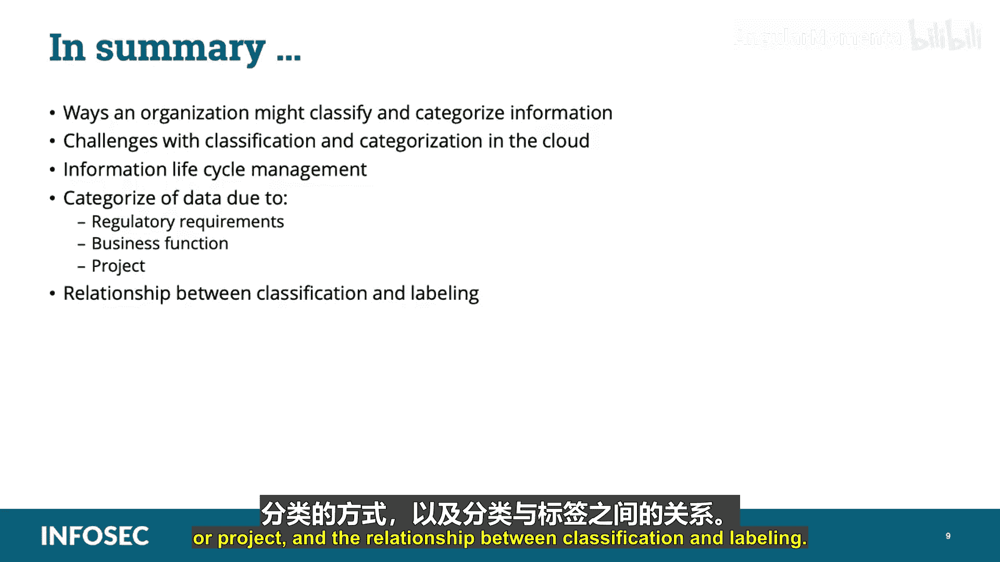

# 016：数据分类与分级 📊

在本节课中，我们将学习云数据安全领域的一个核心概念：数据的分类与分级。这是CCSP认证考试的重要内容，有助于为信息系统建立标准化的防护基线。

***

## 概述

数据分类与分级用于帮助标准化信息系统的防御基线，并确定员工或系统访问信息所需的适当性和信任级别。通过整合具有相似类别和级别的数据，组织能够明确所需的安全控制规模，以应对业务影响分析和漏洞评估中发现的威胁与漏洞。

***

## 数据所有者与分类分级

数据所有者最了解数据在组织中的使用方式及其对组织的价值，因此能够对数据进行适当的分类和分级。

以下是组织对数据进行分级的一些常见方式：

*   **按敏感性分级**：例如，军事领域采用的“绝密”、“秘密”、“机密”、“非密”。数据根据其敏感性被赋予一个级别，这基于未经授权披露可能造成的负面影响。在此模型中，所有数据都必须被分级，即使是不敏感的材料也必须标记为“非密”。
*   **按管辖范围分级**：例如，遵守欧盟的《通用数据保护条例》（GDPR）或其他监管要求。数据的来源地或存储点的地理位置可能对数据的处理方式有重大影响。例如，从欧盟公民处收集的个人身份信息（PII）受欧盟隐私法管辖，这些法律比美国的隐私法更为严格和全面。
*   **按关键性分级**：这是业务影响分析、漏洞评估或风险评估的结果。对于组织生存至关重要的数据，其分级方式必须与普通的日常运营数据区分开来。业务影响分析有助于我们确定哪些材料应以这种方式进行分类。

***

## 分类与分级的区别

对于数据的“分类”与“分级”，除了特定法规覆盖的领域（例如，军事领域的分级结构由联邦法律定义），没有行业定义的法定强制定义。这两个术语经常可以互换使用。为了在本学习路径中讨论方便，我们将尝试遵循以下理解：**数据根据其用途被“分类”，根据其某些特征被“分级”**。请记住，这并不是这些术语的行业标准用法。

再次强调，数据根据其用途被分类，根据其特定特征被分级。

***

## 数据分类作为信息生命周期管理的一部分

作为信息生命周期管理过程的一部分，数据分类可以被定义为一个对数据进行分类的工具，以帮助组织有效回答以下问题：

*   有哪些数据类型可用？
*   特定数据位于何处？
*   哪些访问级别是重要的？
*   实施了哪些访问级别？
*   实施了何种保护级别？是否符合合规法规？

建议采用数据分类流程来实施数据控制，例如数据防丢失系统和加密。数据分类也是某些法规和标准的要求，例如ISO 27000和支付卡行业数据安全标准（PCI DSS）。

***

## 常见的分类类别

实施数据分类有多种原因，数据的分类也有许多不同的参数和类别。以下是一些常用的分类类别：

*   数据类型、格式和结构
*   管辖范围、来源或所属地及其他法律约束
*   上下文、所有权
*   合同或业务约束
*   信任级别和来源
*   对组织或第三方的价值、敏感性和关键性
*   保留和预防义务

分类类别应与要使用的数据控制措施相匹配。例如，在使用加密时，数据可以分为“需要加密”和“无需加密”。对于数据防丢失系统，则需要“内部使用”和“限制共享”等其他类别来正确分类数据。

***

## 组织对数据进行分类的方式

正如之前所述，数据所有者最了解数据在组织中的使用方式，这使其能够恰当地对数据进行分类。组织可以拥有任意数量的信息类别或类型，这些类别可以在整个组织中明确定义和重复使用，也可能由数据所有者在创建阶段任意指定。

以下是组织可能对数据进行分类的一些方式：

*   **按法规遵从性分类**：不同的业务活动受不同法规约束。组织可能希望根据适用于特定数据集的法规来创建类别。这可能包括《格雷姆-里奇-比利雷法案》（GLBA）、支付卡行业数据安全标准（PCI DSS）、《萨班斯-奥克斯利法案》（SOX）或《健康保险携带和责任法案》（HIPAA）合规性。
*   **按业务功能分类**：组织可能希望为数据的不同用途设定特定类别。数据可能根据其在计费、营销或运营中的用途进行标记。
*   **按职能部门分类**：每个部门或办公室可能都有自己的类别，并将其控制的所有数据保留在自己的类别中。
*   **按项目分类**：一些组织可能根据数据关联的项目来定义数据集，以此创建独立的、分隔的项目。

组织对数据进行分类的方式几乎没有限制。无论组织采用何种模式，都应在整个组织内统一采用和执行。临时性的分类与没有分类一样无效。

***

## 数据标记

数据标记通常指为数据附加额外信息，如部门、位置或创建者。标记选项之一是根据特定标准（如绝密、秘密、机密）进行分级。因此，分级通常被认为是数据标记的一部分。

分级可以是**手动的**（通常由创建数据的用户执行），也可以是**自动的**（基于策略规则，根据位置、创建者或内容自动执行）。

当数据所有者创建、分类和分级数据时，也需要对其进行标记。标记应指明数据所有者是谁（通常以办公室或角色表示，而非个人姓名或身份，因为人员可能在组织内变更角色或离开组织）。标记应采用必要的形式，以确保其持久性、可理解性和一致性。例如，硬拷贝数据上的标记可能打印在页眉和页脚，而电子文件中的标记可能嵌入在文件名或命名规则中。

标记应显而易见，并传达相关概念，而不必披露它们所描述的数据。根据组织的需求和业务性质，标记可能包含屏幕上列出的以下类型的信息：

*   创建日期
*   计划销毁或处置日期
*   机密级别
*   处理指示
*   传播或分发说明
*   访问限制
*   来源
*   管辖范围
*   可能适用的法规

***

## 云环境中的挑战

在云部署中，数据分类与分级面临一些挑战：

*   **数据创建**：安全从业者需要确保有适当的安全控制措施，以便任何人在创建或修改数据时，都被强制要求作为创建或修改过程的一部分对数据进行分类或更新。
*   **分级控制**：处理云中的数据时，应实施控制措施，这些措施可能是管理性的（如为创建数据的用户制定指南）、预防性的或补偿性的。对于云客户来说，这些措施的实施可能具有挑战性。
*   **元数据分级**：有时可以根据附加到文件的元数据（如所有者或位置）进行分级。为了使分级过程能够做出正确的决策，这些元数据应该可以被访问，这在云实现中有时具有挑战性。
*   **数据转换控制**：应实施控制措施，以确保相关属性或元数据能够在数据对象格式更改以及云导入和导出过程中得以保留。
*   **重新分级考虑**：云应用程序必须支持基于数据生命周期的重新分级过程。有时，数据对象的新分级可能意味着启用新的控制措施，如加密或保留与处置。例如，客户记录从市场部门转移到贷款部门。

***

## 总结

本节课中，我们一起学习了组织对信息进行分类和分级的多种方式，探讨了在云部署中实施分类与分级时面临的挑战。我们还讨论了信息生命周期管理、常用的分类类别，以及组织可能基于法规要求、业务功能或项目对数据进行分类的方式。最后，我们了解了数据分级与标记之间的关系。掌握这些概念对于构建有效的云数据安全策略至关重要。