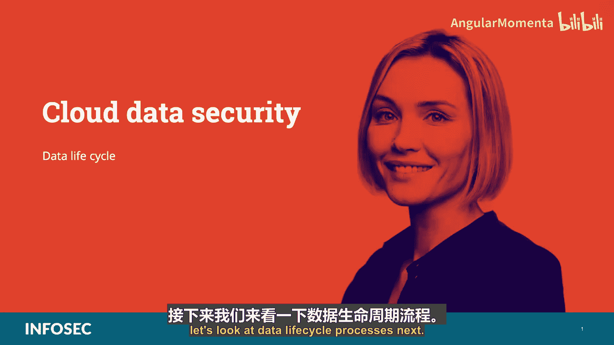
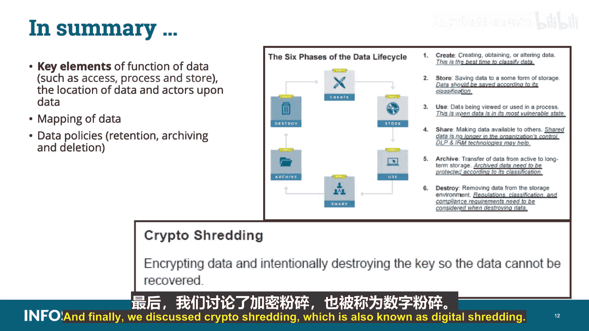

# 017：数据生命周期管理 🔄

在本节课中，我们将学习数据安全生命周期管理。这是CCSP认证云安全领域的关键部分。数据是组织最有价值的资产，其安全控制措施应根据其价值来实施。我们将探讨数据生命周期的各个阶段、关键要素以及如何应用控制措施来保护数据。

---

## 数据生命周期概述 📊

上一节我们介绍了数据安全的重要性，本节中我们来看看数据生命周期的具体过程。数据生命周期框架由SANS研究所提出，并被云安全联盟采纳，它帮助组织将数据生命周期的不同阶段与相应的安全控制措施对应起来。

数据生命周期管理包含三个主要步骤：
1.  映射不同的生命周期阶段。
2.  整合不同的数据位置和访问类型。
3.  将数据映射到功能、参与者和控制措施上。

该框架为数据访问的相关用例提供了映射，并协助在每个生命周期阶段（创建、存储、使用、共享、归档和销毁）制定适当的控制措施。

---

## 数据生命周期的六个阶段 🔄

以下是数据生命周期的六个核心阶段：

**1. 创建**
这是指生成或获取新的数字内容，或对现有内容进行修改和更新。此阶段可以在内部、云端或外部发生。在创建阶段对内容进行敏感性和价值分类是最佳时机。如果分类不正确，可能会导致实施不当的安全控制。

**2. 存储**
这是将数字数据提交到某种存储库的行为。存储通常与创建几乎同时发生。存储数据时，应根据其分类级别进行保护。应实施加密、访问策略、监控、日志记录和备份等控制措施，以避免数据威胁。如果访问控制列表实施不当、文件未进行威胁扫描或分类错误，内容就容易受到攻击。

**3. 使用**
这是指数据正在被查看、处理或以某种活动方式使用（不包括修改）。使用中的数据最脆弱，因为它可能被传输到不安全的位置（如工作站），并且为了处理，它必须被解密。应实施数据防泄漏、信息权限管理和数据文件访问监控等控制措施，以审计数据访问并防止未经授权的访问。

**4. 共享**
这是指信息被提供给其他人访问，例如在用户之间、向客户或合作伙伴共享。并非所有数据都应共享，也并非所有共享都会构成威胁。但由于共享的数据不再受组织直接控制，维护安全可能变得困难。可以使用数据防泄漏技术来检测未经授权的共享，并使用信息权限管理技术来保持对信息的控制。

**5. 归档**
这是指数据离开活跃使用状态，进入长期存储。长时间归档数据可能具有挑战性，成本与可用性之间的权衡会影响数据访问流程。归档的数据仍必须根据其分类进行保护，还必须满足监管要求，并且此阶段可能涉及不同的工具和提供商。

**6. 销毁**
这是指数据被从服务中移除。销毁阶段可以根据用途、数据内容和应用程序使用情况，解释为不同的技术含义。数据销毁可以指逻辑上擦除指针，或使用物理或数字手段永久销毁数据。应根据法规、所使用的云类型（如IaaS与SaaS）以及数据的分类来考虑销毁方法。

**重要提示**：生命周期被描述为一个线性过程，但数据可能会跳过某些阶段或在不同阶段之间来回切换。它不必遵循严格的1、2、3顺序。生命周期模型是一个参考框架，用于提供标准化的方法，并非所有实施或情况都会完全符合。

---

## 数据生命周期的三个关键要素 🔑

为了确定在此生命周期方法中需要部署哪些控制措施来保护数据，您需要关注三个关键要素：**功能**、**位置**和**参与者**。

*   **数据的功能**：可以对数据执行什么操作，例如访问、处理或存储。
*   **数据的位置**：数据存放在哪里。数据是可移植的，根据访问方式，它可能最终出现在不同类型的设备上。
*   **数据的参与者**：谁可以实际访问数据。

每个功能（访问、处理、存储）都由参与者（人）在某个位置执行。我们需要分解这些领域。

**首先，关键数据功能**
以下是三个核心数据功能：
*   **访问**：查看或访问数据，包括复制、文件传输和其他信息交换。需要问：谁可以访问相关数据？他们如何访问（通过什么设备或渠道）？
*   **处理**：对数据执行事务，例如更新数据或在业务流程事务中使用数据。
*   **存储**：将数据存储在文件或数据库中。需要问：数据位于何处？因为数据是可移植的资源，它能够在企业内部和外部不同位置之间快速轻松地移动。

**其次，数据的位置**
生命周期不是单一的线性操作，而是一系列较小的生命周期，始终在不同环境中运行。了解数据的逻辑和物理位置对于满足审计、合规性和其他控制要求非常重要。数据可以在内部网络生成，移动到云端进行处理，然后转移到不同的提供商进行备份甚至归档。

需要考虑的问题包括：谁可能访问我需要保护的数据？我需要保护的数据可能位于何处？每个位置有哪些控制措施？在每个生命周期的哪个阶段，数据可以在位置之间移动？数据如何通过什么渠道或系统在位置之间移动？这些参与者来自哪里？这些位置是可信的还是不可信的？

**最后，数据的访问**
传统的数据生命周期模型并未明确规定谁可以访问相关数据，以及他们如何访问。例如，移动计算作为一种数据访问方式，以及存储、处理和传输数据的大量机制和渠道，都放大了这一要求缺失的影响。

---

## 数据分散技术 🧩

在考虑位置时，我们还需要关注**数据分散**技术。这是一种常用于提高数据安全性但**不使用加密机制**的技术，取而代之的是**位拆分**和**擦除编码**。

*   **位拆分**：类似于为RAID阵列添加加密。数据首先被加密，然后被分割成多个部分，这些部分随后被分布到多个存储区域。然而，位拆分有一些缺点：处理过程消耗大量CPU资源；存在可用性问题（需要所有数据部分都可用才能解密和使用信息）；存储要求和成本高于其他存储系统。

位拆分可以使用不同的加密方法，其中很大一部分基于两种秘密共享加密算法：

1.  **秘密共享缩短**：使用一个三阶段过程：信息加密、使用信息分散算法、使用秘密共享算法分割加密密钥。数据和加密密钥的不同片段随后被签名并分发到不同的云存储服务。这使得在没有任意选择的数据和加密密钥片段的情况下无法解密。
    *公式/代码表示：`SSMS = Encrypt(Data) + IDA_Split(Encrypt(Data)) + SecretShare_Split(Key)`*

2.  **带里德-所罗门码的全或无变换**：集成了全或无变换和擦除编码。此方法首先以无法在不使用所有块的情况下恢复信息的方式，将信息和加密密钥加密并转换为块，然后使用信息分散算法将块分割成“份额”，分发到不同的云存储服务。与秘密共享缩短类似，全或无变换是一种加密模式，只有在知道所有数据时才能理解数据。
    *公式/代码表示：`AONT-RS = AONT_Transform(Encrypt(Data)) + IDA_Split(Transformed_Blocks)`*

*   **擦除编码**：适用于延迟容忍的大容量存储，通常在具有超大容量的对象存储上下文中发现。云运营商常用此技术。它类似于在RAID条带化中使用奇偶校验位。奇偶校验数据帮助您在丢失一个条带化驱动器时恢复丢失的数据；而擦除编码帮助您在云数据不可用或丢失时恢复丢失的数据。

擦除编码是一种数据保护方法，其中数据被分解成片段，扩展并用可配置数量的冗余数据片段进行编码，并存储在不同的位置（如磁盘、存储节点或地理位置）。这允许存储阵列中两个或更多元素发生故障，提供比RAID系统更多的保护。当使用加密时，这通常被称为**分片**。如果数据是静态的，创建和分发数据是一次性成本；如果数据是动态的，则必须重新创建擦除码并重新分发结果数据块。

数据分散类似于RAID技术，将数据分布在不同的存储区域，甚至可能分布在跨越地理边界的不同云提供商。然而，这带来了固有风险：如果数据分布在多个云提供商，一个提供商的故障可能导致用户无法访问数据，无论其位置如何，这对可用性构成威胁。

---

## 控制措施的映射与应用 🗺️

一旦记录并理解了访问、处理和存储这三个项目，就可以指定适当的控制措施并将其应用于系统，以保护数据并控制对数据的访问。这些控制措施可以是预防性、检测性（如监控）或纠正性的。

在完成映射各种数据阶段、数据位置和设备访问后，有必要确定可以对数据做什么（即数据功能）以及谁可以访问数据（即参与者）。一旦确定并理解了这一点，您就可以检查控制措施，以验证哪些参与者有权执行数据的相关功能。

控制措施充当将一系列可能操作限制为允许或禁止操作的机制。例如：
*   **加密**：可用于限制未经授权的查看或使用数据。
*   **应用程序控制**：通过授权和数字版权管理来限制处理。
*   **存储控制**：防止不受信任或未经授权的方复制或访问数据。

此时，我们能够生成一个高级别的数据流映射，包括每个位置的设备访问和数据位置。对于每个位置，我们可以确定相关的功能和参与者。一旦完成映射，我们就能更好地定义要限制哪个参与者执行什么操作，以及通过哪种控制措施来限制。

您只需填写功能、参与者和位置区域，用“是”或“否”表示该项目是否可能执行。例如，在图表中：
*   **功能列**下的“是，是”标识了可用且应允许的项目。
*   **参与者列**下的“可能”为“是”，“允许”为“否”，标识了可能在未来某个时间点与组织协商决定允许的项目。
*   **位置列**下的“否，否”标识了当前组织内不可用的项目，可能需要与组织协商部署和使用计划。

---

## 数据保护策略 📜

数据保护策略应包括云中不同数据生命周期阶段的指南。以下三个策略应得到适当的调整和关注：

**1. 数据保留策略**
这是组织为保持信息可操作或符合监管要求而制定的协议。其目标是：保留重要信息以备将来使用或参考；组织信息以便日后搜索和访问；处置不再需要的信息。该策略在法律法规和业务数据归档要求与数据存储成本、复杂性及其他数据考虑因素之间取得平衡。

一个良好的数据保留策略应为企业定义数据保留期限、数据格式、数据安全和数据检索程序。云服务的数据保留策略应包含以下组成部分：
*   **法规与标准要求**：数据保留考虑因素高度依赖于数据类型及其相关的合规制度。
*   **数据映射**：映射所有相关数据以了解数据类型（如结构化和非结构化）、数据格式、文件类型和数据位置（如网络驱动器、数据库、对象或卷存储）。
*   **数据分类**：基于位置、合规要求、所有权或业务用途（即其价值）对数据进行分类，以决定适当的企业数据保留期限。
*   **数据保留程序**：对于每个数据类别，应遵循管理该数据类型的适当数据保留策略。保留多长时间、保存在哪里（如物理位置和司法管辖区）、使用何种技术和格式，都应在策略中明确规定并通过程序实施。程序还应包括备份选项、检索要求以及恢复程序。
*   **监控与维护程序**：确保整个过程正常运行，包括审查策略和要求，确保没有未经变更管理流程的更改。

**2. 数据归档策略**
数据归档基本上是识别非活动数据并将其移出当前生产系统（从而优化所需资源的性能），并转移到专门的长期归档存储系统。专门的归档系统更经济高效地存储信息，并在需要时提供检索。您的数据归档策略应包含以下所有要素：
*   **数据加密程序**：使用加密进行长期数据归档对组织来说在密钥管理方面可能具有挑战性，因为糟糕的密钥管理可能导致整个归档被破坏。加密策略应指明使用何种介质、恢复选项以及需要加密缓解的威胁。
*   **数据监控程序**：存储在云中的数据往往会为了维护数据治理而被复制和移动。您需要能够跟踪和记录所有数据访问和移动，并确保在整个数据生命周期中正确应用所有安全控制。
*   **执行电子发现和精细检索的能力**：归档数据可能需要根据某些参数（如日期、主题、作者等）进行检索。归档平台应提供对数据进行电子发现的能力，以决定应检索哪些数据。
*   **备份和灾难恢复选项**：应明确规定并清晰记录数据备份和恢复的所有要求。确保业务连续性和灾难恢复计划得到更新并与实施的任何程序保持一致非常重要。
*   **数据格式或介质类型**：数据格式很重要，因为它可能被保存很长时间。专有格式可能会变化，使数据处于无用状态，这被称为介质或数据过时。有效的数字文件维护取决于对硬件、软件、文件格式和存储介质的适当管理。
*   **数据恢复程序**：应定期启动数据恢复测试，以确保流程正常工作且归档文件完整。恢复测试应在隔离环境中进行，以降低风险（如恢复旧病毒或意外覆盖现有数据）。

**3. 数据删除策略**
数据保护程序的一个关键部分是安全处置不再需要的数据。未能这样做可能导致数据泄露和/或合规性失败。安全处置程序旨在确保系统中没有留下可用于恢复原始数据的文件、指针或数据残余。

需要数据删除策略的原因包括：
*   **法规或立法**：某些法律和法规要求对特定记录进行特定程度的安全处置。
*   **业务和技术要求**：业务政策可能要求安全处置数据。此外，像加密这样的流程可能是安全处置明文数据所必需的，即在处置前对其进行加密，然后销毁密钥，这个过程被称为**加密粉碎**。

在云环境中恢复已删除的数据对攻击者来说并非易事，因为基于云的数据是分散的，通常存储在不同的物理位置并具有唯一的指针。但这仍然是一个存在的攻击向量，在评估数据处置的业务要求时应予以考虑。

为了安全处置电子记录，您的数据处置策略应包括如何根据数据的分类和敏感性销毁数据，并与屏幕上列出的销毁方法保持一致：
*   **物理销毁**：通过焚化、粉碎或其他方式物理销毁介质。
*   **消磁**：使用强磁铁扰乱硬盘或磁带等磁性介质上的数据。
*   **覆写**：用随机数据覆盖实际数据。覆写过程发生的次数越多，数据销毁被认为越彻底。
*   **加密**：使用加密方法以加密格式覆盖数据，使其在没有加密密钥的情况下无法读取。

由于前三个选项并不真正适用于云计算，在云中处置数据的唯一合理剩余方法是**加密数据然后销毁密钥**，这被称为**数字粉碎**或**加密粉碎**。

**记住**：加密粉碎（也称为数字粉碎）是故意销毁最初用于加密数据的加密密钥的过程。由于数据是用这些密钥加密的，结果是数据变得不可读（至少直到所使用的加密协议被破解或攻击者能够暴力破解）。为了执行适当的加密粉碎，数据应完全加密，不留下任何明文，并且技术必须确保加密密钥完全不可恢复。这也是我们将密钥与托管数据的云服务提供商分开管理的另一个原因。

---

## 总结 📝

在本节课中，我们一起学习了数据生命周期的六个阶段：创建、存储、使用、共享、归档和销毁。请记住，它们不需要按特定顺序执行。

我们讨论了数据生命周期的三个关键要素：**数据的功能**（如访问、处理、存储）、**数据的位置**和**数据的参与者**。

我们讲解了数据的映射过程，并讨论了数据策略：保留、归档和删除。

最后，我们详细探讨了**加密粉碎**，也称为数字粉碎，这是在云环境中安全处置数据的关键方法。

通过理解数据生命周期并应用适当的控制措施和策略，您可以更有效地在云环境中保护组织最宝贵的资产——数据。