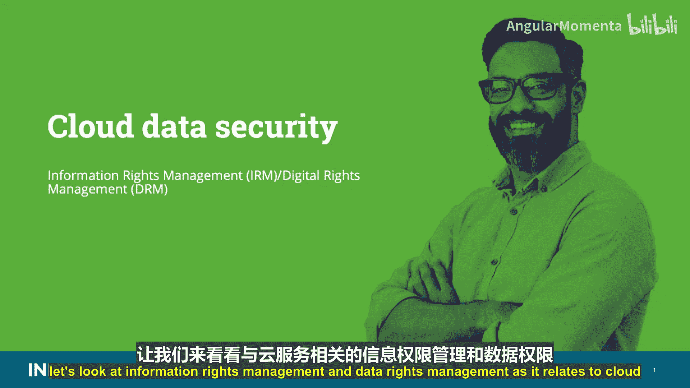
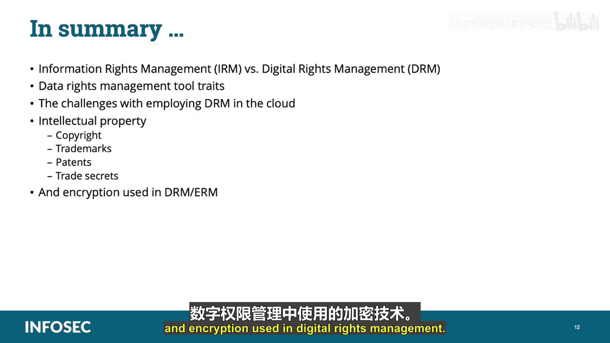

# 018：信息权限管理与数字权限管理

在本课程中，我们将学习云数据安全领域中的两个重要概念：信息权限管理（IRM）与数字权限管理（DRM）。我们将探讨它们如何应用于云服务，了解其核心功能、实现方式以及在云环境中部署时面临的挑战。课程最后，我们还将回顾与知识产权相关的法律保护形式。

---

## 概述

信息权限管理是一种用于保护包含敏感信息的文档免受未经授权访问的IT安全技术。与适用于歌曲、电影等批量生产媒体的传统数字权限管理不同，IRM主要针对个人创建的文档、电子表格和演示文稿。

上一节我们介绍了IRM与DRM的基本区别，本节中我们来看看IRM解决方案通常具备的关键能力。

以下是信息权限管理解决方案应提供的核心能力，无论内容类型或格式如何：

*   **持久保护**：确保文档、消息和附件在静态、传输中乃至分发给接收者后都受到保护。数字权限管理应跟随其保护的内容，无论内容位于何处、是副本还是原始文件，或如何被使用。保护不应因生产环境中的简单操作而失效。
*   **动态策略控制**：数字权限管理工具应允许内容创建者和数据所有者修改其控制下受保护数据的访问控制列表和权限。它允许内容所有者定义和更改用户权限，例如查看、转发、复制、打印，以及在分发后召回或使内容过期。
*   **自动过期**：提供随时自动撤销对文档、电子邮件和附件访问的能力，从而无论内容分发或存储于何处，都能强制执行信息安全策略。由于某些知识产权法律保护的性质，大量数字内容不会永久受保护。当法律保护终止时，数字权限管理保护也应终止。同样，许可证也会过期，受保护内容的访问和权限也应随之过期，无论内容在许可期结束时位于何处。
*   **持续审计**：数字权限管理应允许对内容的使用和访问历史进行全面监控。它提供内容已送达和已被查看的确认，并提供符合组织信息安全政策的证明。
*   **复制限制**：数字权限管理的很大一部分目的是限制对受保护内容的非法或未经授权的复制。因此，DRM解决方案应在多种复制形式上强制执行这些限制，包括屏幕截图、打印、电子复制、电子邮件附件等。
*   **远程权限撤销**：特定知识产权的权利所有者应有权随时撤销这些权利。此能力可能因诉讼或侵权而使用。
*   **支持现有身份验证安全基础设施**：通过利用目录和身份验证系统中已有的用户和组信息，减少管理员参与并加快部署速度。
*   **映射存储库访问控制列表**：自动将基于ACL的权限映射到控制存储库外部内容的策略中。
*   **与所有第三方电子邮件过滤引擎集成**：允许组织根据公司信息安全策略和联邦法规要求自动保护外发电子邮件。
*   **支持电子邮件应用程序**：为Microsoft Outlook和IBM Lotus Notes等电子邮件程序提供接口和支持。
*   **支持其他文档类型**：除了Microsoft Office和PDF，也可以支持其他文档类型。
*   **额外的安全和保护能力**：允许用户拥有额外能力，例如确定谁可以访问文档、禁止打印整个文档或选定部分、禁用复制、粘贴和屏幕截图功能、如果授予打印权限则为页面添加水印、随时使文档访问过期或撤销、通过完整的审计跟踪记录所有文档活动。

---

## 数字权限管理的核心与分类

数字权限管理的核心是加密内容，然后应用一系列权限。权限可以简单到防止复制，也可以复杂到指定基于组或用户的限制，例如剪切和粘贴、电子邮件发送、更改内容等。任何处理DRM保护数据的应用程序或系统都必须能够解释和实施这些权限，这通常也意味着需要与密钥管理系统集成。

数字权限管理主要分为两大类：消费者DRM和企业DRM。

*   **消费者数字权限管理**：用于保护广泛分发的内容，如面向大众的音频、视频和电子书。存在多种不同的技术和标准，重点在于单向分发。消费者DRM在为消费者分发内容方面提供了良好的保护，但记录不佳，大多数技术都曾在某个时间点被破解。
*   **企业数字权限管理**：用于在组织内部以及与业务伙伴之间保护组织的内容。重点在于更复杂的权限、策略以及与业务环境（特别是公司目录服务）的集成。企业DRM可以很好地保护存储在云中的内容，但需要深入的基础设施集成。它对于基于文档的内容管理和分发最为有用。

---

## 在云中实施DRM的挑战

数字权限管理侧重于通过安全和加密来防止未经授权的复制，将分发限制在仅被授权的人员。与数据防泄露系统一样，这通常是一种员工安全控制，在云中并不总是适用，因为所有数字权限管理/企业权限管理系统都基于加密，现有工具可能会破坏云功能，尤其是在软件即服务中。

DRM实施有两种类型：完全DRM和基于提供商的控制DRM。

*   **完全DRM**：是使用现有工具的传统数字权限管理，例如，在将文件存储到云服务之前对其应用权限。如前所述，除非存在某种集成（目前很少见），否则这可能会破坏云提供商的功能，如浏览器预览或协作。
*   **基于提供商的控制DRM**：云平台可能能够通过使用原生功能来强制执行与完全DRM非常相似的控制。例如，用户设备“查看”与“编辑”策略，该策略只允许某些用户在Web浏览器中查看文件，而其他用户可以下载和/或编辑内容。有些平台甚至可以将这些策略绑定到特定设备，而不仅仅是用户级别。

在云中部署数字权限管理会带来一些挑战：

*   **复制限制**：因为DRM通常涉及防止未经授权的复制，而云需要创建、关闭和复制虚拟化主机实例，包括存储在虚拟主机本地的用户特定内容。数字权限管理可能会干扰自动资源分配过程。
*   **管辖权冲突**：云跨越边界和国界，通常以数据所有者未知且无法控制的方式进行，当知识产权权利受地域限制时，这可能会带来问题。
*   **代理或企业冲突**：为执行目的需要本地安装软件代理的数字权限管理解决方案在云环境、虚拟化引擎或自带设备企业使用的各种平台上可能无法始终正常运行。
*   **映射DRM和身份访问管理**：由于涉及内容特定访问控制列表的额外访问控制层，DRM身份访问管理流程可能会与企业或云身份访问管理冲突或无法正常工作。当云身份访问管理功能外包给第三方（如云访问安全代理）时，这一点更为明显。
*   **API兼容性**：由于数字权限管理工具通常内置于内容中，材料的使用在不同应用程序（如内容阅读器或媒体播放器）中可能无法提供相同级别的性能。

---

## 知识产权与法律保护

数字权限管理解决方案用于保护知识产权，以遵守相关保护并维护所有权。知识产权是那类无形的宝贵财产，字面意思是“思维的资产”。您应该为考试熟悉知识产权的法律保护形式，它们是：版权、商标、专利、商业秘密。

*   **版权**：在美国，对思想表达的法律保护称为版权。版权授予首次创造思想表达形式的任何人，通常涉及文学作品、电影、音乐、软件和艺术作品。版权不涵盖思想、特定词语、口号、食谱或公式，这些东西通常可以通过其他知识产权保护来确保。版权保护思想的有形表达，而不是思想的形式。例如，版权保护一本书的内容，而不是书籍本身的实体副本。非法复制书籍内容属于版权侵权，而窃取实体书籍本身则属于盗窃。版权属于作者或作者出售或授予权利的人，而不是当前持有书籍实体副本的人。版权的期限根据其创建条款而异，取决于作品是个人创作还是根据合同创作。通常，版权有效期为作者死后70年，或雇佣作品首次出版后120年。版权赋予创作者对作品的独家使用权（有一些例外）。创作者是唯一合法允许公开表演作品、从作品中获利、复制作品、基于原作创作衍生作品、进口或出口作品、广播作品或出售/转让这些权利的实体。这些独家权利存在例外，包括合理使用原则下的例外，如教学、评论、新闻报道、学术研究、讽刺、图书馆保存、个人备份和为残障人士制作版本等。
*   **商标**：与版权不同，商标保护旨在应用于特定的词语和图形。商标是组织的代表，即品牌。商标旨在保护组织在市场（尤其是公众认知中）建立的声誉和商誉。商标可以是组织的名称、徽标、与组织相关的短语，甚至是特定的颜色、声音或这些元素的组合。为了使商标受法律保护，必须在管辖区域内注册，通常是美国专利商标局。在USPTO注册的商标可以使用®符号表示已注册。各州也提供商标注册，在州注册的商标通常使用™符号。只要商标所有者继续将其用于商业目的，商标就可以永久有效。商标侵权是可诉的，商标所有者可以起诉侵权。
*   **专利**：美国专利商标局也负责注册专利。专利是保护发明、工艺、材料、装饰和植物生命形式的知识产权的法律机制。获得专利后，专利所有者获得生产、销售和进口专利财产的专有权。专利通常从专利申请之日起持续20年。与其他知识产权保护一样，专利侵权可在联邦法院提起诉讼。
*   **商业秘密**：商业秘密是涉及许多与专利材料相同方面的知识产权。它们也可能包括一些未申请专利的内容，例如信息聚合，例如客户或供应商名单。在美国，商业秘密也类似于版权，因为对其的保护在创建时即存在，无需任何额外的注册要求。然而，与知识产权保护不同，被视为商业秘密的材料必须确实是秘密的，不能向公众披露，并且必须努力保持其秘密性以维持这种法律保护。然后，商业秘密受到法律保护，防止非法获取。任何试图通过盗窃或盗用获取商业秘密的人都可以在民事法庭被起诉，也可以因这一罪行在联邦法院被起诉。然而，商业秘密保护并不赋予其他知识产权保护所授予的专有权。任何非该商业秘密所有者的人，通过合法手段发现或发明相同或类似的方法、工艺和信息，都有理由并可以自由地利用这些知识为自己谋利。事实上，通过合法手段发现他人商业秘密的人，也可以自由地为其申请专利，前提是同一材料或概念上没有现有专利。与商标一样，只要所有者仍在商业上使用它，商业秘密就可以永久有效。

---

## 加密在DRM中的应用

加密支持CIA三要素中的保密性（保密性、完整性、可用性），通过防止未经授权的数据查看来实现。在整个企业架构中为所有数据启用加密，可以降低与未经授权的数据访问和暴露相关的风险，但需要解决性能限制和问题。

这里需要记住的是，我们使用加密来保护传输中、静态和使用中的数据。

*   **传输中的数据**：也称为动态数据。为了避免在传输过程中信息暴露或数据泄露，我们使用诸如IPsec、VPN和其他无线协议等加密技术。传输中数据的一个例子是数据进出云进行处理、归档和共享时。当我们在云中为传输中的数据部署数据防泄露时，这有时被称为基于网络或网关的DLP。在这种拓扑结构中，监控引擎部署在组织网关附近，以监控HTTP、HTTPS、SMTP和FTP等传出协议。
*   **静态数据**：加密静态数据是防止任何人在数据归档或存储时看到他们无权查看的数据的好方法。可以根据要求使用不同的加密技术，例如，是实施长期保留还是短期存储，或者数据是位于数据库还是文件系统中。加密机制本身及其部署方式也各不相同。当我们在云中为静态数据部署数据防泄露时，这有时被称为基于存储的DLP。在这种拓扑结构中，数据防泄露引擎安装在数据静态存储的位置，通常是一个或多个存储子系统和文件/应用程序服务器。
*   **使用中的数据**：是指正在被共享、处理或查看的数据。数据生命周期的这个阶段比其他加密技术更不成熟，通常侧重于数据防泄露系统等技术。数据防泄露，也称为数据泄漏防护，可用于检测未经授权的共享。信息权限管理或数字权限管理解决方案可用于保持对信息的控制。可能还需要遵守HIPAA或PCI DSS等法规，这反过来要求对穿越不受信任网络的数据以及某些类型的数据进行相关保护。当我们在云中部署数据防泄露以支持使用中的数据时，这有时被称为客户端或基于端点的DLP应用程序，它安装在用户的工作站和终端设备上。

对于数据库加密，考试需要理解三种基本选项：

1.  **文件/卷加密**：数据库服务器通常驻留在卷存储上。对于这种部署，使用加密引擎加密数据库的卷或文件夹，密钥驻留在附加到该卷的实例上。
2.  **透明加密**：许多数据库管理系统包含加密整个数据库或特定部分（如表）的能力。加密引擎驻留在数据库内部，对应用程序是透明的。
3.  **应用层加密**：在应用层加密中，加密引擎位于使用数据库的应用程序中。由于数据在到达数据库之前已被加密，因此执行索引、搜索和元数据收集具有挑战性。

---

## 总结

在本课程中，我们一起学习了信息权限管理与数字权限管理的区别、数字权限管理工具的特性、在云中部署数字权限管理所面临的挑战、知识产权（如版权、商标、专利和商业秘密）以及数字权限管理中使用的加密技术。理解这些概念对于设计和管理安全的云环境至关重要。