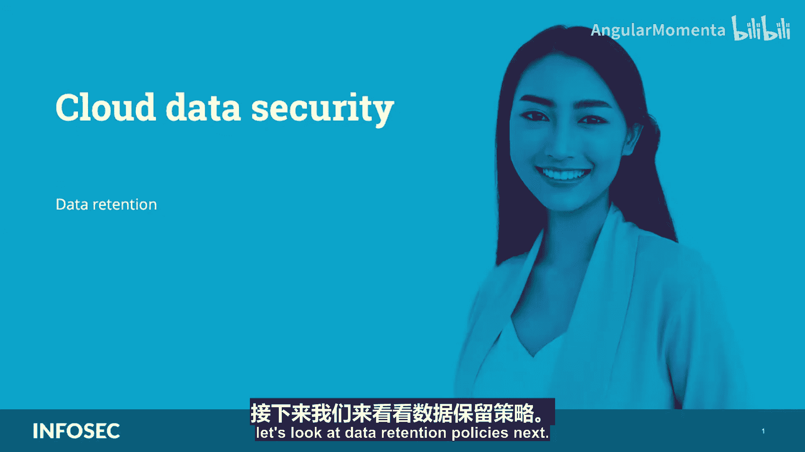
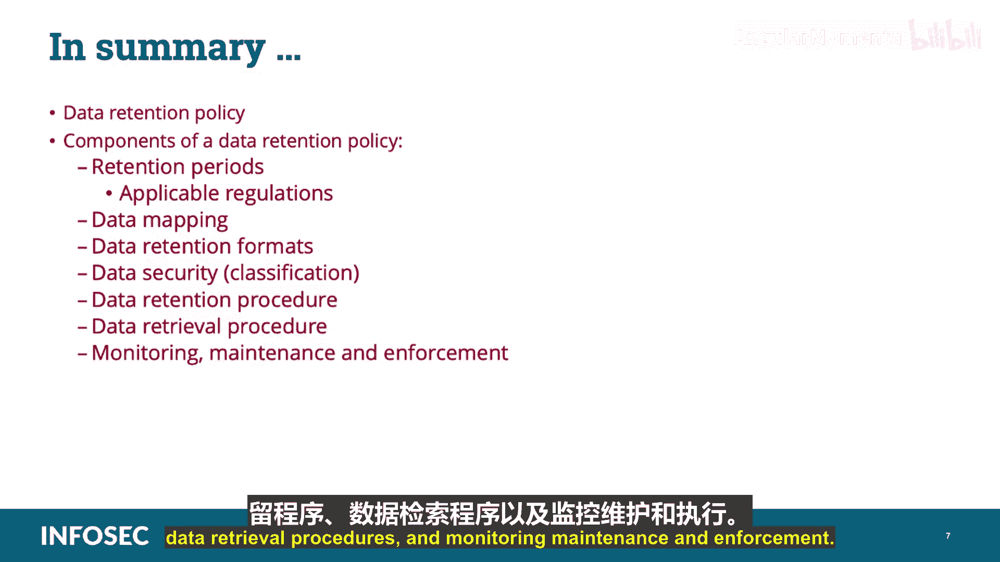

# 019：数据保留策略 📚

在本节课中，我们将要学习云数据安全领域的一个重要组成部分：数据保留策略。我们将探讨其定义、目标、核心组件，以及如何在云环境中有效实施和管理这些策略。

---

## 概述

数据保留策略是组织为满足运营信息需求和法规遵从性要求而制定的协议。它旨在平衡法律、法规和业务数据归档需求与数据存储成本、复杂性之间的关系。一个完善的策略应明确规定保留期限、数据格式、数据安全及数据检索程序。

---

## 策略、标准、流程与程序的关系

在深入探讨数据保留策略的组件之前，我们需要理解组织治理文档的层级关系。

*   **策略**：定义了组织应遵循的方向和高级别目标。
*   **标准**：位于策略之下，明确了可接受与不可接受的行为或行动基线。缺乏标准意味着流程缺乏一致性和质量。
*   **流程**：一套为实现特定目标而设计的输入输出系统，可以支持标准或策略。
*   **程序**：为支持标准而建立的详细步骤，明确了谁在何时、何地、如何执行任务。
*   **支持文档**：包含详细步骤或图示的工作手册、在线手册、指南、模板、表格等，用于支持流程或程序。

上一节我们介绍了治理文档的框架，本节中我们来看看数据保留策略的具体构成要素。

---

## 数据保留策略的核心组件

一个完整的数据保留策略应包含以下关键部分。

以下是策略必须定义的组件列表：

1.  **保留期限**
    *   指数据应被组织保存的时间长度，通常针对归档用于长期存储的非生产环境数据。
    *   保留期限常以年为单位，并由法规、立法或合同协议规定。例如，某些财务记录需保留7年，医疗记录（如受HIPAA管辖）可能需保留6年。

2.  **数据映射**
    *   这是映射所有相关数据以理解数据类型（结构化和非结构化）、数据格式、文件类型以及数据位置（网络驱动器、数据库、对象或卷存储）的过程。

3.  **保留格式**
    *   策略应描述数据实际如何归档，包括存储介质类型（如磁带、光盘、云存储）以及针对该数据的特定处理规范。
    *   例如，某些法规（如PCI DSS）要求存储中的数据必须加密。此时，策略需包含对加密引擎、密钥存储和检索程序的描述，并引用相关法规。

4.  **数据安全与分类**
    *   这涉及根据数据的位置、合规要求、所有权或业务用途（即其对组织的价值）对数据进行分类。
    *   分类也用于决定企业适用的正确保留程序。组织应有一个总体的数据分类策略，作为数据创建者、保管者和用户的指南。
    *   数据保留策略应特别提及不同类别数据将如何归档和检索。

5.  **数据保留程序**
    *   这些程序应基于管理该数据类型的相应数据保留策略来执行。
    *   数据应保存多久、保存在何处（物理位置及司法管辖区）以及如何保存（技术和格式）都应在策略中明确规定，并通过程序实施。
    *   程序还应包括针对所管理数据类型的备份选项、检索要求和恢复程序。

6.  **数据检索程序**
    *   存储的数据可用于纠正生产错误、作为业务连续性和灾难恢复备份，或用于数据挖掘以获取商业智能。
    *   但存储的数据只有在能够被高效且经济地检索并投入生产时才有用。策略应包含数据存入存储和恢复数据的详细流程描述。

7.  **监控、维护与执行**
    *   这是确保整个流程正常运行的步骤，包括审查策略和要求，以确保任何变更都经过变更控制委员会（CCB）的审批。
    *   与所有组织策略一样，该策略应详细列出策略应多久被审查和修订一次、由谁执行、不遵守政策的后果，以及组织内哪个实体负责政策的执行。
    *   测试组织从存储备份中恢复的流程非常有用，有时甚至是法规要求，以确保流程有效且人员受过培训，能在中断发生时恢复数据。

---

## 云环境中的数据保留考量

在云中管理数据保留可能尤其棘手。例如，可能难以确保云服务提供商在指定的保留期限后不再保留组织的数据。

在考虑云迁移以及与潜在云提供商谈判时，组织应特别注意确保提供商能够在服务级别协议（SLA）中支持组织的保留政策。

---

## 总结

本节课中我们一起学习了数据保留策略的重要性及其核心组件。我们探讨了保留期限、数据映射、保留格式、数据安全与分类、数据保留程序、数据检索程序以及监控维护与执行。理解并妥善制定数据保留策略，对于确保云数据安全、满足合规要求及优化存储资源至关重要。