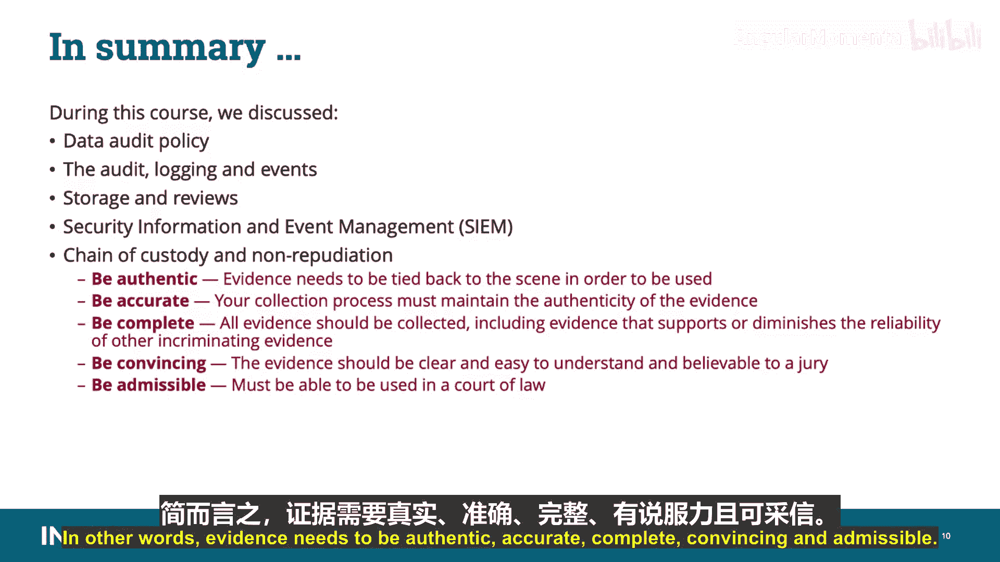

# 020：数据审计

## 概述

在本节课中，我们将要学习CCSP认证云数据安全领域的一个重要组成部分：数据审计。我们将探讨数据审计政策、审计日志与事件、安全信息与事件管理系统以及证据保管链等核心概念。

---

## 数据审计政策

作为CCSP认证云数据安全领域的一部分，接下来我们看看数据审计。在深入本课程之前，需要指出，我将通过用不同颜色高亮显示的方式，指出你必须为CCSP考试掌握的特定信息。屏幕上用双星号标注的颜色高亮的所有内容都与考试相关。

与所有其他资产一样，组织需要通过进行数据审计，定期审查、盘点和检查其拥有的数据的使用情况和状态。

与数据管理的其他要素一样，组织应制定对其数据进行审计的政策。该政策应包括对审计周期、审计范围、审计职责、内部和外部审计流程与程序、适用法规以及监控、维护和执行的详细描述。

与所有类型的审计一样，组织应特别注意确保审计人员不向管理结构中拥有或受其审计数据影响的任何人报告。必须避免利益冲突，审计才具有有效性和实用性。

---

## 审计日志与事件

在大多数组织中，审计以日志记录为基础。日志记录可以多种形式进行，例如事件日志记录、安全日志记录或流量日志记录。

事件可以定义为发生的事情。并非所有事件都重要，但许多事件是重要的。根据跟踪的事件和属性的数量，能够区分哪些事件需要关注可能具有挑战性，可能会产生大量数据。这些数据需要存储，然后进行分析，以发现可能表明系统中存在威胁或漏洞的活动模式，并加以解决。

你可以使用安全信息和事件管理系统来收集和分析来自多个系统的数据流，例如事件、安全和流量日志记录，并结合工具来分析日志数据。

日志可以由应用程序、操作系统和设备生成，用于一般或特定目的。例如，作为操作副产物收集日志的设备，如服务器；或主要以日志记录为目的的设备，如入侵检测系统或安全信息和事件管理系统。

为了能够进行有效的审计和调查，事件日志应包含尽可能多的被检查过程的相关数据。

开放Web应用程序安全项目是一个在线社区，在Web应用程序安全领域提供免费的文章、方法、文档、工具和技术。它建议将屏幕上列出的这些属性集成到事件数据中。可以将其视为4W：时间、地点、人物和事件。

以下是OWASP建议集成到事件数据中的关键属性列表：

*   **时间**：例如日志日期和时间、事件日期和时间以及事件时间戳。事件时间戳可能与日志记录时间不同。
*   **地点**：例如应用程序标识符、应用程序地址、工作站身份、服务名称和协议、地理位置、窗口或页面以及代码位置。
*   **人物**：无论是人类还是机器用户，包括源地址、用户身份。
*   **事件**：例如事件类型、事件严重性、安全相关事件标志以及事件描述。

---

## 日志审查与存储

日志审查和审计是具备特定培训和经验的人员的专业任务。审查员需要了解操作。如果审查员无法区分哪些是授权活动，哪些不是，他们就没有为流程增加安全价值。被指派审查日志的人员必须足够频繁地执行此任务，以便他们能识别基线活动，从而识别偏离基线的情况。

安全从业者的一个自然倾向可能是记录所有内容。我们领域的人以不愿放弃数据而闻名，想知道关于一切的一切。这样做的问题是，记录所有内容会带来额外的风险和成本。聚合如此多的日志数据会带来额外的漏洞并需要额外的保护，而记录所有内容所需的存储将导致存储系统和空间的大规模重复。

---

## 云环境中的数据审计挑战

云环境中的数据审计可能带来一些近乎不可能的挑战。云提供商可能出于运营、合同、安全责任或竞争原因，不愿意或实际上无法向客户披露日志数据。因此，组织在选择云迁移时必须再次考虑具体的审计要求，并将任何此类规范包含在与云提供商的合同或服务级别协议中。

数据审计政策涉及数据生命周期所有阶段的活动。

---

## 安全信息与事件管理系统

安全信息和事件管理系统通常提供此处列出的功能。让我们稍微分解一下这些功能：

*   **数据聚合**：日志管理聚合来自许多来源的数据，包括网络、安全服务器、数据库和应用程序，提供整合、监控数据的能力，有助于避免遗漏关键事件。
*   **关联**：寻找共同属性并将事件链接成有意义的集合。该技术提供执行各种关联技术的能力，以整合不同来源，从而将数据转化为有用信息。关联通常是完整SIEM解决方案中安全事件管理部分的功能。
*   **警报**：作为对关联事件进行自动分析的结果，系统可以产生警报，通知接收者即时问题。警报可以发送到仪表板或通过电子邮件等第三方渠道发送。
*   **仪表板**：提供可以将事件数据转化为信息图表的工具，以帮助发现模式或识别未形成标准模式的活动。
*   **报告**：可以部署应用程序来自动收集合规性数据，生成适应现有安全治理和审计流程的报告。
*   **保留**：基本上是采用历史数据的长期存储，以促进其随时间的关联，并提供合规性要求所需的保留。长期日志数据保留在取证调查中至关重要，因为不太可能在网络入侵发生时发现入侵。
*   **取证分析**：能够根据特定条件跨不同节点和时间段搜索日志。这避免了必须在脑海中聚合日志信息，或为了特定数据而搜索成千上万条日志。

---

## 持续运营与证据保管

为了支持持续运营，此处列出的原则应作为安全运营政策的一部分被采纳。

审计日志记录需要对保护、保留和生命周期管理有更高级别的保证。审计日志可能存在法律、法规或监管合规义务，这些义务规定了问责制和完整性要求。

审计日志记录的持续运营由三个重要流程组成：新事件检测、添加新规则和减少误报。新事件检测用于检测信息安全事件。应创建定义安全事件是什么以及如何处理的策略。构建规则是为了允许检测新事件。规则允许将预期值映射到日志文件，以便在连续操作模式下检测事件。必须更新规则以应对新风险。最后，减少误报。持续运营审计日志记录的质量取决于随时间减少误报数量的能力。为了保持运营效率，这需要不断改进正在使用的规则集。请记住，新事件检测、添加新规则和减少误报都是审计日志记录的一部分。

下一个领域是合同或机构维护。应根据业务需求维护并定期更新适用监管机构、国家和地方执法部门以及其他法律管辖机构的联系人。这将确保已建立直接的合规联络，并使组织为需要与执法部门快速接触的取证调查做好准备。

必须建立处置政策和程序，并实施支持业务流程和技术措施，以安全处置并从所有存储介质中完全删除数据。这是为了确保数据无法通过任何计算机取证手段恢复。

事件响应和法律准备。如果信息安全事件后对个人或组织的后续行动需要采取法律行动，则应要求适当的取证程序，包括保管链，以保存和呈递证据，支持在相关司法管辖区下可能采取的法律行动。在通知后，受影响的客户或租户以及其他外部业务关系应有机会在法律允许的范围内参与取证调查。

请记住，存储需要成本，因此在规划事件数据保存时，必须根据业务和监管要求以及组织的保留责任仔细考虑存储。

保存由ISO 27037定义为维护和保护潜在数字证据的完整性和/或原始状态的过程。请记住这个考试定义。证据保存有助于确保证据在法庭上的可采性，但数字证据众所周知是脆弱的，很容易被更改或销毁。并且由于许多取证实验室的积压，数字证据在被分析或用于法律程序之前，可能会在存储中度过相当长的时间。它需要严格的访问控制，并防止意外或故意的修改，这就是我们对数字证据进行哈希处理的原因。

有两个概念是有效处理物理、数字或电子证据的核心：保管链和真实性。

保管链是从证据收集到在法庭上呈递期间对证据的保存和保护。它记录了证据从收集到销毁或永久归档的整个生命周期中由谁、做了什么、何时、何地以及如何处理。为了使证据在法庭上被认为是可采信的，应存在关于保管链的文件，并阐明从获取到最终处置过程中，对物品的收集、处理、状况、位置、转移、访问以及执行的任何分析。保管链的任何中断都可能对证据的完整性产生怀疑。这就是我们遵循正式的、有良好记录的程序的原因。换句话说，是数字或电子证据的标准操作程序。

当前用于证明真实性和完整性的协议依赖于哈希，哈希会创建一个对任何比特变化都敏感的唯一数字签名，例如SHA-256或SHA-512。如果签名与原始签名匹配或自原始收集以来没有改变，法庭将接受完整性已确立。

请记住，收集的任何证据都需要是真实的。证据需要与现场联系起来才能使用。你的收集过程必须保持证据的真实性、准确性、完整性、说服力和可采性。

*   **准确**：你的收集过程必须保持证据的真实性。
*   **完整**：应收集所有证据，包括支持或削弱其他定罪证据可靠性的证据。
*   **有说服力**：证据应清晰易懂，并能让陪审团信服。
*   **可采信**：它必须能够在法庭上使用。

如果你有多个司法管辖区，提供保管链可能具有挑战性。有时，提供保管链的唯一方法是在服务合同中包含相关条款，并确保云提供商将遵守与保管链问题相关的请求。

---

## 总结

在本节课中，我们一起讨论了数据审计政策、审计日志与事件、存储与审查、安全信息与事件管理系统、保管链和不可否认性。换句话说，证据需要是真实的、准确的、完整的、有说服力的和可采信的。

