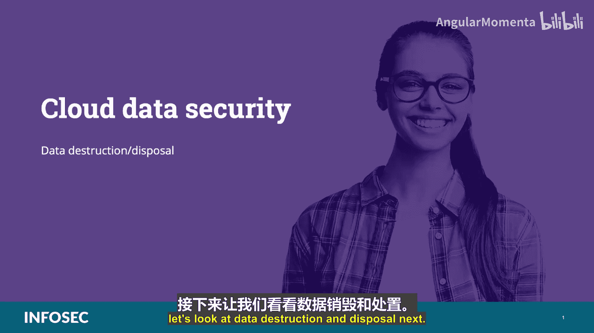
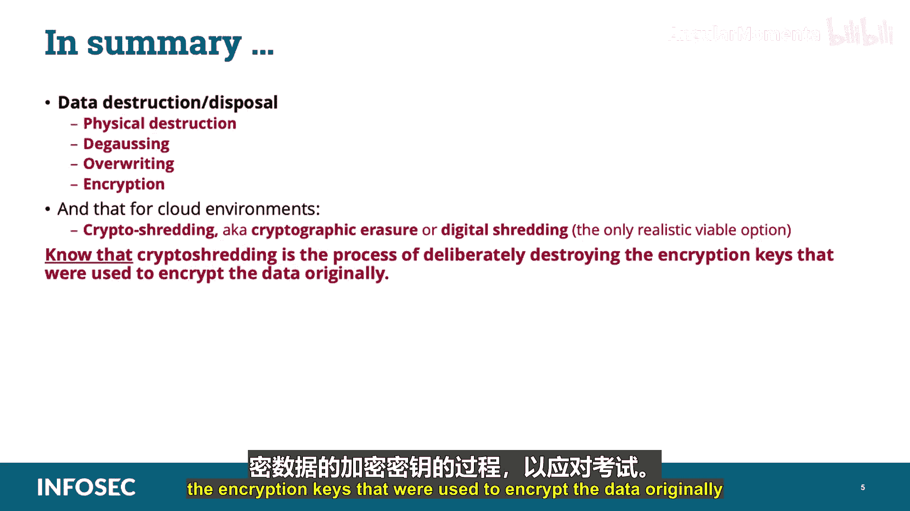

# 021：数据销毁与处置 🗑️🔐

在本节课中，我们将要学习CCSP认证数据安全领域的一个重要环节：数据销毁与处置。我们将探讨为何需要安全地销毁数据、相关的政策要求，以及在传统环境和云环境中不同的数据销毁方法。

---

在深入探讨之前，需要指出，为了帮助您备考，本教程中所有**标为双星号（**）**的内容都是CCSP考试必须掌握的重点信息。

## 数据销毁的重要性

数据销毁程序的一个关键部分是，在数据不再需要时对其进行安全处置。未能做到这一点可能导致数据泄露或合规性失败。安全处置程序旨在确保系统中没有留下任何可用于恢复原始数据的文件、指针或数据残留。

与其他数据管理功能一样，组织需要制定数据处置政策。该政策应包括数据处置流程的详细描述、组织需要遵守的任何适用法规，以及关于何时应销毁数据的明确指导。

## 制定数据删除政策的原因

以下是通常需要制定数据删除政策的原因：
*   **法规或立法要求**：某些法律和法规要求对特定记录（例如包含个人身份信息或健康信息的记录）进行特定程度的安全处置。
*   **业务和技术要求**：业务政策可能要求安全处置数据。此外，某些流程（如加密）也可能要求在创建加密副本后安全处置明文数据。

当然，我们也需要关注**数据残留**，即在尝试了清理和处置方法后遗留的任何数据。

## 云环境中的数据恢复挑战

在云环境中，攻击者恢复已删除数据并非易事，因为基于云的数据是分散的，通常存储在不同的物理位置并具有唯一的指针。由于云服务提供商采取了物理安全措施，攻击者要获得对CSP位置存储介质的任何物理访问权限都将是一个挑战。尽管如此，这仍然是一个存在的攻击向量，在评估业务需求时应予以考虑。

## 数据处置与数据生命周期

对于数据处置，数据处置政策处理的是数据生命周期中“销毁”阶段的活动。

## 传统环境中的数据处置选项

在组织拥有并控制所有基础设施（包括数据、硬件和软件）的传统环境中，数据处置选项是直接且明确的。

传统环境中的数据处置选项包括物理销毁、消磁、覆写和加密。以下是详细说明：

*   **物理销毁**：这是指物理上摧毁存储介质。任何包含数据的硬件或便携式介质都可以通过焚烧、熔化、撞击（即敲打）、钻孔、研磨或工业粉碎等方式销毁。这是首选的清理方法，因为数据在物理上无法恢复。
*   **消磁**：这涉及对存储数据的硬件和介质施加强磁场，使其有效变为空白。**然而，此方法对固态硬盘无效。**
*   **覆写**：这是指用随机字符多次写入数据所在的特定磁盘扇区存储区域，最后一次写入全零和全一。对于大容量存储区域，这可能非常耗时。
*   **加密**：这是指使用加密方法，以加密格式覆写数据，使其在没有加密密钥的情况下无法读取。

## 云环境中的数据处置挑战

由于前三个选项不完全适用于云计算，唯一合理的方法是加密数据。请记住，在云中，数据处置更加困难和危险。

用于处置数据的加密过程称为**加密粉碎**，也称为加密擦除或数字粉碎。**加密粉碎是故意销毁最初用于加密数据的加密密钥的过程。** 这包括使用强加密引擎加密数据，然后获取该过程中生成的密钥，用另一个加密引擎加密这些密钥，最后销毁这些密钥。

要正确执行加密粉碎，数据应被完全加密，不留任何明文，并且该技术必须确保加密密钥完全无法恢复。如果外部云服务提供商或其他第三方管理密钥，这可能很难实现。

## 为何传统方法在云中不可行

硬件和介质永远不能仅通过删除数据来清理。删除操作并不会擦除数据，它只是移除用于处理目的的数据逻辑指针。

在云中，许多传统选项（如物理销毁、消磁和覆写）不可用或不可行，因为硬件归云提供商所有，而非数据所有者所有。物理销毁通常是不可能的。此外，由于很难知道数据在任何给定时刻或历史上的实际具体物理位置，几乎不可能确定所有需要销毁的组件和介质。同样，由于相同的原因，覆写也不是云中清理数据的实用方法。

这使得加密粉碎成为云中数据处置的唯一可编程选项。

## 加密粉碎的注意事项

如果加密粉碎执行正确，应该没有残留。但是，如果某些材料未包含在原始加密中（例如在加密过程中处于离线状态的虚拟机实例，之后被添加到云环境），则可能被视为残留。与所有加密实践一样，正确的实施对于成功至关重要。

---

## 课程总结

在本节课中，我们一起学习了数据销毁与处置。我们讨论了物理销毁、消磁、覆写和加密等方法，并指出对于云环境，**加密粉碎（也称为加密擦除或数字粉碎）是唯一现实可行的选项**。同时，您需要为考试掌握：**加密粉碎是故意销毁最初用于加密数据的加密密钥的过程。**

