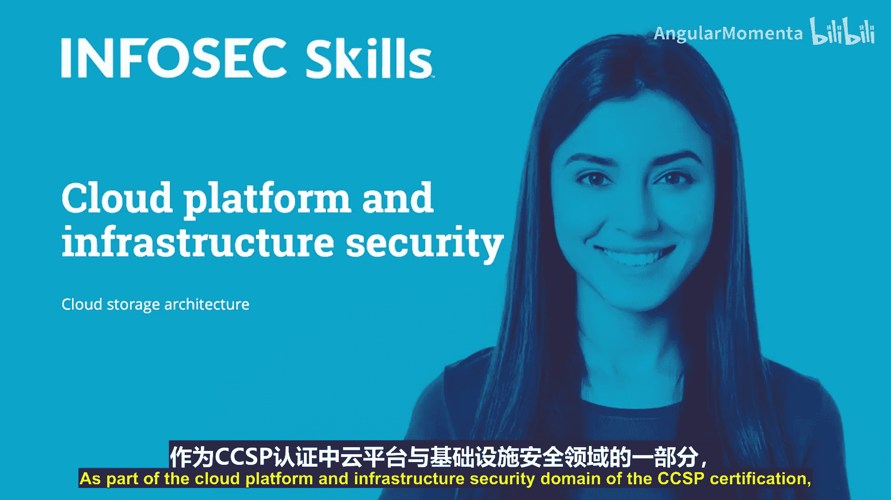
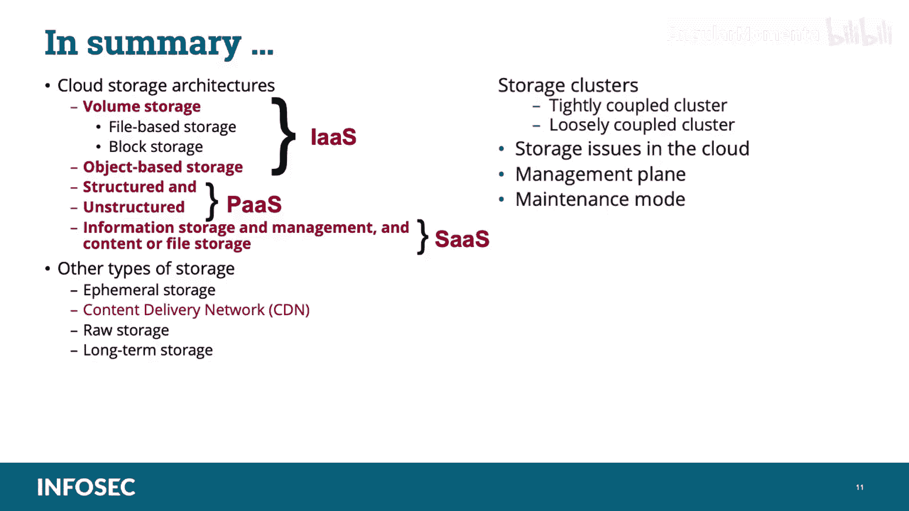

# 022：云存储架构 🗂️

在本节课中，我们将学习云存储架构。作为CCSP认证中云平台与基础设施安全领域的一部分，理解不同的云存储类型及其架构至关重要。我们将逐一探讨各种存储方式，并明确它们在考试中的重点。

***

## 云存储概述

云中有多种存储数据的方式，每种方式都有其自身的优势和成本。接下来的内容将涵盖卷存储及其子类（基于文件的存储和块存储）、基于对象的存储、结构化和非结构化存储、信息存储与管理以及内容或文件存储。

***

## 卷存储

在卷存储中，客户被分配云内的一块存储空间。从客户的角度看，这块存储空间表现为一个附加到其虚拟机的虚拟驱动器。虚拟驱动器的运作方式与连接到实体设备的物理驱动器非常相似，其实际位置和内存地址对用户是透明的。

卷存储架构可以采取不同的形式。关于哪种类型的卷更受青睐，云专业人士间有大量讨论，主要是文件存储和块存储。让我们来看看这两种。

以下是两种主要的卷存储类型：

*   **文件存储**：也称为文件级存储或基于文件的存储。数据以文件和文件夹的形式存储和显示，与传统环境中的文件结构相同，具有所有相同的层级和命名功能。随着云技术和大数据分析工具及流程的发展，文件存储架构变得越来越流行。
*   **块存储**：与文件存储具有文件夹和文件的层级结构不同，块存储是一个空白的卷，客户或用户可以将内容放入其中。块存储可能提供更高的灵活性和性能，但需要更多的管理工作，并且可能需要安装操作系统或其他应用程序来存储、排序和检索数据。块存储可能更适合包含多种类型数据的用途，例如企业备份服务。

卷的存储架构可以包含纠删码，这基本上是一种在云中实现廉价磁盘冗余阵列（RAID）作为数据保护解决方案的手段。我将在几分钟内解释RAID系统是什么。

卷存储可以在任何云服务模型中提供，但通常与基础设施即服务（IaaS）相关联。

***

## 对象存储

对象存储顾名思义，数据以对象的形式存储，而不是文件或块。对象不仅包含实际的生产内容，还包含描述内容和对象的元数据，以及一个用于在整个存储空间中定位该特定对象的唯一地址标识符。这些对象可以通过应用程序编程接口（API）访问，也可能通过Web用户界面访问。

对象存储系统提供表征状态转移（REST）API，允许程序员处理容器和对象。应用程序编程接口（API）通常使用令牌而不是传统的用户名和密码。API可以分为多种格式，其中两种是：
*   **表征状态转移（REST）**：一种软件架构风格，包含创建可扩展Web服务的指导原则和最佳实践。
*   **简单对象访问协议（SOAP）**：一种用于在计算机网络中实现Web服务时交换结构化信息的协议规范。

对象存储系统不是将文件组织在目录层次结构中，而是将文件存储在称为“桶”的容器的扁平组织中，并使用称为“键”的唯一ID来检索它们。对象存储通常是存储操作系统镜像的方式，管理程序将这些镜像启动到运行实例中。

通常，对象存储可以通过将数据分散到多个对象存储服务器上（通过分片和复制）来实现冗余，以此提高弹性。这可以增加弹性和性能，并可能降低数据丢失风险。

对象存储架构允许进行显著级别的描述，包括标记、标签、分类和分类规范。这也增强了索引能力、数据策略执行（如数字版权管理或数据丢失防护系统）以及某些数据管理功能集中化的机会。

同样，任何云服务模型都可以包含对象存储架构，但对象存储通常与基础设施即服务（IaaS）相关联。

**请记住考试要点**：基础设施即服务（IaaS）使用两种存储类型：卷存储和对象存储。卷存储是一个可以附加到虚拟机实例的虚拟硬盘，可用于在文件系统中托管数据。附加到IaaS实例的卷的行为就像物理驱动器或阵列一样。对象存储类似于通过API或Web界面共享访问的文件。**请记住这一点以备考试**。

同时，请确保你理解在基础设施即服务（IaaS）中，用户负责管理应用程序、数据、运行时、中间件和操作系统。提供商仍然管理虚拟化、服务器、硬盘存储和网络。在IaaS中，用户或组织拥有最多的责任和控制权。

***

## 数据库存储

与传统的对应物类似，云中的数据库为存储的数据提供某种结构。数据将根据数据本身的特征和元素进行排列，包括归档数据所需的特定特征，称为主键。在云中，数据库通常是数据中心的后端存储，用户通过浏览器使用在线应用程序或API进行访问。

数据库可以在任何云服务模型中实现，但它们最常被配置为与平台即服务（PaaS）和软件即服务（SaaS）一起工作。

**请记住考试要点**：平台即服务（PaaS）利用两种数据存储类型：结构化和非结构化。
*   **结构化信息**：具有高度组织性的信息，例如关系数据库。它无缝且易于通过简单直接的搜索引擎算法或其他操作进行搜索。
*   **非结构化信息**：不驻留在传统行列数据库中的信息。非结构化数据文件通常包括文本和元数据内容。例如包括电子邮件、文字处理文档、视频、照片、音频文件、演示文稿、网页和许多其他类型的业务文档。请注意，虽然这类文件可能具有内部结构，但它们仍被视为非结构化，因为它们包含的数据无法整齐地放入数据库中。

**请记住考试要点**：平台即服务（PaaS）使应用程序的开发、测试和部署变得快速、简单且经济高效。通过这项技术，企业运营或第三方提供商可以管理操作系统、虚拟化、服务器存储、网络和PaaS软件本身。开发人员管理他们安装的应用程序和他们生成的数据。

你还需要**记住考试要点**：软件即服务（SaaS）利用两种主要的数据存储类型：信息存储与管理以及内容或文件存储。
*   **信息存储与管理**：通过Web界面输入并存储在SaaS应用程序（通常是后端数据库）中的数据。这种数据存储利用数据库，而数据库又安装在对象或卷存储上。
*   **内容或文件存储**：存储在应用程序内部的数据。

***

## 其他存储类型

你应该熟悉的其他存储类型包括：

*   **临时存储**：这种存储类型与基础设施即服务（IaaS）实例相关，并且仅在实例运行时存在。它通常用于交换文件和其他临时存储需求，并会随其实例一起终止。**你需要记住这一点以备考试**。
*   **内容分发网络（CDN）**：内容分发网络是一种数据缓存形式，通常位于高使用需求的地理位置附近，用于存放用户经常请求的数据副本。组织希望使用CDN的最佳例子可能是在线多媒体流媒体服务。与其将数据从数据中心拖拽到大陆上不同距离的用户那里，流媒体服务提供商可以将最常请求的媒体副本放置在可能发出这些请求的大都市区域附近，从而提高带宽和交付质量。CDN的例子包括Akamai Technologies、Amazon CloudFront或Azure CDN。
*   **原始存储和长期存储**：原始设备映射（RDM）是VMware服务器虚拟化环境中的一个选项，它使存储逻辑单元号（LUN）能够从存储区域网络（SAN）直接连接到虚拟机。在Microsoft Hyper-V平台中，这是通过使用直通磁盘实现的。最后是**长期存储**：一些供应商提供专门针对数据归档需求定制的云存储服务。这些服务包括搜索、保证不可变性和生命周期管理等功能。
*   **集群存储**：集群存储是使用两个或更多存储服务器协同工作以提高性能、容量和可靠性。集群将工作负载分配给每个服务器，管理服务器之间的工作负载转移，并提供从任何服务器访问所有文件的能力，无论文件的物理位置如何。存在两种基本的集群存储架构，称为紧耦合和松耦合。紧耦合集群具有物理背板，可在服务器之间提供高性能互连，以实现负载平衡、性能和最大可扩展性（随着集群增长）。松耦合集群提供经济高效的构建块，可以从小规模开始，并根据应用程序需求增长。

**请记住考试要点**：软件即服务（SaaS）使用Web交付由第三方供应商管理的应用程序，其界面在客户端访问。对于企业来说，使用SaaS可以简化维护和支持，因为一切都可以由供应商管理：应用程序运行时、数据、中间件、操作系统、虚拟化、服务器存储和网络。客户端仅负责他们在软件中生成的数据，以及可能在客户端前端的一些应用程序接口。

存储集群应设计为满足服务级别协议中规定的所需服务级别，为多租户托管环境中分离客户数据提供能力，并通过使用加密、哈希、掩码和多路径等保密性、完整性和可用性机制来安全存储和保护数据。

***

## 技术细节与RAID

在技术层面上，云计算中的持久大容量存储通常由旋转硬盘驱动器或固态硬盘组成。出于可靠性目的，磁盘驱动器通常被分组以提供冗余。典型的方法是廉价磁盘冗余阵列（RAID），这实际上是一组技术。RAID组配置了冗余磁盘，以便当其中一个磁盘发生故障时，磁盘控制器仍然可以检索数据。平均而言，磁盘驱动器每年的故障率为3%到5%。粗略地说，在5000个已安装的磁盘中，你可以预期每天发生一次故障。RAID技术在冗余磁盘的百分比和它们可以提供的总体性能方面有所不同。

存储功能的一部分是将磁盘切片并分组为任意大小的逻辑卷，也称为逻辑单元号（LUN）、虚拟硬盘、卷存储、弹性块存储（Amazon EBS）和Rackspace Cloud Block Storage等都是这方面的例子。这些存储卷没有文件系统。文件系统结构由供应给它们的虚拟机实例上的操作系统应用。

**对于考试，你应该熟悉我在本屏幕上为你列出的RAID级别**：
*   **RAID 0**：仅使用条带化。这里没有冗余的好处。如果其中一个磁盘发生故障，信息就会丢失。
*   **RAID 1**：仅使用镜像。在RAID 1中没有性能优势，但你确实有冗余。
*   **RAID 3**：使用奇偶校验和条带化，因此你确实有冗余，因为奇偶校验磁盘可以从丢失的磁盘重新创建信息。
*   **RAID 5**：使用奇偶校验和条带化，奇偶校验交错分布在驱动器上，而不是在单独的驱动器上。

***

## 管理平面

管理平面允许管理员远程管理任何或所有主机，而不必亲自访问每台服务器来打开它或在上面安装软件。

管理平面的关键功能是创建、启动和停止虚拟机实例，并为它们提供适当的虚拟资源，如CPU、内存、永久存储和网络连接（当管理程序支持时）。管理平面还控制虚拟机实例的实时迁移。然后，管理平面可以管理整个设备群中的所有这些资源。

管理平面软件通常运行在它自己的一组服务器上，并具有与受管物理机的专用连接。因为管理平面是整个云基础设施中最强大的工具，它还集成了身份验证、访问控制以及对正在使用的资源的日志记录和监控。

管理平面由权限最高的用户使用，即那些安装和移除硬件、系统软件、固件等的人员。管理平面也是个别租户访问云资源的途径，他们的访问权限有限且受控。

管理平面的主要接口是API，既面向被管理的资源，也面向用户。图形用户界面（GUI）或网页通常构建在这些API之上。这些API允许自动化受控任务，例如编写脚本和编排复杂应用程序架构的设置、填充配置管理数据库、在物理资产上分配资源以及配置和轮换用户访问凭证。

***

## 维护模式

在更新或配置云环境的不同组件时，会使用维护模式。在维护模式下，客户访问被阻止，警报被关闭或禁用，尽管日志记录仍然启用。**你需要记住这一点以备考试**。你应始终遵循供应商特定的指导原则和最佳实践，进入维护模式、在其中操作并成功退出。任何托管的虚拟机或数据如果需要在系统维护期间保持可用，应在进入维护模式之前进行迁移。

维护模式可以应用于数据存储和主机。服务级别协议应描述IT服务，记录服务级别目标，并指定IT服务提供商和客户在进入和执行维护模式时的职责。

***

## 总结

在本节课中，我们一起讨论了云存储架构，包括卷存储、对象存储、结构化和非结构化存储、信息存储与管理以及内容或文件存储。我们还讨论了您应该熟悉的其他存储类型：临时存储、内容分发网络、原始存储和长期存储。我们谈到了云存储集群，无论是紧耦合集群还是松耦合集群。我们还讨论了云管理平面中的存储问题，最后是维护模式。