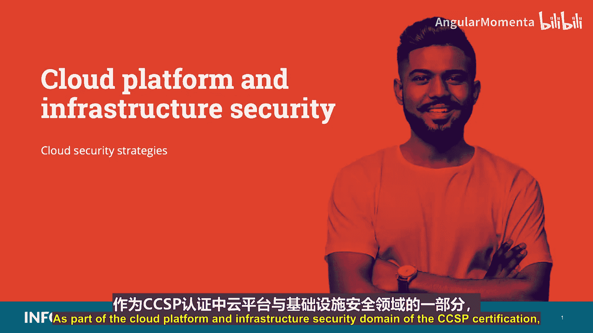
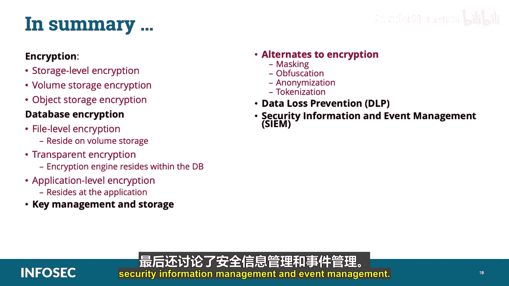

# 023：云安全策略 🔐

在本节课中，我们将学习云安全策略的核心组成部分，包括数据加密、密钥管理、数据保护替代方案、数据防泄露以及安全信息与事件管理。这些知识对于保护云平台和基础设施至关重要。

## 加密技术

上一节我们介绍了云安全策略的重要性，本节中我们来看看实现数据保护的基础技术：加密。加密的挑战在于，它必须与业务考量、法规要求以及组织可能面临的其他限制直接相关。根据数据的状态（静态、传输中或使用中），会采用不同的技术。在云环境中，处理特定威胁（如保护个人身份信息或受法律监管的信息）或防御来自系统和平台管理员的未授权访问时，可能会适用不同的选项。

### 存储级加密

存储级加密的加密引擎位于存储管理层，密钥通常由云服务提供商持有、存储或保留。该引擎会对写入存储的数据进行加密，并在数据离开存储（例如被使用时）进行解密。这种加密类型与对象存储和卷存储都相关，但它只能防止硬件被盗或丢失，无法防止云提供商管理员访问或来自存储层之上的未授权访问。

### 卷存储加密

卷存储加密要求加密数据驻留在卷存储上。这通常通过一个加密容器来实现，该容器被映射为一个文件夹或卷。卷存储加密无法防止通过实例进行的任何访问，例如在实例上运行的应用程序内部进行操作的攻击。

以下是实现卷存储加密的两种方法：

*   **基于实例的加密**：加密引擎位于实例本身。密钥可以在本地保护，但应在实例外部进行管理。基于实例的加密只允许通过卷操作系统访问数据，并能防止物理丢失或被盗、外部管理员访问存储、以及从系统中获取并移除的存储快照或存储级备份。
*   **基于代理的加密**：加密引擎运行在代理实例或应用程序上。代理实例是一台安全机器，负责处理所有加密操作，包括密钥管理和存储。代理将数据映射到卷存储上，并提供给实例访问。密钥可以存储在代理上，或通过外部密钥存储（推荐方法）存储，由代理负责密钥交换和所需的密钥保护。

### 对象存储加密

大多数对象存储服务都提供服务器端存储级加密。但这种加密的有效性有限，因此建议在将数据推送到云存储环境之前，使用外部加密机制对数据进行加密。外部机制可以是文件级加密或应用程序级加密。

*   **文件级加密**：例如信息权限管理或数字版权管理解决方案，其加密引擎通常实现在客户端，并会保留原始文件的格式。
*   **应用程序级加密**：加密引擎位于使用对象存储的应用程序中。它可以集成到应用程序组件中，或通过一个在数据进入云端之前负责加密的代理来实现。该代理可以部署在客户网关或外部提供商的服务上。

### 数据库加密

您应该了解数据库加密的三种选项：

*   **文件级加密**：数据库服务器通常驻留在卷存储上。对于这种部署，您加密的是数据库的卷或文件夹，加密引擎和密钥驻留在连接到该卷的实例上。
*   **透明加密**：加密引擎位于数据库内部，对应用程序是透明的。密钥通常驻留在实例内，但其处理和管理可以卸载到外部密钥管理系统。这种加密可以有效防止介质盗窃、备份系统入侵以及某些数据库和应用程序级别的攻击。
*   **应用程序级加密**：加密引擎位于使用数据库的应用程序中。由于数据在到达数据库之前已被加密，因此难以执行索引、搜索和元数据收集。

## 密钥管理

加密实现中最重要的部分是密钥管理，即对密钥的签发、复制、恢复和分发的控制。柯克霍夫原则指出，即使密码系统的所有细节（除了密钥）都公开，密码系统也应该是安全的。这简单意味着密钥是密码系统真正的力量所在。密钥在其整个生命周期中如何处理和管理成为密码学中最重要的事情，这也是加密密钥管理的前提。没有加密，就不可能以任何安全的方式使用云。远程用户使用加密来创建安全通信连接；云客户的企业使用加密来保护自己的数据；在数据中心内部，云提供商使用加密来确保不同的云客户不会意外访问彼此的数据。

从安全角度来看，首先需要消除对云提供商正在正确处理和控制加密过程的依赖或假设。其次，通过拥有独特且独立的加密机制，在数据和传输级别应用额外的安全性和保密性，确保您不受云环境中共享密钥或数据泄漏的约束或限制。

密钥的存储方式和位置会影响数据的整体风险。在规划密钥管理时，应考虑以下生命周期事项：密钥生成应使用随机数；加密密钥绝不应以明文形式传输，并应始终保持在可信环境中。此外，在考虑密钥托管或密钥管理即服务时，应仔细规划，考虑所有相关法律、法规和管辖要求。无法访问加密密钥将导致无法访问数据，这在讨论保密性威胁与可用性威胁时应予以考虑。最后，在可能的情况下，密钥管理功能应与云提供商分开进行，以强制执行职责分离，并在尝试未授权数据访问时迫使串谋发生。

对于云计算密钥管理服务，最常采用以下两种方法：

*   **远程密钥管理服务**：客户在本地维护密钥管理服务。理想情况下，客户将拥有、运营和维护KMS，从而使客户能够控制信息保密性，而云提供商则可以专注于服务的托管、处理和可用性。
*   **客户端密钥管理**：与远程密钥管理类似，客户端方法旨在让客户或云用户完全控制加密和解密密钥。主要区别在于，大部分处理和控制都在客户侧完成。云提供商可以提供密钥管理服务，但KMS驻留在客户本地，密钥由客户生成、持有和保留。这种方法通常用于软件即服务环境和云部署。

无论最终采用哪种方法，首选的解决方案都是不要将加密密钥与云提供商存储在一起。

密钥管理的常见挑战包括密钥访问、密钥存储以及备份和复制。最佳实践与法规要求相结合，可能会为密钥访问设定特定标准，同时限制或不允许云服务提供商员工或人员访问密钥。密钥的安全存储对于保护数据至关重要。在传统的内部环境中，密钥存储在安全的专用硬件中。这在云环境中可能并不总是可行。最后，在云中，数据备份和复制以多种不同格式进行，这可能影响长期或短期密钥管理有效维护和管理的能力。

云中的密钥存储通常通过内部、外部或第三方方式实现：

*   **内部管理**：密钥存储在同时充当加密引擎的虚拟机或应用程序组件上。这种密钥管理类型通常用于存储级加密、内部数据库加密或备份应用程序加密。这种方法有助于减轻与介质丢失相关的风险。
*   **外部管理**：密钥与加密引擎和数据分开维护。它们可以在同一云平台内部、组织内部或不同的云上。实际存储可以是一个专门为此任务加固的独立实例，或一个硬件安全模块。在实施外部密钥存储时，需要查看密钥管理系统如何与加密引擎集成，以及密钥的整个生命周期（从生成到销毁）如何管理。
*   **第三方管理**：当密钥托管服务由可信的第三方提供时。密钥管理提供商使用专门开发的安全基础设施和集成服务进行密钥管理。您必须评估您打算签约的任何第三方密钥存储服务提供商，以确保允许第三方持有加密密钥的风险得到理解和记录。

通常，云服务提供商使用基于软件的解决方案来保护密钥，以避免基于硬件的安全模块带来的额外成本和开销。问题是，基于软件的密钥管理解决方案通常不符合美国国家标准与技术研究院联邦信息处理标准FIPS 140-2或140-3中规定的安全要求。因此，缺乏FIPS认证的加密对于美国联邦政府机构和其他希望使用云服务提供商的组织来说可能是一个问题。

## 加密的替代方案

由于性能、成本和技术能力等多种原因，使用加密并不总是一个现实的选择。因此，需要采用额外的机制来确保可以实现数据保密性。在这方面，可以使用掩码、混淆、匿名化和令牌化。

### 数据掩码与混淆

数据掩码或数据混淆是从特定数据集中隐藏、替换或省略敏感信息的过程。数据掩码通常用于保护特定数据集，如个人身份信息或商业敏感数据，以符合某些法规要求。它也可用于测试平台，当测试数据不可用时。常见的数据掩码方法有：

*   **随机替换**：用随机值替换或追加原值。
*   **算法替换**：用算法生成的值替换或追加原值。这通常允许双向替换。
*   **混洗**：混洗数据集中不同行的值，通常来自同一列。
*   **掩码**：使用特定字符隐藏数据的某些部分，通常适用于信用卡数据格式。

掩码的主要方法是静态掩码和动态掩码。静态掩码是创建一个带有掩码值的新数据副本。动态掩码有时称为即时掩码，它在应用程序和数据库之间添加一个掩码层。当表示层访问数据库时，掩码层负责即时掩码数据库中的信息。最后，删除法简单地使用空值或删除数据。

识别个人用户或个人信息有两个主要组成部分：直接标识符和间接标识符。直接标识符是唯一标识主体的字段，通常被称为个人身份信息。掩码解决方案通常用于保护直接标识符。间接标识符通常包括人口统计或社会经济信息、日期或事件。间接标识符本身无法识别个人，风险在于数据聚合，当我们开始将多个间接标识符与外部数据结合起来时，可能会导致信息主体暴露。间接标识符的挑战在于，这类数据可能被集成到自由文本字段中，这些字段往往比直接标识符的结构化程度低，从而使过程复杂化。

### 匿名化

匿名化是移除间接标识符的过程，以防止数据分析工具或其他智能机制从多个来源收集或提取数据来识别个人或敏感信息。匿名化的过程类似于掩码，包括识别要匿名的相关信息，并选择相关的数据混淆方法。

### 令牌化

令牌化是用一个无意义的等价物（称为令牌）替换敏感数据元素的过程。令牌通常是一组随机值，具有原始数据占位符的形状和形式，并通过令牌化应用程序或解决方案映射回原始数据。令牌化不是加密。令牌化将数据完全从数据库中移除，用识别和访问资源的机制取而代之。它用于在安全、受保护和受监管的环境中保护敏感数据。令牌化可以在内部实现（当需要集中保护敏感数据时），也可以使用令牌化服务在外部实现。令牌化有助于遵守法规或法律，降低合规成本，减轻存储敏感数据的风险，并减少对该数据的攻击向量。

云及其相关技术一直在发展，可能难以跟上。一些例子是比特分割和同态加密。比特分割通常涉及将加密信息拆分并存储在不同的云存储服务中。根据比特分割系统的实现方式，可能需要部分或全部数据集可用才能解密和读取数据。比特分割的优点是提高了数据保密性；在不同地理区域或司法管辖区之间进行比特分割可能使通过传票或其他法律程序更难获取完整数据；并且它具有可扩展性，可以集成到安全的云存储API技术中，并可能降低供应商锁定的风险。比特分割的挑战在于存储要求和成本通常更高；它是CPU密集型的，因为需要处理和重新处理比特的加密和解密；并且比特分割可能产生可用性风险，因为整个数据集可能无法在云提供商存储和处理比特的同一地理区域内可用。比特分割可以利用不同的方法，其中很大一部分基于秘密共享加密算法。

同态加密仍处于研究阶段，尚未准备好用于生产环境，但其目的是创造在不先解密的情况下处理加密数据的可能性。换句话说，它允许云客户将数据上传到云服务提供商进行处理，而无需先解密数据。

## 数据防泄露

对于基于云的数据防泄露系统，您需要考虑以下几点：云中的数据往往会在不同位置、数据中心、备份之间或在组织内外移动和复制，这种移动或复制可能对任何DLP实施构成挑战。此外，对企业云中数据的管理员访问可能很棘手，您需要确保了解如何在基于云的存储中执行发现和分类。数据防泄露技术也可能影响整体性能，因为扫描所有流量以查找预定义内容的网络或网关DLP可能会影响网络性能。基于客户端的DLP扫描工作站对所有数据的访问，这可能影响工作站的运行。您需要在测试和部署期间查看整体影响，并找出可能的瓶颈。

大多数数据防泄露解决方案包括一套技术，以促进三个关键目标：定位和编录整个企业中存储的敏感信息；监控和控制敏感信息在整个企业中的移动；最后，监控和控制终端用户系统上敏感信息的移动。要被视为一个完整的数据防泄露解决方案，DLP需要解决信息的全部三种状态，并通过集中管理功能进行集成。

管理控制台中可用的服务范围因产品而异，但大多数都具有屏幕上列出的这些常见功能：

*   **策略创建和管理**：这些是策略或规则集，规定了各种DLP组件采取的操作。
*   **目录服务集成**：与目录服务的集成，允许DLP控制台将网络地址映射到指定的终端用户。
*   **工作流管理**：大多数完整的DLP解决方案提供配置事件处理的能力，允许中央管理系统根据违规类型、严重性、用户和其他此类标准将特定事件路由给适当的各方。
*   **备份和恢复**：备份和恢复功能允许保存策略和其他配置设置。
*   **报告**：报告功能可能是内部的，也可能利用外部报告工具。

我们已经在之前的课程中讨论过架构。这里我希望您记住的是：

*   **传输中的数据**：有时称为基于网络或网关的DLP，其监控引擎部署在组织网关附近，以监控传出协议。拓扑可以是基于代理的、网桥、网络分路或SMTP中继的混合。
*   **静态数据**：有时称为基于存储的数据，DLP引擎安装在数据静止的位置，通常是一个或多个存储子系统以及文件和应用程序服务器。这种拓扑对于数据发现和跟踪使用情况非常有效，但可能需要与基于网络或终端的DLP集成以进行策略执行。
*   **使用中的数据**：有时称为基于客户端或终端的，DLP应用程序安装在用户工作站和终端设备上。这种拓扑提供了对用户如何使用数据的洞察力，并能够添加网络DLP可能无法提供的保护。基于客户端的DLP的挑战在于在所有终端设备（通常跨越多个地点和大量用户）上实施的复杂性、时间和资源。

## 安全信息与事件管理

您应该知道，安全信息与事件管理软件产品和服务结合了安全信息管理和安全事件管理。SIEM系统作为软件设备或管理服务出售，也用于记录来自多个系统的安全数据流，并生成合规性报告。SIM或SEM这两个缩写有时可以互换使用。提供长期存储、分析和报告日志数据的领域称为安全信息管理。安全管理的第二个部分，处理实时监控、事件关联、通知和控制台视图，通常称为安全事件管理。简而言之，SIEM将所有信息放入易于理解的通用格式，并提供警报和报告。它提供对网络硬件和应用程序生成的安全警报以及来自网络、防火墙、路由器、服务器、IDS、IPS的日志的实时分析，基本上它将所有信息整合在一起并关联数据，使您能够进行更好的分析并可能识别问题。

您应该了解的一些SIEM特性包括：集中收集日志数据、增强的分析、仪表板和自动响应。它存储来自各种系统日志的原始信息，将信息聚合到单个存储库，规范化信息以使其更有意义。它拥有可以处理、映射和提取目标信息的分析工具，以及警报和报告工具。

SIEM系统通常提供屏幕上列出的功能：

*   **数据聚合**：日志管理从许多来源（包括网络、安全设备、服务器、数据库和应用程序）聚合数据，提供整合监控数据的能力，有助于避免遗漏关键事件。
*   **关联**：寻找共同属性并将事件链接成有意义的集合。该技术提供执行各种关联技术的能力，以整合不同来源，从而将数据转化为有用信息。关联通常是完整SEIM解决方案中安全事件管理部分的功能。
*   **警报**：对关联事件进行自动分析并生成警报，以通知接收者即时问题。警报可以通过仪表板或通过电子邮件等第三方渠道发送。
*   **仪表板**：提供工具，可以将事件数据转化为信息图表，帮助发现模式或识别未形成标准模式的活动。
*   **合规应用程序**：可用于自动收集合规数据，生成适应现有安全治理和审计流程的报告。
*   **保留**：采用历史数据的长期存储，以促进跨时间的数据关联，并提供合规要求所需的保留。长期日志数据保留对于取证调查至关重要，并且不太可能在网络入侵发生时立即发现，因此这些日志在那个时候是必要的。
*   **取证分析**：能够根据特定条件跨不同节点和时间段搜索日志。这减轻了必须在脑海中聚合日志信息或必须筛选成千上万条日志的负担。

为了支持持续运营，应采纳此处列出的原则作为安全运营策略的一部分。审计日志需要更高级别的保护、保留和生命周期管理保证。可能存在对审计日志的法律、法定或监管合规义务，这些义务规定了问责制和完整性要求。审计日志的持续运营由三个重要流程组成：新事件检测、添加新规则以及减少误报。我们来分解一下：

*   **新事件检测**：为检测新的信息安全事件，应创建定义什么是安全事件以及如何应对的策略。
*   **添加新规则**：构建规则以允许检测新事件。规则允许将预期值映射到日志文件，以便在持续运营模式下检测事件。必须更新规则以应对新风险。
*   **减少误报**：持续运营审计日志的质量取决于随时间推移减少误报数量的能力，以保持运营效率。这需要不断改进正在使用的规则集。

以上是所有涉及审计日志的元素。下一个领域是联系人和权限维护。应作为业务需求的一部分，维护并定期更新与适用监管机构、国家和执法部门以及其他法律管辖机构的联系人。这将确保已建立直接的合规联络渠道，并使组织为需要与执法部门快速接触的取证调查做好准备。

安全处置。必须制定策略和程序，并实施支持性的业务流程和技术措施，以安全处置和完全移除所有存储中的数据。这是为了确保数据无法通过任何计算机取证手段恢复。

最后，事件响应和法律准备。在信息安全事件发生后，如果需要对个人或组织采取后续法律行动，应要求适当的取证程序，包括证据链，以保存和呈递证据，支持潜在的法律行动，并遵守相关司法管辖区的规定。在通知后，应给予受影响的客户或租户和/或其他外部业务关系（在法律允许的范围内）参与取证调查的机会。

## 总结

在本节课中，我们讨论了加密技术，包括存储级加密、卷存储加密和对象存储加密。我们还讨论了数据库加密，包括驻留在卷存储上的文件级加密、加密引擎驻留在数据库内部的透明加密，以及加密引擎驻留在应用程序的应用程序加密。我们还讨论了密钥管理和存储、加密的替代方案（如掩码、混淆、匿名化和令牌化）、数据防泄露系统，最后是安全信息与事件管理。