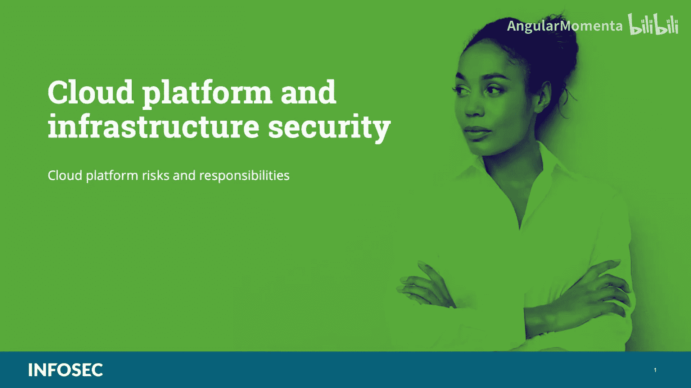
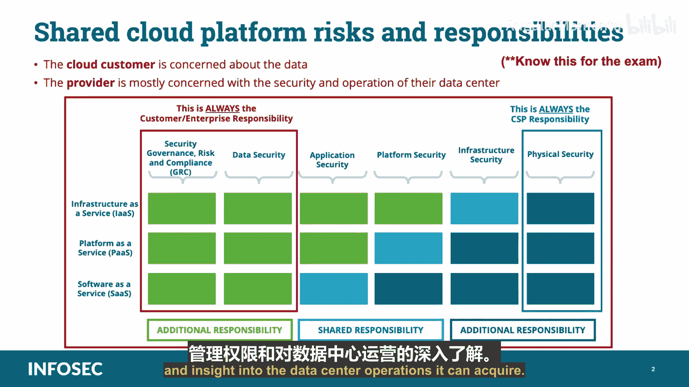

# 024：云平台风险与责任 👨‍💻

在本节课中，我们将学习CCSP认证“云平台与基础设施安全”知识域的核心内容：云平台的风险与责任划分。理解云服务提供商与客户之间的责任共担模型是确保云安全的基础。

## 概述

云平台的风险与责任由云服务提供商和客户共同承担。由于双方都会处理至少部分属于客户的数据，因此与数据处理相关的风险和职责需要明确划分。然而，无论责任如何分配，数据泄露的最终法律责任始终由作为数据所有者的云客户承担。

## 责任划分的核心原则

上一节概述了责任共担的基本概念，本节中我们来看看其核心原则。

客户需要理解，即使数据泄露是由于云提供商的疏忽或恶意行为导致的，客户作为数据所有者，仍需承担最终的法律责任。

尽管如此，提供商和客户仍需通过合同或服务等级协议明确界定各自的具体责任和义务。这种划分在很大程度上取决于客户向云服务提供商购买的服务模型和部署模型。

## 双方的核心关切点

理解了责任划分的原则后，我们来看看云提供商和客户各自最关心的问题。以下是双方关注点的对比：

*   **云客户的核心关切**：客户最关心其**数据**和生产环境。云数据中心的生产环境是客户的生命线。数据泄露、服务故障和可用性缺失是对客户影响最大的事情。因此，客户会寻求对其数据的最大控制权，并希望获得尽可能多的数据中心运营管理权限和洞察力。客户希望实施自己的安全策略。
*   **云提供商的核心关切**：提供商最关心**基础设施**的稳定运行。他们的核心任务是确保云平台的可用性、完整性和保密性。因此，提供商倾向于保留对底层基础设施的完全控制权，并限制客户对硬件和核心虚拟化层的访问与管理权限。

## 影响因素：服务与部署模型

责任的具体划分会受到服务模型和部署模型的直接影响。

*   **服务模型**：例如基础设施即服务、平台即服务或软件即服务。模型层级越高，提供商管理的部分越多，客户的责任范围相应变化。
*   **部署模型**：例如私有云、公有云、社区云或混合云。不同的部署模型在资源隔离、管理控制和安全责任上有所不同。

## 总结

本节课中，我们一起学习了云安全责任共担模型的关键内容。我们明确了**云客户始终是数据安全的最终法律责任方**，同时了解了提供商与客户基于合同划分具体职责的实践。双方的核心关切点（客户重数据，提供商重基础设施）以及服务与部署模型，共同决定了风险与责任的具体分配格局。掌握这些概念对于在CCSP考试中取得好成绩至关重要。