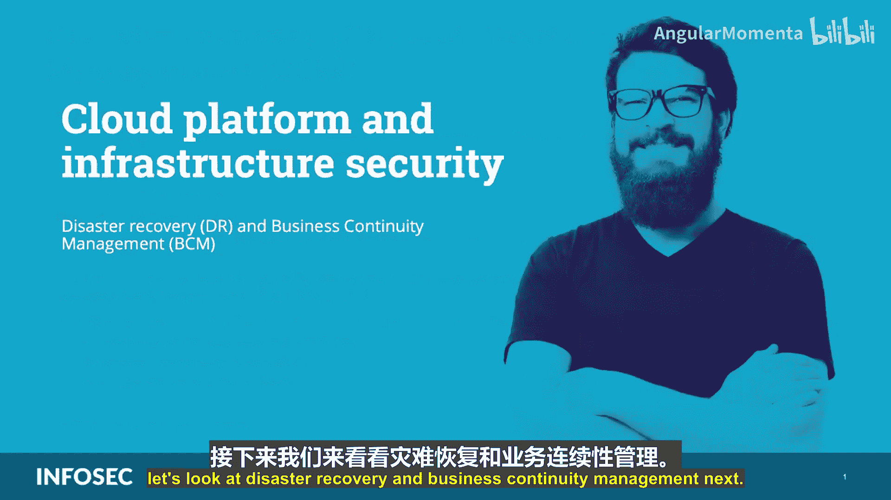
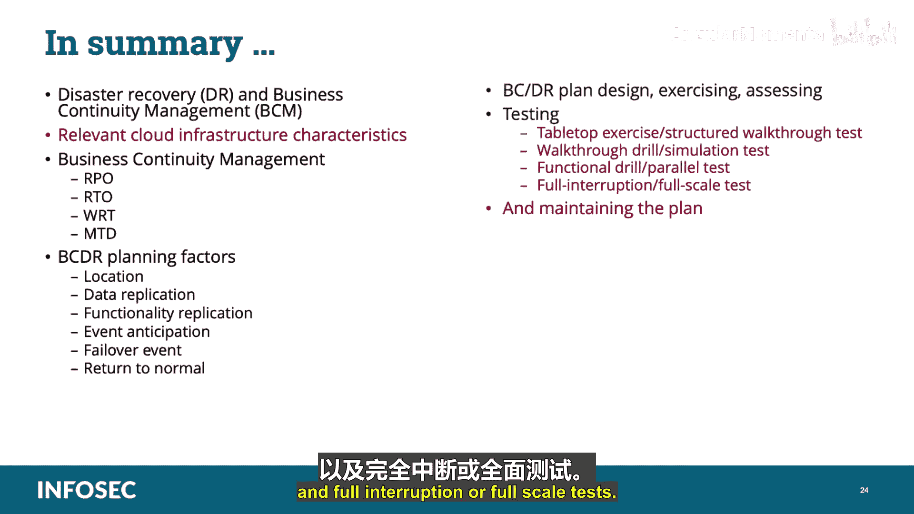

# 025：灾难恢复与业务连续性管理 🛡️

在本节课中，我们将学习CCSP认证中“云平台与基础设施安全”领域的一个重要组成部分：灾难恢复与业务连续性管理。我们将明确两者的区别，探讨核心概念，并了解在云环境中实施相关计划的策略与步骤。

## 概述

业务连续性管理与灾难恢复常被混淆或交替使用。作为安全专业人员，必须确保使用正确的术语并强调它们之间的区别。

## 业务连续性管理与灾难恢复的定义

上一节我们介绍了课程主题，本节中我们来看看这两个核心概念的具体定义。

*   **业务连续性**：这是一个主动的过程，作为整体风险管理的一部分，定期审查和管理对服务、业务功能和组织持续可用性构成的风险与威胁。其目标是在发生**中断**时，保持业务运营和功能。
*   **灾难恢复**：这是一个过程，旨在制定合适的计划和措施，以确保在发生**灾难**（如洪水、风暴、网络攻击等）时，企业能够做出适当响应，以尽可能短的时间恢复关键和基本操作，达到部分或全部的服务水平。其目标是快速**建立、重建或恢复**受灾难影响的业务领域或要素。

在传统的非云环境中，**BC/DR** 是一个用于共同描述业务连续性和灾难恢复工作的术语，通常归属于一个BCDR计划。

## 业务连续性计划的组成部分

理解了基本定义后，我们来看看业务连续性计划的具体构成。一个业务连续性计划包含三个主要功能领域：

以下是业务连续性计划的三个核心组成部分：

1.  **运营连续性计划**：用于在从重大中断中恢复期间，将维持组织范围或设施范围基本流程的活动**迁移到备用地点**。
2.  **业务连续性计划**：确保在组织恢复其主站点运营能力的同时，关键业务功能能在备用地点**持续运行**。其目标是在发生中断时保持业务运营。
3.  **灾难恢复计划**：处理中断的影响，以**及时恢复运营**。这也涉及与备用处理设施、备份和容错相关的技术控制。其目标是在灾难发生后快速恢复受影响的业务领域。

简而言之：
*   **运营连续性** 让你到达备用地点，以便继续处理基本功能。
*   **业务连续性** 让你在备用地点启动并运行。
*   **灾难恢复** 修复主站点的一切，以便你能从备用地点迁回。

## 云环境中的业务连续性与灾难恢复

如今，业务连续性与灾难恢复功能通常利用云来执行，而非传统的温站、热站或冷站。利用云服务时，有两个关键的成功因素：

以下是确保云中BC/DR成功的关键因素：

1.  **理解责任共担模型**：明确你的责任与云提供商的责任。这包括理解任何相互依赖性（如供应链风险）和恢复顺序（即恢复过程中的优先级）。
2.  **明确服务等级协议**：SLA应明确规定业务连续性与灾难恢复的哪些组成部分被涵盖，以及涵盖的程度。SLA就像是规则手册和法律合同的结合体，其中规定了服务可用性、安全控制、流程、通信支持等关键业务要素的最低水平，并由双方同意。

云客户应在签署任何表示接受服务运营条款的文件或协议之前，同意并完全满意所有与业务连续性和灾难恢复相关的细节，包括恢复时间、责任等。

云基础设施的某些特性（如**快速弹性**和**按需自助服务**）可以根据场景为业务连续性与灾难恢复的实现带来显著优势。例如，它们可以提供可快速部署以执行实际灾难恢复的灵活基础设施。

## 核心恢复指标

业务连续性与灾难恢复旨在防范数据不可用及其支持的业务流程无法运行的风险。我们通过实现三个主要指标来做到这一点：

以下是定义恢复要求的三个核心指标：

1.  **恢复点目标**：帮助确定必须恢复和还原多少信息。另一种理解方式是：公司能承受丢失多少数据？公式表示为：`RPO = 可接受的数据丢失量`。
2.  **恢复时间目标**：从中断到恢复处理的总时间。可以将其视为从RPO恢复到RTO所需的时间，以确保不超过最大可容忍停机时间。公式表示为：`RTO = 可接受的恢复时间`。
3.  **最大可容忍中断时间**：组织在仍能维持使命的情况下可以容忍的最大停机时间。

RPO和RTO应根据每个资源的预期损失以及实现目标的成本与收益来设定。

此外，还应理解两个术语：
*   **平均故障间隔时间**：衡量系统特定组件或部件发生故障之间的平均时间。
*   **平均修复时间**：衡量修复故障组件或部件所需的平均时间。

## 业务连续性与灾难恢复规划策略

在制定业务连续性与灾难恢复策略时，需要审视其逻辑顺序。以下是关键的规划组成部分：

以下是制定BC/DR策略时需要考虑的核心组成部分列表：

1.  **位置**：策略应解决重要资产的丢失问题，并在多个位置复制这些资产。考虑的位置取决于预期灾难的地理范围。
2.  **数据复制**：在不同位置维护所需数据的最新副本。这可以在多个技术层面以不同的粒度完成（例如，块级、文件级、数据库级复制）。
3.  **功能复制**：在不同位置重建处理能力。根据要缓解的风险和所选模型，这可能简单如选择额外的部署区域，也可能涉及大量的重新架构。
4.  **事件预期**：规划、准备和配置是指导致实际灾难恢复故障转移的工具、功能和流程（如充分的监控）。越早检测到异常，就越容易实现恢复时间目标。
5.  **故障转移事件**：故障转移能力本身需要某种形式的负载均衡器，将用户服务请求重定向到适当的服务。这可以是集群管理器、负载均衡设备或DNS操作等技术形式。
6.  **恢复正常**：这是灾难恢复的结束。最重要的部分是充分记录经验教训，清理不再需要的资源（包括敏感数据），然后更新计划。这将成为业务连续性与灾难恢复流程的新基线。

## 业务连续性计划的设计与测试

业务连续性计划与传统实施计划有许多相似之处。两者都需要规划、概述、风险管理方法，并且需要被记录、测试和重新评估。

设计阶段的目标是建立和评估候选架构解决方案、技术备选方案，并充实程序和工作流程。在此阶段，应解决一些BC/DR特有的问题，例如：如何调用BC/DR解决方案？调用故障转移服务的手动或自动程序是什么？故障转移期间业务对服务的使用将受到何种影响？如何测试灾难恢复？需要哪些资源来设置、启动和恢复正常？

计划完成后，必须测试所有部分以验证其在真实事件中的有效性。测试策略应包括明确测试范围和目标。

## 演练类型

有多种不同类型的演练可以执行。安全专业人员计划进行的最常见演练类型包括：

以下是四种主要的BCP演练类型：

1.  **桌面演练/结构化走查测试**：简单且低成本。团队成员开会讨论计划的每个要素和程序，评估有效性并记录改进领域。主要目标是确保所有领域的关键人员都熟悉业务连续性计划。
2.  **走查演练/模拟测试**：比桌面演练更复杂。参与者选择一个特定的事件场景，并将业务连续性计划应用于其中。通常包括模拟灾难，所有团队练习他们的训练和判断，并模拟他们的行动。
3.  **功能演练/并行测试**：第一种涉及实际将人员调动到其他站点以建立通信并执行业务连续性计划中规定的实际恢复处理的测试类型。目标是确定关键系统是否可以在备用处理站点恢复。
4.  **完全中断/全面测试**：最全面和复杂的测试类型。尽可能真实地模拟现实生活中的紧急情况。组织通过在处理站点使用备份媒体处理数据和交易来实施其全部或部分业务连续性计划。

每次演练后，安全专业人员应进行事后报告，记录发现的项目并解决演练中发现的问题。行动项应被跟踪直至解决，并且在适当的情况下，应更新计划。

## 测试与维护

需要记住的是，业务连续性计划与任何其他安全事件响应计划一样，需要按计划间隔或在发生重大组织或环境变化时进行测试。每个计划都必须经过测试、审查和更新，以确保计划有效，并且人们知道在危机中该做什么。

## 总结

本节课中，我们一起学习了灾难恢复与业务连续性管理。我们探讨了相关云基础设施特性、业务连续性管理的核心指标（RPO， RTO， WRT， MTD），以及BC/DR的规划因素（如位置、数据复制、功能复制等）。我们还详细讨论了业务连续性计划的设计、演练与评估，包括各种测试类型（桌面演练、走查演练、功能演练、全面测试），最后强调了计划的维护与更新的重要性。