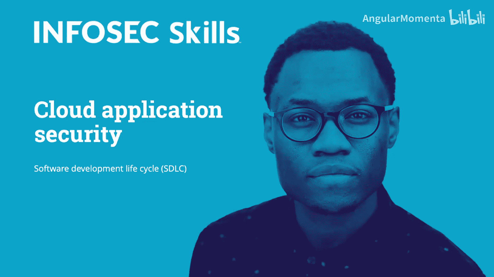
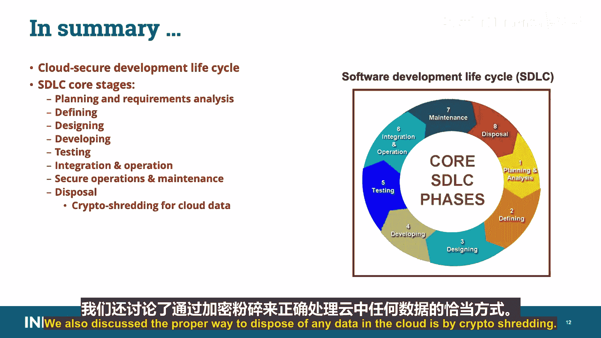

# 026：软件开发生命周期 (SDLC) 🛡️

在本课程中，我们将学习云应用安全领域的一个核心概念：软件开发生命周期。我们将了解其目的、核心阶段，以及为何在开发初期就融入安全考量至关重要。

在深入学习之前，需要说明：本课程中，所有为CCSP考试必须掌握的重点信息，将使用双星号标注并以不同颜色高亮显示。**所有以此颜色高亮的内容都与考试相关。**

软件开发生命周期流程旨在帮助开发出**成本效益高、高效且高质量**的产品。业界已发布多种SDLC模型，它们大多包含相似的阶段。屏幕上展示了几个例子，你可以看到它们之间的相似性。任何软件开发的生命周期都包含一系列相当直观的阶段。

一个公认的事实是：**在应用部署后发现的安全问题，其修复成本会呈指数级增长**。安全需要在前期就构建进去，而不是在最后才添加。通常，在应用设计阶段就融入安全特性，比在最后为修复漏洞而打补丁要便宜得多。后者通常成本高昂。

例如，你根据选定的模型和特定设计功能购买一套房子。但在施工期间，建筑师认为取消地下室、直接加建一层会更高效。如果你等到房子建成后才审查图纸，修复地下室问题将花费你多得多的钱。而如果在早期、开始打地基之前就提出，问题本可以被轻松解决和纠正。同理，**将安全构建到应用中，比在最后试图“外挂”安全来修复问题要便宜得多**。

我们学习和实践云安全开发生命周期的真正目的，是为了确保我们使用的云应用从一开始就尽可能安全，免受漏洞和其他可能导致数据泄露的风险影响。云安全软件开发生命周期与其他传统开发生命周期具有相同的基础结构，尽管在处理云环境时需要考虑一些额外因素。

就像数据一样，软件也有一个基于开发和使用阶段的有用生命周期。尽管阶段的名称和数量可能有争议，但它们通常至少包括屏幕上列出的核心阶段。下面我们来逐一分解。

## 规划与需求分析

这是确定业务和安全需求及标准的阶段。主要重点是识别项目经理和利益相关者，确定功能性和非功能性需求，并在初始设计开始前对其进行定义。**识别与项目相关的安全需求和风险**也在规划阶段进行，同时还要规划质量保证需求和测试。

## 定义阶段

在此阶段，我们清晰定义并记录产品需求，以便提交给客户并获得批准。定义阶段专注于识别应用的业务需求，例如会计、数据库或客户关系管理。无论应用的目的如何，**在定义阶段彻底梳理业务需求的各个方面及其关联至关重要**。我们应尽量避免在此阶段选择任何特定的工具或技术。过早选择的诱惑会导致我们有了一个既定结论（例如“我们将使用X技术”），而不是真正考虑所有可能最佳满足业务需求的可能性。这也是我们**细化在需求收集和分析阶段确定的安全需求**的地方。

## 系统设计阶段

系统设计阶段有助于明确硬件和系统要求，并有助于定义整体系统架构。在设计阶段，我们开始开发用户故事，例如用户想要完成什么、如何完成，以及界面将是什么样子、是否需要使用或开发任何API。**这也是我们确定将使用何种编程语言（如Python、Visual Basic等）和架构（如REST、SOAP等）的地方。**

## 开发阶段

一旦收到系统设计文档，工作被划分为模块、单元或冲刺，实际的开发就开始了。开发阶段是编写代码的阶段，需考虑先前确定的定义和设计参数。**在此阶段可能会对代码片段进行一些测试**，以确定在与其他开发周期或冲刺集成之前，代码是否按设计工作。然而，主要的测试将在流程的后期进行。

## 测试阶段

代码开发完成后，将根据已建立的需求进行测试，以确保产品真正解决了在规划和需求分析阶段收集的需求。在应用开发测试阶段，会对应用执行诸如渗透测试和漏洞扫描等活动。我们将使用静态应用安全测试（SAST）和动态应用安全测试（DAST）的技术和工具。**SAST** 基本上是离线分析未运行时的代码，而 **DAST** 则针对运行状态下的应用。我们将在本课程后面的软件安全测试模块中更详细地讨论这一点。

## 集成与安全运维阶段

一旦所有其他阶段完成，应用将进入所谓的集成与安全运维阶段。这是在成功完成全面测试、并且应用及其环境被认为安全之后。大多数SDLC模型将维护阶段作为其终点。在我们的模型中，我们将其单独列为下一阶段。但需要理解，**集成、运维和维护可能同时发生**。

运维和处置在一些模型中被包含，作为进一步细分传统上发生在维护阶段的活动的一种方式。大多数Web和云应用与传统应用略有不同，因为它们通常可以持续地就地更新，并且可能服务非常长的时间。只要供应商和应用仍然是一个可行的解决方案，它们可能会作为SDLC运维和维护阶段的一部分，保持打补丁和更新。一个例外情况是，供应商创建的应用包含了现有技术或库，并且当这些技术的新版本、更安全的版本发布时，供应商没有更新应用。软件会因此变旧，并且由于技术演进通常带来的巨大跨越，升级变得困难。

将新应用与现有应用集成可能是开发过程的一部分。然而，当开发人员和运维资源对支持组件和服务没有开放或无限制的访问权限时，集成会变得复杂，特别是在云提供商管理基础设施、应用和集成平台的情况下（例如在SaaS模型中）。从安全角度来看，一旦应用使用SDLC原则实施完成，应用就进入了安全运维阶段。

**正确的软件配置管理和版本控制对应用安全至关重要**。有一些工具可用于确保软件根据指定要求进行配置。其中两个工具是名为 **Chef** 和 **Puppet** 的程序。Chef专为云自动化设计，而Puppet技术或工具则专为简化而设计。我们来分解一下：

以下是配置管理工具 Chef 的主要功能：
*   **应用部署**
*   **基础设施配置**
*   **网络配置管理**

Chef 是一种配置管理工具，它提供了一种将基础设施资源定义为代码的方式。用户可以通过代码管理基础设施，而不是使用手动流程。

以下是配置管理工具 Puppet 的主要功能：
*   **使用Puppet DevOps工具动态扩展和缩减机器。**
*   **通过持续检查和确认主机上所需配置的状态，为每个主机定义不同的配置。**
*   **提供对所有机器的集中控制，以便对配置所做的任何更改都可以轻松传播到所有相关机器。**

Puppet 也是一种配置管理工具，可用于配置、部署和管理服务器。

安全运维阶段要求进行动态分析、漏洞评估和渗透测试等活动，作为持续监控计划的一部分。活动监控和一些OSI第7层防火墙（也称为Web应用防火墙，因为OSI第7层是应用层）也属于此阶段。

需要指出，处置阶段并未包含在CCSP通用知识体系（CBK）中，但值得在此提及。一旦软件完成其工作或被更新、不同的应用取代，就必须对其进行安全处置。大多数软件公司都有公布的软件生命周期，作为其面向客户信息的一部分，其中包括应用的生命周期，具体说明诸如为客户提供安全补丁的时长和种类等事项。过时且不再受支持的软件在许多方面对企业构成风险，主要是由于供应商在公布的寿命终止日期之后，停止了对任何新发现漏洞的支持或补丁开发。这就是为什么寿命终止的应用应该被处置，并由接管其功能的应用替换。当一个应用已完成其使命且不再需要时，我们需要以安全的方式处置它及其生成的数据。

从云的角度来看，确保数据被妥善处置具有挑战性，因为你无法物理移除驱动器。因此，我们需要实施 **加密粉碎**。其过程如下：
1.  使用加密引擎对数据进行加密。
2.  使用不同的加密引擎对加密密钥进行加密。
3.  最终销毁那些密钥，使得最初加密的任何数据都无法恢复。

## 总结 📝

在本课程中，我们讨论了云安全开发生命周期。软件开发生命周期的核心阶段包括：规划与需求分析、定义、设计、开发、测试、集成与运维、以及最终的处置。我们还讨论了在云中处置任何数据的正确方法是通过加密粉碎。

