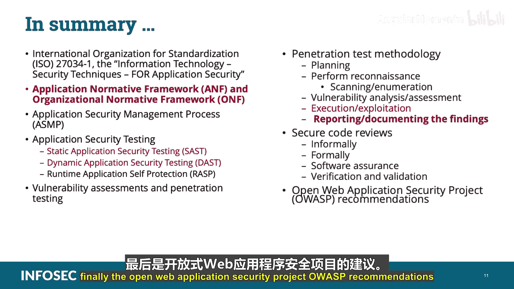

# 027：软件测试 🔍

在本节课中，我们将学习CCSP认证“云应用安全”领域的一个重要组成部分——软件测试。我们将探讨相关的国际标准、测试框架、不同类型的测试方法以及具体的测试流程。课程内容将严格遵循考试要求，所有考试重点信息将用**加粗**标出。

---

## 概述 📋

软件测试是确保云应用安全的关键环节。本节课程将系统介绍软件测试的国际标准、核心框架、不同测试类型（如静态测试、动态测试）以及完整的渗透测试方法论。掌握这些知识，对于构建安全的云应用和通过CCSP考试至关重要。

---

## ISO/IEC 27034-1 标准

首先，我们来看一个重要的国际标准。国际标准化组织（ISO）和国际电工委员会（IEC）共同制定并发布了 **ISO/IEC 27034-1**，即“信息技术安全技术-应用安全”。该标准定义了相关概念、框架和流程，旨在帮助组织将安全集成到其软件开发生命周期中。**考生需记住，ISO 27034-1为应用安全的所有组件制定了一个框架。**

该标准提出了**组织规范性框架（ONF）**，作为应用安全最佳实践所有组件的框架。ONF包含以下部分：
*   **业务上下文**：包括组织采用的所有应用安全策略、标准和最佳实践。
*   **法规上下文**：包括所有影响应用安全的标准、法律和法规。
*   **技术上下文**：包括适用且可用的技术。
*   **规范**：记录组织的IT功能需求，以及解决这些需求的合适方案。
*   **角色、职责和资格**：记录组织中与IT应用相关的参与者、与应用安全相关的流程。
*   **应用安全控制库**：包含基于已识别威胁、上下文和目标信任级别，保护应用所需的已批准控制措施。

---

## 应用规范性框架（ANF）

上一节我们介绍了组织级的框架（ONF），本节中我们来看看针对具体应用的框架。**应用规范性框架（ANF）** 与组织规范性框架（ONF）结合使用，并为特定应用创建。ANF维护了ONF中适用于特定应用的部分，以使该应用达到所需的安全级别或目标信任级别。

**ONF与ANF是一对多的关系**，即一个组织规范性框架（ONF）将作为基础，用于创建多个应用规范性框架（ANF）。

ISO/IEC 27034-1定义了一个**应用安全管理过程（ASMP）** 来管理和维护每个应用规范性框架（ANF）。ASMP包含五个步骤：
1.  指定应用需求和环境。
2.  评估应用安全风险。
3.  创建和维护应用规范性框架（ANF）。
4.  配置和运行应用。
5.  审计应用的安全性。

---

## 应用安全测试类型

在了解了管理框架后，我们进入具体的测试技术。通过测试软件对Web应用进行安全测试，通常分为两种截然不同的类型：静态测试和动态测试。

**首先是静态应用安全测试（SAST）。** 这通常被视为一种白盒测试，测试人员在**不执行应用程序代码**的情况下，对应用程序的源代码、字节码和二进制文件进行分析，以确定可能暗示安全漏洞的编码错误和遗漏。换句话说，静态应用安全测试在代码未运行时离线分析代码。

SAST可用于发现以下问题：
*   跨站脚本（XSS）错误
*   SQL注入漏洞
*   缓冲区溢出
*   未处理的错误条件
*   潜在的后门

**其次是动态应用安全测试（DAST）。** 这通常被视为一种黑盒测试，工具用于发现被分析应用程序中的各个执行路径，这意味着该工具是在应用程序**运行状态**下对其进行测试。**理解SAST和DAST扮演不同角色，且一方并不优于另一方，这一点很重要。** 静态和动态应用测试协同工作，以增强组织创建和使用的应用程序的安全可靠性。

**测试本质上是动态的。** 在动态测试中，我们测试系统并观察其行为。相比之下，静态测试技术则在不执行被测系统的情况下对其进行分析。

**运行时应用自我保护（RASP）** 通常被认为侧重于那些在其运行时环境中内置了自我保护能力的应用程序。这些能力对应用逻辑、配置以及数据和事件流有完全的洞察力。运行时应用自我保护通过自我保护和自动重新配置（无需人工干预）来防止攻击，以响应某些条件（如威胁、故障等）。

---

## 渗透测试方法论

除了自动化的SAST和DAST，模拟真实攻击的渗透测试是另一项关键评估手段。**渗透测试的主要目标是模拟对系统或网络的攻击，以评估环境的风险状况。** 成功渗透测试的关键在于明确的目标、范围、既定目标、商定的限制和可接受的活动。换句话说，就是建立完善的“交战规则”。

渗透测试的方法论有多种，但以下是一个已成为最佳实践的基本逻辑流程：

**以下是执行渗透测试的基本步骤：**

1.  **规划**：在开始任何操作之前，必须先进行规划。例如，确定目标、制定攻击策略、目标和退出策略等。
2.  **侦察**：规划好策略后，我们执行侦察。即搜索目标上任何可用的相关信息，以协助你规划或执行测试。目标是收集尽可能多的目标信息。侦察的一部分是**扫描和枚举**（也称为网络或漏洞发现）。这是从目标系统、应用程序和网络直接获取信息的过程。枚举阶段是渗透测试项目中被动攻击和主动攻击界限开始模糊的点。
3.  **漏洞分析与评估**：在此阶段，我们分析数据以确定可能被利用并成功攻击目标的潜在漏洞。我们寻找系统、网络和应用程序之间可能导致可利用暴露的关系。
4.  **执行与利用**：完成漏洞分析和评估后，我们进入执行和利用阶段。测试通常被分解为多个执行线程或测试场景组。在这里，我们利用发现的任何漏洞。
5.  **报告与记录**：在测试过程中，我们收集并生成可用于得出结论和阐明发现的信息。此处的目标是清晰地呈现发现、使用的战术、采用的工具，并对测试收集的信息进行分析。**这些报告必须受到严格保护，因为它们包含的信息非常敏感。**

文档和分析报告应包括：
*   目标系统中发现的漏洞
*   安全措施中的差距
*   入侵检测和响应能力
*   日志活动和分析的观察结果
*   建议的应对措施

**漏洞测试（或评估）与渗透测试的主要区别在于：** 在漏洞测试中，你执行除“执行与利用”外的所有步骤；而在渗透测试中，你执行包括“执行与利用”在内的所有步骤。**考生需记住这一点。**

---

## 其他安全评估与保证措施

完成渗透测试的讲解后，我们来看其他几种确保代码安全的方法。**执行安全代码审查**是评估代码是否具备适当安全控制的另一种方法。这些审查可以非正式或正式进行。

*   非正式代码审查可能涉及一个或多个人检查代码部分，寻找漏洞。
*   正式代码审查可能涉及使用经过培训的审查员团队，他们在审查过程中被分配特定角色，并使用跟踪系统来报告发现的漏洞。

由于在云中运行应用程序与传统基础设施存在显著差异，因此使用保证和验证技术（如软件保证、验证和确认）来解决应用程序的安全问题非常重要。

*   **软件保证**：包含为确保软件按预期运行而开发和实施的方法和流程，同时减轻可能给最终用户带来伤害的漏洞、恶意代码或缺陷的风险。
*   **验证和确认**：应在软件开发生命周期的每个阶段执行，并与变更管理组件保持一致。作为流程的一部分，你应该验证需求是否被指定且可衡量，测试计划和文档是否全面并始终应用于所有模块、子系统，并与最终产品集成。这两个概念都可以应用于企业内部的代码开发，以及外部采购的应用程序接口和服务。

---

## OWASP测试建议

最后，我们参考一个广泛使用的实践指南。**开放式Web应用程序安全项目（OWASP）** 创建了一个测试指南，推荐了九种主动安全测试类别，我们在此列出以供参考（仅作信息用途）：
1.  身份管理测试
2.  身份验证测试
3.  授权测试
4.  会话管理测试
5.  输入验证测试
6.  错误处理测试
7.  弱加密技术测试
8.  业务逻辑测试
9.  客户端测试

这些OWASP类别在云环境中与传统基础设施中同样适用。然而，与你选择的部署模型（如公有、私有或混合）相关的额外威胁模型可能会引入需要分析的新威胁向量。

---

## 总结 🎯

本节课中我们一起学习了软件测试的多个核心方面。我们讨论了国际标准 **ISO/IEC 27034-1**（信息技术安全技术-应用安全），以及**应用规范性框架（ANF）** 和**组织规范性框架（ONF）**。我们探讨了**应用安全管理过程（ASMP）** 和各类应用安全测试，包括**静态应用安全测试（SAST）**、**动态应用安全测试（DAST）** 和**运行时应用自我保护（RASP）**。我们还讲解了**漏洞评估与渗透测试**的区别，并详细介绍了渗透测试的方法论步骤：**规划、侦察、漏洞分析与评估、执行与利用、报告与记录**。此外，我们也涵盖了**安全代码审查**（正式与非正式）、**软件保证与验证确认**，以及**开放式Web应用程序安全项目（OWASP）** 的测试建议。掌握这些知识，将帮助你更全面地理解和实施云环境下的应用程序安全测试。