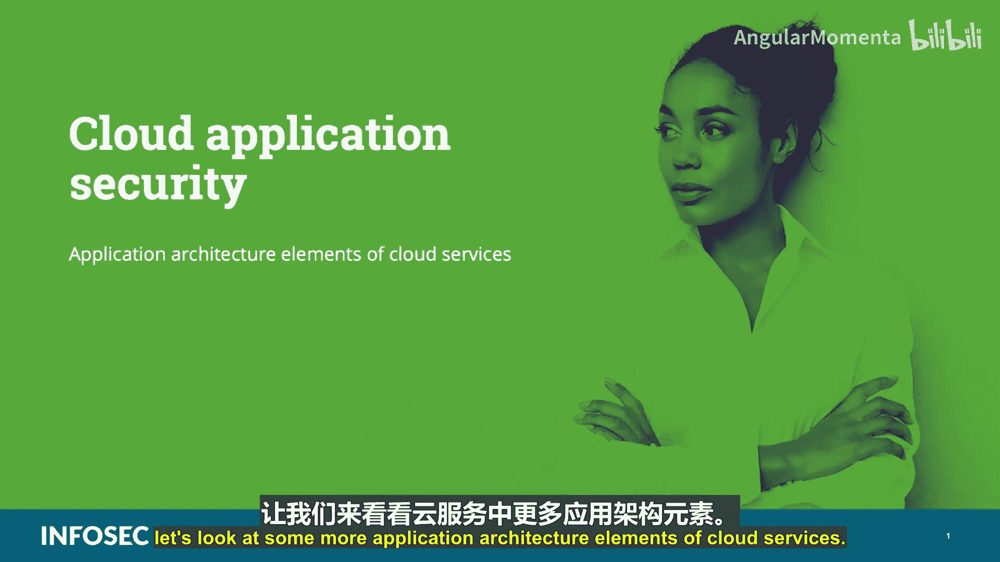
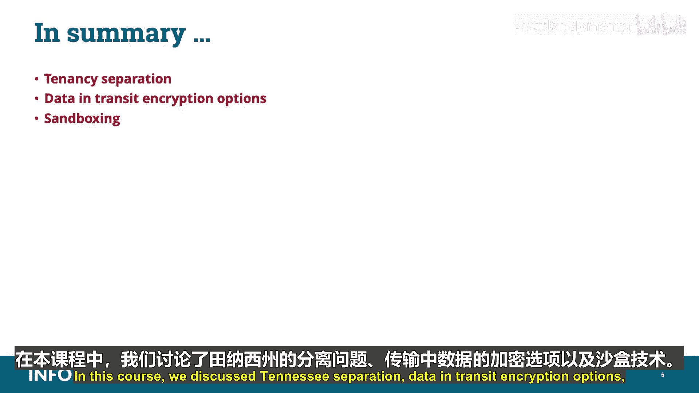

# 028：云服务应用架构要素 🔐

在本节课中，我们将学习CCSP认证中云应用安全领域的核心内容，重点探讨云服务的应用架构要素。我们将了解多租户环境下的风险、数据加密选项以及沙箱技术等关键概念。

## 概述

作为CCSP认证云应用安全领域的一部分，我们来深入了解云服务的一些应用架构要素。在开始之前，需要指出，**所有以双星号标注并高亮显示的内容，都是CCSP考试必须掌握的重点信息**。

## 多租户环境与数据隔离风险

在传统的企业环境中，所有基础设施和资源都由组织拥有和控制，不存在其他租户（包括组织的竞争对手）通过应用程序、操作系统、客户镜像和用户之间的无意数据泄露来访问组织数据的风险。

云环境的情况则完全相反，因为云采用了**多租户**架构。例如，一台典型的主机可以根据其CPU、内存和存储容量支持众多虚拟租户。

因此，所有这些可能性都存在。所以，必须通过大量使用对策来解决应用程序、操作系统、客户镜像和用户之间每个无意数据泄露的风险。这些对策需要确保访问控制、进程隔离，并阻止客户机或主机逃逸尝试。

通常，对策的实施将依赖于某种形式的远程管理，并且很可能需要与云服务提供商进行大量的协商与合作。

## 应用接口与风险管理

云操作的一个吸引人之处在于能够以新颖的方式灵活使用现有数据。这种能力通过部署各种各样的**应用接口**来提供和增强，其中许多接口可以由云客户选择，甚至在“自带设备”环境中，用户可以在自己的平台或设备上选择更多接口。

尽管选择多样很诱人，但它也带来了一些风险，因为提供此功能的API可能来源可疑。云客户的最佳利益是制定一个正式的策略和流程，用于审查、选择和部署那些可以通过某种方式验证的API。必须建立一种确定来源和软件本身可信度的方法，并将其作为策略或程序的一部分，纳入变更管理计划中。

## 本地应用云迁移的挑战

除了变更管理，本地应用（通常被称为“on-premise”应用）通常设计在快速的本地环境中运行，数据在本地访问、处理和存储。将这些应用迁移到云端并不总是可行，甚至可能不切实际。

遇到的问题可能很简单，比如需要回连企业网络，这会减慢应用程序速度；也可能很复杂，比如某些代码无法在某些基于云的Web平台上有效运行，因为它们是为本地环境设计的。

然而，一些应用程序，特别是数据库应用程序，在云中可能运行得更好。通常，云存储比老式企业机械硬盘更快，并且数据到达计算和存储组件的传输距离通常更短，因为它们都存储在同一逻辑单元中。

问题在于，并非所有应用都为云环境做好了准备。通常，必须重新评估和修改代码，以便在云中有效运行。可能需要使用过去未曾用过的加密技术，并且存在一系列其他问题。即使某些应用最终能在云中成功运行，它们也并非总是立即可用，可能需要更改代码或配置才能有效工作。

## 数据传输加密

在使用基于云的系统时，重要的是要记住它们是在可信和不可信网络（也称为半可信和敌对环境）内部和之间运行的。因此，在云中运行的系统和服务之间以及与之通信的数据应该被加密。

以下是更多数据传输加密选项的例子：

*   **传输层安全**：TLS是一种协议，可确保互联网上通信的应用程序及其用户之间的隐私。当服务器和客户端通信时，TLS确保第三方无法窃听或篡改任何消息。TLS是安全套接层SSL的继任者。
*   **安全套接层**：SSL是用于在Web服务器和浏览器之间建立加密链接的标准安全技术。此链接确保在Web服务器和浏览器之间传递的所有数据保持私密和完整。
*   **虚拟专用网**：VPN，也称为IPSec网关，是一种使用公共线路（通常是互联网）连接到专用网络（如公司内部网络）而构建的网络。有许多系统使您能够创建使用互联网作为数据传输媒介的网络。

## 数据安全技术与控制措施

请记住，在企业中提供和保护机密服务时，使用密码学和加密的需求是普遍的。重要的是要了解您可能需要部署或使用的相关数据安全技术，以确保云中数据的机密性、完整性和可用性。

潜在的控制措施和解决方案包括：

*   **加密**：用于防止未经授权的数据查看。
*   **数据防泄露**：DLP用于审计和防止未经授权的数据外泄。
*   **文件和数据库访问监控**：用于检测对存储在文件和数据库中的数据的未经授权访问。
*   **混淆、匿名化、令牌化和掩码**：这些是不使用加密保护数据的不同替代方案。它是用随机字符或数据隐藏原始数据的过程。

诸如令牌化、数据掩码和沙箱化等技术和方法对于增强加密解决方案的实施非常有价值。

## 沙箱技术

**沙箱化**是一种软件虚拟化形式，它允许程序和进程在它们自己隔离的环境中运行。在云计算领域，沙箱化指的是在一个严格控制的环境中，利用一个受保护区域来测试未经测试或不可信的代码，或者通过执行和观察文件行为来更好地了解应用程序是否按预期方式工作，以发现恶意活动的迹象。

这些沙箱通常是内存中的受保护区域，不允许任何类型的进程在环境外运行，也不允许其他应用程序或进程从外部访问。换句话说，沙箱隔离并仅使用预期的组件，同时与其余组件保持适当的分离，例如能够将个人信息存储在一个沙箱中，而将公司信息存储在另一个沙箱中。

如今，许多开发人员会专门租用此类云平台进行测试，因为该模型基于计量使用、按使用付费，开发人员只需在使用时付费。一旦应用程序开发完成，他们可以关闭服务并停止付费。

一些供应商已经开始提供基于云的沙箱环境，组织可以利用这些环境来全面测试应用程序。您还应该知道，由于在沙箱内运行的程序对您的文件和系统的访问权限有限，它无法进行任何永久性更改。这意味着沙箱中发生的一切都留在沙箱中。

沙箱化也是传统基于签名的恶意软件防御的替代方案，被视为发现零日恶意软件和隐蔽攻击的一种方式。特别是，较新的浏览器实现了沙箱化和更强的ActiveX控制，以帮助缓解ActiveX漏洞。因此，如果它是经过签名的证书，它可以做任何它想做的事情；如果它没有签名，它就会留在沙箱中。

## 总结

在本节课中，我们一起学习了云服务应用架构的关键要素。我们探讨了**多租户环境下的数据隔离风险**、**应用接口的管理**、**本地应用云迁移的挑战**，并详细介绍了**数据传输加密**的多种选项（如TLS、SSL、VPN）。最后，我们了解了**沙箱技术**作为一种重要的安全隔离和测试手段。掌握这些要素对于设计和维护安全的云应用至关重要。