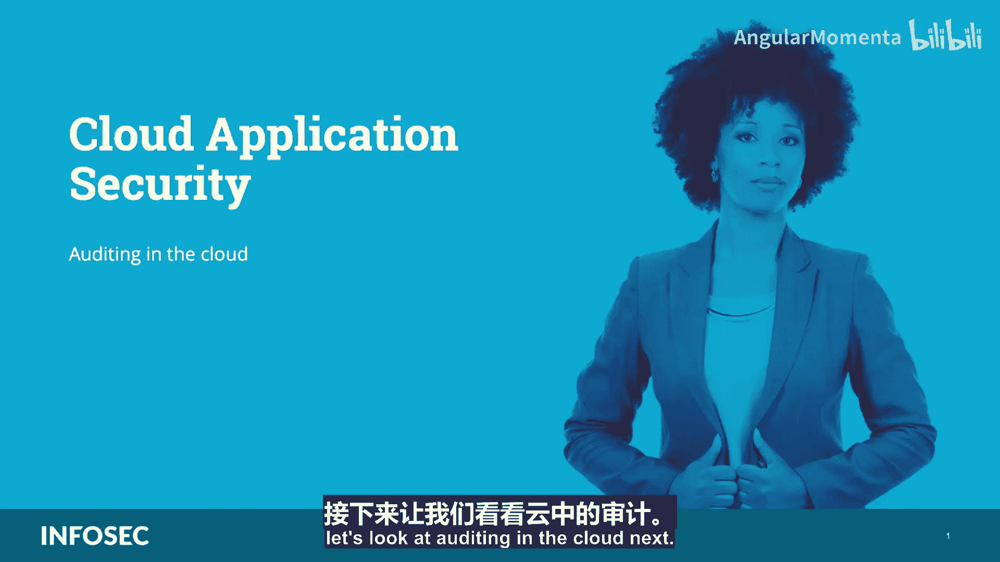
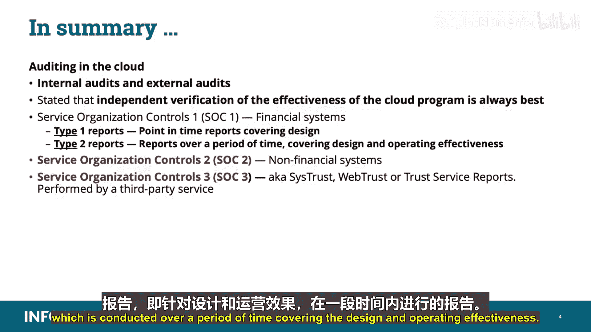

**CCSP认证课程：05：云环境中的审计**

在本节课中，我们将学习CCSP认证“云应用安全”领域的一个重要部分：云环境中的审计。我们将探讨审计的挑战、关键框架、内部与外部审计的角色，以及服务组织控制报告的类型和用途。

在深入课程之前，请注意，我会使用**双星号标注**来突出CCSP考试中你必须掌握的特定信息。屏幕上所有以该颜色高亮显示的内容都与考试相关。

---

**云审计的挑战与基础框架**

审计云环境是一项极具挑战性的任务。云安全联盟开发了**云控制矩阵**，旨在根据控制措施，对相关领域、控制项及其影响的组件进行列表和分类。

CCM是识别和列举各项控制措施及其潜在影响的宝贵资源。在CCM表格中，还为每项控制提供了最佳实践指南，并将CCM与多个框架和标准进行了映射，例如：
*   ISO 27001
*   NIST 800-53
*   COBIT
*   CSA可信云倡议

CCM及合适的框架应构成任何云战略、风险审查或基于合规性评估的基础。

**内部审计：组织的第三道防线**

随着组织将服务迁移到云端，云客户和提供商都需要持续保证控制措施已到位或正在识别中。组织的内部审计在业务职能和风险管理职能之后，充当第三道防线。

内部审计职能可以与利益相关者互动，以云视角审查当前的风险框架，协助制定高风险缓解策略，并执行多种云审计，例如：
*   组织当前的云治理计划
*   数据分类治理
*   影子IT（指在组织内部未经明确批准而构建和使用的IT系统与解决方案）

云提供商也会进行内部审计，特别是在部署新服务时，以便在规划云控制设计期间获取客户所需的反馈并降低风险。

**外部审计与独立验证**

对内部控制进行独立验证的另一个潜在来源是外部审计师执行的审计。外部审计的范围与内部审计有很大不同，外部审计通常侧重于财务报告相关的内部控制。

验证控制和云计划的有效性始终是最佳选择。

**服务组织控制报告**

《鉴证业务准则公告》是一项法规，定义了服务组织如何使用各种服务组织报告来报告其合规性，这些报告被称为SOC 1、2或3。

自2017年5月1日起，SSAE 16已被SSAE 18取代。你需要记住的是SOC 1、2、3报告的种类，以及类型1和类型2报告的区别及其用途。以下是详细说明：

**SOC 1报告**
SOC 1审计侧重于描述安全机制以评估其适用性，并报告组织财务报告的内部控制。此项审查依据SSAE 16（现为SSAE 18）进行，它取代了旧的SAS 70。SOC 1报告的国际等效标准是ISAE 3402。

**SOC 2报告**
SOC 2审计涉及信任服务，并侧重于与**保密性、完整性、可用性、安全性和隐私性**相关的已实施安全控制。SOC 2报告适用于非财务系统，侧重于组织控制框架（如NIST 800-53、ISO 27001、COSO、ITIL等）在保密性、完整性、可用性、安全性和隐私性方面的实施情况。与SOC 1类似，SOC 2报告也是一项审查，但将控制评估扩展到了AICPA信任服务标准，并且通常是一份限制性报告。

**SOC 3报告**
SOC 3报告，也称为系统信任、网络信任或服务信任报告，同样涉及信任服务（**安全性、可用性、保密性、处理完整性、隐私性**），但由独立审计师执行。SOC 2与SOC 3的区别在于：
*   **SOC 2报告**提供了关于提供所列信任服务的控制措施的非常详细的数据，包括审计师执行的测试描述、测试结果以及审计师对单个控制和系统有效性的意见。此报告不供公众使用。
*   **SOC 3报告**不包含测试信息和现有控制措施的细节，仅报告系统是否符合已识别的特定信任服务标准的要求，旨在供公众使用。它通常提供一个认证印章，显示在网站上，例如“ISO 27001 Certified”。

**报告类型：类型1与类型2**

SOC报告有两种类型：
*   **类型1报告**：属于**时点报告**，涵盖控制措施的**设计**。
*   **类型2报告**：属于**期间报告**，涵盖控制措施的**设计和运行有效性**。

例如，在SOC 1类型1报告中，你的组织解释并记录系统，会计师向管理层证明控制措施在某个时点有效。在SOC 1类型2报告中，会计师实际上会在一段时间内测试这些控制措施，并向管理层证明控制措施在该时间段内有效运行。

---

**总结**

在本节课中，我们一起学习了云环境中的审计。我们讨论了内部审计和外部审计，并指出对云计划有效性进行独立验证始终是最佳实践。我们详细介绍了服务组织控制报告：SOC 1（财务系统）、SOC 2（非财务系统）以及由第三方服务机构执行的SOC 3（也称为系统信任、网络信任或服务信任报告）。我们还探讨了报告的类型：类型1报告（时点报告，涵盖设计）和类型2报告（期间报告，涵盖设计和运行有效性）。