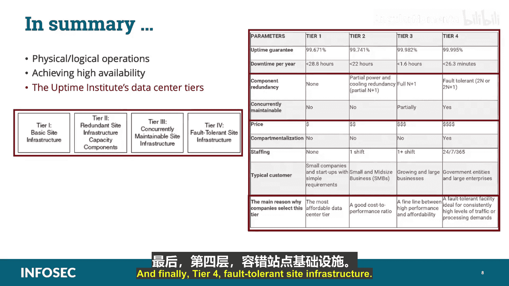

# 030：物理与逻辑运营 🔐

在本课程中，我们将学习云安全运营与管理领域中的物理与逻辑运营。我们将探讨如何确保云数据中心的高可用性，并深入了解正常运行时间协会（Uptime Institute）制定的数据中心分级标准。这些知识对于理解云服务提供商的运营承诺至关重要。

---

## 高可用性与正常运行时间

上一节我们介绍了课程概述，本节中我们来看看云数据中心的核心要求。云数据中心必须足够健壮和有弹性，以抵御各种威胁，包括自然灾害、黑客攻击以及简单的组件故障。这种强度和能力必须全面且详尽，以便为具有广泛服务需求的众多客户提供近乎连续的系统运营和数据访问，这被称为“正常运行时间”。

目前，行业标准的云服务正常运行时间目标是 **“五个九”**，即 **99.999%** 的可用性。

**公式：** 可用性 = 99.999%

这意味着在一年中，计划外停机时间少于六分钟。这一期望通常通过**服务等级协议** 正式记录，并告知所有用户，以便他们了解系统的可用性。

需要注意的是，“正常运行时间”和“可用性”并非同义词。例如，系统可能处于运行状态但不可用；或者，客户因自身互联网服务提供商 故障而无法连接到数据中心。从客户角度看这是可用性缺失，但从提供商角度看并非正常运行时间缺失。数据中心是正常运行的，只是客户出于实际原因无法访问。通常，“正常运行时间”和“可用性”这两个术语传达的是相同的概念：云提供商在SLA规定的参数内提供服务的能力，且不会无故中断。隐含的理解是，对于超出提供商控制范围的原因导致的客户无法访问，提供商不承担责任。

为了确保系统可用性，重点在于确保所有必需的系统都能按照其SLA的规定保持可用。传统上，系统可用性在SLA中的衡量和记录是使用一个测量矩阵，如下所示。

---

## 数据中心冗余设计

为了确保系统可用性，重点必须放在确保所有必需的系统都能按照其SLA的规定保持可用。云基础设施需要为连续正常运行时间而设计和维护。这意味着**每个组件都是冗余的**。这有两个目的：使基础设施能够抵御组件故障，并允许在不影响云基础设施正常运行时间的情况下更新单个组件。

在设计数据中心时，冗余性不仅需要考虑IT系统和基础设施，还需要考虑支持数据中心运营的所有功能方面。

以下是需要考虑冗余的关键方面列表：
*   公用事业：电力接收与分配、供水。
*   通信与连接。
*   人员配备。
*   应急能力：主要是发电及其燃料。
*   人员疏散路径。
*   暖通空调 系统。
*   安全控制。

有许多方法可以实现高可用性。一个例子是使用冗余架构元素来保护数据以防故障，例如**磁盘镜像**或**RAID解决方案**。另一个针对云环境的特定例子是在云架构中使用多个供应商来提供相同的服务。这允许您构建需要特定可用性级别的系统，使其能够在SLA规定的时间窗口内切换或故障转移到备用提供商的系统。

---

## 正常运行时间协会分级标准

目前，ISC² 在追求连续运营方面，参考正常运行时间协会 制定的数据中心冗余标准。Uptime Institute 是一个与IT服务相关事务的咨询组织。它发布数据中心设计标准，并认证数据中心是否符合该标准。

Uptime Institute 的标准分为四个等级，数据中心耐久性逐级递增。

### 第一级：基础站点基础设施

第一级数据中心设计简单，冗余性很少或没有，被标记为“基础站点基础设施”。它列出了数据中心的最低要求，必须包括：IT系统专用空间、用于线路调节和备份的不同断电源系统、为所有关键设备服务的足够冷却系统，以及用于长时间停电的发电机，并配备至少**12小时**的燃料以支持发电机在足够负载下运行IT系统。

**考试要点：** 请记住，**12小时**是所有四个等级的标准燃料要求。

第一级数据中心还具有以下特征：
*   计划内维护将需要使系统（包括关键系统）离线。
*   计划外维护和响应活动也可能使系统（包括关键系统）离线。
*   不当的人员活动（无论是无意还是恶意）将导致停机。
*   年度维护对于安全运行数据中心是必要的，并且需要完全关闭（包括关键系统）。没有此维护，数据中心可能会遭受更多的中断和故障。

这种类型的设施可能对仅需要或仅将数据中心服务用作其自身企业和数据的备份的组织有吸引力，甚至可能是组织自己的私有云，并且只需要偶尔且非常临时地可用。从这个角度来看，第一级数据中心可能适合作为组织的**热站**或**温站**，数据不频繁上传（例如每周或每月），或者甚至可能作为**冷站**，仅在组织遇到紧急情况并需要启动应急操作时才上传数据。因此，对于不需要持续正常运行时间和访问资源与数据的组织来说，第一级数据中心可能是成本最低的选择，因为它的功能性最低。

### 第二级：冗余容量组件站点基础设施

第二级数据中心比第一级稍微健壮一些，以其定义特征命名：**冗余站点基础设施容量组件**。它具有第一级设计的所有属性，并增加了以下要素：关键运营不必因任何冗余组件的计划更换和维护而中断。但是，配电系统和线路的任何断开都可能导致停机。与第一级类似，不当的人员活动可能导致停机，计划外的组件或系统故障也可能导致停机。

凭借基本的冗余优势，第二级数据中心显然更适合云运营，并且对此目的更具吸引力。它可能仍然比更高级别的产品更经济实惠，但现在可以作为连续使用的可靠替代方案。对于希望在公共云环境中运营同时保持相对较低开销的小型组织来说，这可能是一个不错的选择。

### 第三级：可并行维护站点基础设施

第三级设计被称为“可并行维护站点基础设施”。顾名思义，该设施既具有第二级构建的冗余容量组件，又具有多分布路径的额外优势，其中在任何给定时间只需要一条路径来服务关键运营。

将第三级与之前级别区分开来的特征包括：
*   所有IT系统均配备双电源。
*   即使任何单个组件或电源元件因计划维护或更换而停止服务，关键运营也可以继续。
*   计划外的组件丢失可能导致停机。
*   另一方面，单个系统的丢失将导致停机。这里实现的区别在于，组件是多节点系统中的一个节点，虽然每个系统都有冗余组件，但并非所有系统都是冗余的。
*   包括设施整体年度维护在内的计划维护不一定会导致停机。但是，在此活动期间，停机风险可能会增加。这种暂时的风险升高不会使数据中心在此期间失去其第三级评级。

显然，提供第三级数据中心的云提供商是希望迁移到公共云的组织的可行候选者。大多数具有常规运营需求的组织可能会考虑第三级选项。那些具有特殊需求的组织，例如拥有高度敏感材料的政府机构、大量使用知识产权的实体，或者具有绝对持续正常运行时间要求的大型组织，则可能考虑第四级选项。但对于所有其他组织而言，第三级应该能满足其需求。

### 第四级：容错站点基础设施

“容错站点基础设施”是顶级数据中心产品。正如Uptime Institute在该等级描述中重复强调的，设施的每个和所有元素和系统，无论是用于IT处理、物理厂房、配电还是其他任何方面，都具有内在的冗余性，使得关键运营能够在任何组件或系统丢失的情况下，经受住计划内和计划外的停机。这是否意味着第四级数据中心坚不可摧，具有永久正常运行时间？当然不是。任何营销此类承诺的人都应受到怀疑。然而，它是最健壮、最具弹性的可用选项。

除了包含所有后续等级的特性外，第四级数据中心还将包括：
*   IT和电气组件的冗余，其中各种多个组件相互独立且在物理上分离。
*   即使在丢失任何设施基础设施元素后，仍有足够的电力和冷却来支持关键运营。
*   任何单个系统组件或分布元素的丢失**不会**影响关键运营。
*   设施将具备基础设施控制系统的自动响应能力，使得关键运营不会受到基础设施故障的影响。
*   任何单个丢失事件或人员活动都不会导致关键运营停机。
*   计划内维护可以在不影响关键运营的情况下进行。然而，当一组资产处于维护状态时，数据中心可能因影响备用资产的事件而面临更高的故障风险。在此临时维护状态下，设施不会失去其第四级评级。

第四级数据中心应该适合服务于任何考虑云迁移的组织，无论其信息资产的敏感性或正常运行时间需求如何。同样，它也将是**最昂贵**的选择，并且可能仅限于那些有资源负担得起的组织。

---

## 总结

在本课程中，我们一起学习了物理与逻辑运营、实现高可用性以及正常运行时间协会的数据中心分级标准。我们详细探讨了四个等级：第一级（基础站点基础设施）、第二级（冗余容量组件站点基础设施）、第三级（可并行维护站点基础设施）和第四级（容错站点基础设施）。理解这些分级有助于评估云服务提供商的基础设施能力和相应的服务承诺。