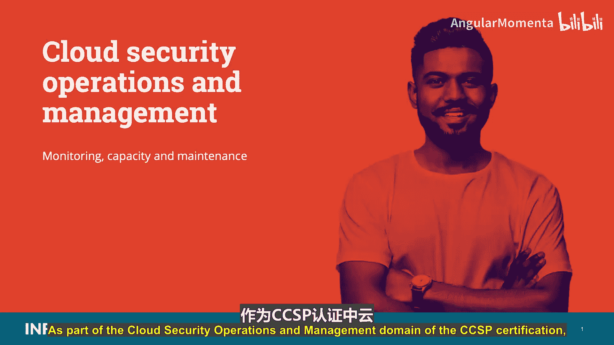
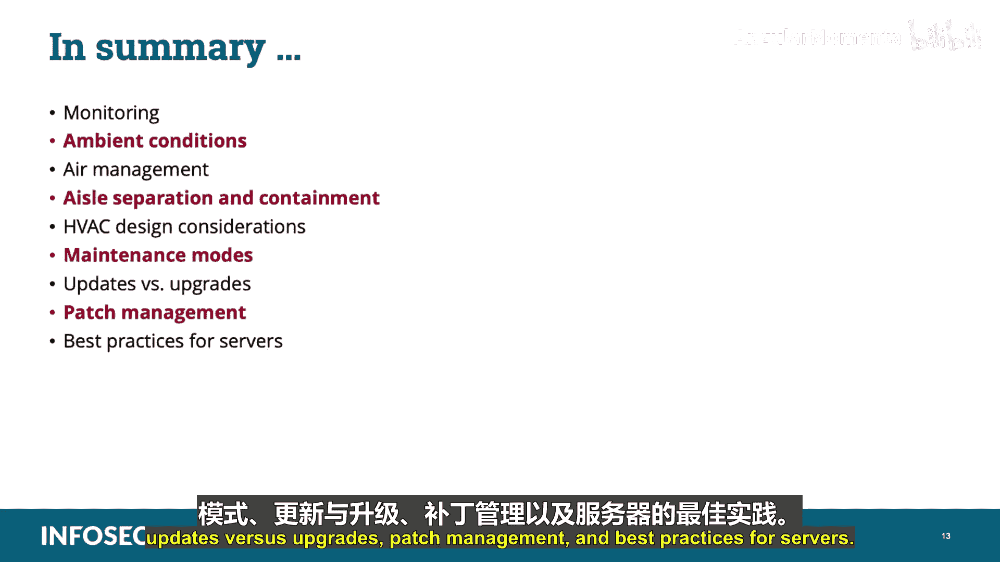

# 031：容量监控与维护 🛠️

在本节课中，我们将要学习云安全运营与管理领域中的一个核心部分：容量监控与维护。我们将探讨如何监控数据中心资源、管理环境条件，以及执行系统维护和更新的最佳实践。

---

## 容量监控 📊

上一节我们介绍了云安全运营的总体框架，本节中我们来看看如何具体监控数据中心的容量。对于数据中心运营商而言，了解硬件、软件和网络的利用率以及资源需求至关重要。这些信息有助于运营商更好地平衡和分配资源，以满足客户需求并确保符合服务级别协议。

当我们谈论监控时，主要关注的是软件、硬件和网络组件。这些组件需要实时评估，以便了解哪些系统可能接近容量使用极限，从而使组织在问题出现时能够尽快响应。

以下是几种关键的监控类型：

*   **操作系统日志记录**：大多数操作系统都具备用于监控性能和事件的基本工具集。云供应商可以设置操作系统日志，当使用率接近可能影响服务级别协议参数的容量利用率或性能下降水平时，向管理员发出警报。监控指标包括：
    *   **CPU使用率**
    *   **内存使用率**
    *   **磁盘空间**（虚拟或物理）
    *   **磁盘输入/输出时序**（这是磁盘读写速度的指标）

*   **硬件监控**：与操作系统类似，许多供应商在常见设备构建中包含了性能监控工具。这些工具可用于测量CPU温度、风扇速度、电压、功耗和吞吐量、CPU负载和时钟速度以及驱动器温度等性能指标。如果制造商设备本身不具备此功能，也可以使用商业产品来收集和提供这些数据并发出警报。

*   **网络监控**：除了操作系统和设备本身，各种网络元素也需要被监控，这不仅包括硬件和软件，还包括布线、软件定义网络控制平面等分发层面。供应商应确保当前容量满足客户需求并能应对增长的需求，以保证云计算的灵活性和可扩展性特质，同时避免网络过载或产生不可接受的延迟。

与所有日志数据一样，性能监控信息可以输入到安全信息和事件管理（SIEM）、安全事件管理（SEM）或安全信息管理（SIM）系统中，进行集中分析和审查。

---

## 环境条件监控 🌡️

除了硬件和软件，监控数据中心内的环境条件也很重要。特别是温度和湿度，是优化运营和性能的关键数据点。

那么，温度和湿度在影响设备性能方面扮演什么角色呢？可以这样理解：环境温度过高可能导致设备过热。高容量电气组件会产生大量废热，设备可能对超出其运行参数的条件敏感。而环境温度过低则可能对健康和安全构成风险，接触冰点以下的裸露金属会灼伤或损伤皮肤。此外，在此条件下工作的人员会感到不适和不快，这可能导致不满情绪，进而引发安全风险。

环境湿度过高会促进金属部件的腐蚀，以及霉菌和其他生物的生长。湿度过低则会增加静电放电的可能性，这可能影响人员和设备，并增加火灾风险。

重要的是要获取数据中心内温度的真实情况，例如可以通过对遍布气流过程中的多个恒温设备的测量值进行平均来实现。虽然有许多具体而详细的建议，但美国采暖、制冷与空调工程师学会（ASHRAE）为数据中心推荐的一般范围是：
*   **温度**：**64 至 81 华氏度**（即 **18 至 27 摄氏度**）
*   **湿度**：**露点 42 至 59 华氏度**（即 **5.5 至 15 摄氏度**），**相对湿度 60%**

**考试须知**：您需要记住这些数值。在考试中，题目会同时显示华氏度和摄氏度，并且数值会四舍五入到最接近的整数。

虽然这些范围给出了数据中心内部环境条件的一般概念，但ASHRAE的指南对于基于设备类型、使用年限和位置的具体范围要详细得多。这些范围指的是IT设备进气口的温度。温度可以在数据中心的多个位置进行控制，例如：服务器进风口、服务器出风口、地板送风砖供应温度、暖通空调（HVAC）机组回风温度，当然还有机房空调（CRAC）机组供应温度。**考试时请记住温度和湿度的推荐运行范围。**

---

## 空气管理 💨

空气管理是供应给设备的冷空气与设备排出的热空气之间的平衡。有效的空气管理实施可以最大限度地减少冷却空气绕过机架进气口的情况，以及热废气再循环回机架进气口的情况。

为什么这很重要？因为空气管理系统可以降低运营成本、减少初期设备投资、提高数据中心的功率密度（瓦特/平方英尺），并减少与热量相关的中断或故障。

当我们谈论线缆管理时，持续的线缆管理是有效空气管理的关键组成部分。例如，实施线缆清理计划（作为持续线缆管理计划的一部分，移除废弃或无法操作的线缆）将有助于优化数据中心冷却系统的气流输送性能。

热点可能由于地板下或上方的障碍物（这些障碍物经常干扰冷却空气的分布）以及高架地板静压层中的线缆拥堵（这会急剧减少总气流，并降低通过穿孔地板砖的气流分布质量）而发生。您还应该知道，高架地板安装应提供**最低 24 英寸的有效净空高度**。**考试时请记住，高架地板的最低要求是 24 英寸。**

气流管理的另一个重要领域是通道隔离与遏制。顾名思义，数据中心设备按机架行排列，机架之间交替设置冷通道（机架进气侧）和热通道（机架热排气侧）。严格的热通道/冷通道配置可以显著增加数据中心冷却系统的空气侧冷却能力，如下图所示。这里要记住的主要一点是，**隔离热通道和冷通道可以显著提高系统的空气侧冷却能力**。

应遵循行业指南，提供足够的HVAC以保护服务器设备。本幻灯片列出了一些基本考虑因素：
*   了解当地气候将影响HVAC设计需求。
*   冗余HVAC系统应是整体设计的一部分。
*   HVAC系统应提供空气管理，将冷空气与服务器的热排气分开。
*   应考虑节能系统。
*   应提供备用电源，以在系统需要保持运行的时间内运行HVAC系统。
*   最后，HVAC系统应过滤污染物和灰尘。

---

## 维护模式与正常模式 ⚙️

持续的运行时间需要不断维护整体环境。这也包括维护各个组件，无论是按计划进行还是在必要时进行非计划维护。在本课程中，我们主要关注一般维护事项、更新、升级和补丁管理。

数据中心的运行模式可以分为两类：**正常模式**和**维护模式**。实际上，从整体来看，数据中心将始终处于维护模式，因为对特定系统和组件的持续维护对于保持连续运行时间是必要的。因此，可以认为云数据中心处于持续的正常模式，而各种独立的系统和设备则持续处于维护模式，以确保不间断运行。这对于**第3层和第4层数据中心**尤其如此，其冗余组件、线路和系统允许在维护进行的同时，关键操作不受干扰。

因此，让我们从正常模式和维护模式的角度来看待系统和设备。

**维护模式**用于更新或配置云环境的不同组件。处于维护模式时，**客户访问被阻止，警报被禁用，但日志记录仍然启用**。**考试时请记住，在维护模式下，客户访问被阻止，警报被禁用，但您仍然记录所有活动。** 您应按照供应商特定指南和最佳实践进入维护模式、在其中操作，然后成功退出。如果系统在维护期间仍需可用，则在进入维护模式之前，应迁移任何托管的虚拟机或数据。维护模式可应用于数据存储和主机。

服务级别协议应描述IT服务，记录服务级别目标，并规定IT服务提供商和客户的责任。当系统或设备进入维护模式时，数据中心运营商必须确保某些任务成功完成，例如：
*   防止所有新登录（原因与上一任务相同，我们不希望客户登录到受影响的系统和设备）。
*   确保登录继续并进行增强日志记录。管理员活动比普通用户活动更强大，因此风险更高。因此，建议以比普通用户更高的速率和详细程度记录管理员操作。维护模式是一项管理功能，因此需要增加日志记录。

在将系统或设备从维护模式移回正常操作之前，重要的是测试其是否具备客户目的所需的所有原始功能、维护是否成功，以及所有活动的适当文档是否完整并已更新。

行业最佳实践包括确保我们遵守所有关于特定产品的供应商指南。事实上，未能遵守供应商规范可能被视为运营商未能提供必要的应有注意。换句话说，这表明我们没有做正确的事。而有记录的遵守供应商指令则可以证明尽职尽责，证明我们做了正确的事。

---

## 更新、升级与补丁管理 🔄

除了部署前的配置（也称为变更和配置管理，稍后详细讨论），供应商还会发布持续的维护指令，通常以更新或补丁的形式。这既可以是软件的应用程序包形式，也可以是硬件的固件安装形式。

更新流程应在运营商的治理中正式化，就像所有流程一样，并且它们都应源自某项政策。它至少应包括以下要素：
*   记录更新是如何、何时以及为何启动的。
*   如果是供应商发布的，则注明通信的详细信息：日期、更新代码或编号、解释和理由。其中一些可能通过引用包含，例如指向供应商发布更新公告页面的URL。
*   通过变更管理流程推进更新。所有对设施的修改都应通过变更管理方法进行并记录在案。虽然我们稍后会详细介绍变更管理流程，但需要强调的是，在更新应用于生产环境之前，应将沙箱测试作为变更管理流程的一部分。

在高层次上，我们首先将系统和设备置于维护模式，然后对必要的系统和设备应用更新，注释资产清单以反映更改。之后，我们验证更新，在生产环境中运行测试以确保所有必要的系统和设备都已收到更新。如果有遗漏，则重新安装直到完成。接着，我们验证修改，确保更新的预期效果已生效，并且更新后的系统和设备与生产环境的其余部分正常交互。最后，我们恢复正常操作，恢复常规业务。

**升级**：在此上下文中，我们以此目的区分更新和升级：**更新应用于现有系统和组件，而升级则是用新元素替换旧元素**。升级流程在很大程度上应与更新流程类似，包括正式化、治理、变更管理方法、测试等。在升级过程中，需要特别注意记录资产清单中的变更，不仅要添加新元素，还要注释旧元素的移除和安全处置。当然，这意味着安全处置是升级流程中包含而更新流程中没有的一个要素。

**补丁**是更新的一种，最常与软件关联。我们在这里通过其频率来区分它们。供应商通常会出于对特定需求的即时响应（例如新发现的漏洞）以及常规目的（例如定期修复、添加或增强功能）而发布补丁。补丁管理流程必须以与更新和升级类似的方式正式化，并将其纳入政策等。然而，补丁会带来额外的风险和挑战。屏幕上列出的建议和考虑因素应在管理云数据中心的补丁时予以考虑。

首先看**时机**：当供应商发布补丁时，所有受影响方都面临二元风险。如果他们未能应用补丁，可能会被视为未能为使用未打补丁产品的客户提供应有的注意。如果他们仓促应用补丁，可能会对生产环境产生不利影响，损害客户的运营能力。当补丁是针对新发现的漏洞发布，并且供应商急于识别缺陷、找到并创建解决方案、发布修复程序并发布补丁时，情况尤其如此。在急于处理问题的过程中，特别是当漏洞被广泛宣传并引起公众关注时，补丁可能会引发其他漏洞，或通过削弱某些互操作性或接口能力而影响其他系统。

数据中心运营商可能会倾向于让业内的其他公司先应用补丁，以便根据竞争对手的经验来确定其效果和结果。这种选择的风险在于，在此期间，补丁本应修复的漏洞可能导致损失或损害，并可能因未能履行尽职调查而被起诉。

**实施**：补丁可以通过自动化工具或人工手动应用。两种方法都有明显的优点和风险。运营商将不得不决定在一般情况下（即通过政策）以及针对每个具体情况（当补丁发布时，如果情况需要）使用哪种方法。让我们看看每种方法的风险和收益：

*   **自动化**：机械化方法比手动方法能更快地向更多目标交付补丁。补丁工具可能还包括报告功能，可以注释哪些目标已收到补丁（与资产清单交叉核对），并具有警报功能，可以在没有能力的人类观察者的情况下通知管理员哪些目标被遗漏。然而，工具可能无法彻底或正常运作，补丁可能被错误应用，或者报告可能不准确或描绘出不完整的画面。
*   **手动**：训练有素且经验丰富的人员可能比机械化工具更值得信赖，并且可能理解异常活动何时发生。然而，在云数据中心需要打补丁的元素数量庞大，补丁过程的重复性和枯燥性可能导致即使是经验丰富的管理员也会遗漏一些目标。此外，该过程可能比自动化选项慢得多，并且可能不够彻底。

现在，关于**日期**：随着补丁在整个环境中推送，实际的时间戳在获取和确认接收时可能成为一个重要且具有误导性的问题。当补丁代理设置为根据内部时钟指定的时间检查补丁，而不同目标的内部时钟设置为不同的时区时（例如，客户地理位置分散的情况），这个问题会更加复杂。在云模式下，由于虚拟化的广泛使用，这个问题更加突出。所有保存为镜像且在当前补丁交付期间未启动的虚拟化实例，只有在下次启动时才会收到补丁。这意味着该过程将持续到所有虚拟机都变为活动状态为止，这可能代表从决定实施补丁到完成之间的相当长一段时间。结果是运营商决定实施补丁的时间与标注100%完成的时间之间存在相对较长的延迟。这反映了运营商流程的不足，特别是在监管机构和法院眼中。

也许最佳的技术是结合每种方法的优点，同时使用手动和自动化方法。手动监督在确定补丁的适用性以及测试补丁在环境中的适用性方面很有价值，而自动化工具可用于传播补丁并确保统一应用。

---

## 服务器最佳实践 🛡️

在屏幕上，我们有一些保护云环境中主机服务器的最佳实践建议：

1.  **安全构建**：完全遵循操作系统供应商的具体建议，以安全部署其操作系统。
2.  **安全初始配置**：这可能意味着许多不同的事情，取决于操作系统供应商、操作环境、业务需求、法规要求、风险评估和风险承受能力以及将在系统上托管的工作负载等多个变量。最佳实践的常见列表包括：
    *   **主机加固**：从主机中移除所有非必要的服务和软件。
    *   **主机打补丁**：安装用于创建主机服务器的硬件和软件供应商提供的所有必需补丁。
    *   **主机锁定**：实施主机特定的安全措施，这些措施因供应商而异。
3.  **安全持续配置维护**：这通过多种机制实现，有些是供应商特定的，有些不是。参与以下类型的活动：
    *   对主机、客户操作系统以及在它们上面运行的应用程序工作负载进行补丁管理。
    *   对主机、客户操作系统以及在主机上运行的应用程序工作负载进行定期漏洞评估扫描。
    *   对主机和在其上运行的客户操作系统进行定期渗透测试。

---

## 总结 📝

本节课中我们一起学习了云安全运营中的容量监控与维护。我们讨论了如何监控硬件、软件和网络容量，以及环境条件（特别是温度和湿度）的重要性。我们还探讨了空气管理、通道隔离与遏制、HVAC设计考虑因素。接着，我们区分了正常模式和维护模式，并详细说明了更新、升级和补丁管理流程及其相关风险。最后，我们回顾了保护云环境中主机服务器的最佳实践。掌握这些知识对于确保云环境的安全性、可靠性和合规性至关重要。