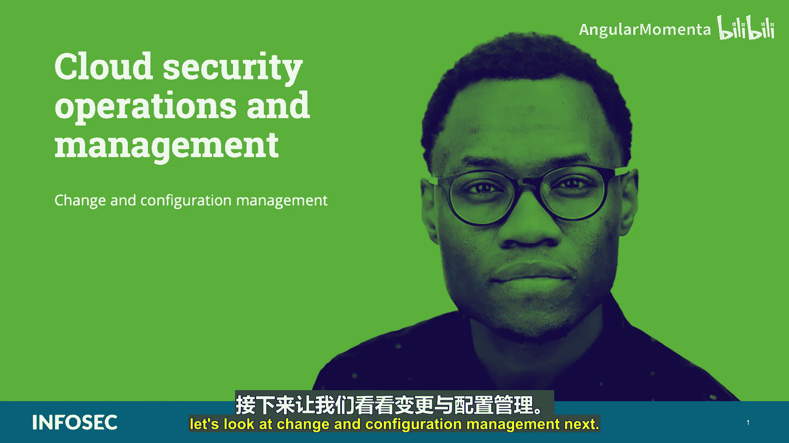
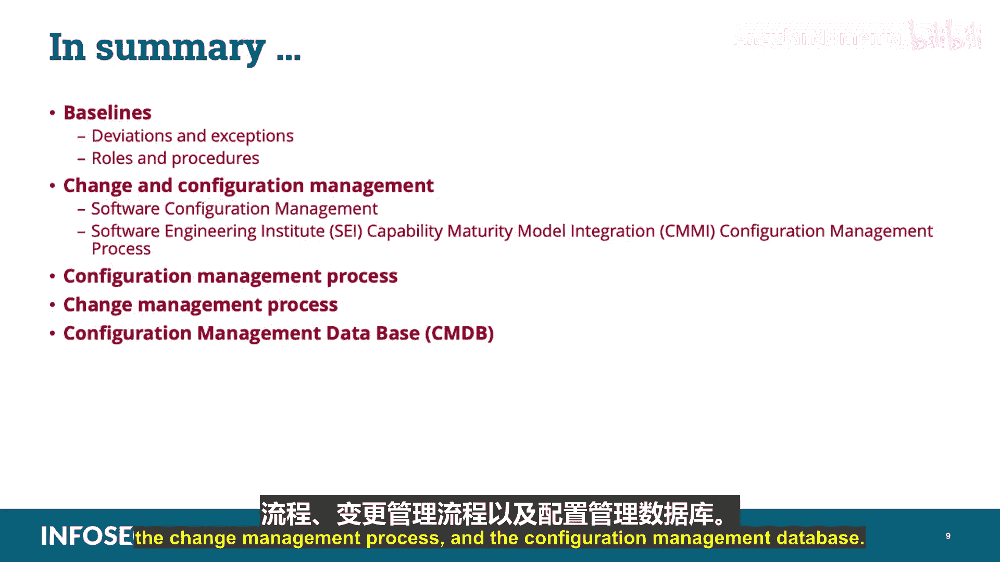

# 032：变更与配置管理 🛠️

在本节课中，我们将学习CCSP认证中云安全运营与管理领域的一个重要组成部分：变更管理与配置管理。我们将探讨这两个核心流程如何确保云环境的安全与稳定，并了解它们在组织治理中的关键作用。

## 概述

变更管理与配置管理是IT服务管理（ITSM）的核心流程，尤其在云环境中至关重要。它们确保所有对系统、网络和服务的修改都经过系统化的规划、审批、实施和审查，从而维持环境的完整性、安全性和合规性。

上一节我们介绍了云安全运营的总体框架，本节中我们来看看其中两个紧密相关的具体流程：变更管理和配置管理。

## 基线、变更管理与配置管理

配置管理始于建立**基线**。基线是系统标准状态的准确记录，为后续的变更管理提供了参照依据。

*   对于变更管理，基线是基于全面详细的资产清单，对网络和系统状态的描绘。
*   对于配置管理，基线是所有系统的标准构建，从操作系统设置到每个应用程序的配置。

基线应是一张基于所需功能和安全要求的通用网络与系统地图。安全控制措施必须整合到基线中，并详细描述其目的、依赖关系和支撑理由（即我们希望通过每个控制实现什么目标）。

在考虑通过变更管理流程对环境进行修改时，将控制措施纳入基线至关重要。这样，我们在改变任何现有控制集或向环境添加新系统和功能时，就能充分了解风险管理状况，判断是否会因此增加风险，以及是否需要添加补偿性控制来管理新的风险水平。

持续将当前环境与基线进行比较，可以确定所有资产是否都已登记在册，并检测出任何偏离基线的情况。任何此类偏差，无论是有意还是无意、授权还是未授权，都必须记录并审查。这些偏差可能源于有缺陷的补丁管理流程、特定办公室或用户设置的“野”设备、外部攻击者的入侵或管理实践中糟糕的版本控制。

确定原因并进行必要的后续跟进，是分配给变更管理角色人员的职责。基线应始终反映组织的风险偏好，并在安全性与操作功能性之间提供最佳平衡。如果将其用作模板（特别是在配置管理中），那么它覆盖的系统越多，其价值就越大。

确保基线灵活实用，并且例外请求流程及时响应组织及其用户的需求。一个复杂、缓慢的例外流程会导致用户和管理者感到沮丧，进而可能引发未经变更管理权限批准的、未授权的变通方案。

## 偏差与例外

跟踪例外和偏差除了能确保法规遵从性和安全控制覆盖范围外，还有其他重要用途。

如果收到大量要求偏离基线的、相同或类似功能的例外请求，我们可能需要修改基线本身。如果我们持续收到修改基线元素的请求，那么该基线就没有起到应有的作用。此外，处理例外请求通常比修改基线以纳入新的、额外的安全控制来允许所接受的功能，需要更多的时间和精力。

## 变更与配置管理流程

与所有流程一样，变更和配置管理流程应在组织的治理中正式化。这项由标准、程序和流程支持的政策应包括以下内容：

以下是变更与配置管理政策应包含的核心要素：

1.  **变更与配置管理委员会（CCMB）的组成**。
2.  **流程本身**，包括范围、目的和受影响组织。
3.  **文档要求**。
4.  **请求例外的说明**。
5.  **变更或配置管理任务的分配**，例如验证、扫描、分析和偏差通知。
6.  **检测到偏差后的处理流程**和**执行措施**以及**相关职责**。

变更与配置管理委员会（CCMB）应由组织内所有利益相关方的代表组成。建议的代表包括来自IT、安全、法律、管理、用户组、财务、采购以及人力资源部门的人员。组织认为有用的任何其他参与者当然也可以加入CCMB。

CCMB将负责审查变更、配置和例外请求。委员会将确定变更是否会增强功能和生产力，变更是否有资金支持，变更将带来哪些潜在的安全影响，以及为了使变更成功且合理，在资金、培训、安全控制和人员配备方面可能需要哪些额外措施。

CCMB应足够频繁地召开会议，以免变更和例外请求被过度延迟，导致用户和部门对流程感到沮丧。然而，会议也不应过于频繁，以免为CCMB预留的时间成为负担。参与CCMB的人员都有其他主要职责，参与CCMB会影响他们的生产力。在某些情况下，根据组织情况，CCMB可能临时召开会议，仅在变更和例外请求达到一定阈值时才响应。这可能带来一些风险，因为如果CCMB成员仅临时会面，他们可能会对流程有些生疏。此外，如果CCMB不是定期优先安排的活动，协调这么多不同部门开会可能会很麻烦。

## 配置管理流程

配置管理流程在组织内，通过产品的生命周期，建立并维护产品、系统或被管理项的完整性。它指的是一种用于评估、协调、批准或否决以及实施构建和维护硬件或软件系统所用工件的变更的规范。

显然，控制变更的最佳方法是制定一个**配置管理计划**，确保变更仅以商定的方式执行。任何偏离计划的行为都可能改变整个系统的配置，并可能实质上使其作为安全可信系统的任何认证失效。

配置管理的核心目的是消除因存在不同版本工件而带来的混乱和错误。进行变更是为了纠正错误、提供增强功能或反映产品定义的渐进式改进。如果没有一个信息充分的变更管理流程，团队成员可能会无意中使用不同版本的工件；个人可能会在没有适当授权的情况下创建版本；并且可能会无意中使用错误的工件版本。

另一个需要理解的重要领域是**软件配置管理**。这涉及为软件项目识别配置项、控制这些配置项及其变更，以及记录和报告这些配置项的状态和变更活动。

第一步是识别所做的任何变更。当每个变更都需经过某种类型的文档记录，并且必须由授权个人审查和批准时，控制就发生了。记录和报告是在任何变更过程中，对软件或硬件配置的记述。审计允许对完整的变更进行验证，特别是确保任何变更不会影响已实施的安全策略或保护机制。

成功的变更管理流程需要一套定义明确且制度化的政策和标准，明确规定以下内容：

以下是变更管理政策应清晰定义的内容：

1.  受变更管理管辖的工件集合。
2.  工件的命名方式。
3.  工件如何进入和离开受控集合。
4.  处于变更管理下的工件如何被允许变更。
5.  如何提供工件的版本以及在什么条件下可以使用每个版本。
6.  如何使用变更管理工具来启用和强制执行变更管理。

软件工程研究所（SEI）的能力成熟度模型集成（CMMI）列出了这些实践，作为组织内变更管理能力的关键：

以下是CMMI中变更管理的关键实践：

1.  识别将置于配置管理之下的配置项、组件和相关工作产品。
2.  建立并维护一个用于控制工作产品的配置管理和变更管理系统。
3.  创建用于内部使用和交付给客户的发布基线。
4.  跟踪配置项的变更请求。
5.  在配置项的上下文中控制变更。
6.  建立并维护描述配置项的记录。
7.  执行配置审计以维护配置基线的完整性。

请记住，配置管理是一个识别和记录硬件组件、软件及相关设置的过程。一个文档齐全的环境通过确保IT资源得到正确部署和管理，为健全的运营管理奠定了基础。

## 变更管理流程

变更管理结构应在组织政策中详细说明。还应创建用于变更管理流程操作方面的程序。

请记住，变更管理流程的结构应能使您记录以下环节：

以下是变更管理流程的关键环节：

1.  **请求**。
2.  **影响评估**。
3.  **批准或否决**。
4.  **构建与测试**。
5.  **通知**。
6.  **实施**。
7.  **验证**。
8.  **版本控制与基线更新**。

系统变更的结果应记录在适当的记录中，包括可能已进行的任何系统修改，以及在部署过程中学到的任何经验教训。

您需要理解，任何变更都必须经过配置与变更控制委员会（CCB）的正式提交和批准才能进行。变更管理的目标是响应客户不断变化的业务需求，同时最大化价值并减少事件、中断和返工；响应业务和IT的变更请求，使服务与业务需求保持一致；确保变更被记录和评估；确保已授权的变更以受控的方式被优先排序、计划、测试、实施、记录和审查；确保对配置项的所有变更都记录在配置管理系统中；最终优化整体业务风险。通常，最小化业务风险是正确的，但有时为了潜在利益，有意识地接受风险也是合适的。

一个专注于云的变更管理流程应包括以下政策和程序：

以下是云变更管理流程应包含的内容：

1.  新基础设施和软件的开发与获取。
2.  新软件的质量评估以及与既定安全基线的合规性。
3.  系统变更，包括测试和部署程序。
4.  应包括对所有变更的充分监督。
5.  防止未经授权的软件和硬件安装。

## 配置管理数据库（CMDB）

**配置管理数据库（CMDB）** 是我们将所有资产（硬件、软件、数据等）整合在一起的地方，包括按照IT基础架构库（ITIL）的建议整合服务管理流程，涵盖库存、配置和IT资产管理。

CMDB能够强大地洞察基础设施当前及不断变化的概况。这可用于确定您的成本效益分析。

## 总结

本节课中我们一起学习了CCSP云安全运营领域的变更与配置管理。我们探讨了基线的概念及其作为变更参照的重要性，详细分析了偏差与例外的处理方式，并介绍了正式的变更与配置管理委员会（CCMB）的角色与运作流程。我们深入了解了配置管理流程如何维护系统完整性，以及变更管理流程从请求到验证的标准化步骤。最后，我们认识了配置管理数据库（CMDB）作为整合所有资产信息核心库的关键作用。掌握这些流程对于在云环境中实施有效、安全且合规的运营管理至关重要。