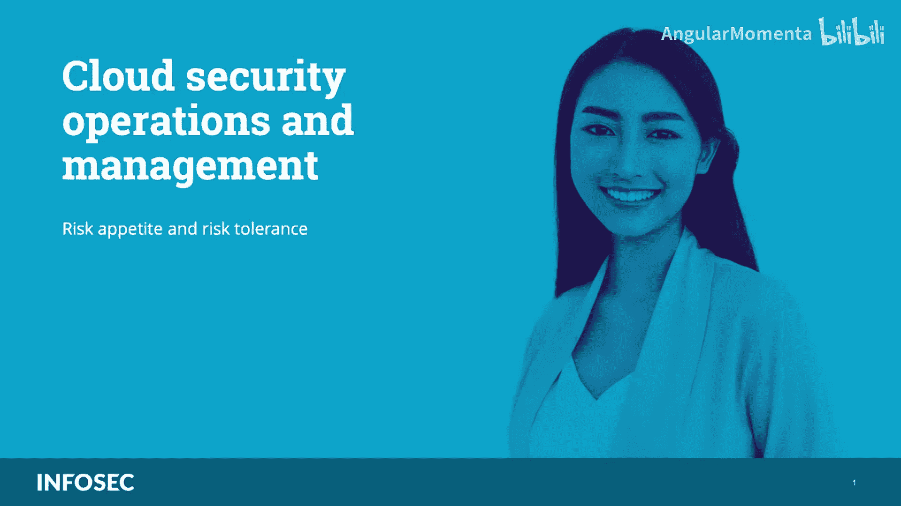
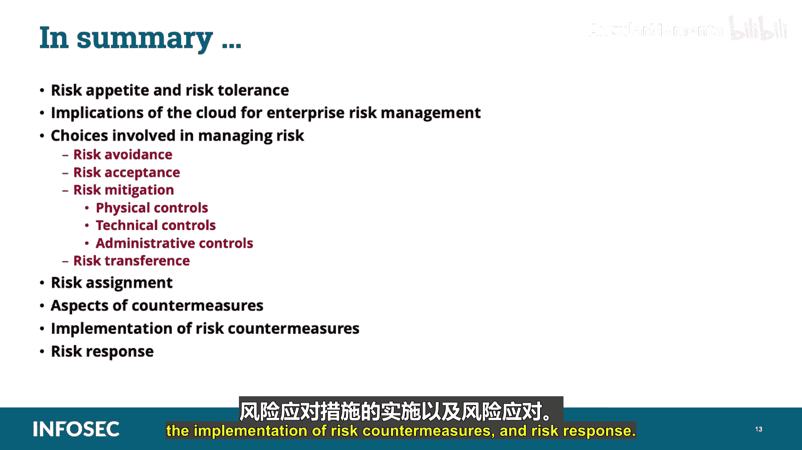

# 033：风险偏好与风险容忍度 🎯

在本课程中，我们将学习云安全运营与管理领域中的核心概念：**风险偏好**与**风险容忍度**。理解这两个概念对于制定有效的安全策略和通过CCSP考试至关重要。

---

在深入探讨之前，请注意，为帮助您备考，所有CCSP考试相关的**关键信息**将以特殊颜色高亮标出，并用双星号（**）进行强调。

---

## 理解风险偏好与风险容忍度

每个涉及风险的决策都包含两个方面：决策带来的**潜在收益**和与之相关的**机会**。

例如，银行根据客户的信用评分发放贷款。如果客户信用良好，从贷款利息中获利的**机会**就大于客户违约的**风险**。随着违约风险上升，利率也会提高，直到风险过高而无法批准贷款。

企业和个人每天都在做风险决策，决定愿意承担或不愿承担哪些风险。在进行**风险容忍度**评估时，他们会考虑在潜在风险实际超过机会之前，愿意将风险推进到何种程度。

**举例说明**：假设你有一栋两层楼的房子。睡前，你会锁好一楼所有的门窗，以降低夜间有人闯入的概率。然后你上楼，可能会打开二楼所有的窗户以获得新鲜空气。有人从二楼窗户闯入的风险存在吗？当然。但发生这种事的风险极低，你愿意接受它，因为新鲜空气的**收益**大于入侵者从二楼窗户进入的**风险**。这是一个你愿意承担的**可接受风险**。

相比之下，一个住平房的人可能不想在夜间开窗，因为从一楼窗户进入更容易。如果他们想开窗，可能需要安装**补偿性控制措施**，比如在窗户上加装栏杆，以防止入侵者进入。这仍然存在有人剪断栏杆的风险，但这已是你愿意接受的**风险水平**。

在云中与企业合作也是如此。每个企业根据自身情况，都有其特定的**风险偏好**和**容忍度**。有些企业可能愿意将数据分布在全球，而另一些则不然。有些企业受到严格监管，不允许承担某些风险；另一些则可能为了追求更敏捷灵活而愿意在安全上有所妥协。重要的是记住，每个企业都不同，对风险的容忍度也不同，并且这种容忍度会随时间或环境快速变化。

---

## 制定策略前的考量

在组织开始制定策略之前，需要权衡迁移到云端的**风险**是否被其将获得的**收益**所抵消。

我们首先需要**识别利益相关者**。这确保我们有合适的人员参与制定风险容忍度的表达。利益相关者可能包括业务部门领导、董事会、投资者和监管机构。这些群体的观点、认知和选择将影响组织接受风险的意愿和能力。

然而，大多数利益相关者不会直接参与制定组织策略。可能会邀请主题专家来解释策略的具体方面、阐述特定威胁、说明切实收益，并解释策略如何应对这些风险。**高级管理层**必须理解这些草案策略，以便在接纳它们及其蕴含的风险与收益，或根据需要进行修改时，做出明智的决策。

---

## 云环境下的关键策略

组织需要适当反映云计算模型的一些策略包括：

*   **信息安全策略**
*   **可接受使用策略**
*   **数据分类策略**
*   **网络策略**
*   **互联网安全、密码、反恶意软件策略**
*   **软件安全策略**
*   **灾难恢复与数据备份策略**
*   **远程与第三方访问策略**
*   **职责分离策略**
*   **事件响应计划**
*   **人员安全策略**
*   **身份识别与访问管理策略**
*   **法律合规策略**
*   **加密策略**

可能还有其他许多策略。

最终，策略的接受需要高级经理签署策略文件，并由董事会确认批准。策略一旦被正式接受，就必须发布并分发给受其影响的每个人。

---

## 云环境下的沟通挑战

在企业环境中，沟通本身已具挑战性。云计算使沟通更加复杂，原因包括：IT管理员可能不在本地、提供商与客户之间存在时区差异，以及提供商可能拥有成千上万的其他客户。

其他可能使沟通复杂化的因素包括：分散的管理团队、时区差异、对云计算模型和概念的理解不足、对业务驱动因素的理解不足，以及对组织风险偏好的理解不足。

---

## 云服务提供商与客户的责任

有时，云服务提供商可能无法满足组织的内部策略要求。当这种情况发生时，必须将这些不足纳入考量，并作为任何内部治理流程的一部分进行管理。这将确保任何商定的合同要素或服务水平协议不会违反组织策略，或将组织置于其风险容忍度水平之外的不当风险中。

**云客户**作为**数据所有者**，最终负责确保控制措施的有效性。但是，存储数据的安全和风险管理需要客户与提供商之间的合作。

在云计算世界中，**云服务提供商**从CSP架构的角度负责客户数据的安全和隐私，因为他们控制后端系统。然而，客户作为数据所有者，仍然对任何数据丢失负有最终责任。

如果是在传统的本地部署模型中，企业边界安全（即非军事区、网络分段、入侵检测/防御系统、监控工具及相关安全策略）将控制驻留在边界后并传输的数据。因此，在该示例中，企业将负责安全和隐私，并对任何损失承担责任。

---

## 风险管理相关术语

在深入探讨风险管理的细节之前，您需要熟悉一些风险相关术语。

*   **关键风险指标**：KRIs是首先提醒您某些方面出现问题的指标。在金融行业，KRI可能是股市在一天内大幅波动。在云计算中，可能是宣布发现可能影响您云客户的新漏洞。核心思想是，您需要识别并密切监控那些最有可能提醒您风险环境发生变化的事项。

*   **风险偏好与风险容忍度**：这两个术语相似，都描述了组织如何看待风险。随着组织的风险偏好或容忍度增加，其承担更大风险的意愿也随之增加；反之亦然。

*   **风险所有者与参与者**：这些是组织内共同决定组织整体**风险概况**和**偏好**的个人。

---

## 风险的四种应对策略

风险管理的一部分是知道您想如何处理风险。组织在面对风险时始终有四种选择：**风险规避**、**风险接受**、**风险缓解**和**风险转移**。

以下是具体分析：

**1. 风险规避**
风险规避是指确定特定风险的影响或可能性太大，潜在收益无法抵消，并因此决定不执行某项业务功能。基本上，这意味着**停止该活动**，因为您不想接受其风险。

**2. 风险接受**
风险接受是指确定业务功能的潜在收益大于可能的风险或影响，并决定在不采取其他行动的情况下执行该功能。这通常是因为预期影响水平较低，是一种**明确决定不进行缓解，而是承受风险**的决策。这里的权衡是支持该决策的**成本效益分析**。

**3. 风险缓解**
风险缓解是通过实施安全控制措施来**减弱**特定风险的可能影响和/或可能性。这是通过应用控制措施将风险降低到可接受的水平来实现的。

**4. 风险转移**
风险转移，也称为风险分担，是指**支付外部方来承担特定风险的财务影响**，基本上是将风险转嫁给另一个实体，如保险公司。但请记住，**并非所有风险都能转移**。

---

## 剩余风险与总风险

**剩余风险**是在实施安全控制措施以降低或缓解风险后**仍然存在的风险**。这基本上是在应用适当控制措施来减少或消除漏洞后剩余的风险量。

**总风险**是如果**没有实施任何防护措施**，组织将面临的风险量。

您应该了解总风险与剩余风险的公式：

*   **总风险公式**：`威胁 × 漏洞 × 资产价值 = 总风险`
*   **剩余风险公式**：`总风险 - 控制缺口 = 剩余风险`

---

## 深入分析风险应对策略

**风险规避**不是处理风险的方法，而是在面对特定风险时，基于成本效益分析做出的**回应**。如果组织面临的风险其潜在成本远大于可能收益，组织可能会选择**根本不进行**会招致该风险的活动。这是消除特定风险的唯一可靠方法：不进行有风险的活动。

**风险接受**与风险规避直接相反。在检查某项活动的潜在收益和风险后，如果组织确定风险很小而回报可观，组织可能会选择**接受**该事业所涉及的风险，并在没有任何额外考虑的情况下继续推进该活动。换句话说，如果活动的风险估计在组织的风险偏好范围内，那么组织可能会选择风险接受，就像之前给出的打开二楼窗户的例子。

**风险缓解**是大多数安全从业者日常工作的核心选项。风险缓解是通过使用控制措施和对策将风险降低到可接受水平的实践。也就是说，组织实施控制措施，以使已知风险处于该组织的风险偏好范围内。

关于风险缓解有两点需要注意：
1.  **不可能完全消除风险**。永远不要相信有人说某事零风险或某个控制措施提供100%安全。即使对业务功能应用了所有可能的控制措施，仍然会存在一定水平的风险，我们称之为**剩余风险**。如果实施控制措施后剩余的剩余风险在组织的风险偏好范围内，那么组织可能会选择执行该功能。如果剩余的剩余风险**超过**了组织的风险偏好，则说明控制措施不足，或者该业务风险太高而无法执行。
2.  **控制措施的成本必须小于业务流程的潜在收益**，否则该流程就不盈利或不值得。永远不要给一辆5美元的自行车装一把10美元的锁。

---

## 控制措施的类型

组织在选择缓解风险时，可以考虑并使用不同类型的控制措施。在安全领域，我们通常将控制措施分为三种一般类型：**物理控制**、**技术控制**和**管理控制**。

*   **物理控制**：限制对资产的物理访问，或以减少物理事件影响的方式运作的控制措施。
*   **技术控制**：也称为逻辑控制。这些是增强机密性、完整性、可用性三要素某些方面的控制措施，通常在系统内以电子方式运作。可能的技术控制包括加密机制、限制用户权限的访问控制列表以及系统活动的审计跟踪和日志。
*   **管理控制**：那些不一定属于物理或技术范畴，但能提供某些安全方面的流程和活动。

结合使用不同类型的控制措施是向组织提供**深度防御**（也称为分层防御）的好方法。这要求恶意行为者不仅要克服多个控制措施，还要克服多种类型的控制措施，从而需要不止一种技能才能访问或获取受保护的资产。

---

## 风险转移与责任归属

**风险转移**是一种处理与活动相关风险而不承担所有风险的方式。通过风险转移，组织找到其他方以承担事业潜在风险，而成本只是组织自己承担风险时潜在成本的一小部分。基本上，当您想到风险转移时，就想到一个词：**保险**。

并非所有风险都能转移。虽然财务风险很容易通过保险转移，但真正的风险几乎永远无法完全转移。

---

## 风险管理框架与责任

存在许多风险管理框架，旨在帮助企业制定健全的风险管理实践。然而，就CCSP考试而言，我们只需要熟悉**ISO 31000**、**NIST SP 800-37**和**欧盟网络与信息安全局**的框架。

一个关键问题是：**谁被分配并负责风险？** 这是一个严肃的问题，答案很有趣：**视情况而定**。

最终，组织，即高级管理层或利益相关者，拥有公司运营期间存在的风险。然而，高级管理层可能依赖业务部门或数据所有者/保管人来协助识别风险，以便进行缓解、转移或规避。组织也可能期望所有者和保管人根据环境中的策略、程序和法规，在工作中最小化或缓解风险。如果期望未得到满足，可能会导致纪律处分、解雇或起诉等后果。

---

## 选择与实施对策

对组织而言，最重要的步骤之一是**适当地选择**应用于环境中风险的对策。必须考虑对策的许多方面，以确保它们适合任务，例如：
*   **问责性**：谁可以被追究责任？
*   **可测试性**：如何测试？
*   **可信来源**：确保我们有已知来源。
*   **独立性**：自决、一致应用。
*   **成本效益**、**可靠性**、**与其他对策的独立性**（避免重叠）。
*   **易用性**、**自动化**、**适用性**、**安全性**。
*   **保护资产的CIA**：保密性、完整性、可用性。
*   **可回退性**：在出现问题时能够撤销。
*   **在运营中不产生额外问题**，且在其功能完成后不留下残留数据。

---

## 实施与维护

风险评估完成后，会有一系列需要采取的补救活动清单，组织必须确保拥有具备适当能力的人员来**实施**这些补救活动，并对其进行**维护和支持**。这可能要求组织为参与环境中安全机制的设计、部署、维护和支持的人员提供额外的培训机会。

此外，至关重要的是，要创建、实施、维护、监控和执行与每个策略项目相对应的、具有详细程序和标准的适当策略。组织应分配可对每项任务负责的资源，并随时间跟踪任务，向高级管理层报告进展，并在此过程中留出时间进行适当的审批。

---

## 安全架构师的思考

当安全架构师坐下来开始思考如何设计企业安全架构时，他们应该考虑很多事情：应该使用什么框架作为参考点？需要考虑哪些业务问题？谁是利益相关者？为什么他们只处理这个业务领域而不是那个？如何将系统设计整合到整体架构中？这个架构中的单点故障会在哪里？架构师的挑战在于协调所有这些思路，并将其引导到一个流程中，使他们能够设计出一个连贯且强大的企业安全架构。

---

## 风险响应

**风险响应**根据组织的风险框架，通过制定应对风险的备选行动方案、评估备选行动方案、确定与组织风险容忍度一致的适当行动方案，并基于所选行动方案实施风险响应，从而提供全组织一致的**风险响应**。

---

## 课程总结 🎓

在本课程中，我们一起学习了：
*   **风险偏好与风险容忍度**的核心概念及其区别。
*   云计算对企业风险管理的**影响**。
*   风险管理涉及的四种选择：**风险规避**、**风险接受**、**风险缓解**（使用物理、技术和管理控制）以及**风险转移**。
*   **风险分配**、对策的各个方面、风险对策的**实施**以及**风险响应**流程。

理解这些概念是构建有效云安全策略和通过CCSP认证的基础。