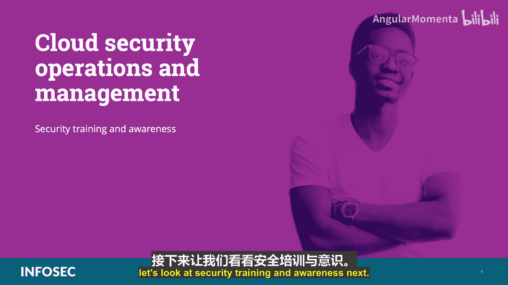
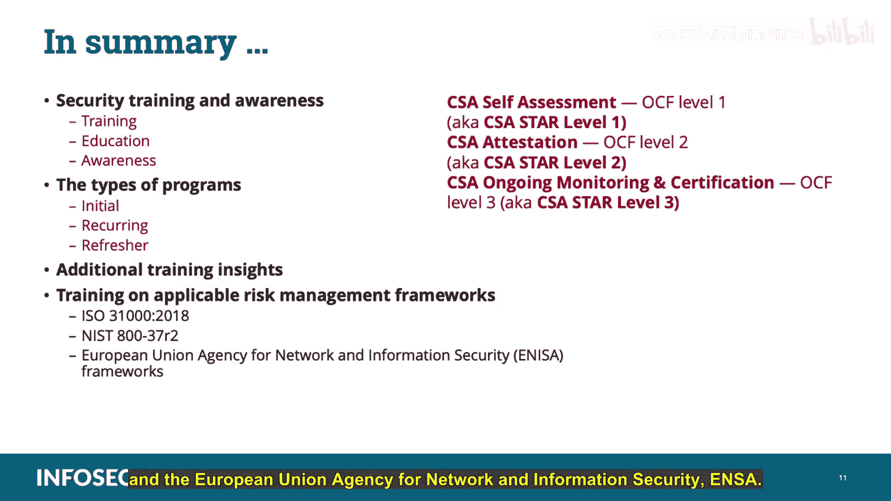

# 034：安全培训与意识 🛡️

在本节课中，我们将学习云安全运营与管理领域中的一个核心组成部分：安全培训与意识。我们将探讨培训、教育和意识之间的区别，介绍不同类型的培训计划，并了解相关的风险管理框架。

---

## 概述

安全培训与意识是确保组织内所有人员都能以安全方式履行职责的关键。在云数据中心环境中，由于员工通常具备一定的技术背景，这项工作可能相对容易，但仍需正式的培训计划来满足政策和法规要求。

---

## 培训、教育与意识

在深入探讨具体培训类型之前，我们需要明确培训、教育和意识这三个概念的区别。以下是CCSP认证中对这些术语的标准解释：

*   **培训**：指由组织内部的专家进行的正式材料讲解，内容涵盖组织政策、法规要求以及行业最佳实践。
*   **教育**：指在学术环境中进行的正式学习，通常是为了获得学位或认证学分。
*   **意识**：指额外的、非正式的（通常是自愿的）材料宣传，目的是提醒员工并提高他们的注意力。

基于以上定义，我们将重点讨论安全培训、教育和意识计划。

---

## 培训计划的类型

安全培训计划通常分为三种交付类别：初始培训、定期培训和复习培训。接下来，我们将逐一审视这些类别。

### 初始培训

初始培训在新员工入职时进行，通常内容全面且详尽。所有人员，无论其职位或角色如何，都必须参加。培训内容应足够广泛，涵盖所有员工需要理解和遵守的安全政策和程序，同时也应具体到让每个人都知道如何执行基本的安全操作。

初始培训可能涵盖的主题包括：
*   **密码政策**：包括密码的发放方式、格式、有效期、如何申请重置，以及强调保密的重要性。
*   **物理安全**：包括设施访问权限、遇到不熟悉人员时的应对措施，以及紧急疏散程序。
*   **安全凭证或令牌的使用**，以及如何报告安全问题（如异常行为、凭证丢失等），包括联系安全人员的方式。
*   **可接受使用政策**（也称为“道路规则”），包括详细的执行机制。当然，所有人员在访问组织设施和资产之前必须签署该政策。

初始培训课程是所有员工首次接触安全办公室代表的机会。因此，最好由安全团队成员而非人力资源等其他部门的培训师来主持。培训师应解释安全措施的原因，使用真实世界的案例和轶事，并鼓励互动和提问，以建立积极的关系。

### 定期培训

定期培训旨在持续更新安全知识，建立在初始培训的基础之上。应根据组织需求、监管环境或行业波动定期进行，至少每年一次。

定期培训的内容应包括：
*   组织内部安全实践和程序的任何更新和修改。
*   法规和政策的变化。
*   基础设施中引入的任何新元素。

定期培训也可以与意识工作相结合，并用于巩固在初始培训中培养的良好关系。最后，务必记录所有定期培训课程，包括内容和所有参与者的姓名，这对于在审计中展示尽职调查和满足合规要求至关重要。

### 复习培训

复习培训面向那些表现出需要额外指导的人员。这可能包括长时间离开工作岗位（例如一个月左右）或错过了定期培训的人员，也可能包括那些在安全实践方面存在不足的人员，例如无意中造成安全漏洞、安装了恶意软件或在审计中被指出不了解或不遵守正确安全实践的人员。

重要的是要记住，目标是培养运营与安全之间的友好关系，因此这些课程不应具有惩罚性或指责性。应告知参与者，安全失误不是严重过错，而是学习如何改进的机会。与所有培训事项一样，应记录每次复习培训，包括主题和参与者，以备审计和合规之用。

---

## 培训交付方式

所有培训都可以通过现场演示或在线课程的形式提供。两种方法各有利弊。

**现场培训**让参与者与主题专家互动，极具价值。参与者能更好地理解材料，并且如果以他们欣赏和理解的方式呈现，他们更有可能记住信息。然而，安排和记录现场课程存在一些困难，通常需要某种形式的考勤，这在员工规模变化时会变得复杂。

**在线课程**（基于计算机的培训）是一个极其强大的工具，可以简化安排现场课程的许多麻烦。它允许每位员工在方便的时候，从自己的工作场所（或根据交付方式，甚至从家中）访问材料，并按照自己的节奏学习。然而，这些特点也可能使在线培训容易受到外部干扰，许多员工只是将其视为一项必须完成的任务，而不是关注内容，他们只是快速点击直到结束。不过，在线课程工具通常提供出色的跟踪功能，即使面对较大的用户群体，也能提供细致的文档记录能力。

---

## 政策与支持

安全培训的另一个基本方面是政策。如果组织真正重视安全，那么这应该反映在其组织治理中。高级管理层需要支持培训计划，并通过尽可能积极参与现场课程来展示参与度。他们还应该建立并正式制定奖励计划，以表彰那些通过报告发现的安全问题而提供安全见解的员工。在资金充足的情况下，不要对无意中造成安全问题的员工采取惩罚措施。纪律处分应仅用于恶意或犯罪行为。

---

## 风险管理框架培训

由于存在许多旨在帮助企业制定健全风险管理实践的风险管理框架，组织应进行与其所遵循框架相关的正式培训。为了CCSP考试的目的，我们将只讨论ISO 31000、NIST SP 800-37和欧盟网络与信息安全局（ENISA）。

### ISO 31000

ISO 31000（最后更新于2018年）是一项国际标准，专注于设计、实施和审查风险管理流程和实践。该标准解释说，正确实施风险管理流程可用于创造和保护价值，整合组织程序，成为决策过程的一部分，明确应对不确定性，确保风险管理计划是系统化、结构化和及时的，基于最佳可用信息，根据组织的业务要求和实际风险量身定制，考虑人为和文化因素，确保透明和包容，创建动态、迭代并能响应变化的风险管理计划，并最终促进组织的持续改进和提升。

### NIST SP 800-37

美国国家标准与技术研究院（NIST）特别出版物800-37是实施风险管理框架（RMF）的指南。这个特定的风险管理框架是一种以全面、持续的方式处理所有组织风险的方法论。它取代了旧有的、在军事、情报和联邦社区广泛使用的、具有特定持续时间的周期性检查的认证和认可模型。该RMF严重依赖自动化解决方案、风险分析和评估，并根据这些评估实施控制措施，同时进行持续监控和改进。NIST SP 800-37是组织可以用来实施RMF的指南。尽管NIST标准是为联邦政府使用而开发的，但它们已开始在许多领域被接受为最佳实践。例如，美国的公司可能使用NIST模型和出版物来制定其信息安全计划以及风险管理计划和实践。NIST出版物和标准具有双重好处：既被广泛认为是专业和合理的，又是免费的。所有NIST文件都属于公共领域。

将NIST材料从其联邦治理领域的预期用途采纳并调整到私营部门或非营利事业中并不费力。但请注意，这些文件在国际市场上不像ISO/IEC标准那样被普遍接受。因此，如果您在美国境外开展业务，可能需要更详细地研究其他标准。一些海外公司甚至不会与未订阅并通过ISO标准认证的美国公司开展业务。

### 欧盟网络与信息安全局（ENISA）

您可以将欧盟网络与信息安全局（ENISA）视为欧洲版的NIST。它是在欧洲开发的标准和模型，虽然其性质在欧洲范围内是国际性的，但并未像ISO标准那样在全球范围内被广泛接受。ENISA负责发布云计算的优势、风险和信息安全建议。它识别了35种风险类型，并进一步根据可能性和影响确定了前8大安全风险，分别是：治理权丧失、供应商锁定、隔离故障、合规风险、管理接口故障、数据保护、恶意内部人员以及不安全或不完整的数据删除。

根据ENISA，云认证方案清单（CCSL）概述了可能与云计算客户相关的不同现有认证方案。CCSL还展示了每个认证方案的主要特征。例如，CCSL回答了诸如“基于哪些标准”、“谁颁发认证”、“云服务提供商是否经过审计？如果是，谁审计？”等问题。构成CCSL的方案包括：TÜV Rheinland认证云服务、云安全联盟（CSA）自我评估（也称为STAR Level 1）、CSA鉴证（也称为STAR Level 2）以及CSA持续监控和认证（称为STAR Level 3）。此外，它还列出了UCD自我评估、UCD STAR审计认证、ISO 27001、支付卡行业数据安全标准（PCI DSS）、LEET安全评级指南、AICPA SOC 1、SOC 2和SOC 3报告。

根据ENISA，云认证方案映射框架（CCSM）是CCSL的扩展，它提供了一个中立的、高层次的映射，将客户网络和信息安全需求映射到现有云认证方案中的安全目标，这有助于在采购过程中使用现有的认证方案。

---

## 总结

在本节课中，我们一起学习了安全培训与意识。我们明确了培训、教育和意识之间的区别，并详细介绍了初始培训、定期培训和复习培训这三种主要的培训计划类型。我们还探讨了培训的交付方式（现场与在线）、组织政策支持的重要性，以及针对ISO 31000、NIST SP 800-37和ENISA等风险管理框架的培训内容。这些知识对于在云环境中建立有效的安全文化和满足合规要求至关重要。