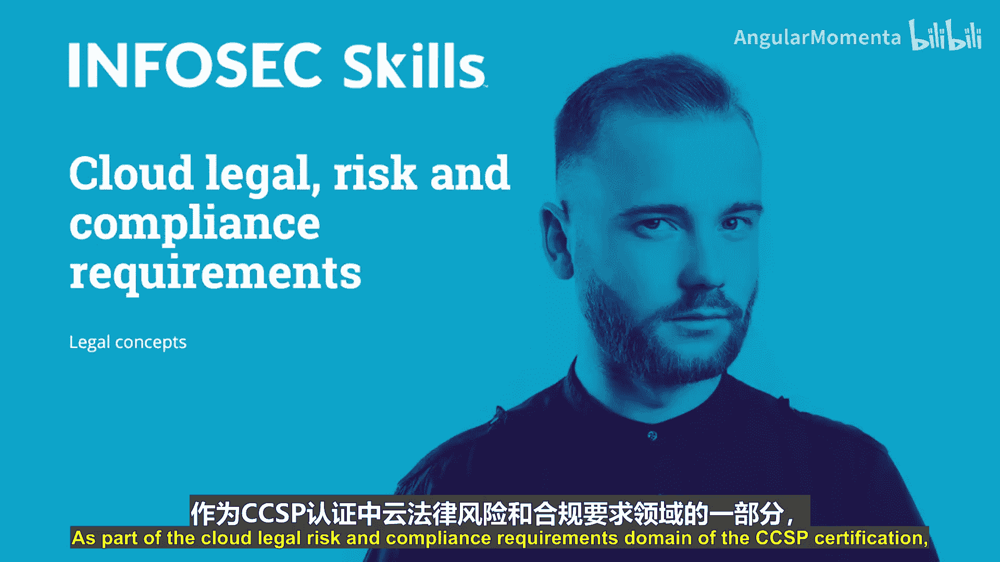
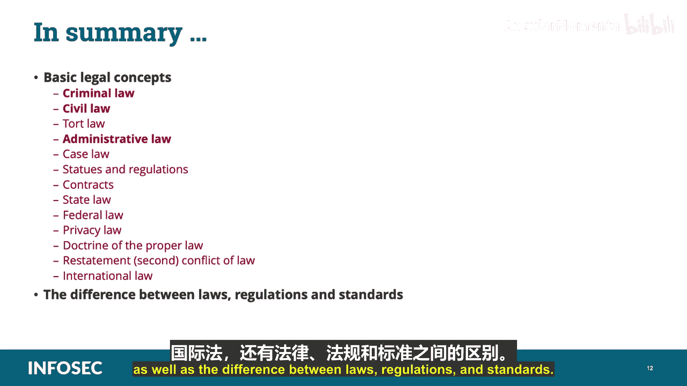

# 035：法律概念与合规要求 📚

在本节课中，我们将学习CCSP认证中“云法律风险与合规要求”领域的基础法律概念。这些概念是理解如何在跨国云环境中运营、确保一致性与公平性的基石。作为云安全从业者，掌握这些知识至关重要。

---

## 基本法律概念概述 🌍

随着技术的全球化发展，在满足不断演变的立法、法规和法律方面，挑战日益复杂。确保在传统本地环境、第三方托管环境乃至云计算环境中遵守这些规定，难度显著增加。本课程讨论的术语构成了我们进行跨国云活动的基础知识。

以下是本节将涵盖的核心法律概念：
*   **美国三大法律体系**：刑法、民法、行政法。
*   **法律渊源**：判例法、成文法、法规。
*   **国际冲突法原则**：适当法原则与《法律冲突法重述（第二版）》。
*   **知识产权**（将在后续模块详述）。
*   **隐私法**。

接下来，我们将逐一详细探讨这些术语。

---

## 刑法 ⚖️

刑法涉及政府与任何违反成文法的个人、团体或组织之间的所有法律事务。它是一套定义政府所禁止行为、旨在保护公共安全与福祉的规则和法令。刑法不仅定义禁止行为，还规定了违法时的惩罚措施。

*   **成文法**：由立法者制定的正式书面法令，用于管理州、市或国家。它通常命令或禁止某些行为，或声明某项政策。例如，交通法规。
*   **犯罪分类**：根据严重性分类，不同类别对应不同的最高刑罚。例如，抢劫、盗窃和谋杀。
*   **执法与惩罚**：刑法的执行称为**起诉**，只有政府可以进行。惩罚措施包括**罚款、监禁，甚至死刑**。

---

## 民法与合同法 🤝

上一节我们介绍了刑法，本节中我们来看看民法。民法是处理个人和社区事务（如婚姻、离婚）的法律体系，与刑法相对。它是一套管理私人公民及其纠纷的规则。

*   **诉讼方**：民法事务的参与方严格限定为私人实体，包括个人、团体和组织。
*   **典型案例**：在美国，涉及财产边界、矿产权和婚姻离婚的纠纷。
*   **惩罚措施**：民事案件的惩罚措施包括**经济赔偿或要求履行特定行动**（通常针对违约），但**不包括监禁或死刑**。

**合同**是双方为进行某项特定活动（通常为互利）而达成的协议。云客户与云提供商之间的合同就是一个典型例子。

*   **合同要素**：通常包括合同有效期、参与方列表、争议解决方式以及合同所适用的**管辖法律**。
*   **违约与纠纷**：当一方未能履行合同规定的活动时，即构成**违约**。另一方可以提起诉讼，以获得法院命令的救济，例如金钱赔偿或强制违约方履行义务。

CCSP考生应熟悉以下合同性文件：
*   **服务等级协议**
*   **隐私协议**
*   **运营等级协议**
*   **支付卡行业数据安全标准**

合同纠纷通常在民事法院处理，涉及损失赔偿。在云环境中，CCSP应准备好处理与此类合同相关的风险。

---

## 州法与联邦法 🏛️

在了解了民法和合同法之后，我们需要区分美国的州法与联邦法。

**州法**指美国各州的法律。美国共有50个州，每个州都有自己的宪法、政府和法院。

*   **示例**：限速法规、州税法、刑法典等。
*   **注意**：在美国以外，“state”一词常作为“国家”的同义词，其成员实体可能称为“县”、“管辖区”等。

**联邦法**管辖整个国家，其管辖权超越州界。

*   **示例**：反绑架法、反银行抢劫法。
*   **与州法的关系**：联邦法通常**优先于**州法，特别是在涉及州际商业性质的事务上。然而，有时州法可能更严格（如加利福尼亚州），此时通常适用**最严格的法律**。管辖权和后续起诉问题通常由执法和司法机构事先协商确定。

---

## 侵权法与行政法 ⚠️

**侵权法**涉及因他人的不当行为而受到伤害的个人所能获得救济的权利、义务和补救措施体系。它主要服务于四个目标：
1.  赔偿受害者因他人过错行为所受的伤害。
2.  将伤害成本转移给法律上应负责的人。
3.  阻止未来的伤害性或疏忽冒险行为。
4.  维护受到损害的法律权利和利益。

**行政法**是影响大多数人的另一法律体系。这些法律并非由立法机关创建，而是由行政决策和职能产生。

*   **执行机构**：许多联邦机构可以创建、监督和执行自己的行政法。它们拥有专属的立法部门、执法人员、法院和法官。
*   **示例**：联邦税法由**美国国税局**管理，该机构制定法律、通过IRS特工调查和执行，并由其雇员中的律师和法官审理案件。

---

## 法律冲突与隐私法 🌐

在跨国云运营中，法律冲突是常见问题。以下是两个关键概念：

**《法律冲突法重述（第二版）》**：这是一套普通法（法官造法）发展的汇编，用于告知法官和法律界相关领域的更新。它是在美国各州法律规则存在冲突时，决定适用哪部法律的基础。

**适当法原则**：当发生法律冲突时，此原则根据合同语言中**明示的选择**或通过法律选择条款所体现的明确意图，来确定在哪个管辖区审理争议。如果没有明示选择，则可能使用默示选择来推断双方意图。

**隐私法**赋予个人决定何时、如何以及在何种程度上披露其信息的权利。隐私法通常还包括要求**在不再需要时销毁个人信息**的条款。

*   **示例法律**：欧盟《通用数据保护条例》、经济合作与发展组织指南、支付卡行业数据安全标准、《健康保险携带和责任法案》。
*   **管辖权与治外法权**：一个国家的法律效力并不止于其边境。如果另一国家的公民或甚至本国公民在境外违反该国法律，仍可能受到该国的起诉和惩罚。例如，黑客可能因攻击他国目标而被引渡至该国受审。

**国际法**决定了如何解决国家间的争端和管理国家间关系。它由国际公约、国际习惯、文明国家公认的一般法律原则以及司法判例和各国最高权威公法学家的学说组成。

---

## 法律、法规、标准与框架的区别 📊

理解这些术语的区别对于合规至关重要。以下是它们的核心区别：

*   **法律**：由政府实体（如国会或议会）制定的法律规则。不遵守可能导致罚款或监禁。
*   **法规**：由政府其他部门或政府授权的外部实体制定的规则。不遵守同样可能导致惩罚性程序。
*   **标准**：由非政府组织制定的框架和指南，供企业遵循。监管机构可能因组织未采用行业公认的最佳实践和标准而认定其存在过失。
*   **框架**：一种分层结构，指示可以或应该构建何种程序以及它们如何相互关联以支持信息安全战略和使命。

**控制框架**由组织建立，用以支持其政策、程序、标准和指南。所有框架都应具备以下共同要素：
1.  **一致性**：在信息与隐私的处理和应用上保持一致。
2.  **可衡量性**：提供确定进展和设定目标的方式。
3.  **标准化**：依赖标准化，使结果可在不同组织或部门间有意义地比较。
4.  **全面性**：至少涵盖组织的最低法律和监管要求，并可扩展以适应额外的组织特定要求。
5.  **模块化**：仅需审查和更新需要修改的控制或要求。

**框架示例**：
*   **控制框架**：美国国家标准与技术研究院的**NIST SP 800-53**、**ISO/IEC 27001:2013**、COSO（内部控制整合框架）、COBIT（企业IT治理与管理框架）。
*   **流程框架**：ITIL（IT服务管理）、CMMI（能力成熟度模型集成）、六西格玛。
*   **架构框架**：Zachman框架、TOGAF（开放组体系结构框架）、SABSA（业务安全架构）。
*   **安全计划开发框架**：**ISO/IEC 27000系列**（信息安全管理体系）。

请注意，CCSP考试不涵盖特定法律（如FISMA或萨班斯-奥克斯利法案），但涵盖**安全控制模型框架**，如ISO 27000系列、COBIT和COSO，因为它们是国际标准。

---

## 总结 🎯

在本节课中，我们一起学习了CCSP认证所需的基础法律概念，包括：
*   美国三大法律体系：**刑法、民法、行政法**。
*   关键法律渊源：**判例法、成文法、法规**。
*   核心法律类型：**侵权法、合同法、州法、联邦法、隐私法、国际法**。
*   解决法律冲突的原则：**适当法原则**与**《法律冲突法重述（第二版）》**。
*   **法律、法规、标准与框架**之间的区别，以及常见的安全与控制框架。

掌握这些概念是理解云环境复杂合规要求、评估法律风险并在全球范围内安全运营云服务的基础。