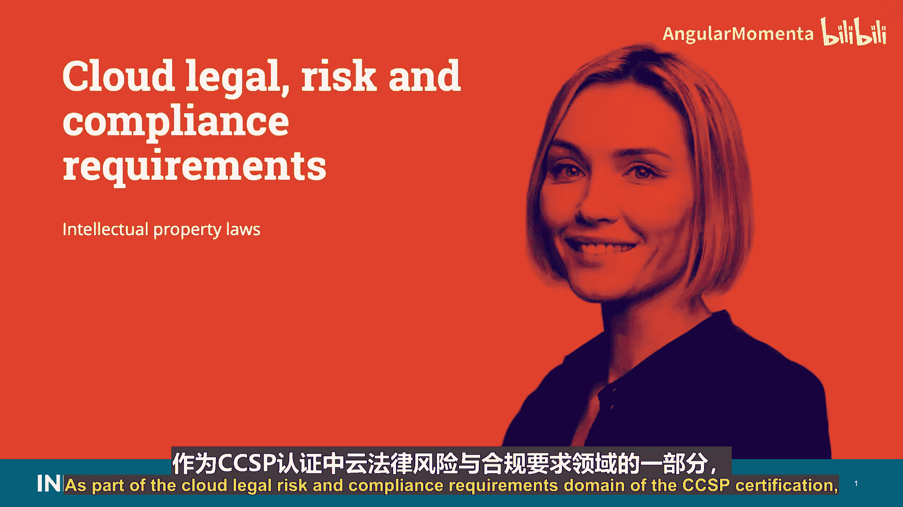
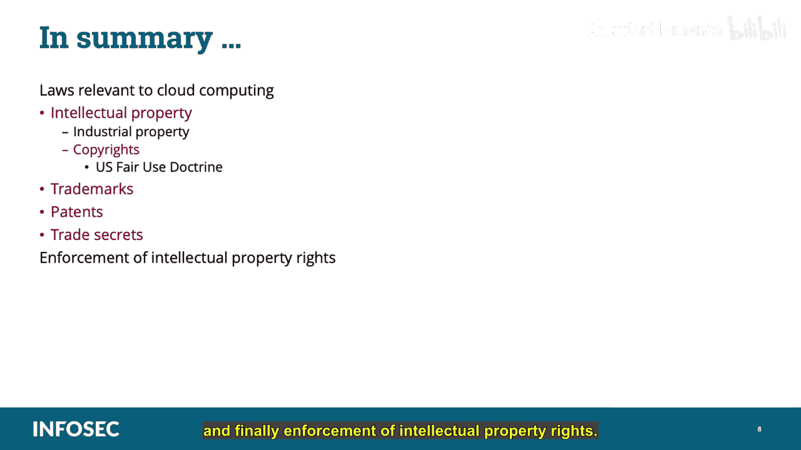

# 036：知识产权法律 📚

在本节课中，我们将要学习CCSP认证中“云法律风险与合规要求”领域的一个重要部分：知识产权法律。我们将了解知识产权的不同类型、保护方式以及相关的法律框架。

---

## 概述

知识产权是数字时代企业和个人的核心资产。理解其法律保护机制，对于在云环境中确保合规性和降低风险至关重要。本节将系统介绍知识产权的定义、主要类别及相关法律。

---

## 知识产权定义与范畴

知识产权是一个法律术语，用于描述由人类智力创造、具有商业价值的无形财产。这包括文字、文学作品、标识、符号或其他艺术创作。

**世界知识产权组织**将其定义为：具有商业价值的人类智力创造物。

知识产权主要分为两大类：

*   **工业产权**：也称为商业产权，包括专利、发明、商标、服务标志、蓝图、商业秘密、工业设计等。
*   **版权**：包括文学和艺术作品、现场或录制的表演、作者权利、软件、照片、雕塑等物品。

---

## 版权与合理使用原则

上一节我们介绍了知识产权的整体范畴，本节中我们来看看其中最常见的一类：版权。

版权保护的是思想的原创性表达。它授予原创作品创作者专有权利，使创作者能够因其作品获得认可和收益，并通过许可控制他人对其作品的使用。

**版权侵权**发生在非信息合法所有者的个人或组织，将受版权保护的材料提供或分享给他人时。

在美国，版权的保护期限为原创者去世后70至125年，具体取决于知识产权的创作性质。

**合理使用原则**是美国版权法中的一项重要限制。它允许在特定限制条件下，无需事先获得版权持有者许可即可复制和分发受版权保护的材料。该原则旨在平衡版权持有者利益与公众更广泛传播和使用创意作品的公共利益。

以下是美国版权法中合理使用的主要情形：

*   评论
*   搜索引擎
*   批评
*   戏仿
*   新闻报道
*   研究
*   学术活动
*   学术组织使用版权材料

---

## 商标与商业秘密

接下来，我们将探讨另外两种关键的知识产权：商标和商业秘密。

**商标**用于保护商品或服务的独特身份。它可以是一个词、符号、颜色、声音、形状等。商标本质上是品牌的知识产权保护，用于即时识别品牌，通常包括徽标或简短的音频旋律。

例如：NBC的三声音效、劳斯莱斯标志性的“欢庆女神”雕像、耐克的“Swoosh”标志、可口可乐瓶身、麦当劳的金色拱门或肯德基的桶形标志。

商标的保护期限取决于其商业使用情况。只要该财产仍在商业中使用，保护就可能持续，有时可被视为永久性权利。

**商业秘密**是指法院承认的私有商业材料的所有权，如客户名单、工艺流程、配方等。许多公司拥有对其业务至关重要的知识产权（即“秘方”），如果泄露给竞争对手或公众，将造成重大损害。

例如：可口可乐的配方或肯德基的保密食谱。

只要企业持续在商业活动中使用该秘密，并努力防止其泄露（例如使用保密协议），知识产权就能保持商业秘密保护状态。在这方面，它也可以被视为一种永久所有权。

在美国，商业秘密受《1996年经济间谍法》保护。要维持商业秘密状态，您必须在组织内实施充分的控制措施，确保只有有必要知情的授权人员才能访问它们。同时，必须确保任何无权访问的人员都受到保密协议的约束，该协议禁止他们与他人共享信息，并规定了违反协议的处罚。

根据《经济间谍法》：
*   为外国政府利益窃取商业秘密，最高可处罚款50万美元和监禁15年。
*   在任何其他情况下窃取商业秘密，最高可处罚款25万美元和监禁10年。

《1996年国家信息基础设施保护法》（1996年10月颁布）是《1996年经济间谍法》的第一章，它修订了《计算机欺诈和滥用法》，基本上规定了对任何未经授权故意访问计算机并获取已被确定需要防止未经授权披露的信息（如商业秘密）的人员的处罚。

---

## 专利及其保护

现在，让我们了解知识产权中最强有力的一种保护形式：专利。

**专利**授予新颖、有用且非显而易见的发明。换句话说，它必须是独特的发明。专利保护配方、工艺、产品、发明和植物。

可以申请专利的事物示例包括：
*   新药物的配方
*   新金属合金的冶炼工艺
*   织物或纺织品图案
*   通过其他植物插条嫁接而成、能在土壤中生长的新香料植物
*   甚至一个更好的捕鼠器

专利授予发明实践专有权利，在美国由美国专利商标局授予，保护期最长可达20年；在全球范围内由世界知识产权组织管理。

专利是最强的知识产权保护类型。拥有特定知识资产的专利可以防止任何他人在未经所有者许可的情况下使用该资产，直至其到期。一旦专利到期，任何人都可以复制或实践它。

---

## 知识产权的执法

最后，我们来探讨知识产权的执法问题。虽然法院和政府承认财产权的所有权，但通常需要由所有者来执行这些权利。

例如，如果一家公司拥有某种药物配方的专利，而他人通过生产和销售相同配方的药物侵犯了该专利，则需要由受害方（原始专利所有者）对仿制者提起民事诉讼。

我们已经讨论过，商业秘密受《1996年经济间谍法》保护。

**《数字千年版权法》** 是美国版权法的一项修正案，旨在实施世界知识产权组织的两项1996年条约。它将生产和传播旨在规避控制访问受版权作品措施的技术、设备或服务的行为定为刑事犯罪，这些措施通常称为数字版权管理。

换句话说，它规定规避反盗版措施为犯罪行为，并禁止制造、销售和分发用于非法复制软件或其他材料的破解设备。

我们之前已经介绍过数字版权管理，这里简要回顾一下：**数字版权管理**被定义为一系列广泛的技术，从内容提供商的角度，授予他们对其自身数字媒体的控制和保护。其生命周期有三个关键组成部分：内容创建、分发和维护，以及最终的内容使用。

---

## 总结

在本节课中，我们一起学习了与云计算相关的法律，重点是知识产权。知识产权分为工业产权和版权。我们讨论了美国的合理使用原则、商标、专利、商业秘密，最后是知识产权的执法。理解这些概念对于在云环境中管理法律风险和确保合规性至关重要。