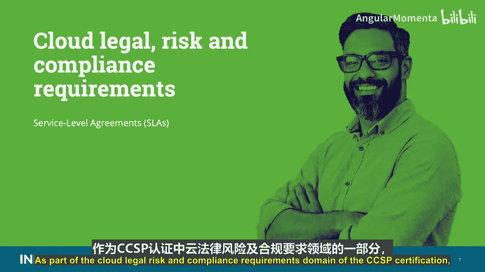
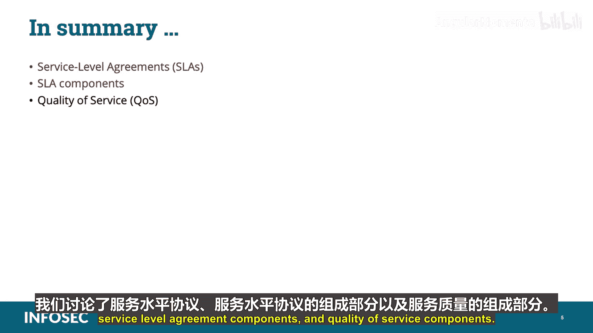

# 037：服务等级协议（SLAs）📜

在本节课程中，我们将学习服务等级协议。作为CCSP认证中“云法律风险与合规要求”领域的一部分，理解服务等级协议对于确保云服务满足业务与合规期望至关重要。

---

## 概述

服务等级协议是定义云服务提供商与客户之间服务期望的关键文件。本节我们将深入探讨SLA的定义、核心组成部分、审查要点以及相关的服务质量指标。

---

## 什么是服务等级协议？

服务等级协议是一份描述客户对供应商服务期望水平的文档。它明确了衡量服务的**指标**，并规定了当约定的服务水平未达到时的处理方式。

与客户和云提供商之间签订的合同类似，服务等级协议应涵盖与合规、最佳实践和满足各项要求的常规运营活动相关的内容。

---

## 区分合同与SLA

如何判断某项内容应属于合同还是服务等级协议？最简单的方法是：**如果内容涉及指标或数字，则属于服务等级协议；否则，它应属于合同范畴。**

---

## SLA应包含的最低内容

一份服务等级协议至少应涵盖以下内容：

*   **可用性**：例如，服务和数据的正常运行时间达到 **99.99%**。
*   **性能**：例如，预期响应时间与最大响应时间。
*   **数据安全与隐私**：例如，对所有存储和传输的数据进行加密。
*   **日志与报告**：例如，所有访问的审计追踪，以及报告关键要求或指标的能力。
*   **灾难恢复预期**：例如，最坏情况恢复承诺、恢复时间目标、最大可容忍中断时间。这些是我们讨论RTO、RPO和MTD时涉及的概念。
*   **数据位置**：例如，满足当地立法要求的能力。
*   **数据格式与结构**：例如，数据是否能够以可读且智能的格式从提供商处检索。
*   **数据可移植性**：例如，将数据迁移到不同或多个提供商的能力。
*   **问题识别与解决**：例如，是否设有帮助热线、呼叫中心或工单系统。
*   **变更管理流程**：例如，更新或新增服务等变更的处理流程。
*   **争议调解流程**：例如，是否存在升级流程及相应后果。
*   **退出策略**：例如，对提供商确保平稳过渡的期望。

---

## SLA的两大组成部分

服务等级协议应包含两个领域的组件：**服务**与**管理**。

上一节我们列出了SLA应涵盖的具体内容，本节我们来看看这些内容如何归类到两大组成部分中。

**服务要素** 包括：
*   提供的服务详情与职责：明确谁负责什么，避免歧义。
*   服务可用性标准：例如，不同时间段（如高峰与非高峰时段）可能对应不同的服务等级。
*   升级流程。
*   成本或服务权衡。
*   服务等级协议下是否满足监管要求。

**管理要素** 应包括：
*   测量、标准和方法定义。
*   报告流程、内容与频率。
*   争议解决流程。
*   保护客户因SLA违约而免受第三方诉讼的赔偿条款。
*   根据需要更新协议的机制。

---

## 审查SLA时的风险评估

在审查服务等级协议时，应关注以下风险评估方面：
*   **风险评估环境**：如服务、供应商和生态系统。
*   **风险概况**：SLA本身及提供服务公司的风险状况。
*   **风险承受能力**：组织可接受的风险水平。
*   **风险缓解**：可降低风险的缓解技术或控制措施。
*   **风险框架**：使用何种框架（如NIST 800-53、ISO 27000、COSO、SABSA等）来评估持续有效性，以及提供商将如何管理此风险。

---

## 关键SLA组件示例

以下是一些你应该熟悉的关键SLA组件示例：

*   **正常运行时间保证**：对服务可用性的承诺。
*   **SLA惩罚条款**：未达标的后果。
*   **SLA惩罚排除条款**：
    *   **停机计算启动限制**：一些云提供商要求应用中断一段时间（例如5到15分钟）后，才开始计入SLA违约。
    *   **计划内停机**：许多云提供商声明，如果提前通知，服务中断不计为计划外停机，因此不计算在惩罚内。有时，通知时间可能短至8小时。
*   **服务暂停**：一些云合同规定，如果付款逾期超过30天（包括任何有争议的付款），提供商可以暂停服务。
*   **提供商责任限制**：大多数云合同将除知识产权侵权索赔外的任何责任限制在过去12个月费用总额内。
*   **数据保护要求**：大多数云合同规定客户最终对数据安全、保护和遵守当地法律负责。**请记住，在云计算环境中，客户或企业始终要对任何治理、风险、合规和数据安全负责。**
*   **违规通知**：SLA应包含条款，要求提供商在意识到任何安全或隐私泄露后立即通知客户。

这些例子凸显了在与云提供商就SLA进行合作时，若未给予足够关注和尽职调查可能带来的风险。

---

## 服务质量指标

服务质量指标构成了SLA中度量与监控要求的关键组成部分。以下是应包含在SLA中的主要指标：

*   **可用性**：在指定时间段内，相关服务的正常运行时间占总时间的百分比。
    *   `可用性 (%) = (总时间 - 停机时间) / 总时间 * 100%`
*   **停机时长**：记录和测量每次服务中断实例的损失时间。
    *   *例如：7月1日，上午9:20开始，10:50恢复，等于1小时服务损失。*
*   **平均故障间隔时间**：连续或重复性服务故障之间的预期时间。
    *   *例如：365天中平均每1.25小时发生一次。*
*   **容量指标**：测量和报告容量能力及满足需求的能力。
*   **性能指标**：用于主动识别性能瓶颈或退化区域。通常以每分钟请求数和连接数来衡量。
*   **成功率指标**：基于约定标准列出响应成功率。
    *   *例如：数据库事务完成成功率达99%。*
*   **存储设备容量指标**：列出与存储设备容量相关的指标和特性，通常以吉字节为单位。
*   **服务器容量指标**：列出基于中央处理器频率（GHz）、内存、虚拟存储和其他存储卷影响的服务器容量特性。
*   **启动时间指标**：报告初始化新实例所需的时间，从用户请求资源开始计算，通常以秒为单位。
*   **响应时间指标**：报告执行请求操作或任务所需的时间，通常基于请求和响应时间以毫秒为单位测量。
*   **完成时间指标**：提供完成启动或请求任务所需的总时间，通常以请求总数的平均值以秒为单位测量。
*   **平均切换时间指标**：提供从服务故障切换到复制故障转移实例的预期时间，通常以分钟为单位测量，从开始到完成计算。
*   **平均系统恢复时间指标**：突出显示在服务故障或中断后完全恢复的预期时间，通常以分钟、小时和天为单位测量。
*   **可扩展性组件指标**：通常用于分析客户使用行为和模式，以实现服务器的自动扩展和收缩。
*   **存储可扩展性指标**：指示在需要增加工作负载和存储需求时可用的存储设备容量。
*   **服务器可扩展性指标**：指示在需要增加工作负载时可调用或利用的可用服务器容量。

---

## 调查与通知要求

服务等级协议或合同协议必须明确，是否允许对基于云的资产进行调查，或者在调查期间是否需要事先通知并获得接受。

---

## 总结

在本节课程中，我们一起学习了服务等级协议。我们探讨了SLA的基本定义、其核心组成部分（包括服务要素和管理要素），以及构成有效监控与度量基础的关键服务质量指标。理解这些内容对于评估云服务合同、管理风险并确保服务满足业务与安全需求至关重要。