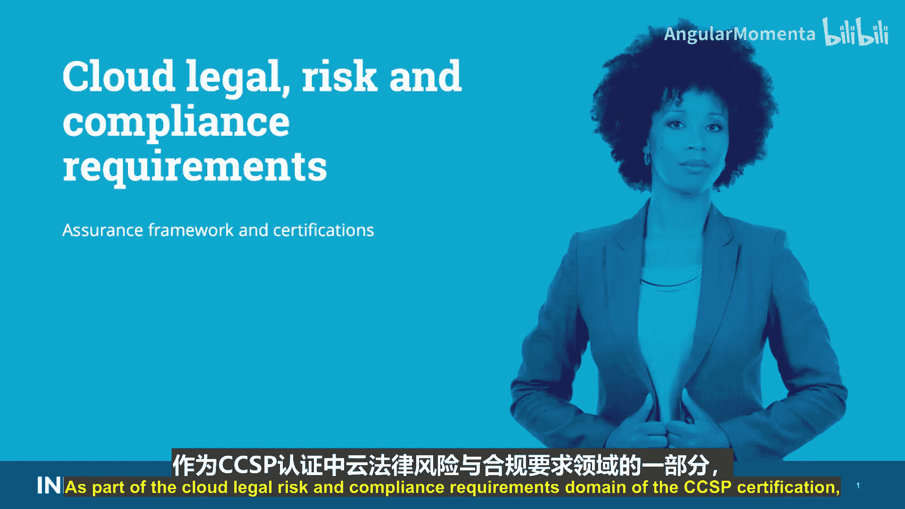
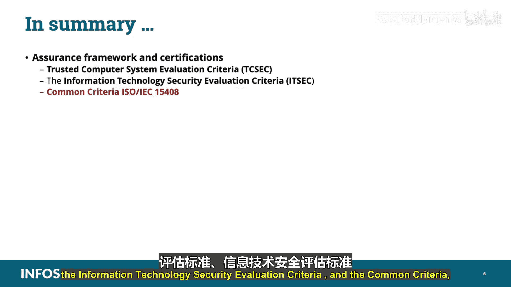

# 038：保障框架与认证

在本节课中，我们将要学习云法律风险与合规要求领域的一个重要部分：保障框架与认证。我们将探讨几种关键的安全评估标准，了解它们如何帮助评估和验证IT产品的安全性。

在深入课程之前，需要指出，所有为CCSP考试必须掌握的具体信息，都会以屏幕所示的双星号标注形式高亮显示。所有以此颜色高亮的内容都与考试相关。

## 评估标准概述

上一节我们介绍了保障框架的重要性，本节中我们来看看几种具体的评估标准。这些标准为经过认证的第三方评估实验室提供了一个共享机制，使其能够根据一组安全要求来评估供应商的产品并公布结果。其目标是确定系统在现实世界中达到理想安全级别的程度，并据此决定是否采用该系统。

以下是几种主要的评估标准：

*   **可信计算机安全评估标准**：也称为TCSEC或“橙皮书”。
*   **信息技术安全评估标准**：即ITSEC。
*   **通用准则**：也称为ISO/IEC 15408。

## 可信计算机系统评估标准

TCSEC是由美国国防部创建的一系列评估标准（彩虹系列）的一部分。例如，TCSEC本身也被称为国防部的“橙皮书”。它是一个保密性模型，评级从最低的D级到最高的A1级。

“红皮书”是TCSEC的网络解释，是一个保密性和完整性模型。此外还有“绿皮书”，即密码管理指南。我们将重点介绍橙皮书，即TCSEC。

TCSEC最初关注的是单机系统的保密性和功能性。其目标是指导设计者了解产品应具备的特性，指导评估者执行评估，并帮助采购者选择可信产品。它还基于强制策略、唯一标识、访问控制、标签、审计和持续保护等要求，提供了分级的安全类别。

美国国防部将TCSEC用作一个标准，为计算系统中安全保护的实施设定了基本标准，主要旨在帮助国防部找到符合这些基本标准的产品。它强烈侧重于强制执行保密性，而不关注安全的其他方面，如完整性或可用性。它现已被我们稍后将讨论的通用准则所取代。

TCSEC使用一个评级量表，D级表示最低保护，A1级为最高。

## 信息技术安全评估标准

接下来我们看看ITSEC。这是起源于欧洲并被国际采用的标准。它使用评估目标作为产品，使用安全目标作为产品声明的能力。

信息技术安全评估标准是一套用于评估产品和系统内计算机安全性的结构化标准。ITSEC于1990年5月首次发布，由法国、德国、荷兰和英国基于各自国家的现有工作制定。经过广泛的国际评审后，1.2版于1991年6月由欧洲委员会发布，供欧盟内部和认证计划使用。然而，ITSEC已基本被通用准则取代，后者提供了类似定义的评价级别，并实现了评估目标概念和安全目标文档。

与TCSEC相比，ITSEC中的安全要求规定得没有那么死板。相反，消费者或供应商有能力从一系列可能的要求菜单中选择一组要求，形成安全目标。然后供应商开发产品（评估目标），并根据该目标进行评估。这里的要点是，评估是分开的，分别检查有效性（即保障性）和功能性。同时，它也会评估漏洞，换句话说，是抵御攻击的能力。

在ITSEC中，供应商声称其产品根据安全策略、安全强化功能机制及其强度，以及评估目标的功能性和有效性级别进行评估。因此，ITSEC使用评估目标（即产品）和安全目标（即产品声明的能力）。评估目标基本上是任何IT产品或系统及其相关的指导文档，是评估的对象。

ITSEC的评级为E1到E6，如屏幕所示。

## 通用准则

现在我们来总结并介绍通用准则。由于其主要关注保密性，TCSEC被发现对于大多数非国防组织来说过于僵化。另一方面，ITSEC则被认为不够严格。因此，通用准则采取了与ITSEC非常相似的方法，提供了一套灵活的功能和保障要求。它侧重于标准化产品评估的通用方法，并在全球范围内提供此类评估的相互认可。

通用准则的出版物被称为ISO/IEC 15408，它同时关注保障性和功能性要求。这是第一个产品评估标准的国际标准，目前被广泛使用，因为它允许供应商或消费者以更细的粒度定义他们需要系统达到的安全级别。

通用准则认证的目标是确保客户所购买的产品已经过评估，并且供应商的声明已由中立的第三方验证。通用准则仅关注认证产品本身，不包括管理或业务流程，尽管它认为这些是有益的。仅依赖技术来实现稳健有效的安全是存在风险的。

通用准则引入了保护轮廓，作为功能和保障要求的通用集合。

以下是核心概念总结：

*   **评估目标**：是评估对象的产品或系统。
*   **安全目标**：是供应商记录的评估目标的安全特性。
*   **保护轮廓**：是针对一类安全设备的已记录的安全要求。
*   **评估保障级别**：从EAL1到EAL7。

你需要知道这些EAL级别是什么。我已经将它们高亮显示，你可以在屏幕上看到。EAL7是“形式化验证的设计和测试”，EAL1是“功能测试”。你需要知道每个级别的定义，因为考试中会出现专门考查定义的题目，你需要将其映射到相应的级别，如EAL1、2、3一直到7。

评估保障级别是衡量由评估分配的保密性、完整性和可用性的指标。它不涉及实施后的管理工作。评估保障级别是一组保障要求，代表了通用准则预定义保障量表上的一个点，范围从1到7，从用自然语言非正式表达，到用基于完善数学概念的、具有定义语义的限制性语法语言正式表达。

再次强调，EAL1是最低的非正式保障要求，而EAL7是最高、最广泛验证的保障声明。请记住，通用准则极大地有助于开发具有信息安全功能的产品和系统。

出于信息目的，我放置了一张图表，显示了通用准则的系统和子系统产品认证流程。你可以看到评估目标输入流程，然后是安全问题定义、评估目标的安全目标、安全功能要求、符合性声明、EAL1到EAL7的评估保障级别，最后是安全保障要求。

## 课程总结

本节课中我们一起学习了保障框架与认证。我们讨论了三种主要的标准：

1.  可信计算机系统评估标准。
2.  信息技术安全评估标准。
3.  通用准则。

理解这些框架和认证对于评估云服务提供商的安全状况和确保合规性至关重要。